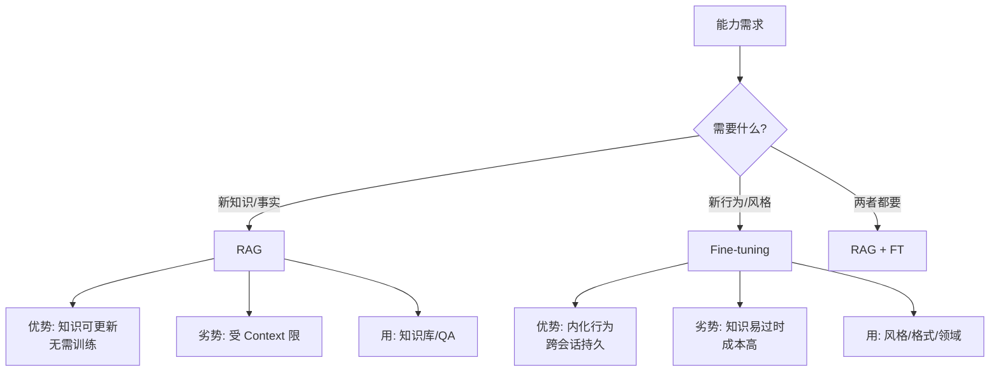
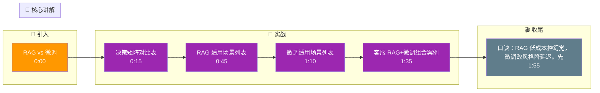

# RAG vs Fine-tuning：什么场景该用RAG，什么场景该用微调？

🎯 本质：RAG和微调解决不同问题——RAG解决“知识”，微调解决“能力”。

📊 决策矩阵：
| 维度 | RAG | Fine-tuning |
|------|-----|-------------|
| 知识更新 | 实时（更新数据库） | 需重新训练 |
| 新增知识 | 加文档即可 | 需要训练数据 |
| 幻觉控制 | 好（有引用） | 差（依赖训练记忆） |
| 风格改变 | 不行 | 好 |
| 领域术语 | 一般 | 好 |
| 输出格式 | 一般（靠prompt） | 好（学到模式） |
| 成本 | 低（检索开销） | 高（训练成本） |
| 延迟 | 较高（检索+生成） | 较低（直接生成） |

何时用RAG：
1. 需要最新知识（新闻、实时数据）
2. 知识库频繁变化
3. 需要引用来源
4. 企业内部文档问答
5. 知识量大但查询简单

何时用Fine-tuning：
1. 改变输出风格/格式（如总是输出JSON）
2. 教模型特定领域的术语和推理方式
3. 提升特定任务性能（如代码生成、数学推理）
4. 减少prompt长度（知识内化到模型）
5. 降低推理延迟

何时两者结合：
1. Fine-tune模型学习领域知识和风格
2. RAG补充最新信息和详细文档
3. 最佳实践：先RAG，效果不够再考虑微调

实际案例：
- 客服机器人：RAG（知识库）+ Fine-tune（语气风格）
- 代码助手：Fine-tune（编程能力）+ RAG（项目文档）
- 法律助手：RAG（法条检索）+ Fine-tune（法律术语理解）

## 技术原理

RAG 和微调解决的是完全不同维度的问题，理解差异要从"知识 vs 能力"的拆分入手：

- **RAG = 外挂知识（开卷考试）**：RAG 不改变模型参数，而是把外部文档编码成向量存入数据库，检索时把相关片段塞进 Prompt 作为上下文。模型回答基于"检索到的证据"，所以能引用来源、控幻觉、且知识更新只需加文档。代价是每次查询都有检索延迟，且受限于上下文窗口能塞多少证据。本质是"知识的外部化"。
- **微调 = 内化能力（考前特训）**：微调用领域数据更新模型权重，把"怎么做"的能力刻进参数。它不擅长更新事实知识（改权重成本高且容易遗忘），但擅长改变输出风格、固定格式、学习领域术语和推理模式。微调后推理延迟低（无需检索），但知识更新需重新训练。本质是"能力的内化"。
- **决策路径的经济学**：RAG 成本低（检索开销）、见效快（加文档即可）、可控幻觉（有引用）；微调成本高（训练 + 数据标注）、周期长、但能改风格降延迟。所以默认"先 RAG，不足再微调"——先用低成本方案验证，效果不够再投入高成本方案。
- **组合使用的协同**：微调让模型学会领域风格和术语，RAG 补充最新事实和详细文档。客服机器人就是典型——微调统一语气，RAG 查政策库。

## 注意事项

1. **知识更新选 RAG 不选微调**：微调改权重成本高且容易灾难性遗忘旧知识；RAG 加文档即可实时更新，是知识类需求的首选。
2. **改风格/格式选微调**：RAG 改变不了模型的输出模式，固定 JSON 格式、统一语气这类"能力"问题必须微调。
3. **别迷信微调控幻觉**：微调后模型仍可能编造事实（依赖训练记忆），需要引用来源和事实校验的场景还是得 RAG。
4. **先 RAG 后微调的迭代节奏**：先上 RAG 验证业务闭环和数据质量，积累足够 badcase 和领域数据后再微调，避免过早投入高成本。

## 对比表

| 维度 | RAG | Fine-tuning | RAG + Fine-tuning |
|:---|:---|:---|:---|
| **解决什么** | 知识（知道什么） | 能力（会做什么） | 知识+能力 |
| **知识更新** | 实时（加文档） | 需重新训练 | RAG 部分实时 |
| **幻觉控制** | 好（有引用） | 差（依赖训练记忆） | 中 |
| **改风格/格式** | 不行 | 好 | 好 |
| **推理延迟** | 高（检索+生成） | 低（直接生成） | 中 |
| **成本** | 低 | 高 | 中高 |
| **典型场景** | 文档问答、实时数据 | 固定格式、领域术语 | 客服、代码助手 |

## 核心流程图

## 记忆要点

- 一句话定调：RAG解决外挂"知识"，微调解决内化"能力"
- 知识更新选RAG，因为加文档即可；风格与格式选微调，因为需重塑模式
- 口诀对比：RAG成本低但延迟高、控幻觉好；微调成本高但延迟低、改风格好
- 决策路径：因为成本低见效快，所以先做RAG，效果不够再结合微调

## 结构化回答

**30 秒电梯演讲：** RAG 和微调解决的不是一类问题——RAG 是给模型外挂知识库，解决"知道什么"；微调是把能力内化进模型参数，解决"会做什么"。一句话记：要实时知识、要引用来源、要低成本就 RAG；要改风格、改格式、降延迟就微调。

**展开框架：**
1. **本质分工** — RAG 解决知识（外挂数据库，加文档即更新），微调解决能力（内化参数，改变风格和推理模式）。
2. **何时用 RAG** — 知识更新频繁、需要引用来源、企业私有文档问答、控幻觉要求高、预算有限。
3. **何时用微调** — 固定输出格式（如总输出 JSON）、学领域术语、降推理延迟、缩短 prompt；最佳实践是先 RAG 再补微调。

**收尾：** 我做过客服机器人就是 RAG + 微调组合：RAG 接知识库查政策，微调统一语气风格。您想聊两者怎么协同，还是先 RAG 后微调的迭代节奏？

## 视频脚本

> 预计时长：2 分钟 | 由浅入深

| 时间 | 画面/字幕 | 口播台词 | 讲解要点 |
|------|----------|----------|----------|
| 0:00 | 标题卡：RAG vs 微调 | "给 LLM 补知识，到底是查书（RAG）还是练脑子（微调）？一句话分清。" | 开场钩子 |
| 0:15 | 决策矩阵对比表 | "RAG：知识实时更新、可溯源、成本低但延迟高；微调：改风格、降延迟，但成本高。" | 核心对比 |
| 0:45 | RAG 适用场景列表 | "RAG 适合：最新知识、知识库常变、要引用来源、企业文档问答。" | RAG 场景 |
| 1:10 | 微调适用场景列表 | "微调适合：固定输出格式、学领域术语、降延迟、缩 prompt。" | 微调场景 |
| 1:35 | 客服 RAG+微调组合案例 | "实战：客服机器人，RAG 查政策知识库，微调统一语气风格，两者协同。" | 组合实践 |
| 1:55 | 总结卡 | "口诀：RAG 低成本控幻觉，微调改风格降延迟。先 RAG 后微调。" | 收尾 |

### 视频流程图

