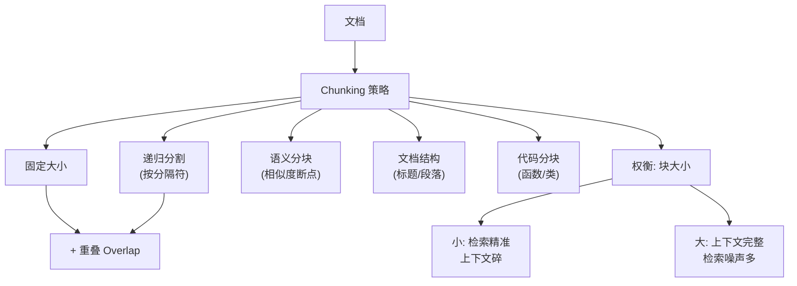

# RAG的Chunking策略有哪些？

文本切片策略是决定检索效果的上限。块太大（噪声多）检索不准，块太小（语义不全）生成效果差。

### 常见策略详解

1.  **固定长度**
    *   **原理**：按固定 token 数（如 512）截断，通常带固定 `overlap`。
    *   **缺点**：常在句子中间断开，导致语义破碎，且可能切断实体（如人名、日期）。

2.  **递归字符分割**
    *   **原理**：LangChain 默认策略。优先按段落（`\n\n`）切，不够再按句子（`\n`），最后按字符。如果还超长，强制截断。
    *   **优势**：尽量保持句子的完整性，语义连续性优于固定长度。

3.  **语义切分**
    *   **原理**：计算相邻句子的 Embedding 相似度。当相似度发生剧烈下降（突变）时进行切分。
    *   **优势**：完美贴合语义边界，块的内容高度内聚。
    *   **缺点**：计算成本高（需对每句话算 Embedding）。

4.  **文档结构感知**
    *   **原理**：利用 Markdown、HTML 标签或 PDF 的标题层级树。按 `Section` 切分，将子块与父标题关联。
    *   **优势**：保留了逻辑层级，便于检索时理解上下文。

5.  **父子索引**
    *   **原理**：
        *   **索引**：将文档切分成**小块**，对小块进行 Embedding 和检索。
        *   **返回**：检索到小块后，返回其所属的**大块**给 LLM。
    *   **目的**：检索追求粒度细（匹配精确），生成追求上下文全（信息丰富）。

### 关键参数
*   `chunk_size`：通常在 **256 - 1024 tokens** 之间。常见值为 500。
*   `chunk_overlap`：重叠区域，通常为 `10%-20%`。作用是防止关键信息正好被切断在边界。

### 实战案例
*   **API 文档问答踩坑**：某团队用固定大小切分 API 文档，导致参数说明在 Chunk A，参数示例在 Chunk B。LLM 只看到 A，编造了错误的示例。改为“语义切分”或“代码结构感知”后，将参数和对应的示例锁定在同一个 Chunk，准确率大幅提升。
*   **法律合同审查**：在处理长篇合同时，若不保留“父级上下文”（如章节标题），LLM 仅看到“第3条：不可撤销”，不知道这是属于“终止条款”还是“付款条款”。通过“元数据过滤”或“带回标题的切分”解决了此歧义。

### 代码示例 (Python - LangChain 语义切分)
```python
from langchain_experimental.text_splitter import SemanticChunker
from langchain.embeddings import OpenAIEmbeddings

# 基于语义相似度进行切分
embeddings = OpenAIEmbeddings()
text_splitter = SemanticChunker(
    embeddings, 
    breakpoint_threshold_type="percentile" # 设定切分阈值
)

docs = text_splitter.create_documents([long_legal_text])
# 结果：文档被按语义逻辑切分，而非生硬按长度截断
```

### Chunking 策略对比
| 策略 | 切分依据 | 检索精准度 | 计算成本 | 适用场景 |
|------|---------|-----------|---------|----------|
| **固定长度** | Token 数量 | 低 (容易切断语义) | 极低 | 通用日志、简单文本 |
| **递归分割** | 分隔符 (\n, .) | 中 | 低 | 通用文章，保持句子完整 |
| **语义切分** | 句向量相似度 | 高 (边界清晰) | 高 (需推理) | 论文、技术文档、小说 |
| **父子索引** | 小块检索，大块返回 | 极高 (兼顾精准与上下文) | 中 (需维护映射) | 需要大量背景信息的问答 |

## 常见考点
1.  **为什么要设置 Overlap（重叠）？**
    保证上下文的连续性，避免关键信息（如一个句子被分成两半）丢失，同时也增加检索的命中率。
2.  **父子索引解决了什么问题？**
    解决了检索粒度和生成所需的信息量之间的矛盾。小块检索更精准，大块给 LLM 提供了更完整的背景信息。
3.  **针对表格数据应该怎么切分？**
    表格不建议随机切分，应将表格作为一个整体提取（如转为 Markdown 或 HTML），或者提取表头+每一行作为一个单独的语义块，以便精确检索特定数据。


## 核心流程图




## 记忆要点

- 固定长度：简单但易切断语义，需设置Overlap（10-20%）防止信息丢失
- 递归分割：优先按段落、句子切分，保持语义完整性，LangChain默认策略
- 语义切分：基于句向量相似度突变切分，边界清晰但计算成本高
- 父子索引：小块检索（精准），返回大块给LLM（上下文全），兼顾检索与生成

## 结构化回答

**30 秒电梯演讲：** Chunking 决定了 RAG 检索的天花板——块太大噪声多检索不准，块太小语义不全生成差。主流从固定长度、递归分割，到更高级的语义切分和父子索引，核心思路就是顺着语义纹理切，别把一句话拦腰斩断。

**展开框架：**
1. **固定长度** — 按 token 数截断（如 512），简单但常切断句子和实体，需配 10-20% Overlap 防边界丢信息。
2. **递归 + 语义切分** — 递归按段落/句子优先切（LangChain 默认）；语义切分按句向量相似度突变切，边界最干净但成本高。
3. **父子索引** — 小块做检索（精准），返回所属大块给 LLM（上下文全），兼顾检索精度和生成质量。

**收尾：** 我踩过坑——固定切分把 API 参数说明和示例切到两个 Chunk，LLM 只看到说明就编错示例，改成语义切分后准确率大涨。您想聊 chunk_size 怎么调，还是表格这类结构化数据怎么切？

## 视频脚本

> 预计时长：2 分钟 | 由浅入深

| 时间 | 画面/字幕 | 口播台词 | 讲解要点 |
|------|----------|----------|----------|
| 0:00 | 标题卡：RAG 怎么切文档 | "RAG 检索不准，八成是文档没切好。块太大太小都不行。" | 开场钩子 |
| 0:15 | 块大小权衡示意图 | "太大噪声多检索不准，太小语义不全生成差，要顺着语义切。" | 核心矛盾 |
| 0:40 | 四种切分策略对比表 | "固定长度简单易切断，递归按段落切，语义切分按向量相似度，父子索引兼顾检索和生成。" | 策略对比 |
| 1:10 | Overlap 作用示意图 | "Overlap 重叠 10-20%，防止关键信息正好被切在边界上。" | 关键参数 |
| 1:35 | API 文档切分踩坑案例 | "实战：参数说明和示例被切到两个 Chunk，LLM 编错示例，改语义切分后解决。" | 实战案例 |
| 1:55 | 总结卡 | "口诀：顺语义切、设重叠、父子兼顾。下期讲 Embedding 怎么选。" | 收尾 |

