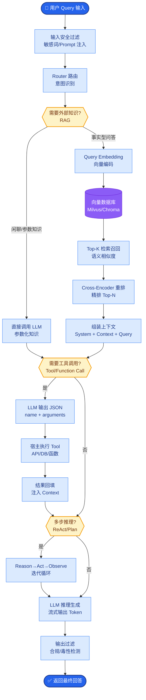

# 什么是Reranking？为什么RAG需要它？

Rerank（重排序）是提升 RAG 精度性价比最高的手段之一。

### 原理与架构
```text
阶段1: 检索 - 追求高召回
User Query ──> Embedding Model ──> 向量库
                           ↓
                    Top-100 候选集
                           │
阶段2: 重排 - 追求高精度
             ┌──────────────┴──────────────┐
             │   Cross-Encoder (Reranker)  │ <── Query + Docs 拼接输入
             │    (交互计算相关性分数)      │
             └──────────────┬──────────────┘
                           ↓
                    Top-5 / Top-10
                           ↓
                    LLM Generation
```

### 为什么需要 Rerank
1.  **弥补向量检索的不足**：Embedding 是将复杂语义压缩成向量，存在信息损失。对于细微差别（如否定词、具体数量），向量检索往往不如字面匹配。
2.  **计算效率权衡**：
    *   向量检索：独立编码 Query 和 Doc，可预先计算 Doc 向量，速度极快，适合从海量数据中捞出 Top-100。
    *   Rerank：需将 Query 和每个 Doc 拼接输入模型进行交互，计算量大。仅对 Top-100 进行计算，耗时可控，但能显著提升 Top-5 的准确率。

### 核心模型对比
| 特性 | Bi-Encoder (检索) | Cross-Encoder (Rerank) |
| :--- | :--- | :--- |
| **输入** | Query 和 Doc 分别独立输入 | Query 和 Doc 拼接成 `[CLS] Query [SEP] Doc [SEP]` 一起输入 |
| **计算方式** | 计算两个向量的余弦相似度 | 模型深层交互 Attention 机制，直接输出 0-1 相关性分数 |
| **速度** | 极快 (毫秒级) | 慢 (与 Doc 数量成正比) |
| **精度** | 中等 | 高 (SOTA 水平) |

### 常用模型
*   **BAAI/bge-reranker-v2-m3**：支持多语言，轻量级。
*   **Cohere Rerank (API)**：效果极佳，商业可用，支持多语言。

### 实战深化

**1. 实战案例**：在客服问答场景中，用户问“如何退款”，向量库可能同时召回“退款流程”和“不支持退款说明”的片段。若“不支持退款”的向量距离更近（仅因为词频高），直接传给 LLM 会导致回答错误。接入 Reranker 后，模型能捕捉“退款流程”与意图的强匹配，将其排在首位，避免误导用户。

**2. 代码示例**：
```python
from FlagEmbedding import FlagReranker
reranker = FlagReranker('BAAI/bge-reranker-v2-m3', use_fp16=True)

# 假设从向量库召回的 Top-K 候选文档
candidates = ["退款流程是点击右上角...", "本商品特殊不支持退款..."]
query = "怎么申请退款"

# 计算分数 (Cross-Encoder 需要两两输入)
pairs = [[query, doc] for doc in candidates]
scores = reranker.compute_score(pairs) 

# 根据分数重新排序后取 Top-1
sorted_docs = [doc for _, doc in sorted(zip(scores, candidates), reverse=True)]
```

### 边界情况与极端场景
1.  **空输入处理**：当检索阶段未召回任何文档（Top-0）时，Rerank 模块需具备“空转”能力，避免抛出异常，系统应能优雅降级为直接回答或拒绝回答。
2.  **超长文档截断**：Reranker 模型通常有最大 Token 限制（如 512）。若召回的单个文档过长，需设计截断策略（如仅截取头尾或 sliding window），防止信息丢失或报错。
3.  **跨语言 Rerank**：在多语言 RAG 场景中，若 Query 是中文而 Doc 是英文，需确认所选 Reranker 模型（如 BGE-M3）支持跨语言语义对齐，否则可能打出错误的低分。

## 常见考点
1.  **Rerank 会对 RAG 系统的延迟产生多大影响？**
    通常 Rerank 仅处理前 50-100 个文档，增加的延迟在几百毫秒级（取决于模型大小），相比 LLM 生成的时间（秒级）通常是可以接受的。
2.  **向量检索效果已经很差了，Rerank 能救回来吗？**
    不能。Rerank 只能从召回的集合中挑选最好的，如果正确答案没在 Top-K 召回集中（Recall 低），Rerank 无能为力。它是“锦上添花”，不是“雪中送炭”。

## 易错点
1.  **过度重排**：对召回数量（如 Top-1000）进行全量 Rerank 会导致响应时间不可控，通常建议 Rerank 的输入截断在 50-100 之间。
2.  **忽视截断策略**：直接将超长文本扔给 Reranker 会导致截断核心内容（如截断把结论截没了），应在入库时做好分块，或在 Rerank 前进行智能摘要。

## 面试追问
1.  如果用户 Query 非常简短（如“苹果”），而 Reranker 模型因为没有上下文导致打分置信度普遍不高，你会怎么优化检索链路？（提示：结合 Query Expansion 或 HyDE）
2.  在高并发场景下，Reranker 模型是 CPU 计算密集型，你会如何做推理加速或架构优化？（提示：量化 int8、批处理、独立 GPU 服务部署）
3.  除了精度，Reranker 在处理“否定意图”时有什么天然优势？能否举例说明？


## 核心流程图



## 记忆要点

- Rerank 是“先召回后精排”的两阶段架构，弥补向量检索的信息损失。
- Bi-Encoder 追求速度（独立编码），Cross-Encoder 追求精度（交互计算）。
- Rerank 仅处理 Top-100，性价比极高，是锦上添花而非雪中送炭。
- 核心对比：向量检索适合海量捞取，Rerank 适合精准排序 Top-K。
- 注意截断策略和空输入处理，避免超长文本报错或异常降级。

## 结构化回答

**30 秒电梯演讲：** Rerank 就是给 RAG 加个"精排"环节——向量检索先用 Bi-Encoder 快速捞 Top-100 候选，再用 Cross-Encoder 把 Query 和每个文档拼一起精排，输出 Top-5。它是性价比最高的提精度手段，但记住它是锦上添花不是雪中送炭：召回里没有的，重排也排不出来。

**展开框架：**
1. **两阶段架构** — 粗排召回（Bi-Encoder 独立编码，快）→ 精排截断（Cross-Encoder 交互计算，准），弥补向量压缩的信息损失。
2. **速度 vs 精度** — 向量检索毫秒级适合海量捞取，Rerank 只处理 Top-100 性价比极高，增加几百毫秒换显著精度提升。
3. **边界处理** — 注意空输入（Top-0 要能优雅降级）、超长文档截断（512 限制）、跨语言要选支持对齐的模型如 BGE-M3。

**收尾：** 我在客服场景里，向量检索把"不支持退款"排在了"退款流程"前面导致答错，接 Reranker 后意图匹配把正确答案顶到首位。您想聊 bge-reranker 怎么部署，还是 Top-K 截到多少合适？

## 视频脚本

> 预计时长：2 分钟 | 由浅入深

| 时间 | 画面/字幕 | 口播台词 | 讲解要点 |
|------|----------|----------|----------|
| 0:00 | 标题卡：Rerank 重排 | "向量检索完直接给 LLM？精度差一截。加个 Rerank 精排，性价比最高。" | 开场钩子 |
| 0:15 | 两阶段架构流程图 | "先粗排召回 Top-100（Bi-Encoder 快），再精排截 Top-5（Cross-Encoder 准）。" | 核心架构 |
| 0:45 | Bi vs Cross-Encoder 对比表 | "Bi-Encoder 独立编码速度快，Cross-Encoder 拼一起交互计算精度高。" | 模型对比 |
| 1:10 | 锦上添花非雪中送炭图 | "关键认知：召回里没有的，Rerank 也排不出来——它只挑最好的。" | 核心边界 |
| 1:35 | 客服退款意图误排案例 | "实战：检索把不支持退款排在退款流程前面，Reranker 按意图重排纠正。" | 实战案例 |
| 1:55 | 总结卡 | "口诀：先召回后精排，只排 Top-100，是锦上添花。下期讲进阶 RAG。" | 收尾 |

