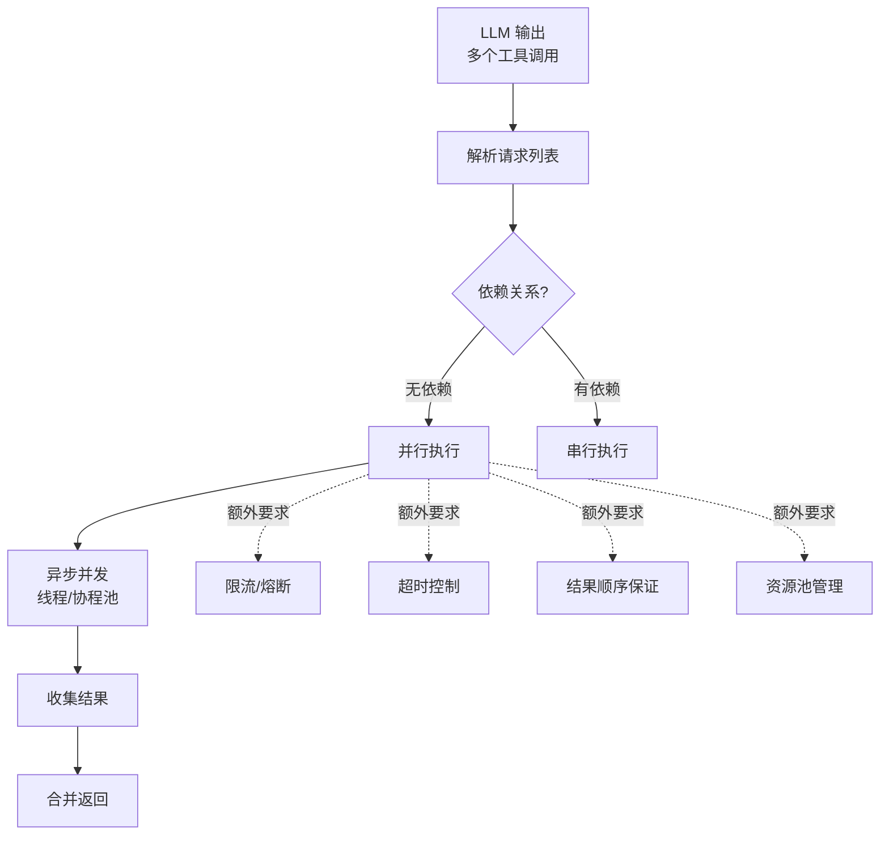

# 在 Function Calling（函数调用）中，并行调用是如何实现的？它比串行调用在系统架构设计上有哪些额外要求？

并行调用允许大模型在一次生成过程中输出多个独立的函数调用请求（如包含在 JSON 数组中的多个 tool_calls）。从架构角度看，这要求客户端或中间件具备并发执行能力，能够同时触发多个 API 或工具，并处理异步返回的结果。相比串行调用，并行调用的额外要求包括：1) 状态管理，需要追踪多个并发任务的 ID 和返回状态；2) 错误隔离，某个工具的失败不应阻断其他工具的执行；3) 结果聚合，需要将所有工具的输出整理成模型可读的上下文格式重新输入。此外，并行调用对模型的指令遵循能力要求更高，必须能正确区分依赖关系（如 B 依赖 A 的结果则不能并行）。

### 边界情况与极端场景
1.  **半并行/部分依赖**：模型一次性发出 3 个调用，其中 A 和 B 独立，但 C 依赖 A 的结果。系统若盲目全并行会导致 C 失败。需在中间件层构建 DAG（有向无环图），将任务拆分为“并行组”和“串行组”执行。
2.  **超时处理与取消传播**：某个工具调用超时（如下游服务假死），不应无限等待。需设置全局 Timeout，一旦超时，不仅要取消该任务，还应决定是否取消其他依赖它的后续任务，或直接返回部分结果给 LLM 进行决策。
3.  **速率限制**：并行调用可能瞬间击穿下游 API 的 Rate Limit。需在并发层增加“令牌桶”或“滑动窗口”限流策略，将突发流量平滑化。

### 实战案例
在构建电商数据分析 Agent 时，我们发现并行调用极大地提升了性能，但也遇到过严重的依赖判断失误：模型曾同时发起“获取用户ID”和“获取用户订单”，导致订单查询因 ID 为空而报错。解决方案是在 Prompt 中显式加入 Dependency Check 环节，或者在中间件层通过 DAG（有向无环图）预处理工具依赖图，将伪并行转为串行执行。

### 代码示例
```python
import asyncio

async def execute_tool(tool_call):
    try:
        # 模拟异步 IO 调用
        return await tool_api.invoke(tool_call.function, tool_call.arguments)
    except Exception as e:
        return {"error": str(e), "id": tool_call.id} # 错误隔离，不抛出异常阻断整体

async def handle_parallel_calls(tool_calls):
    # 并发发起所有请求
    results = await asyncio.gather(*[execute_tool(tc) for tc in tool_calls])
    return results
```

## 易错点
1.  **结果顺序敏感性**：并行返回的结果顺序是随机的，若直接按数组顺序拼回 Prompt，会导致 LLM 混淆 Tool ID 和 Result。必须在返回结构中显式保留 `tool_call_id` 进行精确匹配。
2.  **上下文窗口溢出**：并行调用虽然速度快，但一次性返回几十个工具的大段文本，极易撑爆 LLM 的 Context Window。需在聚合阶段加入摘要或截断策略。

## 面试追问
1.  如果下游工具不仅有依赖关系，还有互斥关系（如不能同时调用“扣款”和“退款”），如何在 Prompt 或中间件层进行约束？
2.  在处理超长链路的并行调用时，如何设计中间件来实现“流式返回”——即某个工具先返回了，就先发给 LLM 处理，而不是等所有工具都结束？
3.  如何测试 Function Calling 的并行逻辑的正确性？是否会设计自动化测试来覆盖所有可能的 DAG 依赖组合？

## 技术原理

并行 Function Calling 比串行多了三个架构层面的硬要求，每一个都对应着具体的工程原理：

- **状态管理与 ID 匹配**：串行调用是"发一个等一个"，天然有序；并行调用是"一次发多个，结果乱序返回"，必须用 `tool_call_id` 把每个结果精确映射回原始请求位置。`assistant.tool_calls[i].id` 与后续 `role=tool` 消息的 `tool_call_id` 一一对应，这是 OpenAI Function Calling 协议设计的核心——没有 ID 匹配，LLM 会把 A 工具的结果错配给 B 工具，推理全乱。
- **错误隔离**：串行里一个工具失败可以直接抛异常终止；并行里一个失败不应阻断其他仍在执行的工具。实现上用 `try/except` 包裹每个工具调用，把异常转化为错误结果返回，由聚合层统一处理。`asyncio.gather(return_exceptions=True)` 就是这个机制。
- **依赖关系与 DAG**：模型可能误判依赖（同时发"获取用户 ID"和"获取订单"，后者依赖前者）。中间件层需构建 DAG（有向无环图），把任务拆成"并行组"（无依赖）和"串行组"（有依赖），独立任务并行、依赖任务排队等前置完成。这是把"伪并行"修正为"真并行"的关键。
- **限流与超时**：并行会瞬间打高下游 QPS，触发 Rate Limit（429）。令牌桶/滑动窗口把突发流量平滑化；单任务超时（`asyncio.wait_for`）防止某个慢请求拖垮整体。

## 注意事项

1. **结果顺序敏感性**：并行返回顺序是随机的（谁先完成谁先返回），若直接按数组顺序拼回 Prompt 会导致 LLM 混淆 Tool ID 和 Result，必须显式保留 `tool_call_id` 精确匹配。
2. **上下文窗口溢出**：并行一次性返回几十个工具的大段文本极易撑爆 Context Window，聚合阶段要加摘要或截断策略。
3. **互斥工具要约束**：扣款和退款这类互斥操作不能并行，需在 Prompt 或中间件层声明互斥关系。
4. **超时取消要传播**：某个工具超时后，要决定是否取消依赖它的后续任务，还是返回部分结果让 LLM 决策。

## 对比表

| 维度 | 串行调用 | 并行调用 |
|:---|:---|:---|
| **执行模型** | 发一个等一个，天然有序 | 一次发多个，结果乱序返回 |
| **延迟** | N 个工具延迟相加（Σ） | N 个工具延迟取最大值（max） |
| **状态管理** | 无需 ID 匹配（顺序即语义） | 必须用 `tool_call_id` 精确匹配 |
| **错误处理** | 一个失败直接终止 | 错误隔离，`gather(return_exceptions=True)` |
| **依赖处理** | 天然按序执行满足依赖 | 需 DAG 拆分依赖组与并行组 |
| **限流风险** | 低（串行 QPS 低） | 高（瞬间打高触发 429） |
| **上下文压力** | 增量返回，窗口可控 | 一次性聚合，易撑爆窗口 |


## 核心流程图



## 记忆要点

- 并行调用需客户端具备并发能力，一次输出多个 tool_calls。
- 架构要求：状态管理追踪 ID、错误隔离防阻断、结果聚合重输入。
- 依赖处理：需构建 DAG 图，将依赖任务转为串行，独立任务并行。
- 结果顺序随机，必须保留 tool_call_id 精确匹配，避免 LLM 混淆。
- 需设置超时与限流策略，防止下游 API 被击穿或无限等待。

## 结构化回答

**30 秒电梯演讲：** 并行调用就是模型一次输出多个独立的 tool_calls，客户端并发执行再聚合结果——像大厨一次喊出多道菜，帮厨同时做最后汇总。比串行快，但架构上多了三个硬要求：状态管理追踪 ID、错误隔离防一个失败全盘崩、结果聚合按 tool_call_id 精确匹配回填。

**展开框架：**
1. **并发执行** — 模型一次输出多个独立 tool_calls，客户端用 asyncio 之类的并发能力同时发起，比串行快得多。
2. **三大架构要求** — 状态管理追踪每个调用 ID 和状态、错误隔离（try/except 不让单工具失败阻断整体）、结果聚合整理成模型可读上下文。
3. **依赖与限流** — 用 DAG 图区分依赖任务（串行）和独立任务（并行）；设超时和令牌桶限流防下游 API 被击穿。

**收尾：** 我在电商数据 Agent 里踩过坑——模型同时发"获取用户 ID"和"获取订单"，订单因 ID 空报错，后来在中间件加 DAG 预处理依赖图解决。您想聊超时取消怎么传播，还是互斥工具（扣款 vs 退款）怎么约束？

## 视频脚本

> 预计时长：2 分钟 | 由浅入深

| 时间 | 画面/字幕 | 口播台词 | 讲解要点 |
|------|----------|----------|----------|
| 0:00 | 标题卡：并行函数调用 | "串行调工具太慢？模型一次发多个 tool_calls，客户端并发执行。" | 开场钩子 |
| 0:15 | 大厨帮厨并发示意图 | "像大厨一次喊多道菜，多个帮厨同时做，最后汇总上桌。" | 核心类比 |
| 0:40 | 三大架构要求图 | "状态管理追踪 ID、错误隔离防阻断、结果聚合重输入——串行没有的三个硬要求。" | 架构要求 |
| 1:10 | DAG 依赖处理图 | "依赖判断：用有向无环图，独立任务并行，依赖任务转串行。" | 依赖处理 |
| 1:35 | 电商用户ID订单依赖案例 | "实战：同时发获取 ID 和获取订单，订单因 ID 空报错，加 DAG 预处理解决。" | 实战案例 |
| 1:55 | 总结卡 | "口诀：并发执行、错误隔离、DAG 排依赖、限流防击穿。" | 收尾 |

