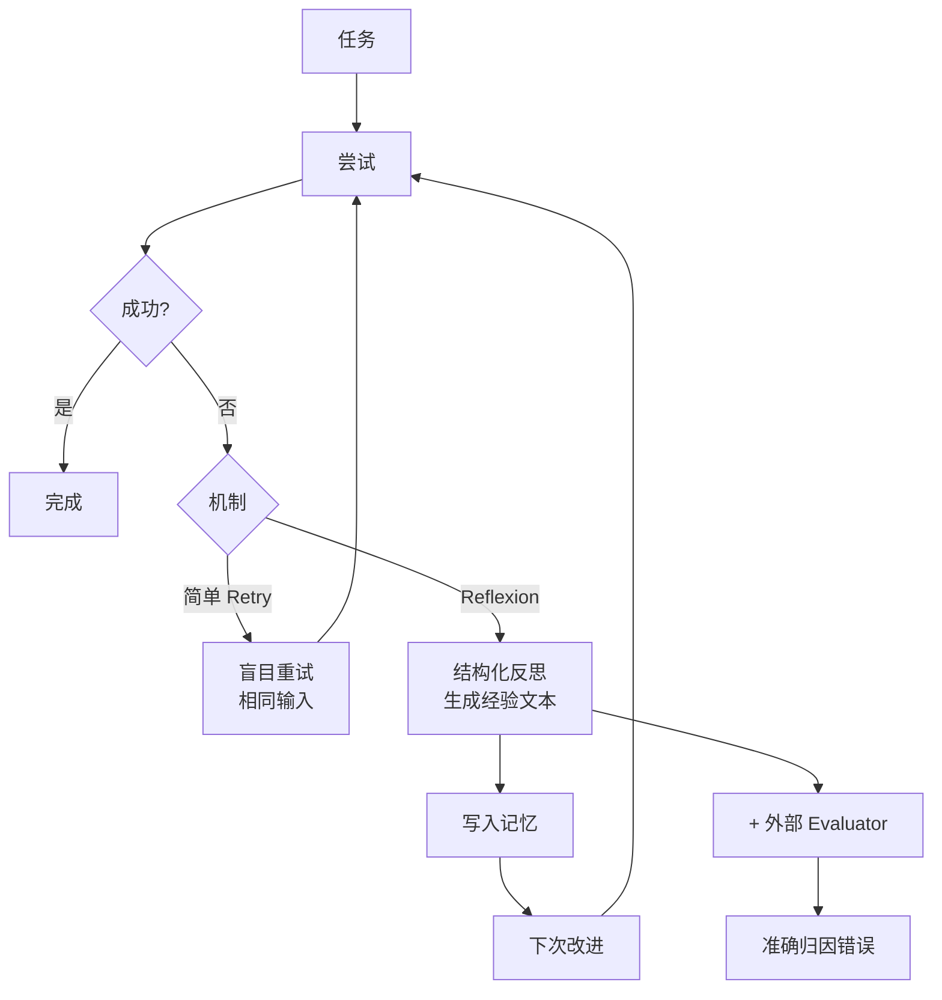

# Reflexion（反思机制）在 AI Agent 中是如何工作的？它与简单的 Retry（重试）机制有什么本质区别？

Reflexion 是一种基于自我反思的 Agent 架构。它不仅检测任务失败，还会生成一个“反思文本”，描述错误原因或改进策略，并将其存储在 episodic memory（情景记忆）中，作为下一次尝试的上下文输入。与简单的 Retry 不同，Retry 通常是直接重复执行，或者通过调整随机采样（如 Temperature）来尝试，缺乏对错误原因的显式建模。而 Reflexion 是一种“认知升级”，它强迫 Agent 进行元认知，通过上下文学习将失败经验转化为行动策略，从而解决需要多轮试错才能解决的复杂任务（如代码调试或规划修正）。

### 实战案例
在代码生成 Agent 中，如果直接 Retry 只会因为随机性改变产生不同但同样错误的代码；而引入 Reflexion 后，Agent 能分析报错栈信息（如“变量未定义”），在 Memory 中记录“需先检查变量作用域”，从而在下次重写时主动修复该逻辑漏洞。

### 代码示例（Python 伪代码）
```python
def reflexion_loop(task, max_trials=3):
    memory = []
    for _ in range(max_trials):
        result = agent.execute(task, context=memory)
        if evaluator.is_success(result):
            return result
        # 生成反思文本而非简单重试
        reflection = agent.reflect(f"Error: {result.error}")
        memory.append(reflection) # 存入上下文以修正策略
    return None
```

### 对比表格
| 特性 | Simple Retry | Reflexion |
| :--- | :--- | :--- |
| **错误处理** | 忽略或仅调整随机参数 | 显式分析错误并存储反思文本 |
| **上下文利用** | 仅依赖原始 Prompt | 结合历史反思动态构建 Prompt |
| **适用场景** | 偶发性网络故障/随机性错误 | 逻辑漏洞/规划错误的修正 |
| **演进能力** | 无演进，概率性成功 | 迭代式认知升级，收敛更快 |

## 边界情况
Reflexion 机制在以下边界场景中表现差异显著：
1. **评估器幻觉**：如果 Evaluator（评估器）本身由 LLM 担任且产生幻觉，可能给出错误的反馈，导致 Reflexion 在正确的答案上强行“反思”并引入错误。需引入单元测试或确定性校验器作为最终判断。
2. **记忆过载**：在超长轮次任务中，错误反思可能不断累积导致上下文溢出，或者早期的成功反思被后续的噪音掩盖。需要设计记忆的优先级衰减机制或遗忘机制。
3. **无解陷阱**：对于 Agent 能力之外的任务（如无法获取的外部数据），Reflexion 可能陷入无限循环的自我修正。必须配合“放弃机制”，即当反思内容重复出现或达到最大重试次数时停止。

## 面试追问
1. 如何防止 Reflexion 产生的错误反思污染上下文，导致后续尝试反而变差？
2. Reflexion 生成的文本如果过长，会影响推理效率和 Token 消耗，你如何优化反思的压缩或检索？
3. 除了基于文本的反思，有没有考虑过将反思结果结构化（如 JSON）以增强 Planner 的执行准确性？

## 易错点
1. **混淆 Self-Consistency（自洽性）与 Reflexion**：Self-Consistency 是通过多次采样投票取最优解，主要用于逻辑推理；而 Reflexion 是基于错误反馈的单链或多链迭代，是序贯的。不要将两者混为一谈。
2. **忽视评估器的成本**：Reflexion 需要在每一轮调用 Evaluator，这实际上增加了每一步的 LLM 调用成本。在实际工程中，Evaluator 的设计必须比 Agent 本身更轻量或更确定，否则成本会呈指数级上升。

## 技术原理

Reflexion 与 Retry 的本质区别在于**是否对错误进行显式建模**：

- **Retry 的概率性本质**：Retry 只是重复执行或调整随机参数（Temperature、top_p），每次尝试是独立的概率采样——模型可能蒙对，也可能重复同样的错误。没有错误信息的累积，收敛靠运气。
- **Reflexion 的元认知循环**：Reflexion 在每次失败后调用 Evaluator 分析错误，生成结构化的反思文本（如"错误原因：变量未定义；改进策略：先检查作用域"），存入 episodic memory。下次尝试时把这个反思作为上下文输入，模型"带着教训"重写，收敛速度远快于 Retry。
- **上下文学习（In-Context Learning）的作用**：Reflexion 的反思不更新模型权重，而是通过把反思文本塞进 Prompt 实现策略改进。这依赖 LLM 的上下文学习能力——模型能从反思文本里提取出"该避免什么"并应用到本次生成。
- **Self-Consistency 与 Reflexion 的区别**：Self-Consistency 是多次采样投票取最优（空间维度的并行）；Reflexion 是基于错误反馈的序贯迭代（时间维度的串行）。两者正交，可组合使用。

## 代码示例

```python
# Reflexion 完整循环（对比 Retry 的概率性重试）
class Agent:
    def execute(self, task, context=None):
        return self.llm.generate(task, context)  # 带 context 的执行

class ReflexionLoop:
    def __init__(self, agent, evaluator, max_trials=3):
        self.agent = agent
        self.evaluator = evaluator
        self.max_trials = max_trials

    def run(self, task):
        memory = []  # episodic memory 存反思
        for trial in range(self.max_trials):
            result = self.agent.execute(task, context=memory)
            if self.evaluator.is_success(result):
                return result
            # 关键：生成结构化反思文本（而非简单重试）
            reflection = self.agent.reflect(
                f"上次失败原因: {result.error}。请给出一条可复用的改进规则。")
            memory.append(reflection)  # 存入记忆供下次使用
        return None  # 达上限放弃

# 对比：Retry 只是调 Temperature 重试，无错误建模
def retry_loop(task, agent, max_trials=3):
    for _ in range(max_trials):
        result = agent.execute(task, temperature=0.9)  # 靠随机性蒙对
        if result.success: return result
    return None
```


## 核心流程图



## 核心知识点图


## 记忆要点

- Reflexion 显式分析错误生成反思文本存入记忆，Retry 仅调整参数重试。
- 本质区别：Reflexion 是认知升级（元认知），Retry 是概率性尝试。
- 适用场景：Reflexion 解决逻辑漏洞（如代码调试），Retry 解决偶发性故障。
- 需防止评估器幻觉导致错误反思污染上下文，或陷入无解无限循环。
- 成本考量：Reflexion 增加了每轮的 Evaluator 调用成本，需轻量设计。

## 结构化回答

**30 秒电梯演讲：** Reflexion 和 Retry 的本质区别是"认知升级 vs 概率尝试"。Retry 只是重蒙一遍答案或调调随机参数；Reflexion 会显式分析错误原因，生成反思文本存进情景记忆，下次尝试时带着这个教训重来。就像学生做错题不是重蒙，而是分析错因记在草稿纸上避开陷阱。

**展开框架：**
1. **机制差异** — Retry 忽略错误或调 Temperature 重试（概率性）；Reflexion 生成反思文本存 episodic memory，动态构建下次上下文（元认知）。
2. **适用场景** — Reflexion 解决逻辑漏洞（代码调试、规划修正），Retry 解决偶发性故障（网络抖动、随机错误）。
3. **风险与成本** — 评估器幻觉会产生错误反思污染上下文，需确定性校验器兜底；每轮多调一次 Evaluator 增成本，要轻量化设计。

**收尾：** 我在代码生成 Agent 里用过 Reflexion，Agent 分析报错栈"变量未定义"后记下"先查作用域"，下次主动修复，比 Retry 收敛快得多。您想聊反思文本怎么压缩，还是评估器幻觉怎么防？

## 视频脚本

> 预计时长：2 分钟 | 由浅入深

| 时间 | 画面/字幕 | 口播台词 | 讲解要点 |
|------|----------|----------|----------|
| 0:00 | 标题卡：Reflexion 反思机制 | "Agent 失败了怎么办？简单重试是重蒙答案，Reflexion 是分析错因记下来。" | 开场钩子 |
| 0:15 | 学生错题本类比图 | "像学生做错题，Retry 重蒙一遍，Reflexion 分析错因记草稿纸，下次避开陷阱。" | 核心类比 |
| 0:40 | Retry vs Reflexion 对比表 | "Retry 调参数概率尝试，Reflexion 生成反思文本存记忆，是认知升级。" | 机制对比 |
| 1:10 | 反思循环代码示例 | "流程：执行→评估失败→生成反思→存入记忆→带教训重试，直到成功或达上限。" | 工作流程 |
| 1:35 | 代码调试变量未定义案例 | "实战：代码 Agent 分析报错栈记下先查作用域，下次主动修复，比 Retry 快。" | 实战案例 |
| 1:55 | 总结卡 | "口诀：Reflexion 是认知升级，Retry 是概率尝试。防评估器幻觉。" | 收尾 |

