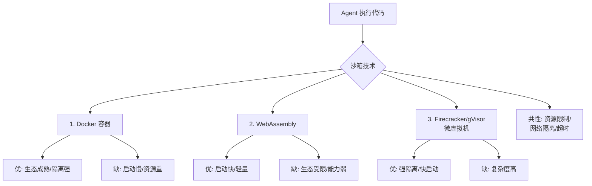

# Agent 系统中的“沙箱隔离”对于安全性至关重要，请列举三种主流的沙箱技术并对比其优缺点。

1) **Docker 容器**：提供操作系统级别的隔离，优点是生态成熟、易于部署和资源限制，缺点是隔离性不如虚拟机，若配置不当可能存在逃逸风险，且启动速度相对较慢；2) **WebAssembly (WASM)**：提供轻量级、近乎原生的执行速度和内存隔离，优点是启动极快、安全性高，缺点是生态和系统调用受限，不适用于需要复杂 OS 依赖的工具；3) **gVisor / Firecracker**：gVisor 是用户态内核，提供强隔离且比 VM 轻量；Firecracker 是微型虚拟机，提供最强的硬件级隔离。gVisor 启动快但有兼容性开销，Firecracker 隔离最强但启动和内存开销略大。选择时需权衡安全级别与性能需求。

### 实战案例
在执行用户上传的 Python 数据处理脚本时，使用 Docker 容器隔离虽方便但曾遭遇恶意脚本通过 `mount` 逃逸尝试；改用 Firecracker 微型 VM 后，虽毫秒级启动延迟略有增加，但彻底杜绝了内核级逃逸风险。

### 代码示例（Docker 安全加固配置）
```dockerfile
# 限制权限，防止 Root 用户逃逸
FROM python:3.9-slim
RUN adduser -D -u 1000 app_user
USER app_user
# 禁止特权模式，只读根文件系统
# --read-only --tmpfs /tmp --security-opt no-new-privileges
CMD ["python", "agent_script.py"]
```

### 对比表格
| 特性 | Docker 容器 | WebAssembly (WASM) | gVisor / Firecracker |
| :--- | :--- | :--- | :--- |
| **隔离级别** | 进程级 (内核共享) | 内存级 (沙箱) | 内核级 / 虚拟硬件级 |
| **启动速度** | 秒级 | 毫秒级 | 亚秒级 / 秒级 |
| **系统调用** | 完全支持 | 受限 (需 WASI 接口) | gVisor拦截/FC完全支持 |
| **适用场景** | 通用服务/复杂依赖 | 高频轻量级计算/前端 | 高安全要求/多租户 SaaS |
| **主要风险** | 容器逃逸 | 生态不成熟/功能受限 | 兼容性开销/资源略高 |

## 边界情况
沙箱技术在极端场景下的限制：
1. **侧信道攻击**：即使是 Firecracker 这样的强隔离 VM，如果攻击者能控制 CPU 缓存、执行时间等物理资源，仍可能通过侧信道推断宿主机信息。这在多租户高密度部署场景下尤为危险。
2. **网络隔离失效**：Agent 可能利用 DNS Rebinding 或 IPv6 隧道绕过仅配置了 IPv4 白名单的网络防火墙。网络层面的沙箱策略必须覆盖全协议栈。
3. **资源耗尽攻击（DoS）**：如果 Agent 生成了死循环代码，单纯的 CPU 限制可能不够，还需要考虑文件描述符打开数、IPC 信号量等内核资源的限制，否则可能导致宿主机 Kernel Panic。

## 面试追问
1. 对于 Agent 调用 GPU 进行推理的场景，Docker 或 gVisor 如何保证 GPU 的隔离安全（防止恶意代码通过 GPU 显存窃取数据）？
2. 在高并发 Serverless 架构下，如何复用 Firecracker 微虚拟机实例以减少冷启动，同时保证不同租户间的内存清理干净？
3. 如果业务逻辑必须依赖 Root 权限（例如某些系统级配置），除了容器沙箱，还有哪些机制可以加固安全性？

## 易错点
1. **误以为 Docker 就是虚拟机**：Docker 共享宿主机内核，一旦内核级漏洞（如 Dirty Cow）被利用，所有容器都会沦陷。对于执行不可信代码，Docker 仅能作为基础隔离，必须配合 Seccomp/AppArmor 等内核安全特性使用。
2. **忽视 Wasm 的“沙箱逃逸”风险**：虽然 Wasm 本身是内存安全的，但如果 Wasm 运行时（如 Wasmtime）暴露了不安全的 Host Function（如直接允许访问文件系统），攻击者依然可以通过调用这些函数突破边界。沙箱的安全性取决于暴露给它的接口。

## 技术原理

三种沙箱技术的隔离强度递增（Docker < WASM < gVisor/Firecracker），差异根源在于它们"拦截系统调用的层级"不同：

- **Docker（进程级隔离）**：本质是 Linux Namespace + Cgroups 的组合——Namespace 隔离视图（PID、网络、挂载点看起来是独立的），Cgroups 限制资源（CPU、内存、IO）。但它**共享宿主机内核**，一旦内核有漏洞（如 Dirty Cow），所有容器都会沦陷。所以 Docker 只是"基础隔离"，防逃逸还需配合 Seccomp（限制系统调用号）、AppArmor（强制访问控制）、非 Root 用户、只读根文件系统。
- **WebAssembly（内存级隔离）**：WASM 代码运行在一个线性内存沙箱里，任何内存越界访问都会被运行时拦截，天然内存安全。启动毫秒级（无需起进程），适合高频轻量计算。短板是系统调用受限——只能通过 WASI 接口访问文件/网络，生态不成熟，不适合复杂 OS 依赖的工具。
- **gVisor / Firecracker（内核级隔离）**：gVisor 用用户态内核（Go 实现的 Sentry）拦截系统调用，在用户态重新实现内核语义，攻击面大幅缩小；Firecracker 是微型虚拟机（基于 KVM），提供真正的硬件级隔离（独立内核）。两者都能阻断容器逃逸到宿主机内核，代价是兼容性开销（gVisor）或启动/内存开销略大（Firecracker）。适合高安全多租户 SaaS。

选型逻辑：通用服务用 Docker + 加固；高频轻量计算用 WASM；高安全多租户用 gVisor/Firecracker。

## 注意事项

1. **Docker 不是虚拟机**：Docker 共享宿主机内核，内核级漏洞被利用后所有容器沦陷。执行不可信代码时 Docker 只是基础，必须配 Seccomp/AppArmor 加固。
2. **WASM 的安全取决于暴露接口**：WASM 本身内存安全，但运行时（Wasmtime）若暴露了不安全的 Host Function（如直接访问文件系统），攻击者仍能突破边界。沙箱安全性 = 语言安全 + 接口收敛。
3. **侧信道攻击是盲点**：即使 Firecracker 强隔离，攻击者控制 CPU 缓存、执行时间等物理资源仍可能推断宿主机信息。多租户高密度部署需关注物理资源隔离。
4. **网络隔离要覆盖全协议栈**：仅配 IPv4 白名单会被 DNS Rebinding 或 IPv6 隧道绕过，网络沙箱必须覆盖全协议。

## 代码示例

```dockerfile
# Docker 安全加固配置（执行不可信代码时必备）
FROM python:3.11-slim
RUN adduser --disabled-password --uid 1000 app_user
USER app_user                          # 非 Root 运行
# 启动参数：--read-only 只读根 / --tmpfs /tmp 临时目录 / --security-opt no-new-privileges
# --security-opt seccomp=profile.json 限制系统调用号
# --cap-drop ALL --cap-add NET_BIND_SERVICE 最小权限
CMD ["python", "agent_script.py"]
```

```python
# WASM 沙箱执行用户代码（Wasmtime，内存级隔离）
import wasmtime
engine = wasmtime.Engine()
store = wasmtime.Store(engine)
module = wasmtime.Module(engine, open("user_code.wasm", "rb").read())
# 只暴露最小 Host Function，不暴露文件系统/网络
instance = wasmtime.Instance(store, module, [])
instance.exports(store)["main"]()  # 在线性内存沙箱里执行
```


## 核心流程图




## 记忆要点

- Docker：OS 级隔离，生态成熟但共享内核，存在逃逸风险。
- WASM：内存级隔离，启动极快安全高，但系统调用受限生态弱。
- gVisor/Firecracker：用户态内核/微虚拟机，隔离最强，适合高安全多租户。
- Docker 非虚拟机，需配合 Seccomp/AppArmor 加固防止内核漏洞。
- 侧信道攻击是强隔离下的盲点，需关注 CPU 缓存等物理资源隔离。

## 结构化回答

**30 秒电梯演讲：** 三种沙箱按隔离强度递增：Docker 是合租室友共享内核、WASM 是胶囊旅馆内存级隔离、gVisor/Firecracker 是独栋别墅内核级隔离。Docker 生态好但防逃逸要加固，WASM 极速轻量但系统调用受限，gVisor/FC 最强适合高安全多租户。选型就是在隔离强度和性能之间找平衡。

**展开框架：**
1. **Docker 容器** — OS 级隔离，生态成熟易部署，但共享内核有逃逸风险，需配 Seccomp/AppArmor 加固，启动秒级。
2. **WebAssembly** — 内存级隔离，启动毫秒级安全高，但系统调用受限（需 WASI）、生态弱，适合高频轻量计算。
3. **gVisor/Firecracker** — 用户态内核/微虚拟机，隔离最强，适合高安全多租户 SaaS，代价是兼容性开销和资源略高。

**收尾：** 我跑用户上传的 Python 脚本，Docker 遇到过 mount 逃逸尝试，换 Firecracker 微 VM 后启动延迟只多一点但彻底杜绝内核逃逸。您想聊侧信道攻击怎么防，还是 GPU 隔离怎么做？

## 视频脚本

> 预计时长：2 分钟 | 由浅入深

| 时间 | 画面/字幕 | 口播台词 | 讲解要点 |
|------|----------|----------|----------|
| 0:00 | 标题卡：三种沙箱技术 | "Agent 跑不可信代码，沙箱怎么选？三种技术隔离强度不同。" | 开场钩子 |
| 0:15 | 合租/胶囊/别墅类比图 | "Docker 合租共享内核，WASM 胶囊内存级，gVisor/FC 别墅内核级隔离。" | 核心类比 |
| 0:45 | 三技术对比表 | "Docker 生态好但有逃逸风险，WASM 极速但受限，FC 最强但开销大。" | 横向对比 |
| 1:15 | Docker 加固配置代码 | "Docker 非虚拟机，必须配 Seccomp/AppArmor、非 Root、只读根文件系统。" | 加固实践 |
| 1:40 | mount 逃逸换 Firecracker 案例 | "实战：用户脚本试 mount 逃逸，换 Firecracker 微 VM 杜绝内核级风险。" | 实战案例 |
| 1:55 | 总结卡 | "口诀：隔离递增 Docker<WASM<FC，按安全等级选。防侧信道。" | 收尾 |

