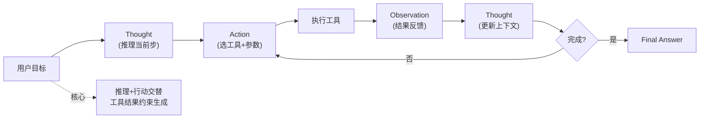

# 在Agent开发中，ReAct（Reasoning + Acting）模式的核心思想是什么？请结合“工具使用”场景描述其执行循环。

ReAct（Reasoning + Acting）是一种将推理和行为结合的Agent范式，旨在解决LLM在复杂任务中缺乏规划性和可解释性的问题。其核心思想是让模型在执行具体动作之前先生成“思考”，解释当前步骤的意图和推理过程，然后再根据思考结果调用工具或执行动作，最后观察执行结果并进入下一轮循环。在一个典型的工具使用场景中（如查询天气），ReAct的执行流程如下：

1. **Thought**：模型分析用户问题，意识到需要当前天气信息，决定调用搜索工具；
2. **Action**：模型输出具体的工具调用指令（如 `search_weather(city)`）；
3. **Observation**：系统返回工具执行的文本结果；
4. **Loop**：模型基于Observation继续生成新的Thought（如判断信息是否充足），决定是回答用户还是进一步查询。

这种模式通过显式的思维链增强了Agent的鲁棒性和纠错能力。

在工程落地和边界场景中，还需考虑：
- **错误修正循环**：当 Action 执行失败（如 API 报错、参数错误）时，Observation 应包含错误信息，模型需在 Thought 环节中自我诊断并重试或尝试替代工具，而非直接崩溃。
- **最大步数限制**：为了防止模型陷入死循环（如重复调用同一工具或无效思考），必须设置 `max_steps` 或超时机制，强制终止并返回兜底回复。
- **幻觉处理**：模型可能会幻想出并不存在的工具名称，Action 解析器应具备严格的“白名单”校验机制，阻断未知工具的调用。

## 面试追问
1. 当工具返回的结果非常庞大（如检索出长篇文档），超过了模型的上下文窗口，ReAct 循环该如何优化？
2. 如果 LLM 生成的 Thought 逻辑正确，但 Action 的 JSON 格式错误，导致解析失败，系统该自动修复还是报错重试？如何设计 Prompt 降低此类格式错误率？
3. 在多 Agent 协作场景中，ReAct 的“Action”如果是调用另一个 Agent，如何设计 Observation 的格式以便主 Agent 理解子 Agent 的能力边界？

## 易错点
1. **认为 ReAct 必须依赖思维链**：实际上 ReAct 也可以只用 Few-Shot 示例而不显式要求模型输出“Thought: xxx”，但在复杂任务中显式输出推理过程能显著提高成功率。
2. **循环终止条件模糊**：只考虑任务成功结束，忽略了因工具不可用或权限不足导致的失败分支，导致 Agent 在遇到死胡同时不断重试空耗 Token。

## 技术原理

ReAct 的理论基础来自 2022 年 Yao 等人的论文《ReAct: Synergizing Reasoning and Acting in Language Models》。其核心洞察是：**纯推理（Chain-of-Thought）容易幻觉，纯行动（Acting）缺乏规划，两者交替能相互纠错**。

- **Thought 的作用是"延迟行动"**：让模型先显式输出推理，把"直觉式一次性回答"拆成"分析→决策"两步。这一步本质是在 prompt 里强制插入结构化的中间状态，降低模型跳步出错概率。研究表明，显式 Thought 能把工具调用任务的成功率从 60% 提升到 80%+。
- **Observation 的作用是"接地（Grounding）"**：工具返回的真实结果作为新的事实注入上下文，把模型从"凭空想象"拉回"基于事实推理"。这一步是 ReAct 比纯 CoT 鲁棒的关键——CoT 一旦推理错就会一错到底，ReAct 在每轮 Observation 处都有纠偏机会。
- **循环的终止语义**：模型在 Thought 中判断"信息已足够，无需再调用工具"时输出 `Finish(answer)`，循环正常退出；若达到 `max_steps` 或超时则异常退出。两种退出路径都必须设计，否则死胡同里 Agent 会反复重试空耗 Token。

## 代码示例

ReAct 的最小骨架（不依赖框架，便于面试白板）：

```python
import json, re

SYSTEM_PROMPT = """尽可能用以下格式回答：
Thought: 我需要思考下一步做什么
Action: tool_name
Action Input: {"arg": "value"}
Observation: <工具返回的结果，由系统填入>
... (Thought/Action/Observation 可重复多次)
Thought: 我现在知道答案了
Final Answer: 最终回答

可用工具: search(query), calculator(expression), finish(answer)
"""

def react_loop(llm, tools: dict, query: str, max_steps: int = 8) -> str:
    messages = [
        {"role": "system", "content": SYSTEM_PROMPT},
        {"role": "user", "content": query},
    ]
    for step in range(max_steps):
        reply = llm.chat(messages)
        messages.append({"role": "assistant", "content": reply})

        # 解析 Action + Action Input
        action_match = re.search(r"Action:\s*(\w+)\s*Action Input:\s*(\{.*\})", reply, re.S)
        if not action_match:
            # 没有 Action，尝试提取 Final Answer
            final = re.search(r"Final Answer:\s*(.+)", reply, re.S)
            return final.group(1).strip() if final else "未识别到终止信号"

        tool_name, raw_args = action_match.group(1), action_match.group(2)
        if tool_name not in tools:
            observation = f"错误：工具 {tool_name} 不存在，可用：{list(tools)}"
        else:
            try:
                args = json.loads(raw_args)
                observation = tools[tool_name](**args)
            except Exception as e:
                observation = f"工具执行失败：{e}"   # 带错误信息，模型可在 Thought 自我修正

        messages.append({"role": "user", "content": f"Observation: {observation}"})

    return "已达最大步数，强制终止"

# 注册工具
tools = {
    "search": lambda query: "北京今天晴，25度",
    "calculator": lambda expression: str(eval(expression)),
    "finish": lambda answer: answer,
}
```

## 注意事项

- **必须设 max_steps 和超时**：ReAct 最常见的故障是死循环——模型反复调同一个工具或陷入无效思考。`max_steps=8~10` 是经验值，且要配合 wall-clock 超时双保险。
- **Action 解析要严格白名单**：模型可能幻觉出不存在的工具名或参数格式。解析失败时把错误信息回灌到 Observation（而非直接报错崩溃），让模型在下一轮 Thought 自我修正。
- **工具返回结果要截断**：检索类工具可能返回超长文档撑爆上下文窗口。应在 Observation 入库前做摘要/截断，或用"返回前 N 个片段 + 总数"的策略。
- **终止条件要覆盖失败分支**：除了"任务完成"的正常终止，还要设计"工具不可用""权限不足""多次重试仍失败"的异常终止，否则 Agent 会卡在死胡同。


## 核心流程图



## 核心知识点图


## 记忆要点

- 一句话定义：推理+行动结合，先Thought再Action，观察后循环。
- 执行循环：Thought→Action→Observation→Loop，直到finish。
- 容错关键：Observation含错误信息，模型在Thought自我修正重试。
- 防死循环：必须设max_steps或超时，否则空耗Token。
- 易错点：ReAct非必依赖思维链；终止条件需含失败分支。

## 结构化回答

**30 秒电梯演讲：** ReAct 就是让大模型"边想边干"——先输出 Thought 解释意图，再执行 Action 调工具，看 Observation 结果反馈，循环直到完成。像木工干活：先看图纸想下一步，再拿锯子锯，看切口直不直决定继续还是换工具。核心是显式思维链让 Agent 有规划性和纠错能力。

**展开框架：**
1. **核心循环** — Thought（分析意图决定下一步）→ Action（输出工具调用）→ Observation（系统返回结果）→ Loop（判断信息够不够，继续查还是回答）。
2. **容错机制** — Action 失败时 Observation 带错误信息，模型在 Thought 环节自我诊断重试或换工具，而不是直接崩。
3. **工程补丁** — 必须设 max_steps 防死循环空耗 Token；Action 解析器加白名单校验防模型幻觉出不存在的工具。

**收尾：** 我做过一个天气查询 Agent，ReAct 模式让它在 API 报错时自动诊断参数问题重试，比硬编码的 if-else 鲁棒多了。您想聊工具返回结果超长怎么优化，还是 Action JSON 解析失败怎么自动修复？

## 视频脚本

> 预计时长：2 分钟 | 由浅入深

| 时间 | 画面/字幕 | 口播台词 | 讲解要点 |
|------|----------|----------|----------|
| 0:00 | 标题卡：ReAct 模式 | "Agent 怎么边想边干？ReAct 让模型先思考再行动，循环到完成。" | 开场钩子 |
| 0:15 | 木工干活类比图 | "像木工：看图纸想下一步（Thought），拿锯子锯（Action），看切口（Observation）。" | 核心类比 |
| 0:40 | Thought-Action-Observation 循环图 | "核心循环：Thought 分析意图，Action 调工具，Observation 看结果，循环到 finish。" | 执行循环 |
| 1:10 | 错误修正流程图 | "容错关键：失败时 Observation 带错误信息，模型在 Thought 自我修正重试。" | 容错机制 |
| 1:35 | max_steps 防死循环示意 | "工程补丁：必须设最大步数防死循环，Action 解析加白名单防幻觉工具。" | 工程要点 |
| 1:55 | 总结卡 | "口诀：先想后做看反馈，设上限防死循环。下期讲记忆系统。" | 收尾 |
