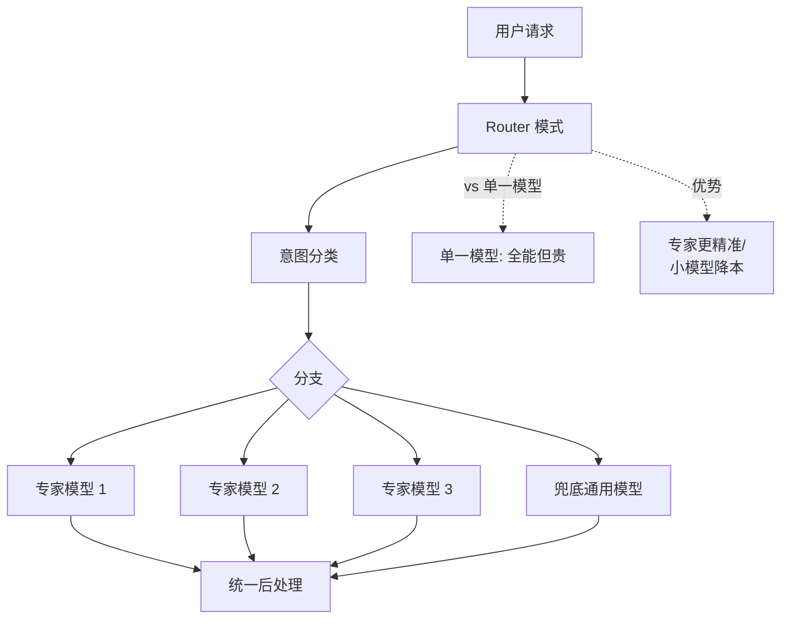

# Agent应用架构中的“Router模式”是如何设计的？在什么场景下比单一模型更优？

向量记忆（Vector Memory）和图记忆（Graph Memory）是Agent存储和检索过往经验的两种不同形式。向量记忆将信息转化为高维向量存储，通过语义相似度（如余弦距离）进行检索，擅长处理模糊的语义匹配，但难以捕捉实体间复杂的关系结构。图记忆则将知识存储为节点和边构成的图谱（如知识图谱），显式保留了实体间的层级、因果或时序关系。在处理复杂任务时，图记忆的优势在于能够进行多跳推理和关系追溯。例如，当Agent需要分析一系列事件的因果链条或回忆两个看似无关但存在隐性关联的人物关系时，图记忆可以通过遍历路径提供比简单向量检索更精确、更具解释性的上下文，有助于Agent进行更深层次的规划和决策。

针对记忆系统的工程落地，还需注意以下边界与挑战：
- **冷启动与更新成本**：图记忆通常依赖 NER（命名实体识别）和关系抽取模型来构建，构建和维护成本远高于向量记忆。在缺乏先验知识图谱的情况下，如何从对话流中动态且准确地构建图谱是核心难点。
- **检索权衡**：图记忆的图遍历查询（如 Cypher 查询）在处理大规模节点时可能比向量近似搜索慢，通常采用“向量粗排 + 图精排”的混合检索策略以平衡性能。
- **动态遗忘机制**：随着时间推移，过时的信息需要被“遗忘”。向量记忆可通过删除旧向量实现，而图记忆中节点的删除可能引发图的断裂或失效边的清理，逻辑更为复杂。
- **幻觉风险**：LLM 生成图结构（节点和边）时可能会产生错误的连接，导致 Agent 基于错误关系进行推理，需要在入库前增加事实校验层。

## 面试追问
1. 在多轮对话中，如果用户修改了之前的设定（例如把“小明的年龄从 10 岁改为 12 岁”），图记忆该如何高效地更新节点属性，而不是新增一个冲突的节点？
2. 相比于 Neo4j 等原生图数据库，能否基于现有的向量数据库（如 Milvus）模拟图记忆的实现？优劣在哪里？
3. 当知识图谱极其庞大时（如百万级节点），如何避免 Agent 在进行多跳推理时陷入“指数级爆炸”的路径搜索问题？

## 易错点
1. **认为图记忆完全取代向量记忆**：实际上图记忆擅长关系推理，但在处理模糊语义搜索（如“找一些关于快乐的感觉的描述”）时不如向量记忆高效，两者通常是互补而非替代关系。
2. **混淆知识图谱与图记忆**：知识图谱通常是静态的、结构化的世界知识，而 Agent 的图记忆是动态的、个性化的对话历史，两者数据来源和更新机制不同。

## 技术原理

向量记忆与图记忆的本质差异源于**数据结构决定检索能力**：

- **向量记忆的数据模型**：把文本 chunk 编码为高维稠密向量（如 1536 维），检索时用余弦相似度或内积找最近邻。这是**无结构**的——两个向量之间的"距离"只反映语义相似度，无法表达"A 是 B 的父亲""事件 X 导致事件 Y"这类结构化关系。优势是 ANN（近似最近邻）检索 O(log N) 极快，适合"找语义相近的内容"。
- **图记忆的数据模型**：用节点表示实体、边表示关系，每条边有明确的语义标签（`FATHER_OF`、`CAUSED_BY`、`WORKS_AT`）。检索用图遍历（BFS/DFS/Cypher 查询），能在 O(跳数) 内精确回答"A 的同事的导师是谁"这类多跳问题。这是**强结构**的——关系是显式存储的，不需要模型去猜。
- **为什么图擅长多跳推理**：向量检索找的是"和 query 像的内容"，多跳问题（A→B→C）的中间节点 B 往往和最终 query 不相似，会被向量检索漏掉；而图遍历沿着真实存在的边走，每跳都精确，不会丢失中间节点。
- **为什么两者互补**：模糊语义检索（"找些关于快乐感受的描述"）向量更强更快；精确关系推理（"张三的领导之前在哪公司干过"）图更强更可解释。生产系统常用"向量粗排召回候选 + 图精排走关系"的混合策略。

## 代码示例

向量 + 图混合检索的最小骨架（用 LangChain + Neo4j 思路）：

```python
from py2neo import Graph
import numpy as np

class HybridMemory:
    def __init__(self, vector_store, graph_uri="bolt://localhost:7687"):
        self.vec = vector_store              # 向量库（如 FAISS/Chroma）
        self.graph = Graph(graph_uri)        # 图库（Neo4j）

    def add_fact(self, subject, relation, obj, text, embedding):
        """同时写图（结构）和向量（语义）"""
        cypher = (
            f"MERGE (s:Entity {{name: $subj}}) "
            f"MERGE (o:Entity {{name: $obj}}) "
            f"MERGE (s)-[:{relation}]->(o)"
        )
        self.graph.run(cypher, subj=subject, obj=obj)
        self.vec.add(text=text, embedding=embedding,
                     metadata={"subject": subject, "relation": relation, "obj": obj})

    def recall(self, query_emb, query_text, entity=None, hops=2, top_k=10):
        """混合检索：向量粗排召回候选实体，图精排走多跳关系"""
        # 1. 向量粗排：按语义相似度召回 top_k 候选
        candidates = self.vec.search(query_emb, top_k=top_k)
        if not entity:
            return candidates

        # 2. 图精排：从锚点实体出发，走 hops 跳，补全结构化关系
        cypher = (
            f"MATCH (s:Entity {{name: $entity}})-[*1..{hops}]-(related) "
            f"RETURN s.name AS src, related.name AS related, "
            f"type(last(relationships(p))) AS rel"
        )
        graph_context = self.graph.run(cypher, entity=entity).data()
        # 把图结构作为高置信上下文拼在向量结果前
        return {"graph_relations": graph_context, "semantic_candidates": candidates}
```

## 注意事项

- **图构建是最大成本**：从对话流自动建图依赖 NER（命名实体识别）+ 关系抽取（RE），这两个模型本身有误差，错误的边会误导推理（"垃圾进垃圾出"）。建议入库前加一层事实校验（如用另一个 LLM 交叉验证关系是否成立）。
- **大规模图的多跳会爆炸**：百万节点上做 3 跳以上遍历，路径数指数增长。必须限制跳数（通常 ≤3）+ 剪枝（只走高频边类型）+ 索引（给锚点实体建索引加速定位）。
- **图的更新比删除复杂**：用户改设定（"小明的年龄从 10 改成 12"）不能简单删旧节点——删节点会断开所有关联边。正确做法是更新节点属性 + 记录变更历史（带时间戳的边），保留可追溯性。
- **别过度神话图记忆**：简单语义检索场景向量更快更省，强行上图只会增加运维负担。图的适用边界是"明确需要多跳关系推理且关系相对稳定"的场景（用户画像、组织架构、知识图谱问答）。


## 核心流程图



## 记忆要点

- 本质区别：向量记语义求模糊匹配，图记节点边保复杂关系
- 图的优势：因为显式保留因果或层级关系，所以擅长多跳推理与追溯
- 落地权衡：图依赖抽取构建成本高，需“向量粗排+图精排”保性能
- 避坑指南：图擅长逻辑推理但非全能，与向量是互补而非替代关系

## 结构化回答

**30 秒电梯演讲：** 向量记忆像图书馆索引卡片按内容大意找书，图记忆像地铁线路图能看站点连接和路径。本质区别是：向量记语义做模糊匹配，图记节点和边保留实体间的因果、层级关系。图记忆的优势是多跳推理和关系追溯——分析因果链或隐性关联时，图遍历比向量检索更准更有解释性。

**展开框架：**
1. **本质分工** — 向量记忆基于语义相似度模糊匹配，图记忆用节点+边显式存储实体间的层级、因果、时序关系。
2. **图的优势** — 多跳推理和关系追溯：分析事件因果链、挖隐性关联时，图遍历提供更精确、可解释的上下文，助力深层规划决策。
3. **落地权衡** — 图依赖 NER 和关系抽取构建成本高，大规模多跳查询慢，常用"向量粗排+图精排"混合策略；两者互补非替代。

**收尾：** 我在 Agent 里用图记忆做用户关系追溯，多跳查询比纯向量检索解释性强很多，但构建成本高，得配向量粗排保性能。您想聊图谱怎么从对话流动态构建，还是节点冲突（改年龄）怎么更新？

## 视频脚本

> 预计时长：2 分钟 | 由浅入深

| 时间 | 画面/字幕 | 口播台词 | 讲解要点 |
|------|----------|----------|----------|
| 0:00 | 标题卡：向量 vs 图记忆 | "Agent 记历史，向量按意思找，图按关系找，各有擅长。" | 开场钩子 |
| 0:15 | 索引卡片 vs 地铁线路图 | "向量记忆像索引卡片按大意找书，图记忆像地铁图看站点连接和路径。" | 核心类比 |
| 0:40 | 向量 vs 图本质对比表 | "向量重语义相似度模糊匹配，图重节点边保留因果层级等结构关系。" | 本质区别 |
| 1:10 | 图多跳推理路径图 | "图的优势：多跳推理和关系追溯，分析因果链或隐性关联更准更可解释。" | 图的优势 |
| 1:35 | 向量粗排+图精排架构 | "落地权衡：图构建成本高查询慢，常用向量粗排加图精排混合策略。" | 落地权衡 |
| 1:55 | 总结卡 | "口诀：向量模糊匹配，图结构推理，两者互补。下期讲 Map-Reduce。" | 收尾 |

