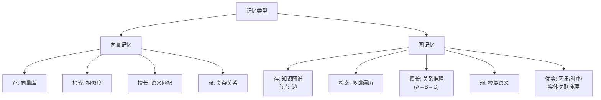

# 自治Agent中的“记忆系统”设计中，向量记忆与图记忆有什么本质区别？图记忆在处理复杂任务时有什么优势？

Agent应用架构中的“记忆系统”设计中，向量记忆与图记忆有以下本质区别：

**向量记忆**将信息转化为高维向量存储，通过语义相似度（如余弦距离）进行检索，擅长处理模糊的语义匹配，但难以捕捉实体间复杂的关系结构。

**图记忆**则将知识存储为节点和边构成的图谱（如知识图谱），显式保留了实体间的层级、因果或时序关系。

在处理复杂任务时，图记忆的优势在于能够进行多跳推理和关系追溯。例如，当Agent需要分析一系列事件的因果链条或回忆两个看似无关但存在隐性关联的人物关系时，图记忆可以通过遍历路径提供比简单向量检索更精确、更具解释性的上下文，有助于Agent进行更深层次的规划和决策。

在**边界情况**方面，向量记忆在处理“冷启动”或“极低频实体”时表现尚可（只要有语义相似度即可），但图记忆在面对完全未见过的实体关系时，若无预定义的 Schema，插入新节点可能较为复杂。此外，当知识图谱规模极大时，图遍历的查询延迟（尤其是多跳查询）可能远高于向量检索，需要在查询深度和性能之间做权衡。

## 面试追问
1. 向量数据库和图数据库在存储和检索性能上差异巨大，如果在一个 Agent 中同时使用这两种记忆，如何设计“混合检索”策略（即何时用向量，何时用图，或如何融合两者的结果）？
2. 随着与用户交互的进行，记忆会不断累积，如何设计“遗忘机制”或“重要性评分”来防止记忆无限膨胀导致检索性能下降或引入噪声？
3. 在图记忆中，如何处理信息更新带来的冲突（例如：Agent 先得知“A是B的朋友”，后来得知“A和B吵架了”，如何更新边属性或关系）？

## 易错点
1. **过度神话图记忆**：认为图记忆在任何场景下都优于向量记忆。实际上，对于简单的语义检索（如“查找关于XXX的描述”），向量记忆的构建成本更低、速度更快，且无需复杂的关系抽取维护。图记忆主要胜在推理和结构化表达。
2. **忽视图谱构建的成本**：构建高质量的图记忆需要准确的实体识别和关系抽取（NER & RE），这通常需要额外的 LLM 调用或专门的模型，且容易产生误差。如果抽取不准，图中的错误边会误导 Agent 的推理，导致“垃圾进，垃圾出”。

## 技术原理

向量记忆与图记忆的差异源于它们对"信息"的编码方式完全不同，这决定了各自的检索能力边界：

- **向量记忆 = 语义指纹**：用 Embedding 模型把文本压成几百到几千维的稠密向量，语义相近的内容在向量空间里距离近。检索时用余弦相似度做近似最近邻（ANN）搜索，复杂度近似 O(log N)，极快但只能回答"什么和什么像"。它的短板是无法表达"A 导致 B"、"A 是 B 的上级"这类结构化关系——这些关系在向量空间里被压扁成了语义距离，丢失了方向性和路径信息。
- **图记忆 = 结构网络**：用节点表示实体、边表示关系（如 `(:Person {name:"张三"})-[:WORKS_AT]->(:Company {name:"阿里"})`），用 Cypher 等图查询语言做遍历。它的核心能力是**多跳推理**——"找出张三同事参与过的、和某专利相关的项目"这类需要跨 3-4 跳的查询，向量检索几乎无能为力，而图遍历只需沿边走。代价是构建成本高（需 NER + 关系抽取）且多跳查询在大图上可能指数级爆炸。
- **互补而非替代**：向量擅长"找相关的"，图擅长"找关联的"。生产系统常用"向量粗排 + 图精排"——先用向量从海量记忆里召回 top-K 候选，再用图遍历在候选间做关系推理，兼顾速度和精度。

## 代码示例

混合检索的最小骨架，体现"向量粗排 + 图精排"思路：

```python
import numpy as np

def vector_recall(query_emb, memory_vectors, top_k=10):
    """向量粗排：余弦相似度召回 top-K 候选"""
    sims = memory_vectors @ query_emb / (
        np.linalg.norm(memory_vectors, axis=1) * np.linalg.norm(query_emb) + 1e-9)
    idx = np.argsort(-sims)[:top_k]
    return idx.tolist()

def graph_hops(graph, seed_nodes, relation, max_hops=3):
    """图精排：从候选节点出发做多跳遍历，找关联实体"""
    visited, frontier = set(seed_nodes), list(seed_nodes)
    for _ in range(max_hops):
        nxt = []
        for n in frontier:
            for m in graph.neighbors(n, relation):  # 沿指定关系走
                if m not in visited:
                    visited.add(m); nxt.append(m)
        frontier = nxt
    return visited

def hybrid_retrieve(query_emb, vectors, graph, query_text):
    cand_idx = vector_recall(query_emb, vectors)          # 1. 向量粗排
    seed_nodes = [id2node[i] for i in cand_idx]
    related = graph_hops(graph, seed_nodes, relation="CAUSED_BY")  # 2. 图精排
    return ranked_results(cand_idx, related)
```

## 注意事项

1. **别过度神话图记忆**：简单语义检索（"找关于 X 的描述"）向量更快更便宜，图只在需要多跳推理、因果追溯时才划算。盲目上图会增加构建和维护负担。
2. **图谱质量决定上限**：图依赖 NER 和关系抽取，抽取不准会产生错误边，误导 Agent 推理（垃圾进垃圾出）。入库前必须有事实校验层。
3. **多跳查询防路径爆炸**：百万级节点上做多跳遍历可能指数级膨胀，需限制最大跳数（max_hops=2~3）或用双向 BFS 剪枝。
4. **节点冲突要能更新**：用户改了设定（如"小明的年龄从 10 改成 12"），图记忆要能更新节点属性而非新增冲突节点，否则推理会自相矛盾。


## 核心流程图



## 核心知识点图


## 记忆要点

- 本质对比：向量重语义相似度，图重实体关联与结构
- 因果优势：因为图谱保留了实体边，所以能精准做多跳推理与关系追溯
- 边界权衡：图构建依赖抽取且多跳查询慢，不如向量检索轻快
- 避坑指南：切勿过度神话图记忆，它与向量记忆是互补而非替代

## 结构化回答

**30 秒电梯演讲：** 向量记忆和图记忆的本质区别是"语义匹配 vs 结构推理"。向量像字典按意思查词，图像地图顺着路径找关联。图记忆的核心优势是多跳推理和因果追溯——分析事件因果链或隐性人物关联时，图遍历比向量检索更精确、更有解释性，帮 Agent 做更深层的规划决策。

**展开框架：**
1. **本质对比** — 向量记忆基于语义相似度模糊匹配（余弦距离），图记忆用节点+边显式存储实体间的层级、因果、时序关系。
2. **图的核心优势** — 多跳推理和关系追溯：因果链分析、隐性关联挖掘时，图遍历提供更精确可解释的上下文，决策可追溯。
3. **边界与避坑** — 图构建依赖 NER/关系抽取成本高，大规模多跳查询慢，冷启动难；别过度神话图记忆，简单语义检索向量更快，两者互补。

**收尾：** 我在 Agent 里用图记忆做关系网络分析，多跳推理的解释性远超向量，但构建和维护成本高，得权衡。您想聊向量+图混合检索怎么设计，还是图谱百万节点的路径爆炸怎么防？

## 视频脚本

> 预计时长：2 分钟 | 由浅入深

| 时间 | 画面/字幕 | 口播台词 | 讲解要点 |
|------|----------|----------|----------|
| 0:00 | 标题卡：向量 vs 图记忆 | "Agent 记忆怎么选？向量按意思查，图按关系查，本质不同。" | 开场钩子 |
| 0:15 | 字典 vs 地图类比 | "向量记忆像字典按意思查词，图记忆像地图顺着路径找关联。" | 核心类比 |
| 0:40 | 本质对比表 | "向量重语义相似度模糊匹配，图重节点边保留层级因果时序等结构。" | 本质区别 |
| 1:10 | 图多跳推理示意图 | "图的优势：因果链分析、隐性关联挖掘，多跳推理更精确可解释。" | 图的优势 |
| 1:35 | 图构建成本高警示 | "避坑：图依赖 NER 抽取成本高查询慢，别过度神话，与向量互补。" | 边界权衡 |
| 1:55 | 总结卡 | "口诀：向量模糊快，图结构准，互补非替代。下期讲 Map-Reduce。" | 收尾 |

