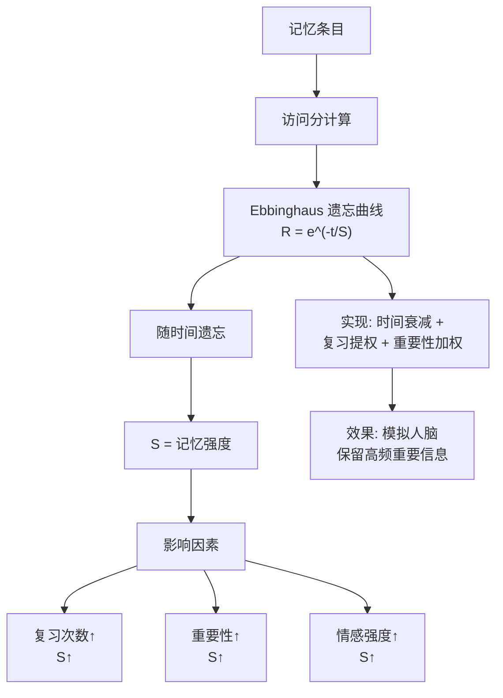

# Agent的记忆模块中引入“Ebbinghaus 遗忘曲线”机制有什么实际意义？如何在大模型系统中实现？

在 Agent 的记忆模块中引入 Ebbinghaus 遗忘曲线机制，旨在模拟人类记忆的衰减过程，使 Agent 能够更智能地管理有限的上下文窗口或存储空间，避免被过时或低价值的信息淹没。其意义在于强化记忆的“重要性筛选”：随着时间推移，那些未被重复访问或重要性评分低的记忆会逐渐衰减甚至被丢弃，从而让高频使用的重要信息（如用户偏好、关键任务状态）保持活跃。在实现上，通常会在存储记忆时附带时间戳和访问频率元数据。每次检索时，根据记忆的重要性评分乘以一个随时间呈指数衰减的权重函数，计算当前的有效分值。当有效分值低于阈值时，记忆将被归档或移除；或者在进行注意力计算时，利用该分值调整记忆的权重，使其对模型行为的影响逐渐减弱。

**边界情况**：在实际应用中，还需特别注意**“过度遗忘”与“突发唤醒”的平衡**。例如，对于用户设定的系统级指令或核心偏好，即使长期未被访问，也不应因时间衰减而被淘汰。这通常引入“永久记忆”标记或“关键事件加权”机制，即允许特定记忆绕过衰减逻辑。此外，在多轮对话的极端长尾场景下，单纯的时间衰减可能导致模型丢失长程依赖的上下文线索，需要结合“滑动窗口重计算”或“摘要压缩”来配合，防止记忆库空心化。

**易错点**：
1. **混淆“遗忘”与“删除”**：遗忘曲线的核心是“降低提取权重”而非物理删除，过早物理删除会导致不可逆的信息丢失。
2. **忽视冷启动问题**：新记忆在缺乏足够访问频率支撑时，容易因时间衰减系数过激而被误杀，需设置“保护期”。

## 面试追问
1. 如果用户在长期未交互后突然改变偏好，如何防止旧的高权重记忆干扰新意图？
2. 在分布式 Agent 环境中，如何保证不同节点间的记忆衰减函数的一致性？
3. 除了时间衰减，还有哪些维度可以作为记忆评分的输入信号？

## 技术原理

Ebbinghaus 遗忘曲线的数学模型来自实验心理学：人类记忆保持率 $R$ 随时间 $t$ 呈指数衰减，公式为 $R = e^{-t/S}$，其中 $S$ 是记忆强度（与重复复习次数正相关）。把这个模型搬到 Agent 记忆系统，本质是给每条记忆算一个"当前有效分值"，低分降权而非删除。

- **有效分值的计算**：`score = importance × recency × frequency`。`importance` 是记忆的静态重要性（系统指令高、闲聊低）；`recency = exp(-Δt/τ)` 是时间衰减项，$\tau$ 是半衰期（可调）；`frequency` 是被检索命中的次数（越用越不容易忘，类似人脑"复习强化记忆"）。
- **降权而非删除的实现**：把 score 作为注意力计算的先验偏置，或作为检索时的排序权重。score 低的记忆排序靠后、对模型影响减弱，但数据仍在库里，一旦被重新命中（frequency +1）score 会回升——这就是"唤醒"。物理删除只发生在 score 低于归档阈值很久之后（如 30 天未命中），且做归档而非真删。
- **永久标记绕过衰减**：系统级指令、用户核心偏好这类记忆，即使长期不被命中也不该衰减。给它们打 `permanent=True` 标记，score 计算时跳过 recency 衰减项，恒为满分。这是防"过度遗忘"的关键护栏。
- **新记忆保护期**：刚写入的记忆缺乏 frequency 支撑，若直接套衰减公式会被迅速淹没。给新记忆设 24~48 小时保护期，期内 score 不衰减，等积累到足够命中数据后再纳入正常衰减逻辑。

## 代码示例

```python
import math
import time
from dataclasses import dataclass, field

@dataclass
class Memory:
    content: str
    importance: float          # 0~1，静态重要性
    created_at: float          # 时间戳
    last_accessed: float = field(default_factory=time.time)
    access_count: int = 0
    permanent: bool = False    # 永久记忆绕过衰减
    in_protection: bool = True # 新记忆保护期

HALF_LIFE = 86400 * 3   # 半衰期 3 天（秒）
PROTECTION_WINDOW = 86400  # 保护期 1 天
ARCHIVE_THRESHOLD = 0.05  # 低于此值归档

def effective_score(mem: Memory, now: float) -> float:
    """计算记忆当前有效分值：importance × recency × frequency"""
    if mem.permanent:
        return mem.importance                  # 永久记忆不衰减
    if mem.in_protection and (now - mem.created_at) < PROTECTION_WINDOW:
        return mem.importance                  # 保护期内不衰减
    # 启用衰减
    delta_t = now - mem.last_accessed
    recency = math.exp(-delta_t / HALF_LIFE)   # 时间衰减
    frequency = math.log2(mem.access_count + 2) / 2  # 对数防爆炸
    return mem.importance * recency * frequency

def recall(memories: list, query_score_fn, now: float, top_k: int = 5):
    """检索：按有效分值 + query 相关性联合排序"""
    scored = []
    for m in memories:
        eff = effective_score(m, now)
        rel = query_score_fn(m.content)        # 与 query 的语义相关性
        scored.append((eff * rel, m))
    scored.sort(reverse=True, key=lambda x: x[0])
    # 命中的记忆更新访问信息（强化）
    for _, m in scored[:top_k]:
        m.last_accessed = now
        m.access_count += 1
        m.in_protection = False
    return [m for _, m in scored[:top_k]]

def gc_archived(memories: list, now: float):
    """低分记忆归档（非物理删除），防上下文膨胀"""
    return [m for m in memories
            if m.permanent or effective_score(m, now) > ARCHIVE_THRESHOLD]
```

## 注意事项

- **遗忘是降权不是删除**：过早物理删除会导致不可逆的信息丢失。正确做法是先降权（影响减弱）、再归档（移出热数据）、最后才考虑删除（长期低于阈值且确认无价值）。每一步都可回滚。
- **保护期防冷启动误杀**：新写入的记忆缺乏 frequency 支撑，直接套衰减公式会被迅速淹没。设 24~48 小时保护期，让新记忆有机会积累命中数据再纳入正常衰减。
- **永久标记防系统指令丢失**：用户偏好、系统指令这类记忆即使长期不被命中也不该衰减。打 `permanent=True` 标记绕过 recency 衰减，是防"过度遗忘"的关键护栏。
- **偏好突变要压制旧记忆**：用户长期未交互后突然改变偏好，旧的高权重记忆会干扰新意图。此时要引入"冲突检测"——新记忆与旧记忆矛盾时，临时压制旧记忆的 score（而非删除），观察一段时间确认偏好真的变了再降权旧记忆。


## 核心流程图




## 记忆要点

- 核心意义：因时间和访问频率降低有效权重，从而淘汰低价值信息保留高频核心记忆
- 计算机制：有效分值 = 重要性评分 × 指数衰减权重，低于阈值则归档或降低注意力权重
- 易混对比：遗忘是“降权”而绝非“物理删除”，防止不可逆的信息丢失
- 边界防守：因为系统指令不怕久不访问，所以需设“永久标记”或新记忆“保护期”防误杀

## 结构化回答

**30 秒电梯演讲：** 给 Agent 记忆加遗忘曲线，就是模拟人脑"久不复习就忘"——根据时间和访问频率动态降低信息的有效权重，淘汰低价值的、保留高频核心的。关键是它只"降权"不"物理删除"，而且系统指令这类关键记忆要设永久标记或保护期防误杀。

**展开框架：**
1. **重要性筛选** — 有效分值 = 重要性评分 × 指数衰减权重，低于阈值就归档或降注意力权重，让高频核心记忆保持活跃。
2. **降权非删除** — 遗忘是降低提取权重而不是物理删除，防止不可逆的信息丢失，必要时能重新唤醒。
3. **边界保护** — 系统级指令和核心偏好设"永久记忆"标记绕过衰减；新记忆设"保护期"防冷启动被误杀。

**收尾：** 我在长对话 Agent 里用遗忘曲线自动清理低价值历史，上下文窗口不再被淹没，还靠永久标记保住了用户偏好。您想聊分布式环境衰减函数怎么同步，还是偏好突变时旧高权重记忆怎么压制？

## 视频脚本

> 预计时长：2 分钟 | 由浅入深

| 时间 | 画面/字幕 | 口播台词 | 讲解要点 |
|------|----------|----------|----------|
| 0:00 | 标题卡：Agent 遗忘曲线 | "Agent 记忆无限膨胀怎么办？模拟人脑遗忘，自动淘汰低价值信息。" | 开场钩子 |
| 0:15 | 大脑自然遗忘类比 | "像大脑根据时间自然遗忘小事，只记常复习的重要大事，自动腾空间。" | 核心类比 |
| 0:40 | 有效分值计算公式 | "有效分值 = 重要性评分 × 指数衰减权重，低于阈值就归档或降权。" | 计算机制 |
| 1:10 | 降权非删除示意图 | "关键：遗忘是降权不是物理删除，防止不可逆丢失，能重新唤醒。" | 易混辨析 |
| 1:35 | 永久标记+保护期示意 | "边界：系统指令设永久标记绕过衰减，新记忆设保护期防冷启动误杀。" | 边界防守 |
| 1:55 | 总结卡 | "口诀：时间降权重，永久标记护核心，保护期防误杀。" | 收尾 |

