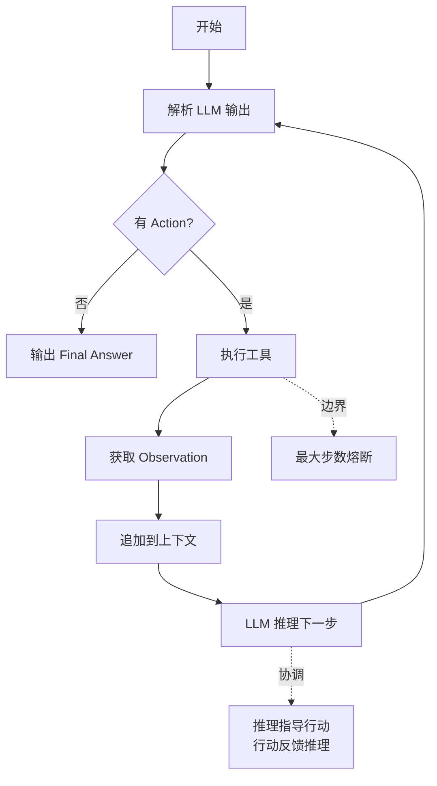

# ReAct（Reasoning + Acting）机制的执行循环细节是什么？它是如何协调推理与行动的？

ReAct（Reasoning + Acting）是一种结合了推理和行动的智能体范式，旨在解决大模型在面对复杂任务时缺乏动态规划能力的问题。其核心执行循环包括三个阶段：Thought（思考）、Action（行动）和Observation（观察）。

1. **Thought**：模型根据当前的上下文（用户指令和历史观测）生成推理轨迹，类似于思维链。这有助于模型拆解任务、分析当前状态并决定下一步该做什么。
2. **Action**：基于Thought的结论，模型选择并调用一个具体的工具或函数，输出通常是形如`Action[tool_name]: input_parameters`的标准化格式。
3. **Observation**：外部环境执行该Action并返回结果，模型将此结果作为新的上下文信息。

模型将Observation拼接到历史对话中，再次进入Thought阶段，如此循环直到模型认为任务完成并输出最终答案。这种机制让模型具备“交互式问题解决”的能力，不仅能通过语言推理，还能通过获取实时反馈来修正错误。

### 实战深化

**1. 实战案例**：在使用 ReAct 模式开发运维机器人时，遇到服务器高告警。机器人首先思考“需要查看当前 CPU 负载”，调用监控工具；Observation 返回“CPU 90%”。机器人进而思考“可能是某个进程异常”，调用 `top` 命令；发现是 Java 进程僵死，最后思考“需要重启服务”，执行重启脚本成功恢复。这种闭环解决了固定脚本无法应对的动态排查需求。

**2. 代码示例 (Python/LangChain)**：
```python
from langchain.agents import initialize_agent, Tool, AgentType
from langchain.llms import OpenAI

llm = OpenAI(temperature=0)
tools = [
    Tool(name="Search", func=lambda x: "Result for " + x, description="Useful for searching"),
    Tool(name="Calculator", func=lambda x: eval(x), description="Useful for math")
]

# 初始化 ReAct Agent
agent = initialize_agent(
    tools, llm, 
    agent=AgentType.ZERO_SHOT_REACT_DESCRIPTION, 
    verbose=True
)

agent.run("Who is the current president of the US? What is his age times 2?")
```

**边界情况**：在循环过程中，需注意**“幻觉循环”与“工具调用死循环”**。例如，若模型调用不存在的工具或解析工具返回结果失败，可能会导致 Thought 陷入死胡同，反复尝试错误的 Action。此时必须引入**“最大步数限制”**和**“停止符检测”**（如检测到 Final Answer 关键字）。此外，当 Observation 返回空值或非结构化乱码时，模型需要具备“异常处理 Thought”，即学会在无法获取信息时主动终止或切换策略，而非无限重试。

**易错点**：
1. **Observation 截断**：工具返回的内容过长直接塞入上下文，不仅消耗 Token，还可能超出模型窗口导致报错。
2. **Thought 缺失**：为了省 Token 而省略 Thought 步骤直接 Action，会导致模型逻辑链断裂，错误率飙升。

## 面试追问
1. 当工具调用失败（如 500 错误或超时）时，Prompt 应如何设计才能让 Agent 进行有效的重试或降级处理？
2. 在 ReAct 循环中，如何检测并打破“推理-行动”的死循环？
3. 如何评估 ReAct 模式生成的 Thought 质量对最终任务成功率的影响？

## 技术原理

ReAct 的循环之所以能"协调推理与行动"，关键在于它把 LLM 的生成空间约束成结构化轨迹，让每一步都能被解析器识别并触发真实工具调用：

- **格式即协议**：通过 Prompt 强制模型按 `Thought: ... Action[tool]: params ... Observation: ...` 的固定模式输出。解析器用正则或 AST 抽取 Action 字段，映射到后端工具注册表。这是 Function Calling 普及前最主流的"Prompt 即协议"做法。
- **Observation 的接地作用**：工具返回的真实结果作为新事实注入上下文，把模型从"凭空想象"拉回"基于事实推理"。这一步是 ReAct 比纯 CoT 鲁棒的根本——CoT 一旦推理错就会一错到底，ReAct 在每轮 Observation 处都有纠偏机会。
- **循环的协调机制**：每轮的 Observation 拼进历史对话重新进入 Thought，相当于让模型条件化在"真实反馈"之上做下一步决策。这种"思考-行动-观测"的闭环让模型具备交互式问题解决能力，而非单次前向传播。
- **终止语义双重设计**：正常终止靠模型在 Thought 中判断"信息已足够"并输出 `Final Answer`；异常终止靠 `max_steps` 熔断和停止符检测。两条路径都必须设计，否则死胡同里 Agent 会反复重试空耗 Token。

## 注意事项

1. **Observation 必须截断**：检索类工具可能返回超长文档，直接塞入上下文会撑爆窗口并推高成本。应在入库前做摘要或截断，或用"返回前 N 个片段 + 总数"策略。
2. **Thought 不能为省 Token 而省略**：跳过 Thought 直接 Action 会断逻辑链，错误率飙升；Thought 帮助模型拆解任务并稳定选择 Action。
3. **空 Observation 要兜底**：工具返回空值或乱码时，应包装成明确的异常信息（如"[无结果，请换参数]"），让模型在 Thought 中学会主动终止或切换策略，而非无限重试。
4. **防幻觉死循环**：模型可能反复调用同一工具或调不存在的工具，必须设 `max_steps`（经验值 8~10）和停止符检测双保险。

## 对比表

| 维度 | 纯 CoT（思维链） | ReAct（推理+行动） |
|:---|:---|:---|
| **环境交互** | 无，单次前向传播 | 有，循环调工具获取反馈 |
| **错误纠正** | 推理错就一错到底 | 每轮 Observation 可纠偏 |
| **实时信息** | 依赖训练数据，可能过时 | 调工具获取实时数据 |
| **Token 成本** | 低（单次生成） | 高（多轮循环累积） |
| **适用场景** | 数学推理、常识问答 | 运维排查、信息检索、工具调用 |
| **终止机制** | 生成结束即终止 | Final Answer 或 max_steps 熔断 |


## 核心流程图



## 记忆要点

- 一句话定义：ReAct是结合推理与行动的智能体范式，核心是动态交互式解决问题
- 核心循环：Thought拆解任务 -> Action标准化调工具 -> Observation环境返回结果
- 循环协调：因为单步观测结果会拼入上下文，所以能修正错误并指导下一轮思考
- 边界防守：为防“幻觉死循环”，必须引入最大步数限制和停止符检测
- 易错避坑：Observation必须截断防超长，Thought绝不能为省Token而省略

## 结构化回答

**30 秒电梯演讲：** ReAct 的执行循环就三步：Thought 思考拆任务、Action 标准化调工具、Observation 看环境返回结果，然后把这轮结果拼进上下文重新思考，循环到完成。像盲人摸象过迷宫：想一步、探一步、摸到反馈再决定下一步。它让模型能靠实时反馈修正错误，不只是语言推理。

**展开框架：**
1. **三阶段循环** — Thought（生成推理轨迹拆解任务决策）→ Action（标准化格式调工具，如 `Action[tool]: params`）→ Observation（环境返回结果作新上下文）。
2. **协调机制** — 每轮 Observation 拼进历史对话重新进 Thought，单步观测能修正错误并指导下轮思考，实现交互式问题解决。
3. **边界防守** — 防幻觉死循环要设最大步数限制和停止符检测（Final Answer）；Observation 必须截断防超长，Thought 不能为省 Token 而省略。

**收尾：** 我做过运维机器人用 ReAct 排查 CPU 告警：查负载→调 top→发现 Java 僵死→重启，闭环解决了固定脚本应对不了的动态排查。您想聊工具调用失败时 Prompt 怎么设计降级，还是死循环怎么检测打破？

## 视频脚本

> 预计时长：2 分钟 | 由浅入深

| 时间 | 画面/字幕 | 口播台词 | 讲解要点 |
|------|----------|----------|----------|
| 0:00 | 标题卡：ReAct 执行循环 | "Agent 怎么动态解决问题？ReAct 三步循环：想、做、看反馈。" | 开场钩子 |
| 0:15 | 盲人过迷宫类比图 | "像盲人摸象过迷宫：想一步（Thought），伸手探路（Action），摸到墙（Observation）。" | 核心类比 |
| 0:40 | Thought-Action-Observation 循环图 | "三阶段：Thought 拆任务，Action 标准化调工具，Observation 返回结果拼上下文。" | 核心循环 |
| 1:10 | LangChain ReAct 代码示例 | "LangChain 里 initialize_agent 配 ZERO_SHOT_REACT_DESCRIPTION 就能跑起这个循环。" | 代码实现 |
| 1:35 | 运维 CPU 告警排查案例 | "实战：查负载 90%→调 top 发现 Java 僵死→重启，闭环解决动态排查。" | 实战案例 |
| 1:55 | 总结卡 | "口诀：想做看循环，设上限防死循环，Observation 要截断。下期讲 Plan-Execute。" | 收尾 |

