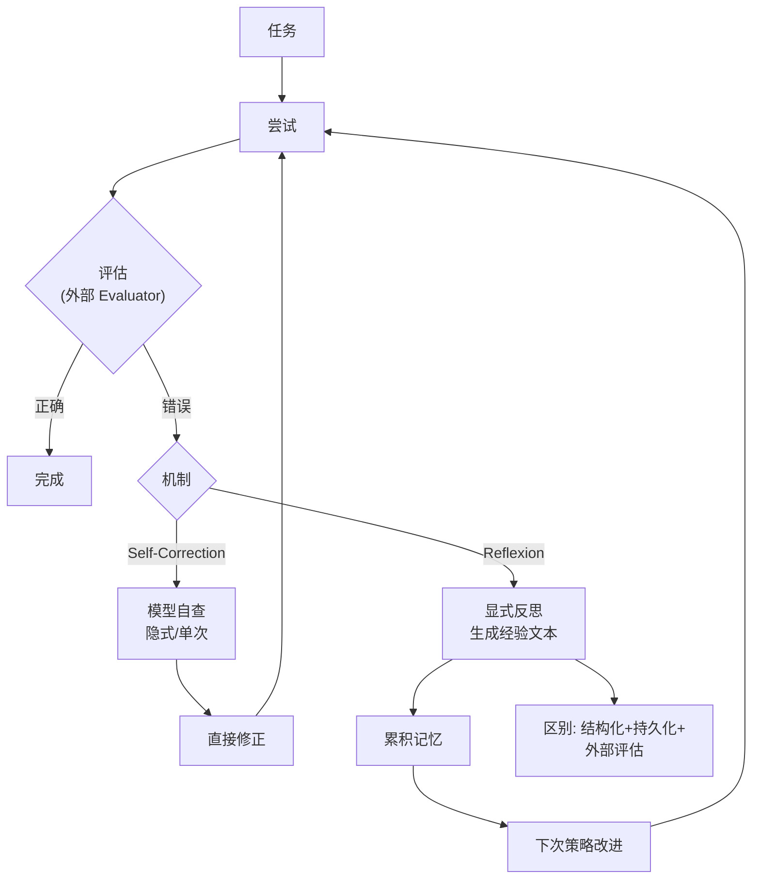
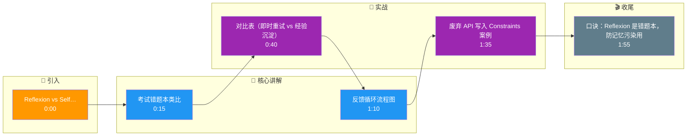

# Reflexion 机制在 Agent 中是如何工作的？它与简单的 Self-Correction 有什么区别？

Reflexion 是一种通过显式的“自我反思”步骤，从执行结果中提取经验并更新长期记忆，从而在后续尝试中利用这些具体教训进行自我修正的机制。它不仅像简单的 Self-Correction 那样即时修复错误，而是将错误转化为永久性的知识积累（如改进的 Prompt 或 Checklist），从而在同类任务中避免重复犯错。

**实战案例**：在开发代码生成 Agent 时，简单的 Self-Correction 会反复生成同样的语法错误直到 Token 耗尽。接入 Reflexion 后，Agent 将“禁止使用废弃 API”写入长期记忆的 Constraints 列表，后续代码生成的编译成功率提升了 40%。

**代码示例**：
```python
def reflexion_loop(initial_task, max_attempts=3):
    memory = [] # 长期记忆存储
    for i in range(max_attempts):
        result = agent.execute(initial_task, context=memory)
        if result.success: return result
        # 反思步骤：构建自我反思提示
        reflection = agent.reflect(f"Task failed: {result.error}") 
        memory.append(f"Prior Error: {reflection}. Action: {reflection.suggestion}")
```

**对比表格**：

| 特性 | Simple Self-Correction | Reflexion |
| :--- | :--- | :--- |
| **错误处理** | 在当前上下文内即时重试 | 将错误抽象为经验存入记忆 |
| **记忆持久性** | 仅存在于当前 Session Context | 跨 Session/任务 复用 |
| **核心逻辑** | 试错 | 归纳总结 |
| **适用范围** | 简单的逻辑/格式错误 | 复杂任务规划、代码迭代 |

**边界情况**：Reflexion 机制的一个潜在风险是**“负面反馈循环”**或**“记忆污染”**。如果 Agent 对某次失败的原因进行了错误的归纳（将环境误判归因于自身逻辑错误），这个错误的反思会写入记忆并在未来每次尝试中被强化，导致 Agent 永远无法解决该特定问题。解决方法包括：引入**“置信度评分”**机制，仅保存高置信度的反思；或设置记忆的**“有效期”**，让长期未被验证的经验逐渐失效。此外，反思内容本身消耗大量 Token，若不加限制，Context 窗口会被旧的反思占满，需设置反思条数上限。

**易错点**：
1. **反思粒度过细**：记录了过于具体的错误细节（如某次特定的参数值），导致反思无法泛化到类似场景。
2. **混淆反思与重试**：Reflexion 强调的是“下次”，而 Self-Correction 强调的是“本次”，两者应结合使用而非替代。

## 面试追问
1. 如果 Reflexion 生成的反思是错误的，系统如何检测并自动清洗这些“脏数据”？
2. Reflexion 需要消耗额外的推理成本，如何权衡其带来的收益与 Token 成本？
3. 如何将 Reflexion 机制应用于非文本生成类任务（如机械臂控制）？

## 技术原理

Reflexion 的核心创新是把"试错"升级为"归纳总结"，让 Agent 具备跨会话的元认知能力。其原理可拆成三个关键环节：

- **反馈的二元化与文本化**：执行任务后获取二元反馈（成功/失败 + 具体错误信息），再用 LLM 把反馈转化为自然语言的"反思文本"（如"失败原因是调用了已废弃的 API，应改用 v2 接口"）。这一步把模糊的成败信号升格为可复用的因果归因。
- **记忆的可检索化**：反思文本被存入长期记忆（上下文列表或向量库），每条反思附带元数据（任务类型、置信度、时间戳）。下次执行同类任务时，按任务相似度检索相关反思，作为 Constraints 注入 Prompt，约束模型行为。这本质上是"经验即上下文"。
- **与 Self-Correction 的本质区别**：Self-Correction 是"本次会话内即时重试"，依赖当前上下文，记忆不跨会话；Reflexion 是"跨会话经验沉淀"，把教训固化为长期知识。前者像考试时涂改答案，后者像考后建错题本——前者下次还可能错，后者能系统性规避同类错误。

## 注意事项

1. **警惕记忆污染**：错误的反思（如把环境问题误归因为自身逻辑错误）会写入记忆并被反复强化，形成"负面反馈循环"让 Agent 永远卡死。需引入置信度评分，只保存高置信度反思；或设记忆有效期让未被验证的经验失效。
2. **反思粒度要可泛化**：记录过于具体的细节（某次特定参数值）无法复用，应抽象为"规则级"经验（如"调用 X 类 API 前先查版本"），确保能泛化到类似场景。
3. **反思条数要限上限**：反思本身消耗 Token，若不加限制，旧的反思会占满 Context 窗口。建议设条数上限（如 10 条）并按置信度 + 时间衰减排序淘汰低价值反思。
4. **Reflexion 与 Self-Correction 结合**：两者是互补而非替代——复杂任务先 Reflexion 沉淀经验，简单格式错误用 Self-Correction 即时修正。

## 对比表

| 维度 | Self-Correction | Reflexion | Self-Consistency |
|:---|:---|:---|:---|
| **时间维度** | 当前会话即时 | 跨会话沉淀 | 空间维度并行 |
| **记忆持久** | 不跨 Session | 跨 Session 复用 | 不累积 |
| **机制** | 重试/涂改 | 归因+错题本 | 多次采样投票 |
| **成本** | 低 | 高（每轮调 Evaluator） | 高（N 次生成） |
| **适用** | 格式错误、偶发失败 | 逻辑漏洞、代码调试 | 数学推理、选择题 |

## 代码示例

```python
# Reflexion 机制的完整实现（含置信度过滤防记忆污染）
class ReflexionAgent:
    def __init__(self):
        self.memory = []  # 长期记忆：反思列表
        self.MAX_REFLECTIONS = 10  # 防上下文溢出

    def execute_with_reflexion(self, task, max_attempts=3):
        for i in range(max_attempts):
            result = self.agent.execute(task, context=self.memory)
            if self.evaluator.is_success(result):
                return result
            # 反思：把错误归因为可复用的规则
            reflection = self.reflect(result.error)
            # 置信度过滤：只保存高置信度反思，防记忆污染
            if reflection.confidence > 0.8:
                self.memory.append(reflection)
                # 淘汰低价值旧反思（按置信度+时间衰减）
                if len(self.memory) > self.MAX_REFLECTIONS:
                    self.memory.sort(key=lambda r: r.confidence * r.recency)
                    self.memory.pop(0)
        return None  # 达上限仍未成功，放弃

    def reflect(self, error):
        # 反思粒度要可泛化：抽象为规则而非具体参数
        return LLM.generate(f"把错误'{error}'归纳为一条可复用的规则")
```

## 核心流程图



## 记忆要点

- 核心对比：Self-Correction是当前会话即时重试，Reflexion是跨会话经验沉淀
- 工作流：执行失败->自我反思->提取教训->写入长期记忆->下次规避
- 典型应用：代码Agent记录废弃API，避免同类错误重复发生，提升成功率
- 风险防控：警惕错误反思导致记忆污染，需引入置信度或有效期清洗机制
- 易错规避：反思粒度切忌过细，要确保抽象经验能泛化复用

## 结构化回答

**30 秒电梯演讲：** Reflexion 和 Self-Correction 的本质区别是"跨会话经验沉淀 vs 当前会话即时重试"。Self-Correction 只在本次对话里改错，下次可能还错；Reflexion 会把"我为什么会错"记进长期记忆的错题本，下次同类任务先看错题本规避。像考试后建错题本，而不是简单涂改答案。

**展开框架：**
1. **反馈循环** — 执行任务→获取评估反馈→生成文本化反思→存入长期记忆（上下文或向量库）→下次 Act 阶段检索反思约束行为。
2. **对比 Self-Correction** — Self-Correction 是当前 Session 即时重试（试错），Reflexion 是跨 Session 经验沉淀（归纳总结），记忆持久性强、适用复杂任务。
3. **风险防控** — 错误反思会污染记忆形成负面反馈循环，需引入置信度评分或有效期清洗；反思粒度别太细，要能泛化复用。

**收尾：** 我在代码 Agent 里用 Reflexion，把"禁止用废弃 API"写进 Constraints 列表，后续编译成功率提 40%。您想聊错误反思怎么检测清洗，还是反思消耗的 Token 成本怎么权衡？

## 视频脚本

> 预计时长：2 分钟 | 由浅入深

| 时间 | 画面/字幕 | 口播台词 | 讲解要点 |
|------|----------|----------|----------|
| 0:00 | 标题卡：Reflexion vs Self-Correction | "Agent 犯错了，是当场改还是记进错题本？Reflexion 选后者。" | 开场钩子 |
| 0:15 | 考试错题本类比 | "Self-Correction 像涂改答案下次还错，Reflexion 像建错题本记为什么错。" | 核心类比 |
| 0:40 | 对比表（即时重试 vs 经验沉淀） | "Self-Correction 当前会话即时重试，Reflexion 跨会话经验沉淀复用。" | 核心对比 |
| 1:10 | 反馈循环流程图 | "流程：执行失败→自我反思→提取教训→写长期记忆→下次检索规避。" | 工作流程 |
| 1:35 | 废弃 API 写入 Constraints 案例 | "实战：代码 Agent 把禁用废弃 API 写进 Constraints，编译成功率提 40%。" | 实战案例 |
| 1:55 | 总结卡 | "口诀：Reflexion 是错题本，防记忆污染用置信度。下期讲并行调用。" | 收尾 |

### 视频流程图




