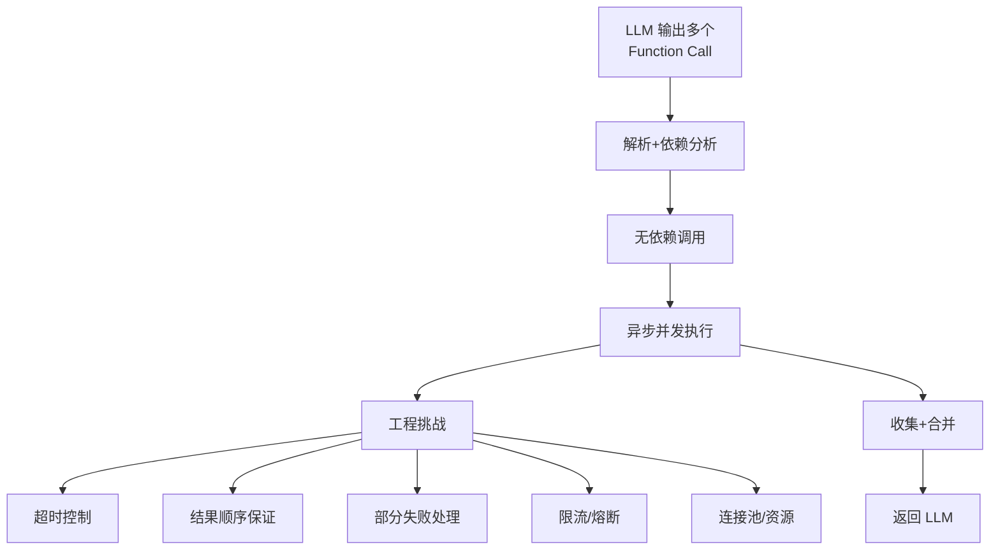

# Function Calling 的并行调用是如何实现的？它在工程实现上有哪些挑战？

Function Calling 并行调用通过让模型一次输出包含多个 tool_calls 的 JSON 数组实现，服务端解析后并发执行这些函数。工程挑战包括：1. 参数依赖问题（需确保各调用参数独立，不可依赖前序结果）；2. 异常处理策略（需设计部分失败时的容错机制）；3. 结果聚合与重排序（需根据 ID 将乱序返回的结果映射回原始请求）；4. 超时控制（防止单个慢速请求阻塞整体流程）。

**边界情况**：
1. **空结果或部分结果**：若某个工具调用返回空（如查无此航班），需决定是继续重试、返回 null 还是直接报错，防止影响聚合逻辑。
2. **并发配额限制**：下游第三方 API 可能有严格的 Rate Limit（如每秒 5 次），需在客户端实现令牌桶或漏桶算法进行限流，避免触发 429 错误。
3. **参数校验失败**：模型生成的 JSON 参数格式可能错误（如日期格式不对），需设计并行校验机制，避免因一个参数错误导致整个并行批次的回退。

**实战案例**：在实现旅行规划 Agent 时，需同时查询“机票”、“酒店”和“天气”。初期使用串行调用导致响应时间超过 10s，优化为并行调用后，总耗时降低至取决于最慢的单个接口（约 2s），极大提升用户体验。

**代码示例**：
```python
import asyncio
async def run_parallel_calls(tools_calls):
    tasks = [execute_tool(call) for call in tools_calls]
    # gather 会等待所有任务完成，即使个别失败需自行处理异常
    results = await asyncio.gather(*tasks, return_exceptions=True)
    return results
```

**对比表格**：

| 维度 | 串行调用 | 并行调用 |
| :--- | :--- | :--- |
| **总耗时** | 所有任务耗时之和 | 最慢任务的耗时 |
| **上下文依赖** | 支持（后任务依赖前任务结果） | 不支持（参数必须独立） |
| **实现复杂度** | 低 | 高（需处理并发、超时、聚合） |
| **Token 消耗** | 较高（多轮交互 Prompt） | 较低（单次交互多结果） |

## 易错点
1. **忽视参数顺序**：`asyncio.gather` 返回结果的顺序与输入 `tasks` 列表的顺序一致，而非按完成时间排序。若依赖 `tool_calls` 的原始 ID 进行匹配，必须显式处理，切勿直接假设返回顺序。
2. **超时传递失效**：设置了总的超时时间（如 5s），但未给单个子任务设置超时，导致某个子任务死循环或卡死，进而拖垮整个请求。

## 面试追问
1. 如果多个并行调用的工具之间有共享状态（如都需要读取同一个大文件），你会如何优化以减少 IO 开销？
2. 当并行调用中部分成功、部分失败（如 2 个成功，1 个超时），你的 Agent 策略是重试失败项、直接报错还是基于部分结果继续推理？如何设计这个策略？
3. 在高并发场景下，如何避免模型瞬间生成大量的 Tool Call 导致下游服务雪崩？

## 技术原理

并行 Function Calling 的实现依赖三个关键机制协同工作：

- **模型层的批量输出**：现代 LLM（GPT-4o、Claude 3.5 等）在 System Prompt 中声明多个工具定义后，能在一次生成中输出包含多个 `tool_calls` 的 JSON 数组。这要求模型具备"任务拆解 + 独立性判断"能力——它必须识别出哪些调用之间无参数依赖，才能安全地放在一起并发。
- **服务端的并发执行**：客户端解析出 tool_calls 数组后，用 `asyncio.gather`（Python）或 `Promise.all`（JS）并发触发各工具。关键是 `return_exceptions=True`，让单个工具失败不阻断整体，错误作为结果返回由后续逻辑处理。
- **结果的 ID 映射**：每个 tool_call 有唯一 ID，并发执行后结果顺序是随机的（谁先完成谁先返回），必须用 `tool_call_id` 把结果精确映射回原始请求位置，再拼回 LLM 上下文。`asyncio.gather` 的返回顺序与输入列表一致（非按完成时间排序），但仍建议显式按 ID 匹配防混淆。

性能上，并行调用的总耗时取决于最慢的任务（短板效应），而非累加——这是它远胜串行的根本。代价是失去上下文依赖（后任务不能用前任务的结果）和更高的实现复杂度。

## 注意事项

1. **参数必须独立**：并行调用间不能有依赖（B 不能用 A 的返回值），否则需拆成多轮串行。模型若误判依赖关系（同时发"获取用户 ID"和"获取订单"）会导致后者因 ID 为空报错。
2. **单任务超时不能省**：只设总超时不够，必须给每个子任务单独设超时（如 `asyncio.wait_for`），否则某个子任务死循环或卡死会拖垮整个请求。
3. **限流防雪崩**：下游 API 有 Rate Limit，瞬间并发可能触发 429。需在客户端用令牌桶或漏桶限流，把突发流量平滑化。
4. **部分失败的策略**：2 成功 1 超时时，要明确策略——重试失败项、直接报错、还是基于部分结果继续推理。建议默认"基于部分结果 + 标注缺失项"让 LLM 决策，而非全盘失败。

## 对比表

| 维度 | 串行调用 | 并行调用 |
|:---|:---|:---|
| **总耗时** | Σ（所有任务累加） | max（最慢任务） |
| **参数依赖** | 支持（B 用 A 的结果） | 不支持（必须独立） |
| **实现复杂度** | 低 | 高（并发+超时+聚合） |
| **限流风险** | 低 | 高（瞬间打高 429） |
| **错误处理** | 一失败即终止 | 错误隔离，部分失败可继续 |
| **Token 成本** | 高（多轮 Prompt） | 低（单次多结果） |

## 核心流程图



## 记忆要点

- 实现机制：模型一次输出 JSON 数组，服务端解析后并发执行，结果按 ID 聚合。
- 核心挑战：参数必须独立，需处理异常容错、乱序重排序及单任务超时控制。
- 性能对比：总耗时取决于最慢任务，优于串行调用的累加耗时。
- 易错点：gather 返回顺序与输入一致，切勿假设按完成时间排序。

## 结构化回答

**30 秒电梯演讲：** Function Calling 并行调用就是模型一次输出包含多个 tool_calls 的 JSON 数组，服务端解析后用 asyncio 并发执行，结果按 ID 聚合。像服务员一次下五桌菜单，厨师同时做菜，按编号端回对应桌子。总耗时取决于最慢任务，远优于串行的累加耗时。

**展开框架：**
1. **实现机制** — 模型一次生成 JSON 数组的多个 tool_calls，服务端解析后并发执行，结果按 tool_call_id 聚合映射回原请求。
2. **核心挑战** — 参数必须独立不能有依赖；异常容错（部分失败不阻断整体）；乱序结果按 ID 重排序；单任务超时控制防卡死。
3. **性能与边界** — 总耗时取决于最慢任务；下游 API 有 Rate Limit 要令牌桶限流防 429；空结果决定重试还是返回 null。

**收尾：** 我做旅行规划 Agent，串行查机票+酒店+天气要 10 秒，改并行后降到最慢接口的 2 秒。您想聊部分失败是重试还是基于部分结果继续推理，还是高并发下怎么防下游雪崩？

## 视频脚本

> 预计时长：2 分钟 | 由浅入深

| 时间 | 画面/字幕 | 口播台词 | 讲解要点 |
|------|----------|----------|----------|
| 0:00 | 标题卡：并行函数调用 | "串行调工具太慢？模型一次下多张菜单，后厨并发做菜。" | 开场钩子 |
| 0:15 | 服务员下多桌菜单类比 | "像服务员一次给后厨下五桌菜单，厨师们同时做，按编号端回对应桌子。" | 核心类比 |
| 0:40 | 并行 vs 串行耗时对比图 | "串行耗时是累加，并行总耗时取决于最慢任务，性能优势巨大。" | 性能对比 |
| 1:10 | asyncio.gather 代码示例 | "实现：模型输出 JSON 数组，服务端 asyncio.gather 并发执行，return_exceptions 容错。" | 代码实现 |
| 1:35 | 旅行 Agent 10s→2s 案例 | "实战：串行查机票酒店天气要 10 秒，并行后降到最慢接口的 2 秒。" | 实战案例 |
| 1:55 | 总结卡 | "口诀：参数独立、按 ID 聚合、防超时限流。下期讲上下文压缩。" | 收尾 |

### 视频流程图


