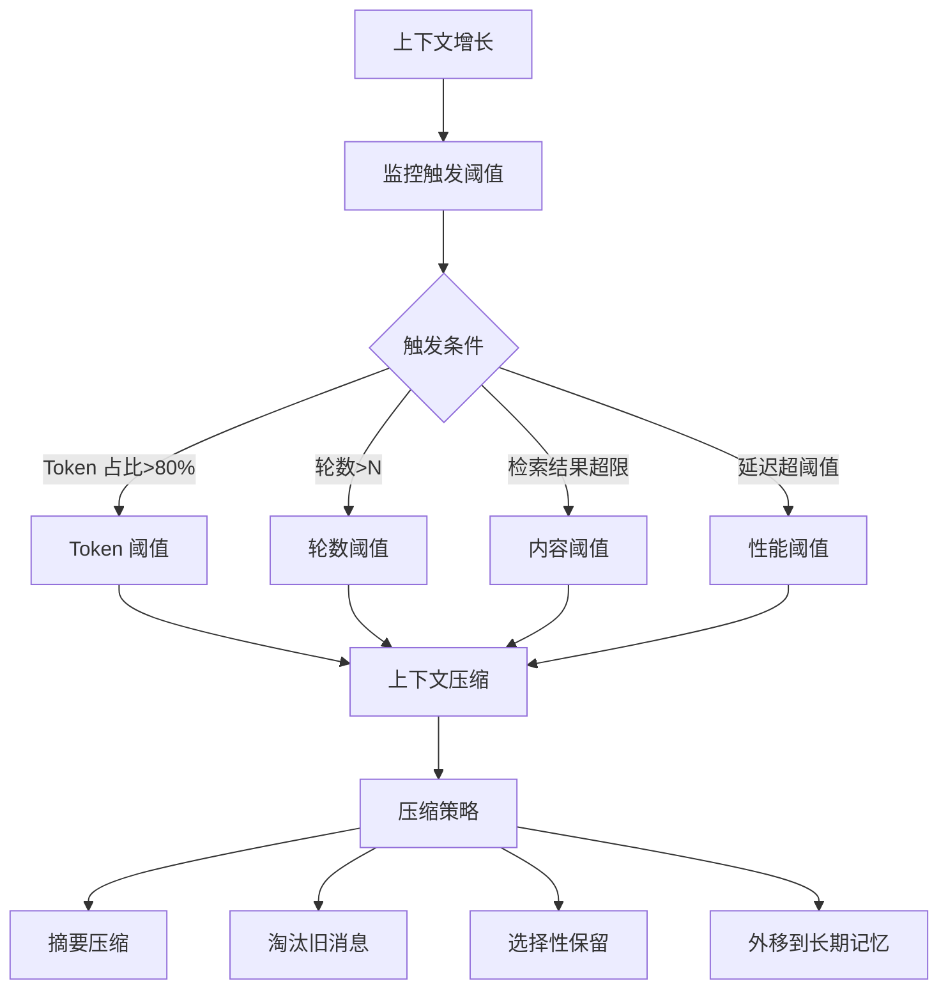

# 什么是 Agent 的上下文压缩？有哪些触发阈值策略？

Agent 的上下文压缩是指随着对话历史和工具调用记录的增长，为了控制上下文窗口大小和推理成本，对记忆数据进行有损或无损的压缩处理。

**压缩方法详解**：
1. **摘要**：使用更小、更快的 LLM（如 GPT-3.5-turbo 或 Llama-3-8B）将过去的一系列交互和工具执行结果总结为一段简短的摘要，替代原始详细日志。*关键点*：摘要可能会丢失细节，适合结论性任务。
2. **提取关键实体**：通过正则或 NLP 提取保留对后续任务最重要的参数、文件名、ID 和数据，丢弃过程性描述和对话填充词。
3. **分层记忆**：将短期记忆（Session Buffer，详细）归档到长期记忆（Vector DB 或 Summary DB）。VectorDB 支持通过语义检索来“回忆”起相关的历史片段，而不是全部塞入上下文。

**边界情况**：
1. **系统提示词被截断**：压缩策略通常优先处理 User/Assistant 消息，必须确保 System Prompt 始终完整保留，否则会导致 Agent 角色崩坏。
2. **非文本模态丢失**：上下文中包含的图片或音频数据无法像文本那样直接摘要，压缩时需保留图片的链接或特征向量，而非尝试将其转化为文字摘要（除非有专门的多模态摘要模型）。
3. **结构化数据破坏**：工具返回的 JSON 嵌套数据在摘要时容易丢失字段结构，对于关键配置类数据，应采用“覆盖更新”而非“文本摘要”。

**触发阈值策略**：
1. **Token 长度阈值**：当当前 Token 数量接近模型限制（如 80%-90%）时触发压缩。需预留一定的 Buffer 用于接下来的生成。
2. **轮次阈值**：每进行 N 轮对话（如每 5 轮）后，对历史记录进行一次归档和压缩，避免在单次轮次中进行繁重的计算。
3. **语义事件触发**：当检测到任务阶段完成（如“订单已创建”、“代码已提交”）时，将该阶段的所有交互压缩为一条状态记录。
4. **滑动窗口**：强制保留最近的 K 轮对话，更早的内容直接丢弃（最激进但也最低成本的策略）。

**常见考点**：
1. **压缩后的上下文丢失了之前的负面示例怎么办？**
   - 可以在摘要层显式保留“失败经验与修正”部分，或利用长期记忆中的单独索引存储错误样本，以便在相似场景下检索。

**实战案例**：在构建长文档分析 Agent 时，未压缩前每轮对话需消耗 10k+ Token，导致成本高昂且经常超限。引入“滚动摘要”策略后，始终保持历史在 4k Token 以内，仅当用户询问具体细节时才从 Vector DB 中检索原文块，成本降低 60%。

**代码示例**：
```python
def compress_context(messages, threshold=4000):
    current_tokens = count_tokens(messages)
    if current_tokens > threshold:
        # 保留最近 2 轮，其余进行摘要
        recent = messages[-2:]
        history = messages[:-2]
        summary = llm_summary(history)
        return [{"role": "system", "content": f"History Summary: {summary}"}] + recent
    return messages
```

## 易错点
1. **过度压缩导致“遗忘”意图**：过度激进的摘要可能丢失用户的原始偏好（如“我只要红色的”被摘要吞没），导致后续回答偏离用户需求。
2. **死循环压缩**：如果摘要后的内容仍然超过阈值，且没有递归退出机制，会导致程序进入死循环或 Crash。

## 面试追问
1. 如何评估压缩算法的质量？除了 Rouge Score，还有什么指标能衡量摘要是否保留了关键信息？
2. 在多用户并发场景下，如果所有用户同时触发压缩动作，会导致后端 LLM 服务瞬间流量激增，你如何削峰填谷？
3. 如果用户直接问“我刚才第一句话说了什么？”，而这句话已经被压缩丢弃了，系统该如何优雅地应对？


## 核心流程图




## 记忆要点

- 定义：为控制窗口和成本，对历史记忆进行有损（摘要）或无损（实体提取）压缩。
- 触发策略：Token 阈值（如 80%）、轮次阈值（如每 5 轮）或语义事件触发。
- 核心方法：滚动摘要、提取关键实体、分层记忆（VectorDB 归档）。
- 注意点：必须确保 System Prompt 完整，防止角色崩坏；结构化数据慎用摘要。

## 结构化回答

**30 秒电梯演讲：** Agent 上下文压缩就是随着对话变长，为了控窗口和省 Token，对历史做有损（摘要）或无损（实体提取）的精简。像写会议纪要，把前面的流水账浓缩成结论。触发可以用 Token 阈值（80%）、轮次阈值（每 5 轮）或语义事件（订单已创建）。关键是 System Prompt 必须完整保留，别把角色压崩了。

**展开框架：**
1. **三种压缩方法** — 滚动摘要（小模型总结历史替代原文）、提取关键实体（正则/NLP 留参数 ID 丢过程描述）、分层记忆（短期归档到 VectorDB 按需检索）。
2. **触发策略** — Token 长度阈值（80-90% 预留 Buffer）、轮次阈值（每 N 轮归档一次）、语义事件触发（任务阶段完成时压缩）、滑动窗口（激进丢弃）。
3. **边界与避坑** — System Prompt 必须完整防角色崩坏；结构化 JSON 数据用覆盖更新别文本摘要；防死循环压缩要设递归退出。

**收尾：** 我在长文档分析 Agent 里用滚动摘要，历史始终压在 4k Token 内，具体细节按需从 VectorDB 检索原文，成本降 60%。您想聊压缩质量怎么评估，还是用户问"我刚才第一句说的啥"被压掉了怎么应对？

## 视频脚本

> 预计时长：2 分钟 | 由浅入深

| 时间 | 画面/字幕 | 口播台词 | 讲解要点 |
|------|----------|----------|----------|
| 0:00 | 标题卡：Agent 上下文压缩 | "对话越拉越长，Token 爆窗口又烧钱？上下文压缩治这个。" | 开场钩子 |
| 0:15 | 会议纪要类比 | "像写会议纪要，把前面流水账浓缩成结论和重点，只留最近几页原始对话。" | 核心类比 |
| 0:40 | 三种压缩方法对比表 | "滚动摘要（有损）、提取关键实体（无损）、分层记忆归档到 VectorDB。" | 压缩方法 |
| 1:10 | 四种触发策略图 | "触发：Token 阈值 80%、轮次阈值每 5 轮、语义事件、滑动窗口。" | 触发策略 |
| 1:35 | System Prompt 必须完整警示 | "避坑：System Prompt 必须完整保留，否则角色崩坏；JSON 数据别摘要。" | 关键避坑 |
| 1:55 | 长文档成本降 60% 案例 | "实战：滚动摘要压到 4k Token，细节按需检索 VectorDB，成本降 60%。" | 实战案例 |

