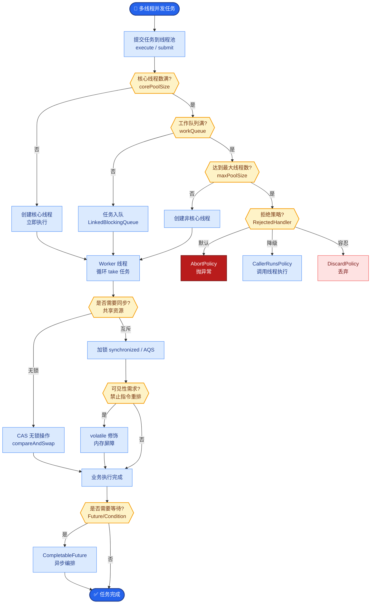
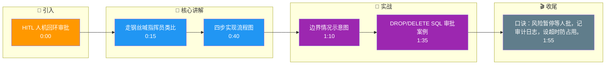

# 什么是 Human-in-the-loop (HITL) 的审批模式？在 Agent 应用中如何实现？

Human-in-the-loop（人机回环）审批模式是指在 Agent 执行关键或高风险操作前，暂停流程，请求人类介入确认，只有在获得批准后才继续执行。这是解决 Agent 幻觉和不可控性的重要安全机制。

**实现方式详解**：
1. **状态挂起**：
   - 当 Agent 决策需要调用“高风险工具”（如“发送邮件”、“删除数据库”、“转账”）时，不立即执行，而是将状态机挂起。
2. **信号发送**：
   - Agent 返回一个特殊的响应结构给客户端，包含需要人类审批的动作内容。例如：
     `{"status": "pending_approval", "action_type": "send_email", "payload": {...}, "approval_id": "req_123"}`
3. **前端交互**：
   - 客户端识别到 `pending_approval` 状态，渲染一个确认对话框或 UI 组件，供用户点击“同意”或“拒绝”。期间前端需维持 Session 或 Context 的完整性。
4. **回调恢复**：
   - 用户操作后，前端将结果通过 API 回传给后端。后端验证 `approval_id` 后，根据“同意”信号执行工具，或根据“拒绝”信号返回错误信息给 Agent，促使其重新规划。

**边界情况**：
1. **参数变更**：用户在审批时可能不仅同意，还修改了参数（如“把金额从 100 改为 50”），系统需支持将修正后的 Payload 回填给 Agent 重新执行，而非简单的 Yes/No。
2. **上下文过期**：对于耗时极长的审批（如审批了一周），执行时的环境状态可能已改变（如商品已售罄），需在回调前校验前置条件是否依然满足。
3. **批量审批**：Agent 可能生成一串高风险操作（如批量删除 100 个文件），前端需支持“全部同意”、“部分拒绝”或“逐条确认”的批量处理 UI。

**应用场景**：
- 金融交易（大额转账）、代码部署、自动化营销（群发邮件）、修改系统配置等容错率低的场景。

```text
  Agent Execution Flow with HITL

  ┌─────────────────┐
  │   Agent Plan    │
  └────────┬────────┘
           │ Detect High Risk
           ▼
  ┌─────────────────┐
  │  Pause & Signal │─── To Frontend ──> [ User: Approve? ]
  └────────┬────────┘                                    │
           │                                            │
           │ <─── Callback (Yes/No) ─────────────────────┘
           │
    ┌──────┴──────┐
    ▼             ▼
 [Yes]          [No]
    │             │
    ▼             ▼
 Execute Tool   Abort / Re-plan
```

**常见考点**：
1. **如果用户长时间不审批怎么办？**
   - 需要设置 Session 超时机制（如 30 分钟未操作自动驳回），防止长期占用系统资源或 Token。
2. **审批记录需要保存吗？**
   - 是的，必须保存审计日志，记录谁在什么时间批准了什么操作，以满足合规性要求。
3. **Agent 能否绕过审批？**
   - 在权限系统设计上，应将“高风险工具”的执行权限与 Agent 分离，确保只有收到明确的人类授权 Token 后，底层服务才允许执行。

**实战案例**：在企业的内部运维 Agent 中，我们曾遇到 Agent 幻觉导致误删除测试数据库的事故。引入 HITL 后，凡是包含 `DROP`、`DELETE` 关键词的 SQL 语句执行前，必须在 Slack/钉钉群中 @管理员 点击确认，有效拦截了 100% 的误操作。

**代码示例**：
```python
def execute_safe_action(tool_name, args):
    if tool_name in RISKY_TOOLS:
        req_id = str(uuid.uuid4())
        save_approval_request(req_id, tool_name, args)
        raise HaltException(
            status="pending_approval", 
            approval_id=req_id, 
            message="Please confirm this action in the admin panel."
        )
    # 正常执行逻辑
    return real_tool_execute(tool_name, args)
```

## 易错点
1. **Agent 陷入拒绝循环**：如果用户一直拒绝，Agent 可能会不断生成新的、类似的执行计划再次请求审批，导致死循环，需设计“冷却期”或强制终止逻辑。
2. **并发竞态条件**：同一 Session 在 Web 端和移动端同时登录，两端同时收到审批请求，若一人同意一人拒绝，后端必须基于版本号或时间戳处理“后发先至”或“重复提交”的问题。

## 面试追问
1. 如何设计权限模型，使得不同级别的 Admin（如初级运维、CTO）能够审批不同风险等级的操作？
2. 在审批被拒绝后，如何让 Agent 更好地理解“拒绝原因”并进行自我修正，而不是简单地重试同样的错误操作？
3. 如果审批接口本身被攻击（如伪造审批请求），系统有哪些安全防御措施？

## 核心流程图



## 记忆要点

- 定义：高风险操作前暂停，请求人类确认，获批后继续执行的安全机制。
- 流程：检测风险 → 状态挂起 → 发送审批信号 → 用户确认 → 回调恢复执行。
- 边界情况：需支持参数修改、校验上下文过期及批量操作处理。
- 关键设计：必须记录审计日志，设置 Session 超时防止资源占用。

## 结构化回答

**30 秒电梯演讲：** Human-in-the-loop 审批就是 Agent 遇到高风险操作（转账、删库、群发邮件）先暂停，发审批请求给人类，获批了才继续。像走钢丝前每次迈步都喊地面指挥员确认。流程是：检测风险→状态挂起→发审批信号→用户确认→回调恢复执行，是防 Agent 幻觉的关键安全阀。

**展开框架：**
1. **四步实现** — 检测高风险工具→状态机挂起→返回 pending_approval 结构给前端渲染确认框→用户决策后回调（同意执行/拒绝重新规划）。
2. **边界处理** — 支持参数修改（用户改金额回填重执行）、上下文过期校验（审批一周后商品可能售罄）、批量审批（全部同意/部分拒绝/逐条确认）。
3. **关键设计** — 必须记录审计日志（谁何时批了什么）满足合规；设 Session 超时（30 分钟未操作自动驳回）防资源占用；权限上把高风险工具执行权与 Agent 分离。

**收尾：** 我在企业运维 Agent 里，凡是含 DROP/DELETE 的 SQL 执行前必须在 Slack @管理员确认，拦了 100% 误操作。您想聊不同风险等级的审批权限怎么分级，还是拒绝后怎么让 Agent 理解原因自我修正？

## 视频脚本

> 预计时长：2 分钟 | 由浅入深

| 时间 | 画面/字幕 | 口播台词 | 讲解要点 |
|------|----------|----------|----------|
| 0:00 | 标题卡：HITL 人机回环审批 | "Agent 要删库转账，敢让它直接干？HITL 审批先暂停等人确认。" | 开场钩子 |
| 0:15 | 走钢丝喊指挥员类比 | "像走钢丝前系安全带，每次迈步都向地面指挥员喊话确认才能继续。" | 核心类比 |
| 0:40 | 四步实现流程图 | "检测风险→状态挂起→发 pending_approval 信号→用户确认→回调恢复。" | 实现流程 |
| 1:10 | 边界情况示意图 | "支持参数修改、上下文过期校验、批量审批（全部同意/部分拒绝）。" | 边界处理 |
| 1:35 | DROP/DELETE SQL 审批案例 | "实战：高危 SQL 执行前在 Slack @管理员确认，拦了 100% 误操作。" | 实战案例 |
| 1:55 | 总结卡 | "口诀：风险暂停等人批，记审计日志，设超时防占用。" | 收尾 |

### 视频流程图




