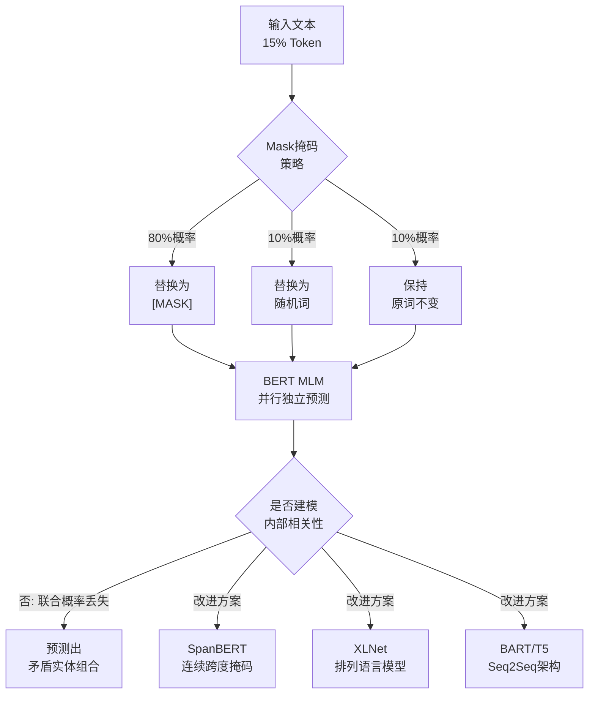

# BERT 的 MASK 机制是否满足独立性假设?有什么改进方案

- **BERT 的 MLM 不满足独立性假设**。

**问题：** BERT 同时 mask 15% 的 token，这些被 mask 的 token 的预测是**并行独立**的，即模型不利用被 mask token 之间的关系。

**举例：** 句子 'The capital of France is [MASK] [MASK]'，BERT 同时预测两个 [MASK]，但两个位置的预测互不影响，无法保证输出是 'Paris' 而非 'New York'。

- **与 AR 模型对比**：GPT 等自回归模型逐 token 生成，天然利用前面已生成的内容。

- **改进方案**
1. **SpanBERT**：mask 连续 span 而非随机 token，强化跨度级建模。
2. **XLNet**：排列语言模型，允许看到部分已预测的 token。
3. **BART/T5**：改为 seq2seq 架构，解码器自回归生成。
4. **MASS / UniLM**：结合 MLM 和 AR 优势。
5. **PaLM/GLaM**：直接用 AR 架构替代。

### 补充细节
- **MASK 机制细节**：BERT 并非将 15% 的 Token 全部替换为 `[MASK]`，而是执行以下策略（80% 替换、10% 随机词、10% 保持原词）：
  - 80% 概率替换为 `[MASK]`：`my dog is hairy` → `my dog is [MASK]`
  - 10% 概率替换为随机词：`my dog is hairy` → `my dog is apple`
  - 10% 概率保持不变：`my dog is hairy` → `my dog is hairy`
  *目的*：迫使模型保持对上下文语义的敏感度，减少 Fine-tuning 时输入分布不一致的影响。
- **独立性假设的具体影响**：由于预测是条件独立 $P(x_i | x_{\text{mask}})$，而非联合概率 $P(x_1, x_2 | x_{\text{mask}})$，模型无法建模被 Mask Token 之间的内部相关性（如共现关系、语法一致性）。

- **实战案例**：在实体识别任务中，由于独立性假设，BERT 可能预测出 "Location: Beijing" 但 "Capital: Tokyo" 这种矛盾的实体组合，因为两个 MASK 位置无法进行一致性校验。

- **对比表格**：BERT vs AR 模型
| 特性 | BERT (MLM) | AR 模型 (如 GPT) |
| :--- | :--- | :--- |
| **预测方式** | 并行预测所有 MASK | 串行逐词生成 |
| **上下文利用** | 双向，但 MASK 间无交互 | 单向，利用上文预测下文 |
| **生成能力** | 弱 | 强 (天然适合文本生成) |
| **训练目标** | 填空 | 预测下一个词 |

### ASCII 流程图：BERT vs XLNet 预测方式
```text
+-------------------------+       +--------------------------+
|      BERT (MLM)         |       |      XLNet (PLM)         |
|                         |       |                          |
|  Input: A B [M] [M] E   |       |  Permutation: B [M] A [M]|
|            ↓   ↓        |       |       ↓          ↓      |
|  Predict:  C   D  (并行) |       |  Predict:  C        D     |
|  (C 不依赖 D)           |       |  (C 会参与 D 的计算)      |
+-------------------------+       +--------------------------+
```

## 易错点
1. **误解 10% 替换随机词的目的**：很多人认为是为了引入噪声，其核心目的是为了 **Embedding 校准**。如果只看到 `[MASK]`，模型就学不到该 token 在真实语境下的 Embedding；只有保留原词或替换为随机词，模型才能学习到真实 token 的表示。
2. **认为 BERT 完全不能做生成任务**：虽然 MLM 不适合生成，但可以通过非自回归的迭代优化（如 BERT-Masked LM Iterative Decoding）或者填空式生成来实现，只是效果通常不如 AR 模型。

## 面试追问
1. 除了 XLNet，还有哪些模型试图解决 BERT 的预训练与微调不一致问题？
2. SpanBERT 中的 Masking 策略具体是怎样的？它相比随机 Masking 在长文本建模上有什么优势？
3. 为什么 BERT 在推理时不需要 `[MASK]` token，而有些改进模型（如 MASS）在推理阶段保留特殊的掩码机制？

## 流程图



## 核心知识点图


## 记忆要点

- 结论：BERT 的 MLM 不满足独立性假设，Mask Token 之间预测互不影响。
- 问题：无法建模被 Mask Token 间的内部相关性（如共现、语法一致性）。
- 改进：SpanBERT（连续 Mask）、XLNet（排列语言模型）、BART（Seq2Seq）。
- 细节：Mask 策略含 80% 替换、10% 随机词、10% 不变，用于 Embedding 校准。

## 结构化回答

**30 秒电梯演讲：** BERT 的 MASK 机制不满足独立性假设——它同时 mask 15% 的 token 并行预测，这些位置之间互不影响，没法建模它们的内部相关性。比如"The capital of France is [MASK][MASK]"两个空是独立猜的，不保证输出 Paris。改进靠 SpanBERT 连续 mask、XLNet 排列语言模型、BART 改 seq2seq。

**展开框架：**
1. **不满足独立性** — MLM 并行预测多个 mask token，彼此互不影响，无法建模共现、语法一致性等内部相关性，是条件独立而非联合概率。
2. **对比 AR 模型** — GPT 等自回归模型逐 token 生成，天然利用前面已生成内容有序依赖；BERT 双向但丢了这层关系。
3. **改进方案** — SpanBERT mask 连续 span 强化跨度建模、XLNet 排列语言模型允许看部分已预测 token、BART/T5 改 seq2seq 解码器自回归生成。

**收尾：** 顺带提个易错点——Mask 策略里 10% 替换随机词不是为了加噪声，是为了 Embedding 校准，让模型学到真实语境表示。您想深入聊 SpanBERT 的 span 长度怎么定，还是 XLNet 排列语言模型的具体原理？

## 视频脚本

> 预计时长：2 分钟 | 由浅入深

| 时间 | 画面/字幕 | 口播台词 | 讲解要点 |
|------|----------|----------|----------|
| 0:00 | 标题卡：BERT MASK 独立性 | "BERT 同时 mask 一堆词并行猜，这些词之间互不影响，这是个问题。" | 开场钩子 |
| 0:15 | 完形填空独立填空类比 | "像做完形填空不看前后空格联系，独立填每个空，保证不了语法一致。" | 核心类比 |
| 0:40 | Paris 双 MASK 例子 | "capital of France is [MASK][MASK]，两个空独立猜，不保证输出 Paris。" | 问题演示 |
| 1:05 | BERT vs GPT 对比表 | "BERT 并行双向但丢依赖，GPT 自回归逐 token 生成天然有序。" | 对比 AR |
| 1:30 | 三种改进方案图 | "改进：SpanBERT 连续 mask，XLNet 排列语言模型，BART 改 seq2seq。" | 改进方案 |
| 1:50 | 10% 随机词为 Embedding 校准 | "易错：10% 随机词不是加噪声，是 Embedding 校准，学真实语境表示。" | 易错点 |

