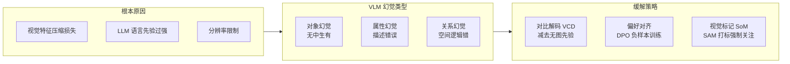

# VLM(视觉语言模型)的幻觉问题与纯文本 LLM 有什么不同?如何缓解

- **VLM 幻觉的独特性**

纯文本 LLM 幻觉：生成不存在的事实
VLM 幻觉：模型'看到'图片中不存在的内容，或忽略图片中存在的内容

- **VLM 幻觉的 3 种类型**

1. **对象幻觉**：
- 描述了图片中不存在的物体
- 例：图片只有猫，模型说'猫和狗在玩耍'

2. **属性幻觉**：
- 对象存在但属性描述错误
- 例：红色的车被描述为'蓝色'

3. **关系幻觉**：
- 对象和属性都对，但空间/逻辑关系错误
- 例：桌子上的杯子被描述为'杯子下面是桌子'

- **根本原因**
1. 视觉特征压缩损失信息(ViT → Projection → LLM)
2. LLM 的语言先验过强，'脑补'常见搭配
3. 训练数据中图像描述质量不均
4. 高分辨率图像 token 数不够

- **缓解策略**
1. **对比解码 (VCD)**：减去无图条件下的输出分布，消除语言先验
2. **CHAIR / POPE 评估**：用专门基准量化幻觉率
3. **RLHF for VLM**：用人类反馈减少幻觉
4. **DPO + 负样本**：'图片中没有XXX'作为 rejected pair
5. **Set-of-Mark**：在图片上标注序号，减少空间关系幻觉
6. **高分辨率处理**：动态分辨率(如 Qwen-VL 的 Window Attention)

- **实战案例**：在自动驾驶场景报告生成中，VLM 可能会描述“看到红灯”但实际图中是路灯。通过引入“负面指令微调”（Negative Instruction Tuning），显式训练模型识别“图中没有红绿灯”的样本，显著降低了误报率。

### 补充细节
- **对比解码 (VCD) 原理**：
  公式：$P_{VCD}(y) \propto P_{y|v}(y) - \lambda P_{y}(y)$。
  $P_{y|v}$ 是基于图片输入的生成概率，$P_{y}$ 是无图片输入（纯文本，将图片 token 置空）时的生成概率。如果模型在无图时也倾向于输出“猫和狗”，说明“狗”是语言先验带来的，通过减去这个概率分布，可以抑制仅由语言模型脑补产生的幻觉。
- **Set-of-Mark (SoM) 原理**：
  利用分割模型（如 SAM）先给图中的物体打上数字标记（1, 2, 3...），然后要求 VLM 描述“标记1是什么”。这强制模型关注具体的物体区域，而不是凭空想象。
- **RLHF/DPO 的应用**：
  构造偏好对：Prompt: “图片里有什么？”；Chosen: “一只猫”；Rejected: “一只猫和一只狗”。通过 DPO 训练，让模型学习降低产生“狗”的概率。

- **对比表格**：VLM 幻觉缓解方案
| 方案 | 核心机制 | 成本 | 适用场景 |
| :--- | :--- | :--- | :--- |
| **对比解码 (VCD)** | 推理时减去语言先验概率 | 低 (仅需额外一次前向) | 快速部署，无需重训 |
| **RLHF / DPO** | 人类反馈强化学习 | 高 (需收集偏好数据) | 对事实准确性要求极高的场景 |
| **Set-of-Mark** | 视觉辅助标注 | 中 (需增加分割模型) | 需要精细物体/空间关系的任务 |
| **高分辨率** | 增加视觉 Token 细节 | 高 (计算量增加) | 文字密集、细节丰富的场景 |

### ASCII 流程图：对比解码 (VCD) 抑制幻觉
```text
输入图像 + 文本 Prompt
        ↓
+---------------------+
|  VLM Forward Pass   |
| (Image-Conditioned) |
+----------+----------+
           |
           v
   Distribution P(v)  [例如: Cat(0.6), Dog(0.3), Bird(0.1)]
           |                                  ^
           | (减去语言先验)                  |
           |                                  |
+----------+----------+           +-----------+-----------+
|  VLM Forward Pass   |           |  Language Model Only |
| (Blank Image / Text)|           |   (No Visual Input)  |
+---------------------+           +-----------------------+
           |                                  |
           v                                  v
   Distribution P(nl) [例如: Cat(0.4), Dog(0.5), Bird(0.1)]
           
       最终概率 ∝ P(v) - α * P(nl)
       结果：Cat(0.2), Dog(-0.2抑制), Bird(0.0)
```

## 常见考点
1.  **VLM 的幻觉和纯文本 LLM 的幻觉在本质上有什么不同？**
    *   *核心回答*：纯文本 LLM 幻觉源于知识缺失或逻辑错误；VLM 幻觉则主要源于视觉与语言模态的对齐偏差，以及语言先验对视觉信号的“覆盖”。

## 流程图




## 记忆要点

- 区别：VLM 幻觉指描述图中不存在内容，或忽略存在内容，受语言先验干扰。
- 类型：对象幻觉（无中生有）、属性幻觉（描述错误）、关系幻觉（空间逻辑错）。
- 缓解：对比解码（减去语言先验）、RLHF/DPO、Set-of-Mark（视觉标注）。
- 根源：视觉特征压缩损失信息，LLM 语言先验过强导致“脑补”。

## 结构化回答

**30 秒电梯演讲：** VLM 幻觉和纯文本 LLM 不同——它是"看图说瞎话"，描述图里没有的东西或忽略有的，根源是 LLM 语言先验太强盖过了视觉信号。分三类：对象幻觉（无中生有）、属性幻觉（描述错）、关系幻觉（空间逻辑乱）。缓解靠对比解码减去语言先验、RLHF/DPO、Set-of-Mark 视觉标注。

**展开框架：**
1. **独特性** — 纯文本幻觉源于知识缺失；VLM 幻觉源于视觉和语言模态对齐偏差，语言先验"覆盖"视觉信号，导致脑补。
2. **三种类型** — 对象幻觉（图只有猫却说猫狗玩耍）、属性幻觉（对象在但属性错）、关系幻觉（空间逻辑错）。
3. **缓解方案** — 对比解码 VCD（推理时减去无图条件概率消语言先验）、RLHF/DPO（偏好对训练）、Set-of-Mark（SAM 打标强制关注具体区域）。

**收尾：** 对比解码公式 P_VCD ∝ P(y|v) - λP(y)，减去无图时的语言先验概率就能抑制脑补。您想聊 POPE 评估方法怎么量化幻觉率，还是 Set-of-Mark 怎么落地？

## 视频脚本

> 预计时长：2 分钟 | 由浅入深

| 时间 | 画面/字幕 | 口播台词 | 讲解要点 |
|------|----------|----------|----------|
| 0:00 | 标题卡：VLM 幻觉问题 | "VLM 会指鹿为马无中生有，这和纯文本幻觉不是一回事。" | 开场钩子 |
| 0:15 | 指鹿为马类比 | "像指鹿为马或无中生有，把看到的和脑补的混在一起。" | 核心类比 |
| 0:40 | VLM vs 纯文本幻觉对比 | "纯文本幻觉源于知识缺失，VLM 幻觉源于语言先验盖过视觉信号。" | 本质区别 |
| 1:05 | 三种幻觉类型图 | "对象幻觉无中生有，属性幻觉描述错，关系幻觉空间逻辑乱。" | 三种类型 |
| 1:35 | 对比解码 VCD 公式 | "缓解：对比解码减去无图概率消语言先验，还有 RLHF 和 Set-of-Mark。" | 缓解方案 |
| 1:55 | 自动驾驶红灯误报案例 | "实战：负面指令微调训练识别图中没有红绿灯，显著降误报。" | 实战案例 |

