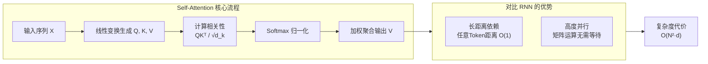

# Transformer中的Self-Attention机制是什么?为什么比RNN更高效

Self-Attention允许序列中每个位置直接关注所有其他位置,计算加权求和.

- **核心公式:**
Attention(Q,K,V) = softmax(QKᵀ/√d_k)·V

- **Q/K/V的来源:** 输入X分别乘以三个权重矩阵Wq/Wk/Wv

- **优势:**
1. **并行计算** - RNN必须串行处理,Self-Attention可并行
2. **长距离依赖** - 任意两个token间距离为O(1),RNN为O(n)
3. **可解释性** - 注意力权重矩阵可视化理解模型关注点

- **复杂度对比:**
- Self-Attention: O(n²·d) - 序列长度平方,但可并行
- RNN: O(n·d²) - 序列长度线性,但必须串行

### 对比表格

| 维度 | RNN (LSTM/GRU) | Self-Attention (Transformer) |
| :--- | :--- | :--- |
| **计算并行度** | 串行 (t步依赖t-1步) | 并行 (所有Token同时计算) |
| **长距离依赖** | O(N) 路径长，信息易衰减 | O(1) 直接连接，无衰减 |
| **计算复杂度** | O(N · d²) | O(N² · d) (主要瓶颈在矩阵乘法) |
| **显存占用** | 较低 (线性) | 较高 (需存储N×N注意力矩阵) |
| **归纳偏置** | 强假设 (局部性、时序性) | 弱假设 (关系需从数据学习) |

### 实战案例
在早期的**情感分析**任务中，使用LSTM往往难以捕捉段落末尾的关键转折词（如“但是...”）对开篇的影响，导致分类错误。切换到Transformer架构后，模型能直接建立“但是”与前面所有词的连接，准确率显著提升。然而，在处理超长序列（如全基因组测序）时，标准Transformer的O(N²)复杂度会导致显存溢出（OOM），此时必须改用**Linear Attention**或**RNN**等线性复杂度模型，或者切分片段使用滑动窗口机制。

### 代码示例
```python
import torch
import torch.nn as nn

class SelfAttention(nn.Module):
    def __init__(self, embed_dim, num_heads):
        super().__init__()
        self.multihead_attn = nn.MultiheadAttention(embed_dim, num_heads)

    def forward(self, x):
        # x shape: [Seq_Len, Batch, Dim] (MHA默认需要L第一)
        attn_output, attn_weights = self.multihead_attn(x, x, x)
        return attn_output

# 模拟输入：序列长度10，Batch 2，维度512
input_tensor = torch.randn(10, 2, 512)
model = SelfAttention(embed_dim=512, num_heads=8)
output = model(input_tensor)
```

## 流程图



## 记忆要点

- 定义：序列中每个位置直接关注所有其他位置，计算加权求和。
- 对比RNN：Self-Attention并行计算，长距离依赖O(1)；RNN串行，依赖O(N)。
- 复杂度：Self-Attention为O(N²·d)，RNN为O(N·d²)。
- 优势：并行度高，捕捉长距离信息能力强，注意力权重可解释。

## 结构化回答

**30 秒电梯演讲：** Self-Attention 让序列里每个位置直接关注所有其他位置，按 QK 相关性加权聚合 V。比 RNN 高效的核心是两点：一是任意两 token 距离 O(1) 直接捕捉长依赖（RNN 是 O(N) 会遗忘），二是矩阵运算能高度并行（RNN 必须串行等前一步）。代价是复杂度 O(N²·d)。

**展开框架：**
1. **QKV 机制** — 输入线性变换出 Q/K/V，QKᵀ 算相关性，softmax 归一化加权聚合 V，每个位置同时看全场决定听谁的。
2. **对比 RNN 两大优势** — 长距离依赖 O(1) vs RNN 的 O(N)；矩阵乘法可并行 vs RNN 必须等 t-1 算完。
3. **复杂度代价** — Self-Attention 是 O(N²·d)（主要来自 QKᵀ），RNN 是 O(N·d²)；序列长了要用 Sparse/FlashAttention 优化。

**收尾：** 关键细节是除以 √d_k 防止点积过大让 softmax 梯度消失。您想深入聊 Multi-Head Attention 不同头怎么学不同子空间，还是怎么降低 O(N²) 复杂度？

## 视频脚本

> 预计时长：2 分钟 | 由浅入深

| 时间 | 画面/字幕 | 口播台词 | 讲解要点 |
|------|----------|----------|----------|
| 0:00 | 标题卡：Self-Attention | "Transformer 的核心，为啥比 RNN 高效？并行+长依赖。" | 开场钩子 |
| 0:15 | 全场看一眼 vs 传声筒类比 | "Self-Attention 每个人同时看全场决定听谁的，RNN 像传声筒一个个传。" | 核心类比 |
| 0:40 | QKV 计算流程图 | "Q/K/V 线性变换，QKᵀ 算相关性，softmax 加权聚合 V。" | 核心机制 |
| 1:10 | Self-Attention vs RNN 对比表 | "长依赖 O(1) vs O(N)，能并行 vs 必须串行，两大核心优势。" | 对比优势 |
| 1:35 | O(N²) 复杂度警示 | "代价：复杂度 O(N²·d)，序列长了要用 FlashAttention 优化。" | 复杂度代价 |
| 1:55 | 总结卡 | "口诀：QKV 加权，O(1) 长依赖能并行。下期讲位置编码。" | 收尾 |

