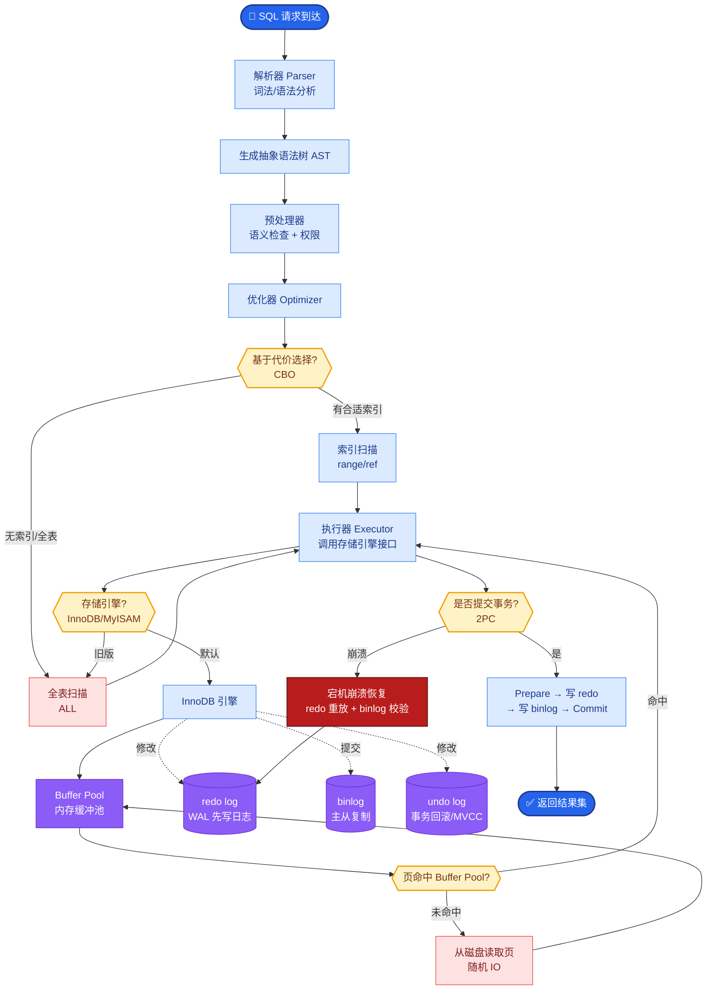
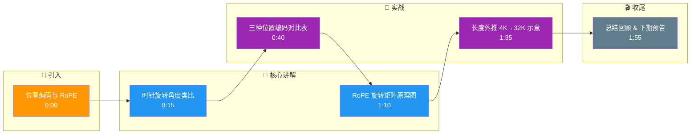

# 主流大模型使用的位置编码有哪些?RoPE的原理和优势是什么

位置编码让Transformer感知token顺序(Self-Attention本身是排列不变的).

- **方案对比:**
| 方案 | 类型 | 外推性 | 代表模型 |
|------|------|--------|----------|
| Sinusoidal | 绝对 | 差 | 原始Transformer |
| Learned PE | 绝对 | 无 | BERT/GPT-2 |
| ALiBi | 相对 | 强 | BLOOM |
| **RoPE** | 相对 | **强** | **LLaMA/Qwen/GLM** |

- **RoPE原理:**
通过旋转矩阵将位置信息编码到Q和K中:
q_m · k_nᵀ = Re((q · R(m))^* · (k · R(n)))
其中R(i)是角度为i·θ的旋转矩阵

**补充细节：**
RoPE的核心思想是将绝对位置信息通过旋转操作注入到Query和Key的向量中，使得Attention Score的计算自然包含相对位置信息。

假设在二维空间中，对于位置$m$，向量$q_m$通过旋转矩阵$R(m)$变换，对应于复数域中的乘法：$f(x, m) = (x_1 e^{im\theta_1}, x_2 e^{im\theta_2}, ...)$。当计算$q_m$和$k_n$的内积时，点积结果仅包含$m-n$的三角函数项，从而实现了相对位置感知。

**配置参数**：$\theta_i = 10000^{-2(i-1)/d}$，其中$d$是维度，$i$是维度索引。这就构成了“NTK-aware”扩展的基础。

- **优势:**
1. 相对位置感知 - 只依赖m-n
2. 长度外推 - 训练4K可推理32K+
3. 计算高效 - 只需矩阵乘法

**实战案例：**
工程中常遇到“长文本灾难”，即直接截断或使用普通插值会导致模型回复重复或逻辑断裂。实战中通常采用 **NTK-aware Scaling**（动态调整base值）而非简单线性插值，能让模型在处理8K以上长文本时保持注意力衰减特性。

**代码示例 (Python/PyTorch RoPE核心实现)：**
```python
def precompute_freqs_cis(dim: int, end: int, theta: float = 10000.0):
    freqs = 1.0 / (theta ** (torch.arange(0, dim, 2)[: (dim // 2)].float() / dim))
    t = torch.arange(end, device=freqs.device)
    freqs = torch.outer(t, freqs).float()
    # 生成复数形式的旋转频率: cos + i*sin
    freqs_cis = torch.polar(torch.ones_like(freqs), freqs) 
    return freqs_cis
```

**ASCII 架构图（RoPE 计算流程）：**
```
输入向量 X                位置索引 m
   │                         │
   ▼                         ▼
[ Query Projection ]  [ 生成旋转矩阵 R(m) ]
   │                         │
   ▼                         │
   Q = X @ W_q                │
   │                         │
   └───────► [ 旋转操作 ] ◄───┘
             (Q_rotated = Q * R(m))
                   │
                   ▼
           参与 Attention 计算
```

## 常见考点
1. **长文本外推**：为何训练短、推理长会导致效果下降？(频率分辨率不足) 提及 NTK-aware Scaling 或 YaRN 等插值方法。
2. **实现细节**：旋转操作是在 Attention 之前还是之后？(通常在 Q/K 计算出来之后，进行点乘之前)。
3. **多维处理**：RoPE 如何应用到高维向量？(两两分组旋转，即 head_dim/2 次旋转)。
4. **对比 ALiBi**：RoPE (加法在复数域/旋转) vs ALiBi (直接在 Attention Score 减去偏置) 的优劣。

## 核心流程图



## 记忆要点

- 主流方案：Sinusoidal（绝对）、Learned（绝对）、RoPE（相对，主流）。
- RoPE原理：通过旋转矩阵将位置信息注入Q和K，内积自然包含相对位置。
- RoPE优势：相对位置感知，长度外推能力强（训练4K可推理32K+），计算高效。
- 实战：长文本推理常用NTK-aware Scaling而非简单插值，以保持注意力衰减特性。

## 结构化回答

**30 秒电梯演讲：** 位置编码让 Transformer 感知 token 顺序（Self-Attention 本身是排列不变的）。主流三种：Sinusoidal 绝对正弦、Learned 可学习绝对、RoPE 旋转相对。RoPE 是主流，因为它通过旋转矩阵把位置信息注入 Q 和 K，内积自然包含相对位置，长度外推能力强——训练 4K 能推理 32K+。

**展开框架：**
1. **为什么需要位置编码** — Self-Attention 对所有位置一视同仁（置换不变），不编码顺序就分不清"猫追狗"和"狗追猫"。
2. **三种方案对比** — Sinusoidal 固定正弦绝对位置、Learned 可学习绝对位置、RoPE 旋转矩阵注入相对位置（当前主流）。
3. **RoPE 优势** — 相对位置感知、长度外推强（训练短推理长）、计算高效；长文本推理用 NTK-aware Scaling 而非简单插值保持注意力衰减。

**收尾：** RoPE 是两两分组旋转（head_dim/2 次），在 Q/K 计算后点乘前应用。您想深入聊 NTK-aware/YaRN 怎么做长度外推，还是 RoPE 对比 ALiBi 的优劣？

## 视频脚本

> 预计时长：2 分钟 | 由浅入深

| 时间 | 画面/字幕 | 口播台词 | 讲解要点 |
|------|----------|----------|----------|
| 0:00 | 标题卡：位置编码与 RoPE | "Self-Attention 分不清顺序，位置编码给它加上方向感。" | 开场钩子 |
| 0:15 | 时针旋转角度类比 | "RoPE 像时针，向量旋转的角度代表位置，转过的角度差就是相对位置。" | 核心类比 |
| 0:40 | 三种位置编码对比表 | "Sinusoidal 绝对正弦，Learned 可学习绝对，RoPE 旋转相对是主流。" | 方案对比 |
| 1:10 | RoPE 旋转矩阵原理图 | "RoPE 旋转矩阵注入 Q 和 K，内积自然包含相对位置信息。" | RoPE 原理 |
| 1:35 | 长度外推 4K→32K 示意 | "优势：长度外推强，训练 4K 推理 32K+，长文本用 NTK-aware Scaling。" | 外推能力 |
| 1:55 | 总结卡 | "口诀：RoPE 旋转注相对位置，外推强。下期讲 MoE。" | 收尾 |

### 视频流程图




