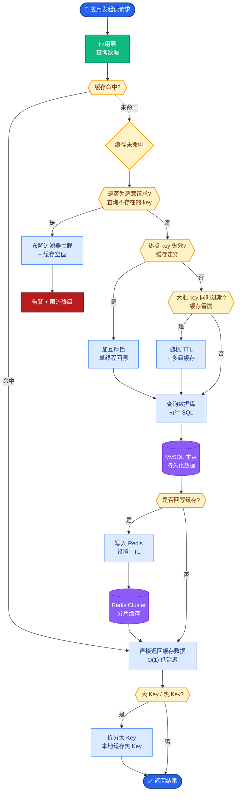
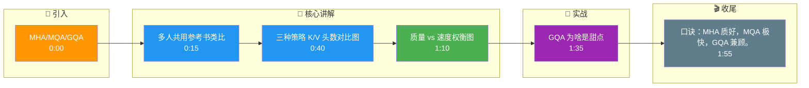

# MHA、MQA、GQA三者有什么区别?为什么大模型倾向用GQA

MHA、MQA、GQA三者是Key/Value在不同head间的共享策略:

| 方案 | K/V头数 | KV Cache | 质量 | 速度 |
|------|---------|----------|------|------|
| MHA | = Q头数 | 大 | 最好 | 慢 |
| MQA | 1 | **最小** | 下降 | **最快** |
| GQA | 分组共享 | 中等 | **接近MHA** | **快** |

- **核心权衡:** K/V头越少→KV Cache越小→推理越快,但质量可能下降

**补充细节：**
- **MHA (Multi-Head Attention)**: 每个头都有独立的 $W_Q, W_K, W_V$。表达能力最强，但解码时访存开销巨大，因为每个头都要加载对应的 Key/Value 向量。
- **MQA (Multi-Query Attention)**: 所有头共享同一组 $W_K, W_V$。KV Cache 仅需一份，极大减少显存占用和 HBM 带宽（带宽通常是推理瓶颈），但可能导致模型表达能力的“坍缩”。
- **GQA (Grouped-Query Attention)**: 折中方案。将 $N$ 个 Query 头分为 $G$ 组，每组共享一个 $K$ 和 $V$ 头。当 $G=1$ 时退化为 MQA，当 $G=N$ 时退化为 MHA。

**计算影响**：在推理阶段，Attention 计算受限于内存带宽。GQA 减少了读取 Key/Value 的数据量，从而显著提升推理吞吐量（TPS），而不仅仅是显存静态占用的减少。

**实战案例：**
在将 PaLM (MHA架构) 迁移到生产环境推理时，发现延迟极高。改用 **MQA/GQA** 后，虽然训练损失略有上升（需进行少量步数的 uptraining），但推理 TPS (Tokens Per Second) 提升了 3 倍以上，因为瓶颈从计算转为了显存带宽。

**代码示例 (PyTorch - GQA KV重复逻辑)：**
```python
# inputs: q [bs, seq, n_heads, d], k [bs, seq, n_kv_heads, d]
# n_kv_heads 必须能整除 n_heads

def repeat_kv(hidden_states, n_rep):
    batch, seq_len, n_kv_heads, head_dim = hidden_states.shape
    if n_rep == 1:
        return hidden_states
    return hidden_states[:, :, :, None, :].expand(batch, seq_len, n_kv_heads, n_rep, head_dim).reshape(batch, seq_len, n_kv_heads * n_rep, head_dim)
```

- **GQA (Grouped-Query Attention):**
- 将Q头分为G组,每组共享一对K/V
- 例如32个Q头分为8组,每组4个Q头共享K/V
- KV Cache减少为MHA的1/4

- **实际应用:**
- LLaMA-2 70B: GQA (8组)
- LLaMA-3: GQA
- Mistral: GQA
- GLM-4: GQA

**ASCII 结构图（Head 共享模式）：**
```
MHA (标准模式):
  Q_head1 ───┐
  Q_head2 ───┤
  Q_head3 ───┼──► Attention ──► Output
  Q_head4 ───┤      (各算各的 K/V)
              │
  K_head1 ───┤
  K_head2 ───┤
  K_head3 ───┘
  K_head4 ───┘  (V 同理)

MQA (极致共享):
  Q_head1 ───┐
  Q_head2 ───┼──► Attention ──► Output
  Q_head3 ───┤      (共用同一个 K_head)
  Q_head4 ───┘
              │
  K_shared ───┘

GQA (分组共享 - G=2):
  Q_head1 ───┐
  Q_head2 ───┼──► Attention (Group 1)
              │       (共用 K_group1)
  Q_head3 ───┼──► Attention (Group 2)
  Q_head4 ───┘       (共用 K_group2)
```

## 常见考点
1. **训练与推理一致性**：如果模型在训练时使用 MHA，推理时能否直接切换到 GQA/MQA？(不能，权重结构不同；需使用 Uptraining / Knowledge Distillation 进行对齐训练)。
2. **性能瓶颈**：为什么减少 KV Cache 能提速？(解释 Compute-bound vs Memory-bound，大模型推理通常是 Memory-bound，减少访存量比减少计算量更关键)。
3. **分组策略选择**：GQA 的分组数量 G 如何选取？(通常根据模型大小和 KV Cache 压缩率需求折中，如 40B 模型常用 G=8)。

## 核心流程图



## 记忆要点

- MHA各头独立K/V，MQA全头共享一对K/V，GQA分组共享K/V
- 权衡：K/V头越少，显存和带宽占用越小，推理越快，但表达能力略降
- 大模型选GQA：兼顾MHA的质量和MQA的速度，KV Cache减至1/G
- 注意：训练和推理架构必须一致，MHA不能直接切GQA，需Uptraining

## 结构化回答

**30 秒电梯演讲：** MHA、MQA、GQA 是 K/V 在不同 head 间的共享策略：MHA 各头独立 K/V 质量好但慢，MQA 全头共享一对 K/V 极快但伤质量，GQA 分组共享兼顾两者。大模型倾向 GQA 因为它平衡了 MHA 的质量和 MQA 的速度，把 KV Cache 压到 1/G。

**展开框架：**
1. **三种共享策略** — MHA 各头独立 K/V（质量好显存大）、MQA 全头共享一对 K/V（极快伤质量）、GQA 分组共享（中间路线）。
2. **权衡逻辑** — K/V 头越少，显存和带宽占用越小推理越快，但表达能力略降；大模型推理是 Memory-bound，减少访存比减计算更关键。
3. **为什么选 GQA** — 兼顾 MHA 质量和 MQA 速度，KV Cache 减至 1/G；但训练推理架构必须一致，MHA 不能直接切 GQA 需 Uptraining。

**收尾：** GQA 分组数 G 通常按模型大小折中，40B 模型常用 G=8。您想深入聊 GQA 分组数怎么选，还是 MQA 在什么场景值得质量折中？

## 视频脚本

> 预计时长：2 分钟 | 由浅入深

| 时间 | 画面/字幕 | 口播台词 | 讲解要点 |
|------|----------|----------|----------|
| 0:00 | 标题卡：MHA/MQA/GQA | "KV Cache 太占显存？三种共享策略压缩它，大模型都选 GQA。" | 开场钩子 |
| 0:15 | 多人共用参考书类比 | "像多人（Q）共用同一套参考书（K/V），不用每人买一套，省钱省地方。" | 核心类比 |
| 0:40 | 三种策略 K/V 头数对比图 | "MHA 各头独立，MQA 全头共享一对，GQA 分组共享。" | 三种策略 |
| 1:10 | 质量 vs 速度权衡图 | "权衡：K/V 头越少推理越快但质量降，大模型推理 Memory-bound 减访存最关键。" | 权衡逻辑 |
| 1:35 | GQA 为啥是甜点 | "GQA 兼顾 MHA 质量和 MQA 速度，KV Cache 压到 1/G，是大模型标配。" | 选型结论 |
| 1:55 | 总结卡 | "口诀：MHA 质好，MQA 极快，GQA 兼顾。下期讲分词。" | 收尾 |

### 视频流程图




