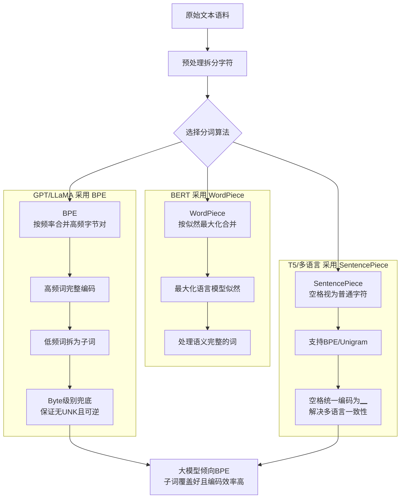

# BPE、WordPiece、SentencePiece分词算法有什么区别?为什么大模型多用BPE

- **BPE (Byte Pair Encoding):**
- 从字符级开始,迭代合并最高频字节对
- GPT/GPT-2/GPT-3/LLaMA使用

**补充细节：**
BPE 首先将文本拆分为字符序列，然后统计相邻字节对的出现频率，将频率最高的一对合并为一个新的符号，并更新字典。重复此过程直到字典大小达到预设值（如 50k）。它是贪心算法，每次只合并当前频率最高的一对。

- **WordPiece:**
- 类似BPE,但使用似然而非频率作为合并标准
- BERT使用

**补充细节：**
WordPiece 的合并策略是基于最大化训练数据的似然概率。它选择合并能最大程度降低语言模型困惑度的字节对，而不仅仅是看频率。这有助于处理那些虽然频率不是最高但语义完整的词。

- **SentencePiece:**
- 不依赖空格预处理,直接在原始文本上操作
- 支持BPE和Unigram两种算法
- T5/LLaMA/GLM使用

**补充细节：**
SentencePiece 将空格也视为一个特殊字符（如 `▁`），从而使得分词过程完全独立于语言的预处理步骤（如英文的空格分词、中文的分词）。这解决了多语言一致性问题，并且保证了分词的可逆性（Token -> Text 是 100% 可还原的）。Unigram 模型则是先初始化一个大词表，然后通过逐步增加语言模型得分最低（即对整体概率贡献最小）的词的损失，来剪枝词表，这与 BPE 的构建过程相反。

**实战案例：**
训练代码生成模型时，如果词表对空格处理不当（如GPT-2将空格作为token前缀），容易导致模型在缩进对齐上出错。现代LLM多使用 **SentencePiece** 并显式将空格视为token的一部分（如 `▁def`），且支持 Byte-level fallback，解决了生成特殊字符或乱码时的崩溃问题。

**代码示例 (Python BPE 训练核心步骤)：**
```python
from collections import Counter

def get_stats(vocab):
    pairs = Counter()
    for word, freq in vocab.items():
        symbols = word.split()
        for i in range(len(symbols)-1):
            pairs[(symbols[i], symbols[i+1])] += freq
    return pairs

# 迭代合并最高频对
# best_pair = max(pairs, key=pairs.get)
# merge_vocab(best_pair, ...)
```

**分词算法对比：**

| 算法 | 核心逻辑 | 空格处理 | 合并方向 | 常见模型 |
| :--- | :--- | :--- | :--- | :--- |
| **BPE** | 统计字节对频率 | 依赖空格(需预分词) | 自底向上(由小到大合并) | GPT系列, LLaMA原版 |
| **WordPiece** | 最大化训练似然 | 依赖空格 | 自底向上 | BERT |
| **Unigram** | 语言模型概率剪枝 | 统一处理(含空格) | 自顶向下(由大变小剪枝) | T5, ALBERT |
| **SentencePiece** | (框架,支持BPE/Unigram) | 空格转特殊字符`▁` | (取决于内部算法) | T5, LLaMA2/3 |

- **大模型倾向BPE的原因:**
1. **子词覆盖好** - 高频词完整编码,低频词拆为子词
2. **多语言友好** - 不依赖空格分词
3. **编码效率高** - 相同文本token数更少
4. **可逆性** - 任何字节序列都能被编码

**实际影响:**
- 中文在LLaMA的BPE中通常1字=1-2 token(效率低)
- Qwen/GLM针对中文优化了词表,中文编码效率更高

**ASCII 流程图（BPE 迭代训练）：**
```
原始文本: "hug hug pug pug hug"
初始词表: [h, u, g, p, , space]

第1轮统计: 'u' 'g' 频率最高 (3次)
合并 'u' + 'g' -> 'ug'
新词表: [..., ug]
当前序列: h ug h ug p ug p ug h ug

第2轮统计: 'h' 'ug' 频率最高 (3次)
合并 'h' + 'ug' -> 'hug'
新词表: [..., ug, hug]
当前序列: hug hug p ug p ug

... (重复直到达到词表大小限制)
```

## 常见考点
1. **未知词处理**：BPE 如何处理训练集中未见过的字符？(通常保留基础的字符级 Byte 级词表，保证任何文本都可被编码，不会出现 [UNK])。
2. **Tokenization Bias**：分词器的选择会影响模型的逻辑推理能力吗？(是的，数值、空格等处理方式的不同可能导致模型算术能力或代码能力的差异，如 LLaMA-2 对空格敏感)。
3. **Unigram vs BPE**：T5 使用 Unigram 的原因是什么？(Unigram 基于概率模型剪枝，理论上能找到更优的子词切分组合)。
4. **多字节字符**：对于 Emoji 或中文，BPE 的合并策略是怎样的？(通常是先在 Byte 层面合并，然后再在字符层面合并)。

## 流程图



## 核心知识点图


## 记忆要点

- BPE按频率自底向上合并，WordPiece按似然合并，SentencePiece把空格当字符处理
- 大模型倾向BPE/SentencePiece：子词覆盖好、多语言友好、无UNK且可逆
- SentencePiece是框架，支持BPE/Unigram，统一处理空格解决多语言一致性问题
- 实战：中文在未优化词表中效率低，需针对性优化词表或使用SentencePiece

## 结构化回答

**30 秒电梯演讲：** 分词算法三种主流：BPE 按频率自底向上合并字符对，WordPiece 按似然合并，SentencePiece 是把空格当字符处理的框架（支持 BPE/Unigram）。大模型倾向 BPE/SentencePiece 是因为子词覆盖好、多语言友好、无 UNK 且可逆。中文在未优化词表里效率低是个老问题。

**展开框架：**
1. **三种算法** — BPE 按频率迭代合并高频字符对、WordPiece 按似然选择最大化语言模型的合并、SentencePiece 把空格当普通字符统一处理。
2. **大模型为啥选 BPE/SentencePiece** — 子词覆盖好（罕见词能拆）、多语言友好、无 UNK（Byte 级保证可编码）、可逆无损。
3. **中文痛点** — 未优化词表里中文 token 效率低（一个字多个 token），需针对性扩词表或用 SentencePiece 优化。

**收尾：** 细节是 BPE 保留 Byte 级基础词表保证任何文本都能编码不出 UNK。您想深入聊中文为啥在 LLaMA 里 token 效率低，还是怎么评估 Tokenizer 好坏？

## 视频脚本

> 预计时长：2 分钟 | 由浅入深

| 时间 | 画面/字幕 | 口播台词 | 讲解要点 |
|------|----------|----------|----------|
| 0:00 | 标题卡：分词算法 | "文本怎么切成 token？三种主流算法各有侧重。" | 开场钩子 |
| 0:15 | 积木拼词类比 | "像积木拼词，常用词做成整块大积木，生僻词用小积木拼，省材料。" | 核心类比 |
| 0:40 | 三种算法对比表 | "BPE 按频率合并，WordPiece 按似然合并，SentencePiece 把空格当字符。" | 三种算法 |
| 1:10 | 大模型选 BPE 原因 | "子词覆盖好、多语言友好、无 UNK 可逆，Byte 级保证能编码任何文本。" | 选型理由 |
| 1:35 | 中文 token 效率低警示 | "痛点：中文在未优化词表里效率低，需扩词表或用 SentencePiece。" | 中文痛点 |
| 1:55 | 总结卡 | "口诀：BPE 按频率，SentencePiece 处理空格，大模型标配。" | 收尾 |

