# 为什么现代大模型(LLaMA/GLM)用SwiGLU替代ReLU/GELU作为FFN激活函数

### SwiGLU 原理与优势解析

**1. 结构与公式拆解**

SwiGLU 是由 Swish 激活函数与 GLU (Gated Linear Unit，门控线性单元) 结合而成的变体。其核心思想是通过引入门控机制来增强模型对特征信息的筛选能力。

- **Swish 激活函数:**
  $$Swish(x) = x \cdot \sigma(\beta x)$$
  (在 LLaMA 中通常设置 $\beta=1$，简化为 $x \cdot \text{sigmoid}(x)$)
  *特性：非单调、平滑、负轴有软饱和区，解决了 ReLU 的“死神经元”问题。*

- **标准 FFN (Position-wise FFN):**
  $$\text{FFN}(x) = \text{GELU}(xW_1 + b_1)W_2 + b_2$$
  *参数量：$d_{model} \times d_{ff} + d_{ff} \times d_{model}$*

- **SwiGLU 变体:**
  $$\text{SwiGLU}(x) = (\text{Swish}(xW_G) \odot (xW_{in}))W_{out}$$
  其中 $W_G$ 是门控权重，$W_{in}$ 是输入权重，$\odot$ 表示逐元素相乘。

**2. 架构图解**

标准 FFN 和 SwiGLU 的数据流对比如下：

```mermaid
flowchart TB
    classDef start fill:#4CAF50,color:#fff
    classDef process fill:#2196F3,color:#fff
    classDef decision fill:#FF9800,color:#fff
    classDef special fill:#9C27B0,color:#fff
    classDef error fill:#f44336,color:#fff
    classDef info fill:#607D8B,color:#fff
    class Activation start
    class Element process
    class FFN decision
    class GELU special
    class Input error
    class Linear info
    class Multiply start
    class Output process
    class ReLU decision
    class SwiGLU special
    class Swish error
    class W1 info
    class W2 start
    class W_G process
    class W_in decision
    class W_out special
    class fact error
    class ffn info
    class fin start
    class fout process
    class fw1 decision
    class fw2 special
    class mul error
    class swiglu info
    class swish start
    class wg process
    class win decision
    class wise special
    class wout error
    class x info
    class xW_G start
    class xin process
    class xout decision
    subgraph ffn["标准 FFN（ReLU/GELU）"]
        fin["Input (x)"]
        fw1["Linear (W1)"]
        fact["Activation（GELU/ReLU）"]
        fw2["Linear (W2)"]
        fout["Output"]
        fin --> fw1
        fw1 --> fact
        fact --> fw2
        fw2 --> fout
    end
    subgraph swiglu["SwiGLU"]
        xin["Input (x)"]
        win["Linear (W_in)"]
        wg["Linear (W_G)"]
        swish["Swish（xW_G）"]
        mul["Element-wise Multiply（⊙）"]
        wout["Linear (W_out)"]
        xout["Output"]
        xin --> win
        xin --> wg
        wg --> swish
        win --> mul
        swish --> mul
        mul --> wout
        wout --> xout
    end
```



**3. 对比分析 (为什么 SwiGLU 更好?)**

| 维度 | 标准 FFN (GELU) | SwiGLU | 优势/代价 |
| :--- | :--- | :--- | :--- |
| **表达能力** | 单一路径投影 | 引入门控机制，动态调节特征流 | 更强的非线性表达能力，性能提升显著 (PaLM/LLaMA验证) |
| **参数量** | $2d \cdot d_{ff}$ | $3d \cdot d_{ff}$ (多了门控矩阵) | **参数量增加 50%** (需相应调整 $d_{ff}$ 保持总参量平衡) |
| **计算代价** | 较低 | 增加了一个 Linear 层和逐点乘法 | 推理速度稍慢，但收敛更快，最终 Perplexity 更低 |
| **平滑性** | GELU 平滑但无门控 | Swish 平滑 + 门控软选择 | 梯度传播更稳定，缓解深层网络梯度消失 |

**4. 实战案例与代码**

* **实战踩坑**：在复现 LLaMA 架构时，如果未按照 $2/3$ 比例缩放隐藏层维度（例如保持 GELU 版本的 $d_{ff}=4d$），直接替换 SwiGLU 会导致模型参数量和计算量激增约 50%，极易导致显存 OOM。通常会将 SwiGLU 的 $d_{ff}$ 设为 $(8/3)d$ 以平衡参数量。

* **代码示例 (PyTorch)**:
```python
class SwiGLU(nn.Module):
    def __init__(self, dim, hidden_dim=None):
        super().__init__()
        # LLaMA 设置 hidden_dim 为 (2/3)*4dim，以平衡参数量
        hidden_dim = hidden_dim or int((2/3) * 4 * dim) 
        self.gate_proj = nn.Linear(dim, hidden_dim, bias=False)
        self.up_proj   = nn.Linear(dim, hidden_dim, bias=False)
        self.down_proj = nn.Linear(hidden_dim, dim, bias=False)

    def forward(self, x):
        # Swish(xW_gate) * (xW_up)
        return self.down_proj(F.silu(self.gate_proj(x)) * self.up_proj(x))
```


## 记忆要点

- SwiGLU引入门控机制，公式为Swish(xW_g)⊙(xW_in))W_out
- 优势：非线性表达能力强，梯度平滑，比ReLU/GELU性能更好
- 代价：参数量增加50%（多一个门控矩阵），需调整隐藏层维度保持总参平衡
- 初始化：A随机初始化，B初始化为0，保证训练初始行为不变

## 结构化回答

**30 秒电梯演讲：** 现代大模型用 SwiGLU 替代 ReLU/GELU，因为它引入了门控机制——Swish(xW_g)⊙(xW_in)，像智能阀门自主决定让哪些信息流过。优势是非线性表达强、梯度平滑（解决 ReLU 神经元死亡），性能比 ReLU/GELU 更好。代价是多一个门控矩阵参数量加 50%，要调隐藏层维度平衡总参。

**展开框架：**
1. **门控机制** — SwiGLU = Swish(xW_gate)⊙(xW_up)，门控分支决定放行多少、up 分支提供内容，两路相乘再 down 投影。
2. **对比 ReLU/GELU** — ReLU 负区间梯度为 0 有"死亡"问题；SwiGLU 的 Swish 激活梯度平滑，非线性表达更强，性能更好。
3. **代价与平衡** — 多一个门控矩阵参数量增加 50%，实践中把 FFN 隐藏层维度调小（如乘 2/3）保持总参数平衡。

**收尾：** 初始化细节是 gate 矩阵随机初始化、up 矩阵初始化为 0，保证训练开始时等价于原始模型。您想深入聊为啥不用更复杂激活函数，还是 SwiGLU 三个矩阵维度怎么设？

## 视频脚本

> 预计时长：2 分钟 | 由浅入深

| 时间 | 画面/字幕 | 口播台词 | 讲解要点 |
|------|----------|----------|----------|
| 0:00 | 标题卡：SwiGLU 激活函数 | "LLaMA/GLM 为啥不用 ReLU 用 SwiGLU？门控机制更聪明。" | 开场钩子 |
| 0:15 | 智能阀门类比 | "像神经网络装了智能阀门，自主决定让哪些信息流过，比只管开关好。" | 核心类比 |
| 0:40 | SwiGLU 公式拆解图 | "SwiGLU = Swish(xW_gate)⊙(xW_up)，门控分支放行，up 分支提供内容。" | 门控机制 |
| 1:10 | 对比 ReLU/GELU | "ReLU 负区间梯度为 0 会死亡，SwiGLU 的 Swish 梯度平滑性能更好。" | 对比优势 |
| 1:35 | 参数量加 50% 警示 | "代价：多一个门控矩阵参数加 50%，把隐藏层维度调小平衡总参。" | 代价平衡 |
| 1:55 | 总结卡 | "口诀：门控乘 Swish，梯度平滑，调维度平衡参数。下期讲涌现。" | 收尾 |

