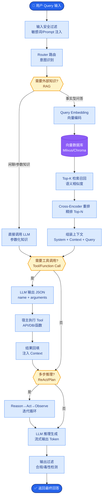

# 大模型的涌现能力(Emergent Abilities)是什么?Scaling Law如何指导模型训练

### 大模型涌现能力与 Scaling Law

**1. 涌现能力**

涌现能力指模型规模（参数量、计算量、数据量）超过某个临界阈值后，突然出现的小模型完全不具备的能力。这种能力通常不是通过简单的性能提升曲线预测的，而是呈现出阶跃式变化。

- **典型涌现能力:**
    - **思维链:** 多步数学推理、逻辑演绎。
    - **上下文学习:** 仅通过 Prompt 中的几个示例就能学会新任务，无需梯度更新。
    - **指令遵循:** 理解并执行复杂、多跳的自然语言指令。
    - **特定任务:** 如“反转单词”、“讽刺检测”等在特定 benchmark 上的表现。

- **临界点:** 根据早期研究（如 Wei et al. 2022），涌现通常在 10B (100亿) 参数以上开始显现，但也有观点认为这与模型架构和训练质量高度相关。

- **争议:** 
    斯坦福大学 2023 年的研究指出，部分所谓的“涌现”可能是由于评估指标是非平滑的。例如，使用“Exact Match”作为评估标准时，模型输出“99.9”和“100”得分差异巨大，导致性能曲线看似阶跃；若使用平滑指标（如 Token 编辑距离），性能提升可能是平滑的。

**2. Scaling Law (缩放定律)**

Scaling Law 描述了模型性能与计算资源（参数量 N、数据量 D、算力 C）之间的幂律关系。

- **Kaplan Law (OpenAI, 2020):**
    $$L(N, D) \approx E + \frac{A}{N^\alpha} + \frac{B}{D^\beta}$$
    *关键结论：在固定计算预算下，模型性能主要取决于参数量 N。倾向于“大模型 + 较少数据”的训练策略。* 

- **Chinchilla Law (DeepMind, 2022) - 当前主流共识:**
    Kaplan 的结论是训练不足导致的。DeepMind 训练了一系列从 70M 到 16B 的模型，并将它们训练到“收敛”，发现应该更重视数据量。
    $$D_{optimal} \approx 20 \times N_{optimal}$$
    *关键结论：为了达到最优计算效率，训练 Token 数量应是参数量的 20 倍。例如，一个 7B 的模型应训练约 140B Tokens。*

**3. Scaling Law 指导下的训练策略**

```text
      计算预算 (Compute Budget)
             │
             ▼
    ┌────────────────────────┐
    │   Scaling Law 预测     │──► 得到最优的 (N, D) 配置
    └──────────┬─────────────┘
               │
               ▼
    ┌────────────────────────┐
    │    Chinchilla 定理     │──► 修正数据配比 D ≈ 20N
    └──────────┬─────────────┘
               │
       ┌───────┴────────┐
       ▼                ▼
  模型参数量 N       训练数据量 D
  (Model Size)     (Tokens)
       │                │
       ▼                ▼
  模型架构设计      数据清洗/配比
  (层数/宽度)      (Curriculum)
```

**4. 实际应用与权衡**

- **训练策略:** 现代模型训练通常遵循 Chinchilla Scaling，即参数量和数据量同步增长。但在推理受限场景（如端侧模型），可能会倾向于“Over-training”（使用更多数据训练较小模型），例如 LLaMA-2 7B 训练了 2T Tokens（远超 Chinchilla 的 140B），以提高小模型的性能上限。

**5. 实战案例与代码**

* **实战案例**：在训练 7B 行业模型时，若遵循 Chinchilla Law（约 140B Tokens），模型Loss虽最优但行业指令遵循能力往往不足。实战中通常采用 **"Long Chinchilla"** 策略，将训练数据量推至 1T+ Tokens，虽然Loss边际收益递减，但能显著提升逻辑推理和抗噪能力，即"大力出奇迹"。

* **代码示例 (拟合 Scaling Law)**:
```python
import numpy as np

def estimate_loss(params, tokens, a=1.8, b=0.6):
    """
    基于 Chinchilla 公式估算 Loss: L = A + B*N^{-alpha} + C*D^{-beta}
    简化版：L ∝ (N^a / D^b) 或 N^(-alpha)
    """
    # 假设 Chinchilla 最优基线: N=7e9, D=1.4e11, Loss=2.5
    baseline_loss = 2.5
    baseline_params = 7e9
    baseline_tokens = 1.4e11
    
    # 简单幂律外推
    estimated_loss = baseline_loss * (params / baseline_params)**(-0.076) * (tokens / baseline_tokens)**(-0.095)
    return estimated_loss

# 预测：7B 模型训练 2T tokens 的 Loss
print(f"Estimated Loss: {estimate_loss(7e9, 2e12):.4f}")
```


## 核心流程图



## 记忆要点

- 涌现能力：模型规模超临界阈值后突然出现的思维链、上下文学习等能力
- Scaling Law：性能与算力、参数量、数据量呈幂律关系
- Chinchilla定律：最优训练Token数约为参数量的20倍，重视数据量
- 实战：端侧模型常采用Long Chinchilla策略，用更多数据训练小模型以提升上限

## 结构化回答

**30 秒电梯演讲：** 涌现能力是模型规模突破临界阈值（通常 10B+）后突然出现的能力，像水加热到 100 度突然沸腾，量变引起质变——思维链、上下文学习这些小模型完全没有。Scaling Law 指导训练：性能与算力、参数、数据呈幂律关系；Chinchilla 定律进一步说最优训练 token 数约为参数量的 20 倍。

**展开框架：**
1. **涌现能力** — 规模超阈值后突然出现的思维链（CoT）、上下文学习（ICL）、指令跟随等能力，小模型完全不具备。
2. **Scaling Law** — 性能与算力、参数量、数据量呈幂律关系，模型越大性能越好，但有性价比最优解。
3. **Chinchilla 定律** — 最优训练 token 数约为参数量的 20 倍，强调数据量要与参数匹配；端侧模型用 Long Chinchilla 策略多喂数据提升小模型上限。

**收尾：** 实战上，端侧小模型常故意多喂数据（超过 20 倍）来拉高能力上限，这就是 Long Chinchilla。您想深入聊涌现能力是真实的还是评估假象，还是 Chinchilla 对数据准备的具体指导？

## 视频脚本

> 预计时长：2 分钟 | 由浅入深

| 时间 | 画面/字幕 | 口播台词 | 讲解要点 |
|------|----------|----------|----------|
| 0:00 | 标题卡：涌现能力与 Scaling Law | "模型够大就突然变聪明？涌现能力是量变到质变。" | 开场钩子 |
| 0:15 | 水沸腾类比 | "像水加热到 100 度突然沸腾，不到这个度就只是温水。" | 核心类比 |
| 0:40 | 涌现能力出现曲线 | "规模超 10B+ 阈值后突然出现思维链、上下文学习等能力。" | 涌现现象 |
| 1:10 | Scaling Law 幂律图 | "性能与算力、参数、数据呈幂律关系，越大越好但有最优解。" | Scaling Law |
| 1:35 | Chinchilla 20 倍定律 | "Chinchilla：最优训练 token 数约为参数量 20 倍，数据量要匹配。" | 数据配比 |
| 1:55 | 总结卡 | "口诀：规模出涌现，20 倍数据最优，端侧用 Long Chinchilla。" | 收尾 |

