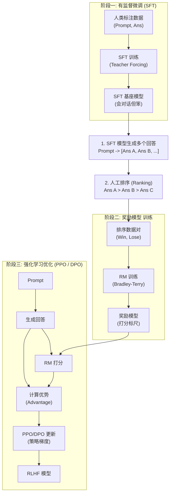

# RLHF的完整流程是什么?为什么需要它?PPO和DPO有什么区别

### RLHF (基于人类反馈的强化学习) 流程与原理

**1. 为什么需要 RLHF?**

- **预训练:** 模型学习的是“下一个词的概率”，目标是续写文本，而非回答问题或遵循指令。产出内容可能包含幻觉、偏见或有害信息。
- **SFT (有监督微调):** 让模型学会“对话格式”和基本的指令遵循，但依赖人工撰写的高质量问答数据，成本高昂且难以覆盖所有场景。SFT 难以定义什么是“好”的抽象标准（如幽默感、安全性）。
- **RLHF:** 通过引入人类偏好作为奖励信号，对齐模型使其输出更符合人类的价值观和期望（Helpful, Honest, Harmless, 即 3H 原则）。

**2. RLHF 完整流程 (三阶段)**



**3. PPO vs DPO 深度对比**

| 特性 | PPO (Proximal Policy Optimization) | DPO (Direct Preference Optimization) |
| :--- | :--- | :--- |
| **核心机制** | Actor-Critic 架构。需要训练 Policy 模型、Value 模型和 Reward 模型。 | 直接利用偏好数据优化策略，无需训练显式的 Reward 模型。 |
| **训练复杂度** | 高。需要 4 个模型同时加载：Ref, Policy, Reward, Value (显存占用极大)。 | 低。只需加载 Policy 和 Ref 模型 (显存减半)。 |
| **训练稳定性** | 较难调节。Reward Model 的不准确输出会导致策略崩溃，需 KL 惩罚约束。 | 高。直接优化人类偏好目标函数，避免了奖励模型 hacking 问题。 |
| **采样效率** | 低。每步需生成大量样本进行交互和梯度估计。 | 高。属于离线强化学习，直接利用已有的偏好对数据。 |
| **当前趋势** | 早期 OpenAI/Anthropic 使用，现逐渐被 DPO 取代。 | LLaMA 2/3, Mistral, ChatGLM3 等主流模型采用。 |

**4. 实战案例与代码**

* **实战踩坑**：在使用 PPO 进行微调时，如果 Reward 模型给出的分值方差过大，或者 KL 散度惩罚系数设置不当，模型极易出现 **"Reward Hacking"** 现象，即生成一些被 Reward 模型判定为高分但毫无意义的重复字符串（如无限输出 "Yes"）。切换到 DPO 可以有效避免此问题，因为它不需要回归拟合奖励分值。

* **代码示例 (DPO Loss)**:
```python
import torch
import torch.nn.functional as F

def dpo_loss(policy_chosen_logps, policy_rejected_logps, 
             reference_chosen_logps, reference_rejected_logps, beta=0.1):
    """
    计算 DPO Loss
    beta: 温度系数，控制对参考模型的偏离程度
    """
    # 计算策略模型与参考模型的 Log Prob 差异
    pi_diff = policy_chosen_logps - policy_rejected_logps
    ref_diff = reference_chosen_logps - reference_rejected_logps
    
    # DPO 核心目标：最大化 的概率
    # Loss = -log(sigmoid(beta * (pi_logratios - ref_logratios)))
    loss = -F.logsigmoid(beta * (pi_diff - ref_diff)).mean()
    
    # 可选：计算准确率
    acc = ((pi_diff > ref_diff).float()).mean()
    
    return loss, acc
```

## 核心知识点图


## 记忆要点

- RLHF三阶段：SFT学会对话格式 -> RM训练打分模型 -> PPO强化学习对齐
- PPO需4个模型（Policy/Value/RM/Ref），显存大且难调参，易Reward Hacking
- DPO直接优化偏好数据，利用闭式解隐去Reward模型，只需Policy和Ref
- DPO优势：显存减半、训练稳、无需采样交互，是目前主流对齐方案

## 结构化回答

**30 秒电梯演讲：** RLHF 三步走让模型对齐人类偏好：SFT 学会对话格式，RM 训练奖励打分模型，PPO 强化学习优化。像训狗：预训练认字、SFT 教握手、RLHF 给奖惩懂礼貌。PPO 要 4 个模型显存大易 Reward Hacking，DPO 直接用偏好数据闭式解隐去 RM，显存减半训练更稳，是现在主流。

**展开框架：**
1. **RLHF 三阶段** — SFT 学指令跟随格式 → RM 用人类偏好数据训练奖励模型 → PPO 用 RM 打分做强化学习对齐。
2. **PPO 的痛** — 需 4 个模型（Policy/Value/RM/Ref）显存大、难调参、易 Reward Hacking（模型钻奖励空子）。
3. **DPO 优势** — 直接优化偏好对数据，利用闭式解隐去 RM，只需 Policy 和 Ref，显存减半、训练稳、无需采样交互。

**收尾：** 现在主流对齐方案是 DPO，因为简单稳定；但 PPO 在复杂奖励信号场景仍有价值。您想深入聊 GRPO 和 PPO 的区别，还是 RLHF 可能引入什么偏见？

## 视频脚本

> 预计时长：2 分钟 | 由浅入深

| 时间 | 画面/字幕 | 口播台词 | 讲解要点 |
|------|----------|----------|----------|
| 0:00 | 标题卡：RLHF 与对齐 | "模型续写好但不懂礼貌？RLHF 三步走让它对齐人类偏好。" | 开场钩子 |
| 0:15 | 训狗类比 | "像训狗：预训练认字，SFT 教握手，RLHF 给奖励惩罚让它懂礼貌。" | 核心类比 |
| 0:40 | RLHF 三阶段流程图 | "SFT 学格式 → RM 训练打分模型 → PPO 强化学习对齐。" | 三阶段 |
| 1:10 | PPO 4 模型显存大警示 | "PPO 痛点：要 4 个模型显存大、难调参、易 Reward Hacking 钻空子。" | PPO 痛点 |
| 1:35 | DPO 闭式解示意图 | "DPO 直接优化偏好数据隐去 RM，只需 2 个模型，显存减半训练稳。" | DPO 优势 |
| 1:55 | 总结卡 | "口诀：SFT+RM+PPO 三步，DPO 简化成主流。下期讲 LoRA。" | 收尾 |

