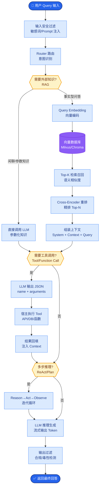

# LoRA的原理是什么?rank r 如何选择?QLoRA做了什么改进

- **LoRA (Low-Rank Adaptation):**
冻结原始权重W,在旁路添加低秩矩阵ΔA和ΔB:
h = Wx + ΔA·ΔB·x
其中 ΔA∈ℝ^(d×r), ΔB∈ℝ^(r×d), r << d

- **核心思想:** 模型适配的权重更新ΔW是低秩的

- **参数量对比:**
- 全量微调: d×d 参数
- LoRA: 2×d×r 参数(r=8时仅0.1%)

- **架构图:**
```
      输入 x
       │
       ▼
  ┌─────────┐
  │    W    │ (冻结)
  └────┬────┘
       │
       ├─────────────┐
       │             │
       ▼             ▼
    ┌─────┐       ┌─────┐
    │  Wx │       │ LoRA│
    └─────┘       │ B·A │
                  └──┬──┘
                     │ ΔW·x
                     │
       ┌─────────────┘
       │
       ▼
      h = Wx + BAx
```

- **rank r选择与初始化细节:**
- r=4-8: 简单任务/风格迁移
- r=16-64: 复杂任务/知识注入
- r>64: 基本接近全量微调效果
- **初始化技巧**: A采用高斯随机初始化，B初始化为0。训练开始时ΔW=0，保证模型行为与预训练模型一致，训练稳定性更高。

- **合并推理**: 推理时可将BA计算结果加回W，无额外计算开销。

- **QLoRA改进:**
1. **4-bit NormalFloat (NF4)**: 一种针对正态分布权重优化的数据类型，比FP4信息量更大。
2. **双重量化**: 对量化常数进行二次量化，每参数平均节省0.37bit。
3. **分页优化器**: 利用GPU显存统一内存，处理峰值显存需求。
4. **LoRA层保持FP16/BF16**: 梯度更新仍在高位进行。
5. **效果:** 70B模型可在单张48GB GPU微调,质量接近全量。

- **适用场景:** 资源有限/多任务部署/快速实验

- **## 常见考点:**
1. LoRA为什么要初始化B为0、A为随机分布？
2. LoRA适合应用在Attention层的所有矩阵还是仅部分？
3. 为什么一般r设置得较小（如8或16）？

**4. 实战案例与代码**

* **实战踩坑**：在使用 QLoRA 微调时，发现模型下游任务效果极差，检查发现是因为训练数据集中存在大量与预训练分布差异巨大的噪声数据（如乱码），导致量化后的 4-bit 权重无法精确表达新特征的梯度方向。**解决方法**：增加 Warmup steps 并适当提高 LoRA 的 rank (如从 8 提到 16)，给模型更多“容错空间”。

* **代码示例 (LoRA 注入)**:
```python
import torch.nn as nn

class LoRALinear(nn.Module):
    def __init__(self, in_features, out_features, rank=8, alpha=16):
        super().__init__()
        # 原始冻结权重 (实际场景中通常替换现有层)
        self.linear = nn.Linear(in_features, out_features)
        self.linear.weight.requires_grad = False
        
        # LoRA 低秩分解
        self.lora_down = nn.Linear(in_features, rank, bias=False)
        self.lora_up = nn.Linear(rank, out_features, bias=False)
        
        # 初始化: A为随机, B为0
        nn.init.kaiming_uniform_(self.lora_down.weight, a=math.sqrt(5))
        nn.init.zeros_(self.lora_up.weight)
        
        self.scaling = alpha / rank

    def forward(self, x):
        # Y = Wx + BAx * scaling
        return self.linear(x) + self.lora_up(self.lora_down(x)) * self.scaling
```

## 核心流程图



## 记忆要点

- LoRA冻结原权重W，旁路加低秩矩阵BA，h=Wx+BAx，r通常取4-64
- 参数量：2×d×r，相比全量微调极大减少，推理时可合并回W无开销
- 初始化：A随机初始化，B初始化为0，保证训练初始行为不变
- QLoRA改进：4-bit NF4量化、双重量化、分页优化器，单卡微调70B模型

## 结构化回答

**30 秒电梯演讲：** LoRA 冻结原权重 W，在旁路加两个低秩矩阵 B·A，h=Wx+BAx，只训 BA 参数量从 d² 降到 2dr（r 通常 4-64）。像给大衣打补丁不用重做整件。QLoRA 在此基础上把基座量化到 4-bit NF4，加双重量化和分页优化器，单卡就能微调 70B 模型。

**展开框架：**
1. **低秩旁路** — 冻结 W，旁路加 B（d×r）和 A（r×d），h=Wx+BAx；参数量 2dr 远小于 d²，极大降显存。
2. **初始化与合并** — A 随机高斯初始化、B 初始化为 0，保证训练初始 BA=0 行为不变；推理时 BA 可合并回 W 无额外开销。
3. **QLoRA 改进** — 基座 4-bit NF4 量化（正态分布最优）、双重量化（量化常数也量化）、分页优化器防显存峰值，单卡微调 70B。

**收尾：** rank r 越大表达越强但参数多，常见任务 r=8 够用，复杂任务可到 64。您想深入聊为啥 A 用零初始化的高斯，还是 QLoRA 的 NF4 为啥比 INT4 好？

## 视频脚本

> 预计时长：2 分钟 | 由浅入深

| 时间 | 画面/字幕 | 口播台词 | 讲解要点 |
|------|----------|----------|----------|
| 0:00 | 标题卡：LoRA 与 QLoRA | "全量微调太贵？LoRA 冻结主干加低秩补丁，省显存。" | 开场钩子 |
| 0:15 | 大衣打补丁类比 | "像给大衣打补丁，不用重做整件衣服，缝几块小布料就能改样式。" | 核心类比 |
| 0:40 | LoRA 低秩旁路示意图 | "冻结 W，旁路加 B·A，h=Wx+BAx，参数从 d² 降到 2dr。" | 核心原理 |
| 1:10 | 初始化 A 随机 B 为 0 | "初始化：A 随机高斯，B 初始化为 0，保证训练初始 BA=0 行为不变。" | 关键细节 |
| 1:35 | QLoRA 4-bit NF4 量化 | "QLoRA：基座 4-bit NF4 量化加双重量化加分页优化器，单卡微调 70B。" | QLoRA 改进 |
| 1:55 | 总结卡 | "口诀：冻结加低秩，r 取 4-64，QLoRA 单卡 70B。下期讲 KV Cache。" | 收尾 |

### 视频流程图


