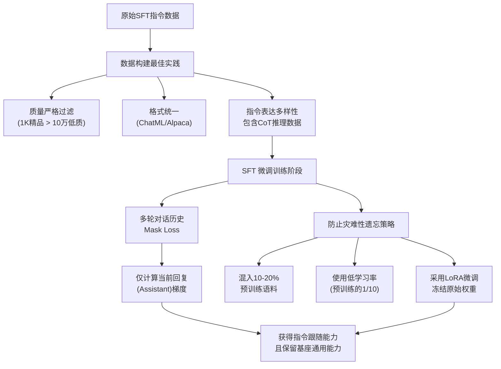

# SFT数据集的构建有哪些最佳实践?如何避免灾难性遗忘

- **SFT数据构建最佳实践:**

1. **多样性优先** - 覆盖多种任务类型和领域
2. **质量>数量** - 1K条高质量数据 > 10万条低质量
3. **格式统一** - ChatML/Alpaca/ShareGPT格式
4. **CoT数据** - 包含思维链推理过程
5. **指令多样性** - 同一意图用不同表达方式

- **避免灾难性遗忘:**
1. **混入预训练数据** - SFT数据中混合10-20%原始预训练文本
2. **低学习率** - 用预训练lr的1/10
3. **LoRA/QLoRA** - 冻结原始权重,天然防止遗忘
4. **课程学习** - 从简单到复杂逐步训练

- **## 常见考点:**
1. 也就是常说的「数据飞轮」，SFT数据质量不好会对模型造成什么不可逆影响？
2. 在SFT阶段，如何平衡多轮对话数据和单轮指令数据？
3. 什么是Evol-Instruct？它在SFT数据构建中起什么作用？

**3. 实战案例与代码**

* **实战踩坑**：在构建多轮对话数据时，如果直接将多轮历史拼接成一条长样本进行 SFT，模型容易在长上下文中丢失指令核心或过度模仿历史语气。**最佳实践**是训练时 Mask 掉历史部分的 Loss，只计算当前回复部分的梯度（Assistant Mask），并适当降低系统提示词的占比。

* **代码示例 (数据处理与 Mask)**:
```python
import torch

def compute_sft_loss(logits, labels, user_mask):
    """
    logits: [batch, seq_len, vocab_size]
    labels: [batch, seq_len] (包含 user 和 assistant 内容)
    user_mask: [batch, seq_len] (1为user输入，0为assistant输出)
    """
    # 计算 CrossEntropy (通常 shift logits and labels)
    shift_logits = logits[..., :-1, :].contiguous()
    shift_labels = labels[..., 1:].contiguous()
    
    # 创建 Loss Mask: 只有 Assistant 的部分才计算 loss
    # 注意 mask 维度要对齐，通常 user_mask 也要 shift
    loss_mask = ~user_mask[..., 1:].contiguous() 
    
    loss_fct = torch.nn.CrossEntropyLoss(reduction='none')
    loss = loss_fct(shift_logits.view(-1, shift_logits.size(-1)), shift_labels.view(-1))
    
    # 应用 mask 并求平均
    loss = (loss * loss_mask.view(-1)).sum() / loss_mask.sum()
    return loss
```

## 流程图



## 记忆要点

- SFT构建：质量>数量，格式统一，包含CoT，指令表达需多样性
- 防遗忘：混入10-20%预训练数据、使用低学习率、采用LoRA冻结权重
- 多轮对话：训练时Mask掉历史部分Loss，只计算当前回复梯度
- 数据飞轮：低质量SFT数据会造成不可逆的模型能力退化

## 结构化回答

**30 秒电梯演讲：** 做 SFT 数据集，质量远比数量重要，LIMA 一千条精品就能调出指令跟随能力。构建上要做到格式统一、指令多样、混入 CoT；防遗忘的关键是掺回 10-20% 预训练语料、低学习率、能用 LoRA 就别全量微调。记住一条铁律：低质量 SFT 数据是毒药，会造成不可逆的能力退化。

**展开框架：**
1. **数据构建原则** — 质量优先于数量，格式统一可控，指令表达要覆盖真实用户意图的分布，并按比例混入 CoT 数据提升推理。
2. **防灾难性遗忘** — 训练时混入 10-20% 预训练数据、使用低学习率、采用 LoRA 冻结原权重，多轮对话场景只对当前回复计算 Loss，Mask 掉历史部分。
3. **数据飞轮与风控** — 上线后持续回收线上日志，但必须经过严格质检再进训练集，否则低质量数据会让模型能力螺旋式下滑。

**收尾：** 简单一句话，SFT 是给模型立规矩，数据质量决定上限。您想深入聊聊多轮对话的 Loss Mask 实现，还是 CoT 数据配比怎么定？

## 视频脚本

> 预计时长：2 分钟 | 由浅入深

| 时间 | 画面/字幕 | 口播台词 | 讲解要点 |
|------|----------|----------|----------|
| 0:00 | 标题《SFT 数据集构建与防遗忘》+ LIMA 论文截图 | 做 SFT，数据质量比数量重要得多。LIMA 证明了一千条精品数据，就能调出指令跟随能力。 | 质量优先，LIMA 观点 |
| 0:25 | 三栏对比图：格式统一/指令多样/CoT 混入 | 构建有三个要点：格式必须统一，指令表达要覆盖真实用户的说法分布，还得按比例掺入思维链 CoT 数据，让模型学会推理。 | 数据构建三原则 |
| 0:55 | 示意图：预训练语料 + 低学习率 + LoRA 旁路 | 防止灾难性遗忘，关键是掺回 10 到 20% 的预训练语料，学习率调低，能用 LoRA 冻结权重就别全量微调。 | 防遗忘三板斧 |
| 1:25 | 多轮对话示意图，高亮当前回复 | 多轮对话有个坑：训练时只对当前回复算 Loss，历史部分要 Mask 掉，否则模型会学着去"生成历史"。 | Loss Mask 技巧 |
| 1:50 | 红色警告图标 + "数据飞轮"循环图 | 最后一条铁律：低质量 SFT 数据是毒药，会造成不可逆的能力退化。线上数据回收必须先过质检这一关。 | 数据飞轮风控 |

### 视频流程图


