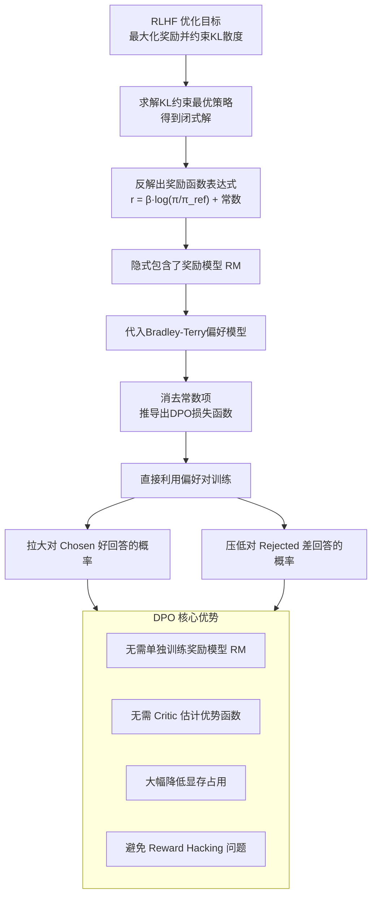
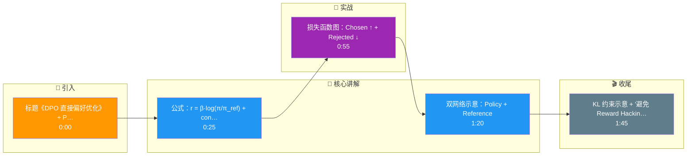

# DPO的数学推导核心是什么?为什么能跳过奖励模型

- **DPO (Direct Preference Optimization) 核心:**

利用RLHF的闭式解,将奖励模型隐式地包含在策略模型中.

- **推导关键步骤:**
1. RLHF目标: max E[r(x,y)] - beta * KL(pi||pi_ref)
2. 最优策略闭式解可反解出奖励函数
3. 代入Bradley-Terry偏好模型
4. 得到**无需RM的损失函数**

- *L_DPO = -log sigma(beta * log(pi(y_w)/pi_ref(y_w)) - beta * log(pi(y_l)/pi_ref(y_l)))*

其中 y_w=偏好回答, y_l=不偏好回答

- **实战案例:**
在RLHF微调阶段，若训练数据中存在标注噪声（如两条回答质量相近），DPO模型容易出现"伪发散"（即只提高chosen的logits而不降低rejected的），实战中常需在损失函数中加入sigmoid的margin或对log-ratio进行clip来增强鲁棒性。

- **代码示例:**
```python
# PyTorch风格伪代码
def dpo_loss(policy_chosen_logps, policy_rejected_logps, ref_chosen_logps, ref_rejected_logps, beta):
    # 计算log策略比率
    log_pi_ratio = policy_chosen_logps - policy_rejected_logps
    log_ref_ratio = ref_chosen_logps - ref_rejected_logps
    # DPO核心隐式奖励差
    logits = beta * (log_pi_ratio - log_ref_ratio)
    # 简单的二元交叉熵损失
    loss = -F.logsigmoid(logits).mean()
    return loss
```

- **## 常见考点:**
1. DPO中的参考模型 pi_ref 有什么作用？如果不加会怎样？
2. beta (temperature) 参数如何调整？它对训练有何影响？
3. 相比PPO，DPO在处理长上下文时有哪些潜在劣势？

## 技术原理

DPO 的核心数学洞察是：RLHF 的最优策略本身就隐含了奖励函数，所以可以反向求解把 RM 消去。推导链条如下：

- **从 RLHF 目标到闭式解**：RLHF 优化 `max E[r(x,y)] - β·KL(π‖π_ref)`，即在最大化奖励的同时约束策略不偏离参考模型太远。这是一个带 KL 约束的凸优化问题，有闭式解：`π*(y|x) ∝ π_ref(y|x) · exp(r(x,y)/β)`。
- **反解奖励函数**：对闭式解两边取对数并移项，得到 `r(x,y) = β·log(π*(y|x)/π_ref(y|x)) + β·log Z(x)`。这一步是关键——它说明奖励函数可以用策略模型和参考模型的对数比显式表达，RM 被隐式包含在策略里了。
- **代入 Bradley-Terry 模型**：人类偏好服从 `P(y_w ≻ y_l) = σ(r(y_w) - r(y_l))`，把上一步的奖励表达式代入，奖励项中的 `Z(x)` 在做差时被消掉，得到纯策略形式的损失：`L = -log σ(β·log(π(y_w)/π_ref(y_w)) - β·log(π(y_l)/π_ref(y_l)))`。
- **为什么能跳过 RM**：传统 RLHF 需要先训练 RM 再用 PPO 优化策略（两阶段，需 Critic 估计 advantage）；DPO 把两阶段合一，直接用偏好对算 log-ratio 差值更新策略，省了 RM 和 Critic，显存占用大幅降低，还避开了 Reward Hacking（模型钻 RM 漏洞刷高分）。

## 注意事项

1. **参考模型 π_ref 不可省**：π_ref 用于计算 KL 散度约束，防止策略偏离过远导致退化。不加约束模型会无限制拉大 chosen/rejected 概率差，产生不可读的输出。
2. **beta 参数调节**：β 控制 KL 约束强度，β 大则约束强（策略接近参考模型，保守），β 小则约束弱（策略自由探索，激进）。通常 β=0.1 是起点，太小易过拟合偏好数据。
3. **标注噪声导致伪发散**：chosen 和 rejected 质量相近时，模型可能只抬 chosen 不压 rejected，实战中需在损失里加 margin 或对 log-ratio 做 clip 增强鲁棒性。
4. **长上下文劣势**：DPO 对长序列的对数概率计算更敏感，相比 PPO 在超长上下文场景下可能训练不稳定，需配合长度归一化。

## 对比表

| 维度 | PPO（传统 RLHF） | DPO | IPO | KTO |
|:---|:---|:---|:---|:---|
| **是否需 RM** | 需要（两阶段） | 不需要（隐式消去） | 不需要 | 不需要 |
| **是否需 Critic** | 需要 | 不需要 | 不需要 | 不需要 |
| **数据形式** | 偏好对 + 标量奖励 | Chosen/Rejected 对 | Chosen/Rejected 对 | 单条 + 好坏标签 |
| **Reward Hacking** | 易发 | 避免 | 避免 | 避免 |
| **显存占用** | 高（4 模型） | 低（2 模型） | 低 | 低 |
| **训练稳定性** | 差（PPO 敏感） | 好 | 更好（防过拟合） | 好 |

## 代码示例

```python
# DPO 训练完整流程（PyTorch 风格）
import torch
import torch.nn.functional as F

def compute_dpo_loss(policy_model, ref_model, batch, beta=0.1):
    """
    batch: {chosen_input_ids, rejected_input_ids, ...}
    policy_model: 当前训练的策略模型
    ref_model: 冻结的参考模型（防偏离过远）
    """
    # 1. 计算策略模型对 chosen/rejected 的对数概率
    policy_chosen_logps = compute_logps(policy_model, batch['chosen'])
    policy_rejected_logps = compute_logps(policy_model, batch['rejected'])

    # 2. 计算参考模型的对数概率（不更新梯度）
    with torch.no_grad():
        ref_chosen_logps = compute_logps(ref_model, batch['chosen'])
        ref_rejected_logps = compute_logps(ref_model, batch['rejected'])

    # 3. DPO 隐式奖励差（核心公式）
    pi_ratio = policy_chosen_logps - policy_rejected_logps
    ref_ratio = ref_chosen_logps - ref_rejected_logps
    logits = beta * (pi_ratio - ref_ratio)

    # 4. 二元交叉熵：拉大 chosen 与 rejected 的概率差
    loss = -F.logsigmoid(logits).mean()
    return loss

# 标注噪声鲁棒性：对 log-ratio 做 clip 防伪发散
logits = beta * torch.clamp(pi_ratio - ref_ratio, min=-5, max=5)
```

## 流程图



## 记忆要点

- DPO核心：利用RLHF最优策略闭式解，将Reward模型隐式消去
- 损失函数：基于Chosen和Rejected的Log-ratio差值，直接优化策略
- 优势：无需训练Critic和RM，显存占用低，避免Reward Hacking
- 参考模型作用：pi_ref用于计算KL散度约束，防止模型偏离过远

## 结构化回答

**30 秒电梯演讲：** DPO 是 RLHF 的简化版。它利用 RLHF 最优策略的闭式解，把显式的奖励模型数学上消掉了，只需要策略模型和参考模型两个网络，直接拿偏好对（Chosen/Rejected）算 Log-ratio 差值来更新策略。好处是省了 Critic 和 RM，显存占用低，还避开了 Reward Hacking。

**展开框架：**
1. **核心原理** — 从 RLHF 的 KL 约束最优解出发，推导出奖励 r(x,y) = β·log(π/π_ref) + 常数，于是显式 RM 被消去，偏好数据可直接用来优化策略。
2. **损失函数** — 基于 Chosen 和 Rejected 的对数概率比差值构造损失，让模型拉大对好答案的概率、压低对差答案的概率。
3. **参考模型的作用** — π_ref 用来计算 KL 散度，防止策略模型偏离参考模型过远，相当于一道隐式的安全护栏。

**收尾：** 一句话，DPO 把"打分老师"换成了"直接对比答案"。您想深入聊聊 DPO 的 beta 参数怎么调，还是 IPO、KTO 这些改进方向？

## 视频脚本

> 预计时长：2 分钟 | 由浅入深

| 时间 | 画面/字幕 | 口播台词 | 讲解要点 |
|------|----------|----------|----------|
| 0:00 | 标题《DPO 直接偏好优化》+ PPO vs DPO 流程对比图 | 传统的 PPO 像考完试找老师打分再改错，DPO 直接把正确答案和错误答案对比着改，省去了打分老师。 | 类比开场 |
| 0:25 | 公式：r = β·log(π/π_ref) + const | DPO 利用了 RLHF 最优策略的闭式解，把奖励模型在数学上消掉了，r 等于 beta 乘 log π 比 π_ref 加常数。 | 奖励隐式消去 |
| 0:55 | 损失函数图：Chosen ↑ + Rejected ↓ | 损失函数就是拿偏好对算 Log-ratio 差值，让好答案概率往上走，差答案概率往下压。 | 损失函数 |
| 1:20 | 双网络示意：Policy + Reference | 整个训练只需要策略模型和参考模型两个网络，不用 Critic，不用 RM，显存占用大幅降低。 | 双网络架构 |
| 1:45 | KL 约束示意 + "避免 Reward Hacking"标签 | 参考模型的作用是算 KL 散度，防止策略跑偏，同时也避免了 PPO 里常见的 Reward Hacking 问题。 | KL 约束与优势 |

### 视频流程图




