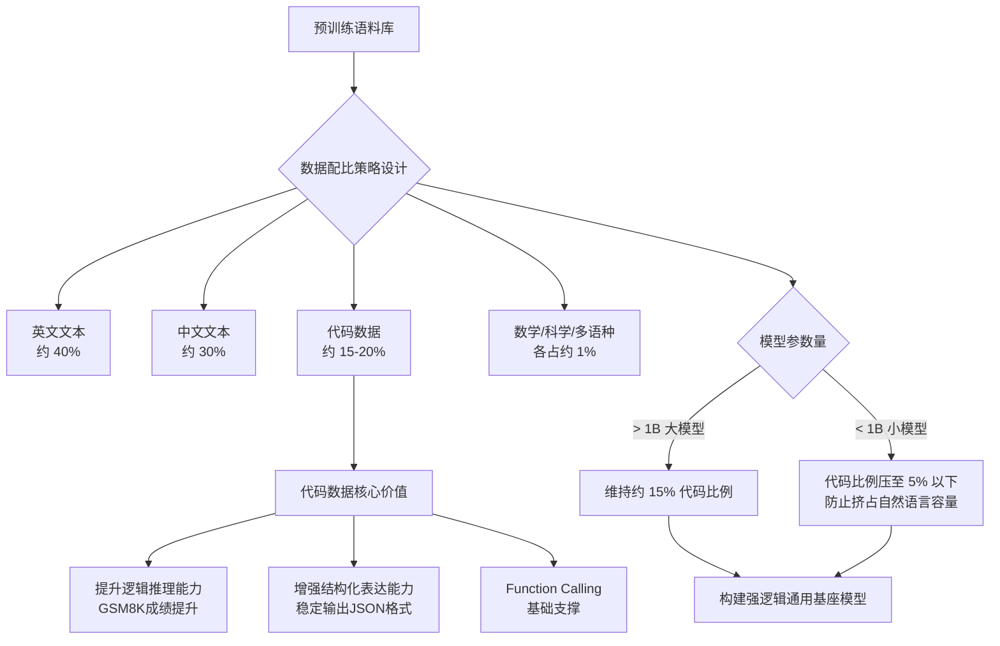
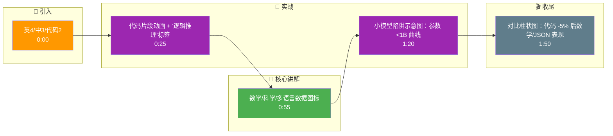

# 预训练数据配比如何设计?代码数据为什么重要

- **预训练数据配比策略:**

| 数据类型 | 推荐比例 | 作用 |
|---------|---------|------|
| 英文网页/书籍 | 35-45% | 通用知识、英文能力 |
| 中文网页/书籍 | 25-35% | 中文语言能力 |
| 代码 | 10-20% | **推理能力、结构化思维** |
| 数学/科学论文 | 5-10% | 逻辑推理 |
| 多语言 | 5-10% | 跨语言迁移 |

- **边界情况补充:**
  - **极小模型(<1B)**: 代码比例需适当降低（<5%）或完全移除，否则容易挤占自然语言的学习容量，导致语感变差。
  - **长窗口训练**: 若模型支持长Context（如32k+），需增加书籍/长文本数据的配比，避免模型只会处理短对话。
  - **代码去重**: 若未进行严格的代码去重，重复的Boilerplate代码（如自动生成的License头）会浪费训练算力。

- **为什么代码数据重要:**
1. **推理迁移** - 代码训练大幅提升数学和逻辑推理
2. **结构化表达** - 代码训练让模型更善于输出结构化内容
3. **工具使用** - 代码理解能力是Function Calling的基础
4. **实证:** Code LLaMA在数学和推理上远超同参数量的LLaMA

- **实战案例:**
在Qwen或DeepSeek的训练实践中，若将代码比例从10%降至5%，模型的GSM8K数学成绩通常会下降5%以上，且输出JSON格式的稳定性会显著变差，这证明了代码对于"思维链"和格式约束的基础性作用。

- **代码示例:**
```python
# 数据混配伪代码
from torch.utils.data import WeightedRandomSampler

# 假设有不同来源的dataset列表
datasets = [web_dataset, code_dataset, math_dataset]
# 权重对应配比：如代码权重设为 20, web设为 40
weights = [40.0, 20.0, 10.0] 

# 构建采样器，确保每个batch的数据来源符合预设配比
sampler = WeightedRandomSampler(weights, num_samples=10000, replacement=True)
dataloader = DataLoader(ConcatDataset(datasets), sampler=sampler)
```

- **## 面试追问:**
1. 在混合代码训练时，如何解决自然语言和代码在词表分布上的差异导致的学习不均衡问题？
2. 除了通用代码，是否需要针对特定领域（如SQL、LaTeX）进行额外的配比增强？这对逻辑推理有何影响？
3. 如果将代码比例提升到30%以上，模型的通用对话能力通常会出现什么现象？如何权衡？

- **## 易错点:**
1. **误区：认为代码仅用于生成代码**。实际上代码数据的核心价值在于提升逻辑推理和指令遵循能力，而非仅仅为了Code Generation任务。
2. **误区：直接复用开源配比**。不同架构的模型（如仅Decoder vs Encoder-Decoder）对代码数据的敏感度不同，需根据具体模型架构调整配比。

- **## 常见考点:**
1. 数据配比中的「教科书质量」具体指什么样的数据清洗标准？
2. 为什么数学数据不能完全替代代码数据来提升推理能力？
3. 预训练阶段代码数据的去重（如基于AST去重）为何很重要？

## 流程图



## 记忆要点

- 配比口诀：英中代码四三二，数科多语各占一
- 代码核心价值：提升推理与结构化表达，非仅为生成代码
- 小模型陷阱：参数<1B时代码比例需<5%，否则挤占语言容量
- 实战影响：代码比例降5%会导致数学成绩显著下降及JSON格式变差

## 结构化回答

**30 秒电梯演讲：** 预训练数据配比有个口诀：英中代码四三二，数科多语各占一。代码数据的真正价值不是让模型会写代码，而是提升逻辑推理和结构化表达能力，它是工具调用的基础。注意小模型有个坑：参数小于 1B 时代码比例必须压到 5% 以下，否则会挤占语言容量。

**展开框架：**
1. **配比口诀** — 英文、中文、代码大致按 4:3:2，数学、科学、多语言各占一份左右，做到中英均衡、覆盖通用知识。
2. **代码的核心价值** — 代码占比约 15%，它提升的是模型的逻辑推理和结构化表达能力，也是 Function Call、Agent 工具调用的基础，不是为了单纯生成代码。
3. **小模型陷阱与实战影响** — 参数小于 1B 时代码比例要压到 5% 以下；实战中代码比例降 5%，就会导致数学成绩显著下降、JSON 格式输出明显变差。

**收尾：** 一句话，代码数据是预训练里的"逻辑补脑丸"。您想深入聊聊数据去重的方法，还是怎么平衡数据量和质量？

## 视频脚本

> 预计时长：2 分钟 | 由浅入深

| 时间 | 画面/字幕 | 口播台词 | 讲解要点 |
|------|----------|----------|----------|
| 0:00 | 标题《预训练数据配比》+ 饼图：英4/中3/代码2 | 预训练数据配比有句口诀：英中代码四三二，数科多语各占一。 | 配比口诀 |
| 0:25 | 代码片段动画 + "逻辑推理"标签 | 很多人以为加代码是为了让模型写代码，其实不是。代码的真正价值是提升逻辑推理和结构化表达，它是工具调用的基础。 | 代码核心价值 |
| 0:55 | 数学/科学/多语言数据图标 | 除了英中代码，还得配数学、科学和多语言数据，各占一份左右，保证通用知识覆盖。 | 辅助数据 |
| 1:20 | 小模型陷阱示意图：参数 <1B 曲线 | 小模型有个坑：参数小于 1B 的时候，代码比例必须压到 5% 以下，否则会挤占语言容量，基础能力反而下降。 | 小模型陷阱 |
| 1:50 | 对比柱状图：代码 -5% 后数学/JSON 表现 | 实战影响很直接，代码比例降 5%，数学成绩显著下降，JSON 格式输出也明显变差。 | 实战影响 |

### 视频流程图




