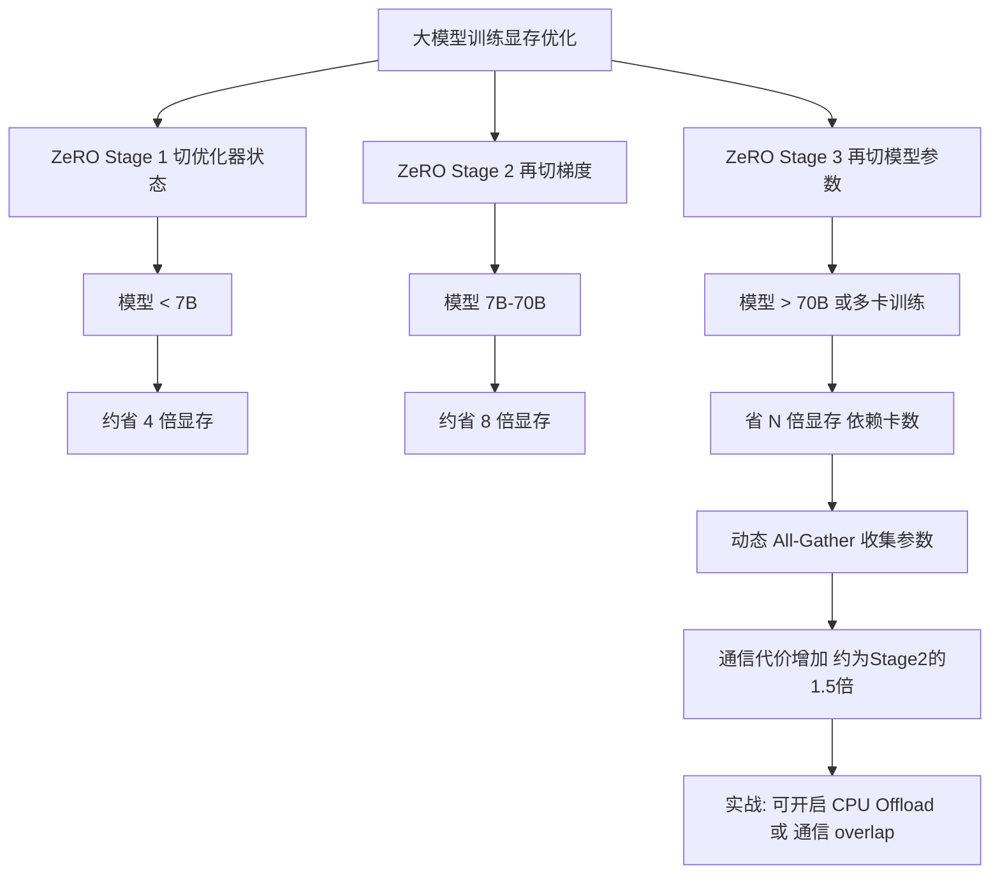

# ZeRO (Zero Redundancy Optimizer)的三级优化分别是什么?如何选择

- **ZeRO (Zero Redundancy Optimizer)三级优化:**

| 级别 | 切分对象 | 显存节省 | 通信量 |
|------|---------|---------|--------|
| ZeRO-1 (Os) | 优化器状态 | 4x | 与DP相同 |
| ZeRO-2 (Os+G) | + 梯度 | 8x | 略增 |
| ZeRO-3 (Os+G+P) | + 模型参数 | **~Nx** | **显著增加** |

- **ZeRO-3 (Add Parameter Partitioning) 架构:**
```
GPU 0:  [W0] [G0] [Os0]
GPU 1:  [W1] [G1] [Os1]
GPU 2:  [W2] [G2] [Os2]
GPU 3:  [W3] [G3] [Os3]
         │
         │ All-Gather (通信)
         ▼
  Forward Pass (临时聚合完整参数)
         │
         ▼
    Backward Pass
```
- 模型参数也切分,每张卡只存1/N
- 前向/反向时动态All-Gather收集参数
- 适合:**超大模型(>70B)或多卡训练**
- 代价:通信量约为ZeRO-2的1.5倍

- **边界情况补充:**
  - **微调场景**: LoRA微调时，由于大部分参数冻结，通常ZeRO-2已经足够，不需要强制使用ZeRO-3，因为ZeRO-3的通信开销可能导致整体速度下降。
  - **推理场景**: ZeRO-3推理通常比Tensor Parallelism (TP)慢，除非是生成式任务且Batch Size非常小（为了极致的显存节省）。
  - **CPU Offload瓶颈**: 开启CPU Offload虽然省显存，但如果PCIe带宽低（如PCIe 3.0），训练速度可能下降至原来的1/5。

- **实战案例:**
在使用DeepSpeed ZeRO-3训练70B模型时，若遇到显存刚好装下但训练速度极慢的情况，通常是因为`bucket_size`配置过小导致All-Gather通信过于频繁；调大`bucket_size`或开启通信 overlap 可以显著提升MFU。

- **代码示例:**
```python
# DeepSpeed配置文件 (ZeRO-3 Offload)
{
    "bf16": { "enabled": true },
    "zero_optimization": {
        "stage": 3,
        "offload_param": { "device": "cpu" },  # 关键：参数卸载到CPU以省显存
        "offload_optimizer": { "device": "cpu" },
        "stage3_prefetch_bucket_size": 5e8,
        "stage3_param_persistence_threshold": 1e6 # 小参数不切分，减少通信
    }
}
```

- **选择建议:**
- 模型<7B: ZeRO-1或纯DP
- 模型7B-70B: ZeRO-2
- 模型>70B: ZeRO-3 + CPU Offload

- **## 面试追问:**
1. ZeRO-3的All-Gather在前向传播时是同步的还是异步的？如何配置能最大化掩盖通信延迟？
2. 在异构集群（如部分机器有A100，部分有A800）中，ZeRO的配置需要注意什么？
3. 如何监控ZeRO-3训练过程中的通信饱和度？如果发现通信是瓶颈，有哪些参数可以调优？

- **## 易错点:**
1. **误区：ZeRO-3一定比ZeRO-2好**。ZeRO-3引入了大量通信小包，在网络带宽不足（如千兆网卡）的集群中，性能可能远不如ZeRO-2。
2. **误区：Offload一定开启**。在显存足够的情况下，开启Offload会严重拖慢训练速度，应仅作为OOM时的应急手段。

- **## 常见考点:**
1. ZeRO-3在推理时如何避免频繁的All-Gather导致延迟高？
2. ZeRO-Offload 是如何利用CPU内存和NVLink/PCIe带宽的？
3. 相比FSDP (Fully Sharded Data Parallel)，ZeRO有哪些异同？

## 流程图



## 记忆要点

- ZeRO三级切分：Stage1切状态，Stage2切梯度，Stage3切参数
- 显存节省：Stage1省4倍，Stage2省8倍，Stage3省N倍
- 通信代价：Stage3需频繁All-Gather，通信量约为Stage2的1.5倍
- 选择策略：<7B用Stage1，7-70B用Stage2，>70B用Stage3

## 结构化回答

**30 秒电梯演讲：** ZeRO 是微软 DeepSpeed 提出的显存优化技术，核心是把训练状态切成三块分别放到多卡上：Stage 1 切优化器状态，Stage 2 再切梯度，Stage 3 把参数也切了。切得越细，能训的模型越大，但通信代价也越高，所以选型要按模型规模来。

**展开框架：**
1. **三级切分** — Stage 1 切优化器状态（如 Adam 的一阶/二阶矩），Stage 2 再切梯度，Stage 3 把模型参数也按卡切分，逐级释放显存。
2. **显存节省与通信代价** — Stage 1 省约 4 倍，Stage 2 省 8 倍，Stage 3 省到 N 倍（N 为卡数）；代价是 Stage 3 要频繁 All-Gather 重建参数，通信量约为 Stage 2 的 1.5 倍。
3. **选择策略** — 按规模选型：小于 7B 用 Stage 1，7 到 70B 用 Stage 2，大于 70B 的大模型才上 Stage 3，把通信开销换算成显存收益。

**收尾：** 一句话，ZeRO 用"众人合伙分摊"打破显存墙。您想深入聊聊 ZeRO-3 的通信开销怎么估算，还是它和 Tensor Parallelism 能不能同时用？

## 视频脚本

> 预计时长：2 分钟 | 由浅入深

| 时间 | 画面/字幕 | 口播台词 | 讲解要点 |
|------|----------|----------|----------|
| 0:00 | 标题《ZeRO 显存优化》+ 多人合伙买房示意图 | ZeRO 的思路像多人合伙买房，每人只出一份钱，共同拥有整套房子，把超大模型分摊到多张卡上。 | 类比开场 |
| 0:25 | 三级递进图：Stage1/2/3 切分对象 | 它分三级：Stage 1 切优化器状态，Stage 2 再切梯度，Stage 3 连参数也切了，切得越细，能训的模型越大。 | 三级切分 |
| 0:55 | 显存节省柱状图：4x/8x/Nx | 显存上，Stage 1 省约 4 倍，Stage 2 省 8 倍，Stage 3 能省到 N 倍，N 是卡数。 | 显存节省 |
| 1:25 | All-Gather 通信示意图 | 但天下没免费午餐，Stage 3 要频繁做 All-Gather 重建参数，通信量大概是 Stage 2 的 1.5 倍。 | 通信代价 |
| 1:50 | 选型决策树：<7B / 7-70B / >70B | 选型按规模来：小于 7B 用 Stage 1，7 到 70B 用 Stage 2，大于 70B 才上 Stage 3。 | 选择策略 |

