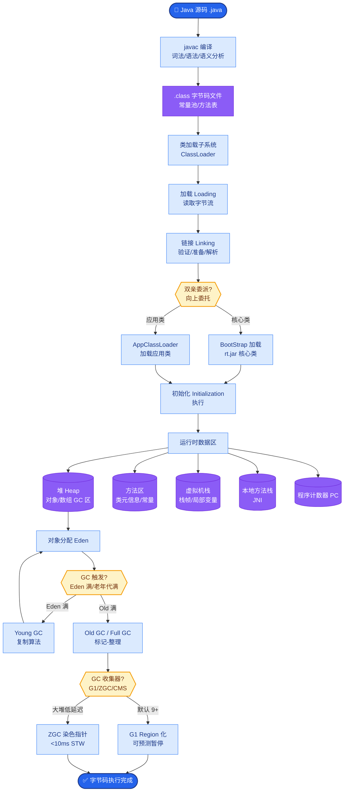
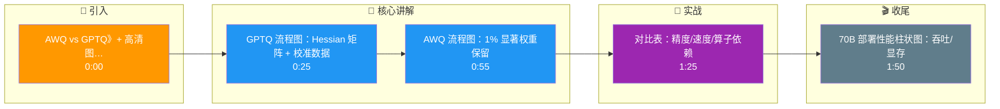

# 模型量化的主要方法有哪些?GPTQ和AWQ的区别是什么

- **量化方法对比:**

| 方法 | 类型 | 精度损失 | 适用场景 | 推理速度 | 显存占用 |
|------|------|---------|------|---------|---------|
| RTN | 简单舍入 | 大 | 快速验证 | 快 | 低 |
| GPTQ | 后训练量化 | 小 | 通用部署 | 较慢(需反量化) | 低 |
| AWQ | 激活感知 | **极小** | 通用/长文本 | **快** | 低 |
| QLoRA(NF4) | 量化+微调 | **极小** | 显存受限训练 | 慢(训练态) | 极低 |

- **GPTQ (Post-Training Quantization):** 
  - **核心原理**: 逐层量化，基于"二阶信息"（Hessian对角线矩阵）指导权重舍入。通过将权重分块，利用Hessian矩阵的逆近似来计算最优的量化常数，使得量化后的权重对输出误差的影响最小。
  - **流程**: 校准数据输入 -> 计算Hessian对角线 -> 逐层更新权重 -> 量化。
  - **特点**: 在PTQ方法中精度较高，但在处理激活值极端情况时不如AWQ，且推理时需要特殊的反量化算子支持。

- **AWQ (Activation-aware Weight Quantization):** 
  - **核心发现**: 并非所有权重同等重要，仅**1%**的显著权重对模型性能起主导作用。这些权重通常对应于激活值较大的通道。
  - **核心机制**: 
    1. **基于激活幅度的重要性评估**: 保留激活值较大的通道不进行激进量化或保持FP16精度。
    2. **等价变换**: 将这一部分被保留的通道的缩放因子等价地转移到下一层的线性变换中（类似平滑），从而不改变模型输出。
  - **优势**: **不需要反向传播**（速度快，比GPTQ快数倍），INT4量化下精度损失极小，甚至接近FP16，且推理速度更快（无需特殊反量化内核，只需简单的缩放）。

- **实际应用:** vLLM默认支持AWQ，大部分开源模型提供GPTQ/AWQ量化版本。AWQ通常是多卡推理的首选。

- **架构流程 (AWQ 通道感知):**

```
Input Layer Output
  │      │        │
  ▼      ▼        ▼
┌─────┐┌──────┐┌─────┐
│  W  ││ Act  ││  X  │
└──┬──┘└───┬──┘└─────┘
   │       │     
   │    激活值大   
   │    (重要)    
   │       │       
   │   保持高精度   
   │       │       
   └──> 缩放转移 ──> 下一层 (X = s * W' * X)
```

- **实战案例:**
在某A100单卡部署70B模型时，FP16版本直接OOM。尝试INT4 GPTQ量化后虽能运行但推理耗时激增（因反量化Kernel开销）。切换至AWQ格式后，不仅显存占用降至40GB左右，且Token生成速度基本无损。

- **代码示例 (AutoGPTQ/AWQ加载):**
```python
from vllm import LLM, SamplingParams

# vLLM中直接加载AWQ量化模型，推理代码与FP16完全一致
# AWQ在底层自动处理了激活感知的缩放逻辑
llm = LLM(
    model="TheBloke/Llama-2-70B-AWQ",
    quantization="awq",  # 指定量化方式
    gpu_memory_utilization=0.9
)

sampling_params = SamplingParams(temperature=0.7, top_p=0.95)
outputs = llm.generate(["你好，请介绍一下量子物理。"], sampling_params)
```

- **## 常见考点**
  1. **GPTQ 为什么慢？**: GPTQ 每次推理需要做 Weight Dequantization（反量化），增加计算开销；而 AWQ 可以直接利用硬件的 INT4/INT8 Matmul 加速，通过 Per-channel Scaling 实现无缝衔接。
  2. **SmoothQuant vs AWQ**: SmoothQuant 是将激活值的难度迁移到权重上，实现全 INT8 量化；AWQ 是保留部分权重（通道）为 FP16 以保护精度，其余做 INT4。

- **## 边界情况**
  1. **小模型量化**: 在参数量小于7B的模型上使用AWQ时，保留部分FP16权重的比例可能对显存节省相对敏感，需精细调整Clipping阈值。
  2. **跨设备量化**: 在多机多卡推理中，需确保量化参数（Scale/Zero-point）在各卡间严格同步，否则会导致计算发散。

- **## 易错点**
  1. **校准数据集选择**: GPTQ/AWQ均依赖校准数据集。误用训练数据（而非代表性验证集）可能导致“数据泄露”式的虚高性能，实际泛化能力变差。
  2. **MoE架构量化**: 对混合专家模型量化时，仅量化专家层权重可能不足以控制显存，Router层和Attention层同样需要处理，且Expert Load Balancing可能因量化失真。

- **## 面试追问**
  1. AWQ保留1%显著权重的策略在MoE（混合专家）模型中是否适用？可能会遇到什么问题？
  2. 在极端低比特（如INT2或INT1）量化下，AWQ的Scaling机制是否会失效，为什么？
  3. 如果模型权重分布本身非常平滑（如经过深度平滑SmoothQuant），AWQ基于激活幅度的策略还能否准确找到重要权重？

## 核心流程图



## 记忆要点

- GPTQ原理：基于Hessian二阶信息的后训练量化，精度高但推理慢
- AWQ原理：保留1%显著权重（激活感知），无需反量化，速度快
- 对比：AWQ在INT4下精度损失极小且推理更快，GPTQ需特殊算子
- 实战：70B模型部署AWQ比GPTQ吞吐量更高且显存占用低

## 结构化回答

**30 秒电梯演讲：** 量化是把高清模型压成普通画质，但重点区域保持清晰。两大主流：GPTQ 基于 Hessian 二阶信息做后训练量化，精度高但推理偏慢；AWQ 保留 1% 显著权重做激活感知量化，无需反量化、速度快。INT4 量化是推理主流，70B 模型部署 AWQ 比 GPTQ 吞吐更高、显存更低。

**展开框架：**
1. **GPTQ 原理** — 基于 Hessian 二阶信息的后训练量化，逐层用校准数据估计权重重要性，精度高，但推理依赖特殊算子，速度偏慢。
2. **AWQ 原理** — 激活感知量化，保留约 1% 显著权重不量化，其余权重量化，无需运行时反量化，速度快、显存友好。
3. **对比与实战** — AWQ 在 INT4 下精度损失极小且推理更快，GPTQ 需要特殊算子支持；实战中 70B 模型部署 AWQ 的吞吐量和显存表现都优于 GPTQ。

**收尾：** 一句话，推理部署首选 AWQ INT4。您想深入聊聊 INT4 量化对推理速度的提升幅度，还是量化后怎么恢复精度损失？

## 视频脚本

> 预计时长：2 分钟 | 由浅入深

| 时间 | 画面/字幕 | 口播台词 | 讲解要点 |
|------|----------|----------|----------|
| 0:00 | 标题《模型量化：AWQ vs GPTQ》+ 高清图压缩类比 | 量化就像把高清图片压成普通画质，但重点区域保持清晰，人眼几乎看不出来。 | 类比开场 |
| 0:25 | GPTQ 流程图：Hessian 矩阵 + 校准数据 | GPTQ 基于 Hessian 二阶信息做后训练量化，逐层用校准数据估计权重重要性，精度高，但推理偏慢。 | GPTQ 原理 |
| 0:55 | AWQ 流程图：1% 显著权重保留 | AWQ 走激活感知路线，保留 1% 的显著权重不量化，其余压成 INT4，运行时无需反量化，速度快。 | AWQ 原理 |
| 1:25 | 对比表：精度/速度/算子依赖 | 对比下来，AWQ 在 INT4 下精度损失极小且推理更快，GPTQ 需要特殊算子支持。 | 横向对比 |
| 1:50 | 70B 部署性能柱状图：吞吐/显存 | 实战里，70B 模型部署 AWQ 比 GPTQ 吞吐量更高、显存占用更低，所以推理首选 AWQ。 | 实战结论 |

### 视频流程图




