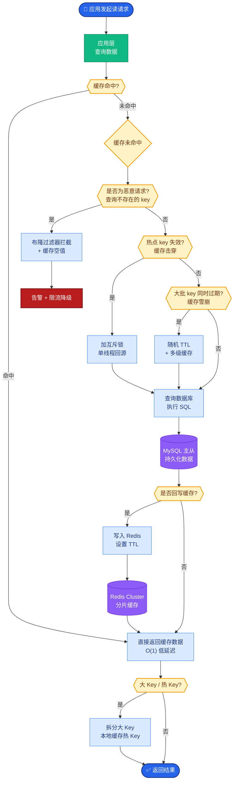

# vLLM的核心技术创新是什么?为什么比HuggingFace推理快10倍

- **vLLM三大核心创新:**

- **1. PagedAttention (KV Cache 管理)**
  - **痛点**: 传统推理将 KV Cache 存储在连续显存中，生成变长序列时不仅浪费预留空间，且频繁申请/释放内存导致碎片化，显存利用率极低（~20%）。
  - **解决方案**: 类似操作系统的虚拟内存分页管理。将 KV Cache 切分为固定大小的 Blocks（如 16 个 token），存储在非连续的显存块中。
  - **效果**: 消除显存碎片，按需分配，利用率提升至 ~96%，支持更大的 Batch Size。

- **2. Continuous Batching (连续批处理 / Iteration-level Scheduling)**
  - **痛点**: 静态 Batching 必须等 Batch 内最慢的 Sequence 生成结束才处理下一批，且中途无法插入新请求。
  - **解决方案**: 在 Decoder 的每个生成步结束后，动态检测已完成或暂停的请求，移除它们并插入新请求。
  - **效果**: 显著提高 GPU 占用率，吞吐量提升 **2-4倍**。

- **3. Prefix Caching (前缀缓存 / KV Cache 共享)**
  - **痛点**: 相同的 System Prompt 或 Prompt 前缀被重复计算和存储。
  - **解决方案**: 计算 Prompt 的 KV Cache 后存储在内存中，新请求若匹配前缀，直接复用 Block 物理内存（Copy-on-Write 机制）。
  - **效果**: 大幅降低 Prompt 阶段的延迟和显存占用。

- **PagedAttention 数据流图:**

```
GPU VRAM (非连续存储)
┌───────────────────────────────┐
│ ┌───┐ ┌───┐ ┌───┐ ┌───┐ ┌───┐ │
│ │B0 │ │B1 │ │B2 │ │B3 │ │B4 │ │  <- Free Blocks Pool
│ └───┘ └───┘ └───┘ └───┘ └───┘ │
└───────────────────────────────┘
           ▲         ▲
           │         │
    Logical Block 0  Logical Block 1
    (Seq A Head 0)  (Seq A Head 1)
    └──> KV Cache for Token 1-N
```

- **Continuous Batching 时序图:**

```
Time Step 1          Time Step 2          Time Step 3
┌─────────────┐      ┌─────────────┐      ┌─────────────┐
│ Request A   │      │ Request A   │      │ Request A   │
│ Request B   │ ───> │ Request C   │ ───> │ Request D   │ (New)
│ Request C   │      │ Request E   │ (New)│ Request B   │ (Paused)
└─────────────┘      └─────────────┘      └─────────────┘
  [GPU Batch]         [GPU Batch]           [GPU Batch]
```

- **性能对比:** LLaMA-7B (A100): HF Pipeline ~5 tok/s -> vLLM ~50 tok/s = **10x加速**

- **实战案例:**
在线客服系统高峰期并发QPS从50突增至500，HuggingFace Transformers服务因排队延迟直接熔断（响应>10s）。切换至vLLM后，在相同硬件（4x A10G）下成功抗住流量，P99延迟稳定在2s以内。

- **代码示例 (vLLM Offline Inference):**
```python
from vllm import LLM, SamplingParams

# 初始化LLM引擎，启用块管理
def init_llm_engine():
    llm = LLM(
        model="meta-llama/Llama-2-7b-hf",
        tensor_parallel_size=1,
        gpu_memory_utilization=0.9,
        max_model_len=4096,
        enable_prefix_caching=True  # 显式启用前缀缓存
    )
    return llm
```

- **## 边界情况**
  1. **Prefill阶段瓶颈**: 在Prompt极长（如32k+）的场景下，Compute Bound的Prefill阶段可能成为瓶颈，此时PagedAttention带来的显存优化收益会递减，需关注显存带宽。
  2. **块大小选择**: Block Size过小会增加管理开销；过大则会导致内碎片。例如对于平均生成长度为100的请求，设置为16可能比32或64更合适。

- **## 易错点**
  1. **投机采样兼容性**: 开启Speculative Decoding（投机采样）时，KV Cache的管理逻辑更为复杂，vLLM需同时维护主模型和Draft模型的Block表，易误解为简单的PagedAttention加倍。
  2. **预填充与解码分离**: vLLM虽然统一了调度，但在底层实现上Prefill和Decoding往往使用不同的Kernel。误以为Continuous Batching能将Prefill和Decoding任务无缝混合在同一步迭代中是错误的，它们通常在同一Iteration内并行但计算图不同。

- **## 面试追问**
  1. vLLM的PagedAttention是如何处理多模态输入（如Vision Transformer的Feature Map）的KV Cache形状差异的？
  2. 在极高并发下，vLLM的Scheduler调度开销是否会成为新的瓶颈？如果是，有哪些优化思路（如分离CUDA Graph）？
  3. 相比于TGI（Text Generation Inference），vLLM的迭代级调度在处理长尾延迟请求时有何不同？


## 核心流程图



## 记忆要点

- PagedAttention：KV Cache分块存储，消除显存碎片，利用率升至96%
- Continuous Batching：动态调度请求，移除暂停/完成并插入新任务
- Prefix Caching：复用System Prompt等前缀计算，降低首字延迟
- 效果：相比HuggingFace吞吐量提升10倍（50 vs 5 tok/s）

## 结构化回答

**30 秒电梯演讲：** vLLM 之所以快，靠三件套：PagedAttention 借操作系统的分页管理，把 KV Cache 分块存储，消除显存碎片，利用率升到 96%；Continuous Batching 像餐厅动态拼桌，随时移除完成的请求、插入新任务；再加上 Prefix Caching 复用系统提示词等前缀计算，整体相比 HuggingFace 吞吐量提升 10 倍。

**展开框架：**
1. **PagedAttention** — 借鉴操作系统分页管理，把 KV Cache 按固定大小的 Block 分块存储，消除显存碎片，显存利用率从约 60% 升到 96%，支持变长序列。
2. **Continuous Batching** — 动态批处理，请求一完成或等待就立刻移出，新请求动态插入，避免传统 Static Batching 里的"等最慢请求"问题。
3. **Prefix Caching 与效果** — 复用 System Prompt 等公共前缀的 KV 计算，降低首字延迟；整体相比 HuggingFace 吞吐量提升约 10 倍（50 vs 5 tok/s）。

**收尾：** 一句话，vLLM 用系统工程把推理吞吐拉满。您想深入聊聊 PagedAttention 怎么处理变长序列，还是 Prefix Caching 在什么场景效果最好？

## 视频脚本

> 预计时长：2 分钟 | 由浅入深

| 时间 | 画面/字幕 | 口播台词 | 讲解要点 |
|------|----------|----------|----------|
| 0:00 | 标题《vLLM 为何这么快》+ 餐厅动态拼桌漫画 | vLLM 快，靠的是三件套。先想象一个餐厅，服务员根据客人用餐节奏动态拼桌，不让空座位浪费。 | 类比开场 |
| 0:25 | PagedAttention 分块图：KV Cache 按 Block 存储 | 第一件是 PagedAttention，借操作系统的分页管理，把 KV Cache 分块存储，消除显存碎片，利用率升到 96%。 | PagedAttention |
| 0:55 | Continuous Batching 动画：请求动态进出 | 第二件是 Continuous Batching，动态调度请求，谁完成或等待就移出，新请求立刻插进来，不浪费算力。 | 连续批处理 |
| 1:25 | Prefix Caching 示意：System Prompt 复用 | 第三件是 Prefix Caching，复用 System Prompt 等公共前缀的计算结果，降低首字延迟。 | 前缀缓存 |
| 1:50 | 吞吐对比柱状图：50 vs 5 tok/s | 三件套合起来，相比 HuggingFace 吞吐量提升约 10 倍，从 5 涨到 50 个 token 每秒。 | 效果数据 |

