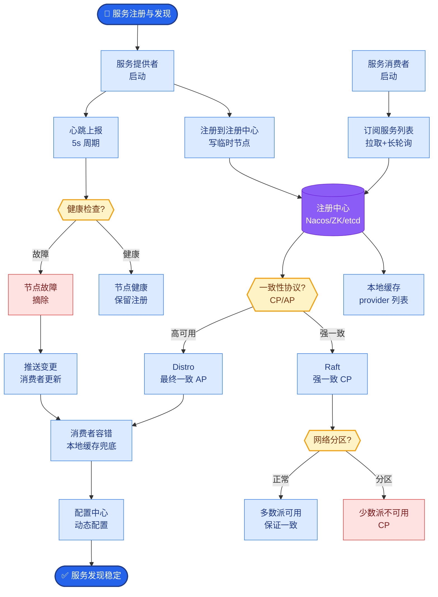
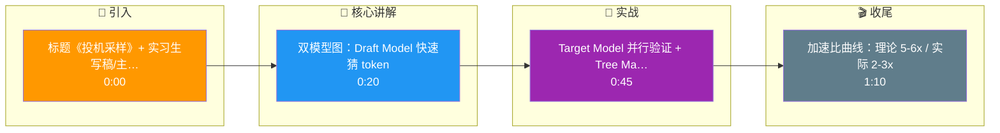

# Speculative Decoding的原理是什么?为什么能加速2-3倍

- **核心思想:** 用小模型(草稿模型)快速生成候选token,大模型批量验证.

- **流程详解:**
1. 小模型自回归生成 $k$ 个token (快)
2. 将这 $k$ 个token 并行输入大模型进行一次前向传播
3. **验证阶段:** 大模型并行计算 $k$ 个位置的概率。对于每个位置 $i$，检查小模型生成的 token 是否属于大模型预测的 Top-K 集合。
4. 如果小模型猜对了（在Top-K内），直接采纳；否则，丢弃该位置及之后的所有token，最后正确的那个位置作为新的起点重新生成。

- **并行计算原理 (树掩码 Tree Masking):**
大模型在验证时并非简单的预测下一个token，而是处理整个序列。为了利用并行计算，需要使用特殊的 Attention Mask (如 TGGraph 中的 Tree Mask)，使得在计算第 $t+i$ 个位置的 Loss 时，只能 Attention 到 $t+i$ 及之前的 token，从而允许 GPU 并行计算这 $k$ 个位置的输出概率。

```text
时间轴 T:   0  1  2  3  4  5  6  ...
大模型状态: S--S--S--S--S (实际执行前向传播)

步骤: 草稿 (小模型)
      A -> B -> C -> D  (串行生成4个token)

步骤: 验证 (大模型 - 1次前向传播)
输入: [A, B, C, D]
掩码:
┌───┬───┬───┬───┐
│ A │   │   │   │  Pos 0: A 的验证 (看 A)
├───┼───┼───┼───┤
│ A │ B │   │   │  Pos 1: B 的验证 (看 A,B)
├───┼───┼───┼───┤
│ A │ B │ C │   │  Pos 2: C 的验证 (看 A,B,C)
├───┼───┼───┼───┤
│ A │ B │ C │ D │  Pos 3: D 的验证 (看 A,B,C,D)
└───┴───┴───┴───┘
结果: A(OK), B(OK), C(Err) -> 保留 A,B, 从 B 重新开始草稿
```

- **加速比公式:**
$$ Speedup = \frac{1}{(1 - \alpha) + \alpha / k} $$
其中 $\alpha$ 是小模型与大模型参数量的比值（例如 1B vs 70B，则 $\alpha \approx 1/70$），$k$ 是每次验证的 token 数。实际上加速效果受限于**接受率**，即大模型接受小模型预测的概率。

- **Medusa改进:** 不用单独草稿模型，在大模型输出层增加多个解码头，每个 head 预测未来不同步长的 token，无需外部小模型，推理时同样使用树状注意力并行验证。

- **加速效果:** 理论上可达 $5\sim\textbf{6x}$ (在 $k$ 较大且接受率高时)，实际生产中通常稳定在 **2-3x**。

- **实战案例:** 在工程落地中，如果大模型开启 Temperature > 0，采样随机性会导致小模型猜测命中率显著下降，此时 Speculative Decoding 几乎无效。**经验解法**：验证阶段使用 Greedy (Top-1) 验证，但在最终输出 token 时再应用采样逻辑，或采用 Medusa 结构以获得更好的校准性。

- **代码示例 (PyTorch Mask逻辑):**
```python
# 生成 Tree Attention Mask 用于 Speculative Decoding
# draft_tokens: [batch, k] 小模型生成的 k 个候选
def get_tree_mask(batch_size, seq_len, k):
    # 简化的下三角矩阵，允许并行验证
    mask = torch.tril(torch.ones(seq_len + k, seq_len + k))
    # 实际 TGGraph 或 vLLM 中需要构建特殊的树形依赖图
    # 这里仅示意：每个位置只能看之前的草稿路径
    return mask.unsqueeze(0).expand(batch_size, -1, -1)
```

- **## 常见考点**
1. **接受率与 Speculation Number ($k$) 的关系**：$k$ 越大吞吐越高，但接受率通常会下降，如何平衡？(一般 $k=5\sim10$)
2. **Tree Attention 的具体实现**：如何在 CUDA Kernel 层面高效实现 Tree Mask 以避免显存碎片？
3. **非自回归模型的区别**：Speculative Decoding 本质上还是自回归的，只是利用了并行验证，这与完全非自回归（如 Non-Autoregressive Transformer）有何本质不同？

## 核心流程图



## 记忆要点

- 核心思想：小模型快速草稿，大模型并行验证
- 加速原理：将串行生成转为并行验证，利用Tree Masking
- 加速比：理论5-6x，实际2-3x，受接受率限制
- 实战：开启Temperature会降低命中率，建议验证用Greedy

## 结构化回答

**30 秒电梯演讲：** 投机采样像实习生先写好初稿、主编一次性批量审阅，比主编逐字写快得多。小模型（Draft Model）快速猜几个 token，大模型（Target Model）并行验证，用 Tree Masking 把串行自回归变成并行验证。理论加速 5 到 6 倍，实际 2 到 3 倍，瓶颈是猜测接受率。

**展开框架：**
1. **核心思想** — 小模型（Draft）快速生成若干候选 token，大模型（Target）一次性并行验证这批 token，把串行的逐 token 生成变成并行批处理。
2. **加速原理** — 利用 Tree Masking 让大模型一次前向就能验证多个候选；命中就接受、不命中就从断点重算，平均代价远低于逐 token 生成。
3. **加速比与实战** — 理论 5 到 6 倍，实际 2 到 3 倍，受接受率限制；Medusa 用多头替代小模型，Eagle 进一步优化。注意开启 Temperature 会降低命中率，验证阶段建议用 Greedy。

**收尾：** 一句话，投机采样用"并行验证"换"串行生成"。您想深入聊聊草稿模型怎么选，还是 Eagle 和 Medusa 有什么区别？

## 视频脚本

> 预计时长：1 分 30 秒 | 由浅入深

| 时间 | 画面/字幕 | 口播台词 | 讲解要点 |
|------|----------|----------|----------|
| 0:00 | 标题《投机采样》+ 实习生写稿/主编审阅漫画 | 投机采样像实习生先写好初稿，主编一次性批量审阅，比主编逐字写快得多。 | 类比开场 |
| 0:20 | 双模型图：Draft Model 快速猜 token | 小模型快速猜几个 token 作为草稿，成本很低，速度很快。 | Draft 草稿 |
| 0:45 | Target Model 并行验证 + Tree Masking | 大模型一次性并行验证这批 token，用 Tree Masking 一次前向搞定，命中就接受，不命中从断点重算。 | 并行验证 |
| 1:10 | 加速比曲线：理论 5-6x / 实际 2-3x | 理论能加速 5 到 6 倍，实际 2 到 3 倍，瓶颈是猜测接受率。实战里开 Temperature 会降低命中率，验证阶段建议用 Greedy。 | 加速比与实战 |

### 视频流程图




