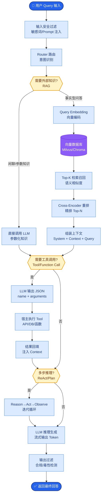

# 对比常见解码策略:Greedy/Beam Search/Contrastive Search各自的优缺点

- **Greedy Search (贪婪搜索)**
  - **原理**：每一步选择概率最高的 token。
  - **优点**：计算速度快，确定性强。
  - **缺点**：容易陷入重复循环，缺乏多样性，可能漏掉全局最优序列（如“The weather is nice”可能比“The weather is good”整体概率更高，但第一步greedy选了good）。

- **Beam Search (集束搜索)**
  - **原理**：每一步保留 Top-$k$ 个候选序列（beam width），直到结束。
  - **优点**：比 Greedy 找到更优序列的概率大，结果更稳定。
  - **缺点**：计算量大（$k$倍显存和算力）；容易生成通用的、平庸的废话；在开放域生成中往往不如 Sampling 灵活。
  - **参数**：`num_beams` (通常2-10)，`length_penalty` (惩罚过短或过长的序列)。

- **Contrastive Search (对比搜索)**
  - **原理**：结合概率模型和退化惩罚。选择下一个 token $x_t$，最大化 $p(x_t|context) - \alpha \cdot \max sim(v(x_t), v(x_{<t}))$。即在保证高概率的同时，选择与已生成序列相似度最低的 token，避免重复。
  - **优点**：解决了大模型生成中的“重复退化”问题，人类评估质量通常高于 Beam Search 和 Nucleus Sampling。
  - **参数**：`top_k` (候选集大小)，`alpha` (退化惩罚系数，通常0.5-0.7)。

- **Nucleus Sampling (Top-p 采样)**
  - **原理**：从累积概率达到 $p$ (如0.9) 的最小集合中随机采样。
  - **优点**：生成的文本多样性高，适合创意写作。
  - **缺点**：不可控，可能产生幻觉或逻辑断裂。

```text
策略选择决策树:
┌───────────────────┐
│   生成任务类型?   │
└─────────┬─────────┘
          │
   ┌──────┴──────┐
   │             │
   ▼             ▼
┌─────────┐  ┌──────────┐
│  事实性  │  │ 创意/对话 │
│  问答/翻译 │  │  (开放域) │
└────┬────┘  └─────┬────┘
     │             │
     ▼             ▼
┌─────────┐  ┌──────────┐
│Greedy/  │  │ Nucleus  │
│Contrast │  │ Sampling │
└─────────┘  └──────────┘
```

- **实战案例:** 在机器翻译任务中，使用 Beam Search 确实提升了 BLEU 分数，但在生成 RAG 回答时，Beam Search (width=4) 经常出现忽略 Prompt 指令、直接照抄检索原文的情况。**踩坑经验**：对于问答和摘要任务，优先尝试 `Contrastive Search` (top_k=4, alpha=0.6) 或 `Temperature=0.1` 的 Sampling，Beam Search 往往过于保守。

- **代码示例 (HuggingFace Contrastive Search):**
```python
# transformers 原生支持 Contrastive Search
output = model.generate(
    input_ids,
    max_new_tokens=256,
    do_sample=False, # 必须设为 False
    top_k=4,         # 候选集大小
    penalty_alpha=0.6 # 退化惩罚系数
)
```

- **对比表格 (解码策略核心指标):**

| 策略 | 多样性 | 事实准确性 | 重复率 | 计算开销 | 适用场景 |
| :--- | :--- | :--- | :--- | :--- | :--- |
| **Greedy** | 极低 | 高 | 高 | 最低 | 数学/代码/翻译 |
| **Beam Search** | 低 | 高 (相对) | 中 | 高 (Beam倍数) | 机器翻译/摘要 |
| **Nucleus (p=0.9)** | 高 | 中 | 低 | 低 | 创意写作/对话 |
| **Contrastive Search** | 中 | **极高** | **极低** | 中 (需算相似度) | **长文本生成/RAG** |

- **## 常见考点**
1. **为何 Beam Search 在人类评估中常不如 Sampling？**（因为 Beam Search 倾向于保守、高概率但“无聊”的文本）
2. **Contrastive Search 中 $\alpha$ 参数的作用**？($\alpha$ 过大导致不连贯，过小导致重复)
3. **Temperature 参数的影响**？（Temperature > 1 平滑概率分布增加随机性，< 1 尖锐分布使其更确定，接近0即变为Greedy）


## 核心流程图



## 记忆要点

- Greedy快但易陷入重复，Beam Search稳但易生成平庸废话，适合翻译/摘要。
- Contrastive Search结合概率与退化惩罚，解决重复问题，适合长文本/RAG，参数alpha通常0.5-0.7。
- Nucleus Sampling (Top-p) 随机采样，多样性高，适合创意写作，但可能产生幻觉。
- 决策口诀：事实问答用Contrastive，创意对话用Nucleus，机器翻译用Beam。

## 结构化回答

**30 秒电梯演讲：** 解码策略是在模型置信度和生成多样性之间找平衡。Greedy 最快但易重复；Beam Search 稳但易生成平庸废话，适合翻译摘要；Contrastive Search 结合概率和退化惩罚，专治重复，适合长文本和 RAG；Nucleus Sampling 多样性高，适合创意写作但有幻觉风险。口诀：事实用 Contrastive，创意用 Nucleus，翻译用 Beam。

**展开框架：**
1. **Greedy 与 Beam Search** — Greedy 每步取最大概率，快但易陷入重复；Beam Search 保留多条路径，质量稳但倾向生成平庸、安全的废话，适合翻译、摘要等结构化任务。
2. **Contrastive Search** — 结合模型概率与退化惩罚项，惩罚与已生成内容相似的 token，解决重复问题，参数 alpha 通常取 0.5 到 0.7，适合长文本和 RAG。
3. **Nucleus Sampling 与决策口诀** — Top-p 随机采样多样性高，适合创意写作但可能产生幻觉；决策口诀：事实问答用 Contrastive，创意对话用 Nucleus，机器翻译用 Beam。

**收尾：** 一句话，解码策略按任务类型选，没有万能解。您想深入聊聊 Beam Search 为什么在开放对话里效果不好，还是 do_sample 真假的区别？

## 视频脚本

> 预计时长：2 分钟 | 由浅入深

| 时间 | 画面/字幕 | 口播台词 | 讲解要点 |
|------|----------|----------|----------|
| 0:00 | 标题《解码策略选型》+ 写作文漫画：通顺又不重复 | 解码策略就像写作文，既要写得通顺、听老师的话，又不能一直重复同一句、要有新词。 | 类比开场 |
| 0:25 | Greedy vs Beam Search 路径图 | Greedy 每步取最大概率，快但易重复；Beam Search 保留多条路径，稳但容易生成平庸废话，适合翻译摘要。 | Greedy/Beam |
| 0:55 | Contrastive Search：概率 + 退化惩罚 | Contrastive Search 结合概率和退化惩罚，惩罚和已生成内容相似的 token，专治重复，适合长文本和 RAG，alpha 通常 0.5 到 0.7。 | Contrastive |
| 1:25 | Nucleus Sampling 随机采样动画 | Nucleus Sampling 即 Top-p 随机采样，多样性高，适合创意写作，但可能产生幻觉。 | Nucleus |
| 1:50 | 决策口诀三栏表：事实/创意/翻译 | 决策口诀：事实问答用 Contrastive，创意对话用 Nucleus，机器翻译用 Beam。 | 决策口诀 |

