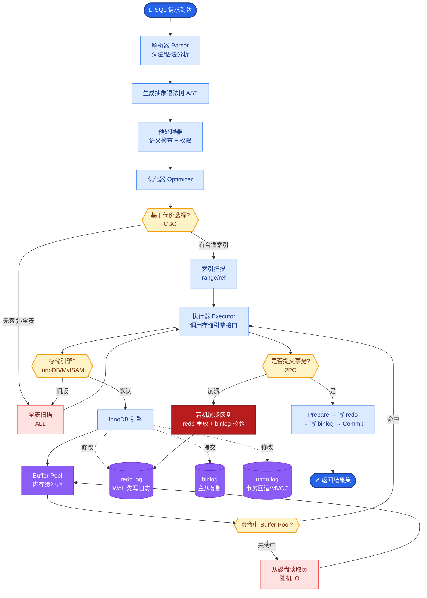

# RAG中的文档分块(Chunking)有哪些策略?如何选择最优策略

- **分块策略详解:**

| 策略 | 方法 | 优点 | 缺点 | 适用场景 |
| :--- | :--- | :--- | :--- | :--- |
| **固定长度** | 按 token/字符数切分 | 简单，实现容易 | 截断语义，破坏完整性 | 通用日志/数据 |
| **递归分割** | 按段落→句子→词递归尝试 | 尽量保留语义单元 | 仍是机械切割 | 通用文档 |
| **语义分块** | 计算句子 Embedding，在相似度骤降处断句 | **语义完整性极高** | 需额外推理开销，速度慢 | 高质量RAG/论文 |
| **结构化分块** | 按 Markdown 标题/代码块/XML标签 | **保留逻辑结构** | 依赖文档格式规范 | 技术文档/法律文书 |
| **父子分块** | 小块索引 + 大块生成 | **兼顾检索精度与上下文** | 存储冗余，链路复杂 | **生产系统首选** |

- **关键参数:**
- **chunk_size**: 一般 256-1024 tokens。OpenAI Embedding 模型通常建议 512-800。
- **overlap**: chunk_size 的 10%-20%。为了保持上下文连贯性，避免关键信息被切在边界。

- **进阶策略 - Parent-Child Chunking (父子索引):**
1. 文档按大尺寸切分 (Parent, e.g., 1024-2048 tokens)，保留完整语义。
2. 大块再切分成小块 (Child, e.g., 256 tokens)，用于索引。
3. **检索阶段**: 向量库搜索 Child chunk (粒度细，匹配精准)。
4. **生成阶段**: LLM 拿到对应的 Parent chunk (包含 Child 的上下文更丰富)，提升回答质量。

```text
原始文档:
┌─────────────────────────────────────────────────────────────────────┐
│ 这里是一段很长的技术文档...                                        │
│ ...解释了原理A，原理B，以及原理C...                                 │
│ ...并给出了关于实验结论的详细论述...                                 │
└─────────────────────────────────────────────────────────────────────┘
                            ↓
Parent Chunk (完整语义, 仅存取用)
┌───────────────────────────────┐
│ 原理A...原理B...原理C...      │ ◄── 传给 LLM
│ 实验结论详细论述...            │
└───────────────────────────────┘
          │              │              │
          ▼              ▼              ▼
    Child 1        Child 2         Child 3   (存入向量库检索)
  [原理A...]     [原理B...]      [原理C...]
```

- **实战案例:** 在做 PDF 技术手册问答时，使用简单的固定长度切分会导致代码块被截断，或者“表头”和“表格内容”被分到两个 Chunk，导致检索失效。**经验解法**：优先使用基于 Markdown 结构的递归分块，尽量将表格和代码块作为不可分割单元，或者对表格进行专门文本化描述后再存入向量库。

- **代码示例 (LlamaIndex 语义分块):**
```python
from llama_index.core.node_parser import SemanticSplitterNodeParser
from llama_index.embeddings.openai import OpenAIEmbedding

# 使用 Embedding 模型计算语义相似度，在边界处切分
embed_model = OpenAIEmbedding()
splitter = SemanticSplitterNodeParser(
    buffer_size=1, 
    breakpoint_percentile_threshold=95, # 相似度骤降阈值
    embed_model=embed_model
)
```

- **## 常见考点**
1. **Overlap 的副作用**：Overlap 会导致检索时同一个事实被多次包含，这是否会引起 LLM 的重复回答？(通常影响不大，但要注意)
2. **Small-to-Big 策略**：除了 Parent-Child，还有检索 Sentence 索引但返回 Window 的做法，这和 Parent-Child 的区别是什么？(Parent-Child 粒度更大，Sentence 2 Window 更灵活)
3. **RAG 中表格数据的处理**：上述文本分块策略对表格效果极差，如何处理？(需要将表格转为 Markdown 或 HTML 文本描述，或者使用多模态/专门的 Table Parsing)


## 核心流程图



## 记忆要点

- 固定/递归分块简单但易截断语义；语义分块质量高但慢；结构化分块保留逻辑。
- 最优策略：父子分块（Parent-Child），小块索引精准，大块生成上下文丰富。
- 关键参数：chunk_size通常512-800，overlap设为10%-20%保连贯。
- 实战：表格/代码块需特殊处理，避免截断；优先用Markdown结构切分。

## 结构化回答

**30 秒电梯演讲：** 分块是把长文档切成可检索的小卡片。固定/递归分块最简单但容易截断语义，语义分块质量高但慢，结构化分块能保留文档逻辑。最推荐的是父子分块（Parent-Child）：用小块做索引保证检索精准，命中后返回大块给 LLM 提供完整上下文。关键参数是 chunk_size 取 512 到 800，overlap 设 10% 到 20%。

**展开框架：**
1. **三种分块策略** — 固定/递归分块简单但易截断语义；语义分块用 embedding 相似度断句，质量高但慢；结构化分块按 Markdown 标题/段落切，保留文档逻辑。
2. **最优策略：父子分块** — 小块（Child）用于索引，检索精准；命中后返回其所属大块（Parent）给 LLM，上下文完整，兼顾精度与生成质量。
3. **关键参数与实战** — chunk_size 通常 512 到 800 token，overlap 设 10% 到 20% 防语义切断；表格、代码块需特殊处理避免截断，优先用 Markdown 结构切分。

**收尾：** 一句话，分块是 RAG 召回质量的地基。您想深入聊聊语义分块怎么实现，还是 Markdown 文档怎么结构化分块？

## 视频脚本

> 预计时长：2 分钟 | 由浅入深

| 时间 | 画面/字幕 | 口播台词 | 讲解要点 |
|------|----------|----------|----------|
| 0:00 | 标题《RAG 分块策略》+ 百科全书撕成卡片漫画 | 分块就像把百科全书撕成小卡片，每张卡片写上索引，方便快速抽取，再附上所属章节方便理解。 | 类比开场 |
| 0:25 | 三种策略对比图：固定/语义/结构化 | 三种主流分块：固定或递归分块简单但易截断语义，语义分块质量高但慢，结构化分块按 Markdown 标题切、保留逻辑。 | 三种策略 |
| 0:55 | 父子分块示意：小块索引 + 大块返回 | 最推荐父子分块：小块做索引保证检索精准，命中后返回它所属的大块给 LLM，上下文更完整。 | 父子分块 |
| 1:25 | 参数图：chunk_size 512-800 / overlap 10-20% | 关键参数：chunk_size 一般取 512 到 800，overlap 设 10% 到 20% 防止语义被切断。 | 关键参数 |
| 1:50 | 表格/代码块特殊处理示意图 | 实战注意：表格和代码块要特殊处理，不能从中间截断，优先用 Markdown 结构来切。 | 实战要点 |

