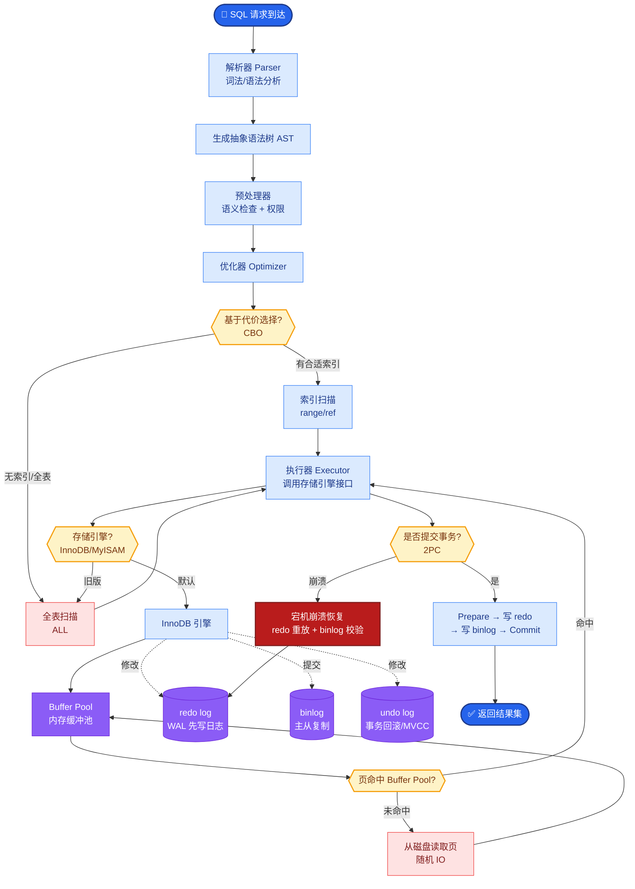

# 什么是混合检索(Hybrid Search)?BM25和向量检索如何融合

- **为什么需要混合检索:**

- **BM25(关键词检索):** 擅长精确匹配(产品名、人名、术语),但不理解语义
- **向量检索(语义检索):** 擅长语义相似,但精确匹配弱
- **混合 = 两者优势互补**

- **融合方法:**

1. **RRF (Reciprocal Rank Fusion):**
score = sum(1 / (k + rank_i))
- k通常取60
- 简单有效,不需要分数归一化
- **最常用**

2. **加权平均:**
score = alpha * norm(bm25_score) + (1-alpha) * norm(vector_score)
- 需要将两种分数归一化到[0,1]
- alpha通常0.5-0.7

- **架构流程:**

```text
┌─────────────┐
│   User Query│
└──────┬──────┘
       │
       ├──────────────────┐
       │                  │
       ▼                  ▼
┌──────────────┐   ┌──────────────┐
│ BM25 Search  │   │ Vector Search│
│ (Sparse)     │   │ (Dense)      │
└──────┬───────┘   └──────┬───────┘
       │                  │
       │     Top-K Docs    │
       ▼                  ▼
       └────────┬─────────┘
                │
                ▼
       ┌──────────────────┐
       │ Score Fusion     │
       │ (RRF / Weighted) │
       └────────┬─────────┘
                │
                ▼
       ┌──────────────────┐
       │ Final Ranked List│
       └──────────────────┘
```

- **实践:**
- Weaviate/Qdrant原生支持混合检索
- LangChain的EnsembleRetriever封装了RRF

- **实战案例:** 在某医疗问答项目中，用户查询“阿司匹林”。纯向量检索可能召回“止痛药”等语义相关但泛化的内容，混合检索通过BM25的强匹配能力，精准召回说明书中包含“阿司匹林”关键词的段落，解决了专业名词召回不准的问题。

- **代码示例:**
```python
from rank_bm25 import BM25Okapi
from sklearn.preprocessing import MinMaxScaler
import numpy as np

# 假设 bm25_scores 和 vector_scores 已获取
# 1. 归一化 (Min-Max)
scaler = MinMaxScaler()
bm25_norm = scaler.fit_transform(np.array(bm25_scores).reshape(-1, 1)).flatten()
vector_norm = scaler.fit_transform(np.array(vector_scores).reshape(-1, 1)).flatten()

# 2. 加权融合 (alpha=0.7偏向BM25)
alpha = 0.7
final_scores = alpha * bm25_norm + (1 - alpha) * vector_norm
```

- **对比表格:**

| 特性 | RRF (倒数排名融合) | 加权平均 | 纯向量/纯BM25 |
| :--- | :--- | :--- | :--- |
| **核心逻辑** | 基于排名倒数的求和 | 基于分数的线性加权 | 单一信号源 |
| **分数归一化** | **不需要** (对数值不敏感) | **必须** (需对齐量纲) | 不适用 |
| **鲁棒性** | 高 (抗分数波动) | 中 (受归一化参数影响) | 低 (单一短板) |
| **实现复杂度** | 低 | 中 (需调参alpha) | 最低 |
| **适用场景** | 通用型，分数分布不一致时 | 分数分布已知且可信时 | 数据特征极其单一时 |

## 常见考点
1. **为什么分数需要归一化？**
   - BM25分数范围通常在0-20+，向量余弦相似度在-1到1。直接加权会导致向量检索权重被淹没，必须归一化（如Min-Max或Sigmoid）。

2. **RRF中的参数k起什么作用？**
   - k控制排名对分数的影响程度。k越大，低排名的结果贡献越小。通常取值为60，是一个经验常数。

3. **混合检索在哪些场景下效果提升最明显？**
   - 专业术语多（如医疗、法律）、用户查询包含缩写、或需要同时处理语义和拼写错误的场景。


## 核心流程图



## 记忆要点

- 混合检索=BM25(精确匹配)+向量(语义匹配)，互补短板。
- 融合方法：RRF(倒数排名融合，无需归一化，最常用) 或 加权平均(需归一化)。
- RRF公式：sum(1/(k+rank))，k通常取60。
- 适用场景：专业术语多(医疗/法律)、包含缩写或需同时处理语义和拼写错误。

## 结构化回答

**30 秒电梯演讲：** 混合检索是 BM25 加向量检索，互补短板。BM25 擅长精确匹配专有名词，向量检索擅长语义理解。融合方法主流是 RRF（倒数排名融合），公式是对 1 除以 k 加 rank 求和，k 通常取 60，它的好处是无需对分数归一化。适合专业术语多、有缩写、或要同时处理语义和拼写错误的场景。

**展开框架：**
1. **互补逻辑** — BM25 基于词频做精确字符匹配，强在人名、术语、缩写；向量检索基于语义相似度，强在同义、改写；两者互补，单用任一个都有盲区。
2. **融合方法** — RRF（倒数排名融合）按排名而非分数融合，公式 sum(1/(k+rank))，k 常取 60，无需归一化、对分数尺度不敏感，所以最常用；加权平均需要归一化，调参更麻烦。
3. **适用场景** — 医疗法律等专业术语多、包含缩写、需同时处理语义理解和拼写错误的场景，混合检索明显优于单一方式。

**收尾：** 一句话，混合检索是 RAG 召回质量的标配。您想深入聊聊 RRF 为什么比加权平均更常用，还是 alpha 参数怎么定？

## 视频脚本

> 预计时长：2 分钟 | 由浅入深

| 时间 | 画面/字幕 | 口播台词 | 讲解要点 |
|------|----------|----------|----------|
| 0:00 | 标题《混合检索》+ 查字典漫画：目录索引 + 内容理解 | 混合检索像查字典，既看目录索引做关键词匹配，又看内容做语义理解，两头都不误。 | 类比开场 |
| 0:25 | BM25 vs 向量检索 对比图 | BM25 基于词频做精确匹配，强在人名、术语、缩写；向量检索基于语义相似度，强在同义改写。两者互补。 | 互补逻辑 |
| 0:55 | RRF 公式：sum(1/(k+rank))，k=60 | 融合方法主流是 RRF，倒数排名融合，公式是对 1 除以 k 加 rank 求和，k 通常取 60，好处是无需归一化分数。 | RRF 融合 |
| 1:25 | RRF vs 加权平均 对比 | 相比加权平均需要归一化、调参麻烦，RRF 按排名融合对分数尺度不敏感，所以最常用。 | 方法对比 |
| 1:50 | 适用场景图标：医疗/法律/缩写/拼写错误 | 适合专业术语多、有缩写、或要同时处理语义和拼写错误的场景，比如医疗、法律。 | 适用场景 |

