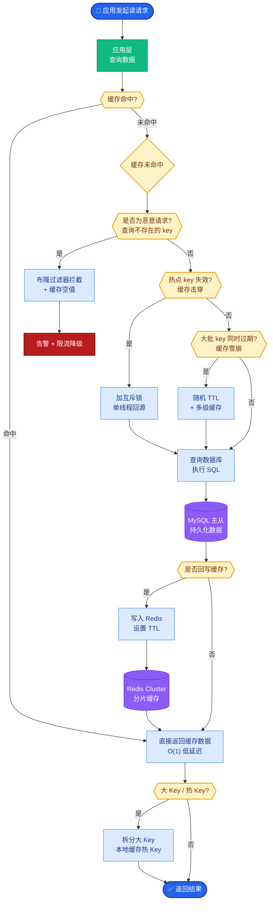

# RAG中为什么需要Reranker?Cross-Encoder和Bi-Encoder有什么区别

- **Reranker的作用:**
向量检索返回Top-K候选后,用Reranker精排,提升最终结果质量.

- **Bi-Encoder vs Cross-Encoder:**

| | Bi-Encoder | Cross-Encoder |
|--|-----------|---------------|
| 原理 | 分别编码Q和D,算余弦相似 | Q和D拼接后一起编码 |
| 速度 | **快**(可预计算) | 慢(每对都要推理) |
| 精度 | 中 | **高** |
| 角色 | **召回**(第一阶段) | **重排**(第二阶段) |

- **两阶段检索流程:**

```text
Query
 │
 ├──────────────────┐
 │                  │
 ▼                  ▼
┌──────────────┐
│ Phase 1:     │
│ Bi-Encoder   │
│ (Recall)     │
└──────┬───────┘
       │
       │ Returns Top-50 (Fast, Approx)
       ▼
┌──────────────┐
│ Phase 2:     │
│ Cross-Encoder│
│ (Rerank)     │
└──────┬───────┘
       │
       │ Returns Top-5 (Slow, Precise)
       ▼
    Answer
```

- **主流Reranker:**
- Cohere Rerank(API)
- BGE-Reranker(开源)
- Jina Reranker(开源)

- **实战案例:** 在电商搜索中，用户搜“适合跑步的轻便鞋”。向量检索召回了一批“运动鞋”，但混入了“篮球鞋”。引入BGE-Reranker后，通过深度理解“轻便”和“跑步”的交互特征，成功将篮球鞋的排名靠后，Top-1准确率提升了15%。

- **代码示例:**
```python
from FlagEmbedding import FlagReranker
# 使用 BGE-Reranker
reranker = FlagReranker('BAAI/bge-reranker-large', use_fp16=True)

# 假设 query 和 docs 是第一阶段召回的候选
candidate_pairs = [[query, doc] for doc in docs]

# 计算得分，分数越大相关性越高
scores = reranker.compute_score(candidate_pairs)

# 根据分数重排序
docs = [doc for _, doc in sorted(zip(scores, docs), key=lambda x: x[0], reverse=True)]
```

- **对比表格:**

| 维度 | Bi-Encoder (Dual-Encoder) | Cross-Encoder | 备注 |
| :--- | :--- | :--- | :--- |
| **输入形式** | Query 和 Doc 独立输入 | Query 和 Doc 拼接 (如 `[CLS] Q [SEP] D [SEP]`) | Cross-Encoder 在 Attention 层全交互 |
| **输出形式** | Embedding 向量 | 标量分数 (相似度) | Bi-Encoder 需额外计算 Cosine Sim |
| **计算复杂度** | O(1) (Doc 向量可缓存) | O(N) (每个 Q-D 对都要前向传播) | N 为候选文档数 |
| **适用阶段** | 粗排 | 精排 | 典型的“漏斗”模式 |
| **长文本处理** | 弱 (向量包含信息有限) | 强 (能处理更长的上下文交互) | 

## 常见考点
1. **为什么Cross-Encoder精度更高但速度慢？**
   - Cross-Encoder让Query和Doc在全连接层中充分交互（Self-Attention），能捕捉深层匹配信号，但无法预先计算Doc的Embedding，必须实时计算Q-D对。

2. **Reranker的输入规模如何控制？**
   - 通常只对第一阶段的Top-K（如Top-50或Top-100）进行重排，否则计算开销会随文档数量线性增长，无法在线使用。

3. **如何处理Reranker的长文本限制？**
   - 切片处理或只截取关键部分（如标题和首段）。部分模型（如BGE-large）支持更长的上下文窗口。


## 核心流程图



## 记忆要点

- Reranker用于召回后的精排，提升Top-K质量，弥补向量检索语义理解不足。
- Bi-Encoder独立编码速度快，用于召回；Cross-Encoder拼接交互精度高，用于重排。
- 流程：Bi-Encoder召回Top-50 -> Cross-Encoder精排Top-5。
- 代价：Cross-Encoder无法缓存向量，计算开销大，仅处理少量候选。

## 结构化回答

**30 秒电梯演讲：** 向量检索召回快但精度有限，Reranker 在召回后做精排，弥补语义理解不足。关键区别：Bi-Encoder 把 query 和 doc 各自独立编码，速度快、可缓存，用于海量召回；Cross-Encoder 把两者拼接后交互，精度高但无法缓存、计算贵，只用于少量精排。经典流程是 Bi-Encoder 召回 Top-50，Cross-Encoder 精排到 Top-5。

**展开框架：**
1. **为什么需要 Reranker** — 向量检索（Bi-Encoder）独立编码、用余弦相似度匹配，快但语义交互不充分，Top-K 里常混入表面相似但实际不相关的文档，需要精排过滤。
2. **Bi-Encoder vs Cross-Encoder** — Bi-Encoder 独立编码、可预计算缓存、速度快，用于召回；Cross-Encoder 把 query 和 doc 拼接后做深层 Attention 交互，精度高但每个 pair 都要算一次、无法缓存。
3. **经典流程与代价** — Bi-Encoder 召回 Top-50，Cross-Encoder 精排取 Top-5；代价是 Cross-Encoder 计算开销大，只处理少量候选，所以放在最后一步。

**收尾：** 一句话，先粗筛再精排，用计算换精度。您想深入聊聊 Cross-Encoder 为什么精度更高，还是怎么训练自定义 Reranker？

## 视频脚本

> 预计时长：2 分钟 | 由浅入深

| 时间 | 画面/字幕 | 口播台词 | 讲解要点 |
|------|----------|----------|----------|
| 0:00 | 标题《Reranker 精排》+ 图书馆选书漫画 | Reranker 像先在图书馆电脑搜到一批书，再把书拿在手里细读目录决定要哪几本，先粗筛再精排。 | 类比开场 |
| 0:25 | Bi-Encoder 示意：query/doc 独立编码 + 缓存 | Bi-Encoder 把 query 和 doc 各自独立编码，可以预计算缓存，速度快，用于海量召回。 | Bi-Encoder |
| 0:55 | Cross-Encoder 示意：拼接 + 深层交互 | Cross-Encoder 把 query 和 doc 拼一起做深层 Attention 交互，精度高，但每个 pair 都要算，无法缓存。 | Cross-Encoder |
| 1:25 | 经典流程图：召回 Top-50 → 精排 Top-5 | 经典流程：Bi-Encoder 召回 Top-50，Cross-Encoder 精排到 Top-5，兼顾速度和精度。 | 经典流程 |
| 1:50 | 代价提示：计算开销大，仅处理少量候选 | 代价是 Cross-Encoder 计算开销大，只能处理少量候选，所以放在流程最后一步。 | 代价与边界 |

