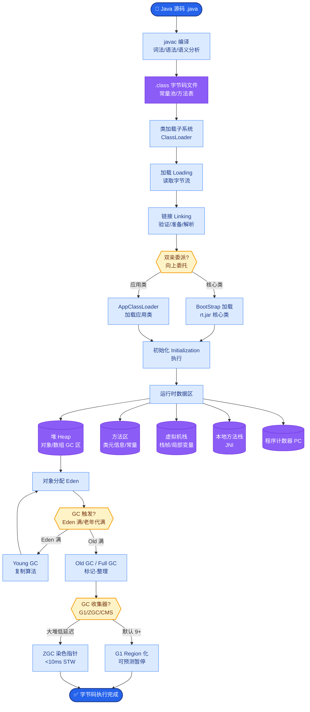

# RAG中的查询改写技术有哪些?HyDE和Step-Back Prompting分别解决什么问题

- **查询改写技术:**

- **1. Query Rewriting(查询改写):**
- 用LLM将用户模糊问题改写为更精确的检索查询
- 例:「怎么用那个东西」→「如何使用React Hooks」

- **2. HyDE (Hypothetical Document Embeddings):**
- 先让LLM生成一个假想答案
- 用假想答案的embedding去检索(而不是用原问题)
- 原理:答案比问题更接近目标文档的语义
- 效果:对于事实型问题检索质量大幅提升

- **3. Step-Back Prompting:**
- 将具体问题抽象为更宽泛的问题
- 例:「Google 2024 Q4收入」→「Google最近4个季度收入趋势」
- 先检索背景知识,再回答具体问题

- **4. Multi-Query:**
- 用LLM生成同一问题的多个变体
- 分别检索后取并集+去重+重排

- **架构对比:**

```text
Original Query: "iPhone 15 Pro Max 电池续航怎么样?"

┌─────────────────────────────────────────────────────┐
│ Strategy 1: HyDE                                     │
├─────────────────────────────────────────────────────┤
│ 1. LLM Gen: "根据测试,iPhone 15 Pro Max续航达29小时..."│
│ 2. Vector Search: [Fake Answer Embedding]            │
└─────────────────────────────────────────────────────┘

┌─────────────────────────────────────────────────────┐
│ Strategy 2: Multi-Query                              │
├─────────────────────────────────────────────────────┤
│ Gen Queries:                                         │
│ 1. "苹果15 Pro Max 电池测试数据"                      │
│ 2. "iPhone 15 Pro Max battery life review"          │
│ 3. "iPhone 15 PM 续航评测"                            │
│ -> Search All -> Merge -> Rerank                     │
└─────────────────────────────────────────────────────┘
```

- **实战案例:** 在金融RAG系统中，用户提问“最近美联储加息对房贷的影响”。直接检索容易召回零散新闻。使用HyDE生成包含“利率上升、按揭成本增加、房地产市场降温”等关键词的假设性回答后，向量检索召回了深度分析报告，相关性显著提升。

- **代码示例:**
```python
from langchain.prompts import PromptTemplate
from langchain_core.output_parsers import StrOutputParser

# HyDE 实现逻辑
def hyde_retrieval(query, llm, vector_store):
    # 1. 生成假设文档
    prompt = PromptTemplate.from_template(
        "Please write a passage to answer the question: {question}"
    )
    hyde_prompt = prompt.format(question=query)
    fake_doc = llm.predict(hyde_prompt) # LLM生成
    
    # 2. 使用假设文档进行检索
    docs = vector_store.similarity_search(fake_doc, k=5)
    return docs
```

- **对比表格:**

| 技术方案 | 核心思路 | 适用场景 | 缺点/成本 |
| :--- | :--- | :--- | :--- |
| Query Rewriting | 纠错、补全意图 | 用户表达不清、口语化 | 依赖LLM理解能力，可能改写偏差 |
| HyDE | 生成假设文档再检索 | 语义匹配难、专业领域问题 | 延迟增加（多一次LLM调用）；LLM如果“幻觉”严重，假设文档可能误导检索 |
| Step-Back | 抽象化/概念化 | 复杂推理、需要背景知识 | 可能过度泛化，丢失细节 |
| Multi-Query | 多路召回 | 语义模糊、多意图问题 | 检索成本倍增（N倍查询量）；需处理结果合并冲突 |

- **## 易错点**
1. **HyDE并非万能**：对于事实极其精确的查询（如身份证号、特定代码），生成的假设文档如果包含错误信息，反而会降低检索精度。此时直接关键词搜索或混合检索更优。
2. **混淆改写与扩写**：查询改写应保持原意，仅仅优化表达。如果改写引入了用户未提及的新实体（例如将“感冒吃什么药”改写为“感冒吃什么抗生素”），会改变检索方向导致错误。

- **## 面试追问**
1. 如果用户问题是多轮对话中的上下文省略句（如“它多少钱？”），直接用HyDE会怎样？应该如何处理？（需结合对话历史进行查询去指代化，再进行HyDE）
2. Multi-Query生成多个查询后，如何合并检索结果？是简单的取并集，还是需要根据与原问题的相关性进行重排？（通常需要Reranker，如Cross-Encoder进行精排）
3. HyDE生成的假设文档如果与事实相反（负向问题），如何防止检索到错误内容？（可以在Prompt中约束“即使假设，也请基于正向知识生成”或使用对比检索技术）


## 核心流程图



## 记忆要点

- HyDE：生成假设答案，用答案Embedding检索，解决语义匹配难的问题。
- Step-Back：将具体问题抽象化，先检索背景知识，适合复杂推理。
- Multi-Query：生成多个问题变体，多路召回并融合，适合语义模糊。
- 注意：HyDE对精确事实查询(如ID号)可能因幻觉误导，需慎用。

## 结构化回答

**30 秒电梯演讲：** 用户提问往往模糊、信息不全，直接检索容易漏。Query 改写有三招：HyDE 让 LLM 先生成一个假设答案，用答案的 embedding 去反搜，语义更准；Step-Back 把具体问题抽象化，先查背景知识再答细节；Multi-Query 生成多个问题变体，多路召回再融合。注意 HyDE 对精确事实查询可能因幻觉误导，要慎用。

**展开框架：**
1. **HyDE（假设答案检索）** — 先让 LLM 生成一个假设性答案，用答案的 embedding 检索文档，因为"答案和文档"比"问题和文档"语义更接近，解决 query-doc 语义鸿沟。
2. **Step-Back Prompting** — 把具体问题抽象成更宽泛的背景问题，先检索背景知识，再回答细节，适合复杂推理和多跳场景。
3. **Multi-Query** — 用 LLM 把一个问题改写成多个语义变体，多路并行召回后融合（如 RRF），防止单一表述遗漏相关文档。

**收尾：** 一句话，Query 改写是把"随便来点好吃的"翻译成具体菜名。您想深入聊聊 HyDE 在什么场景效果最好，还是 Multi-Query 会增加多少延迟？

## 视频脚本

> 预计时长：2 分钟 | 由浅入深

| 时间 | 画面/字幕 | 口播台词 | 讲解要点 |
|------|----------|----------|----------|
| 0:00 | 标题《Query 改写三招》+ 点菜翻译漫画 | 用户提问常像"随便来点好吃的"，Query 改写就是把它翻译成具体的"宫保鸡丁"，检索系统才好做。 | 类比开场 |
| 0:25 | HyDE 流程：问题 → 假设答案 → embedding 检索 | 第一招 HyDE：让 LLM 先生成假设答案，用答案的 embedding 去检索，因为答案和文档语义更接近。 | HyDE |
| 0:55 | Step-Back 示意：具体问题 → 抽象背景 | 第二招 Step-Back：把具体问题抽象化，先检索背景知识，再回答细节，适合复杂推理。 | Step-Back |
| 1:25 | Multi-Query 示意：多路变体召回 + 融合 | 第三招 Multi-Query：生成多个问题变体，多路召回再融合，防止单一表述遗漏相关文档。 | Multi-Query |
| 1:50 | 警告图标：HyDE 对精确事实查询慎用 | 注意 HyDE 对精确事实查询，比如 ID 号，可能因为幻觉误导检索，这类场景要慎用。 | 使用边界 |

