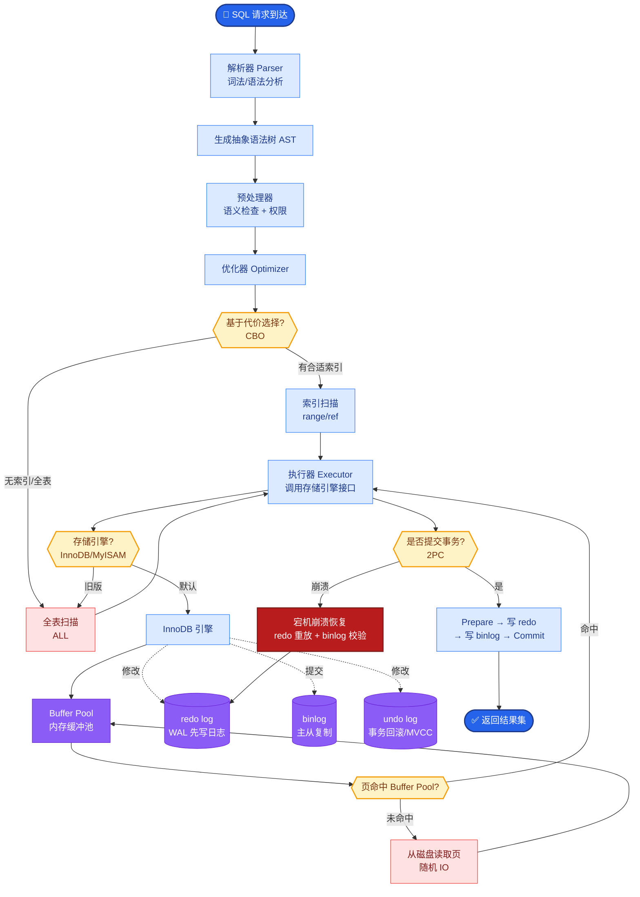

# GraphRAG(微软提出)是什么?相比传统向量RAG有什么优势

- **GraphRAG核心思想:**

**传统RAG：** 文档→chunks→embedding→检索
**GraphRAG：** 文档→**知识图谱**→社区检测→多层级摘要→检索

- **构建流程:**
1. **实体抽取** - LLM从文档中抽取实体和关系
2. **图谱构建** - 构建实体-关系图
3. **社区检测** - Leiden算法将图划分为层级社区
4. **摘要生成** - 为每个社区生成摘要

- **两种检索模式:**
- **Local Search:** 从相关实体出发,检索邻域子图 → 适合具体问题
- **Global Search:** 遍历所有社区摘要 → 适合「整个数据集讲了什么」类全局问题

- **数据结构示意图:**

```text
Source Texts
      │
      ▼ (Entity/Relation Extraction)
┌───────────────────────────────────────┐
│         Knowledge Graph                │
│  (Entity A)──[Relation]──(Entity B)    │
│       │                       │        │
│       └──(Entity C)──(Entity D)        │
└───────────────────┬───────────────────┘
                    │ (Community Detection)
                    ▼
┌───────────────────────────────────────┐
│            Community 1                 │
│  Summary: "This section discusses..." │
└───────────────────────────────────────┘
```

- **优势:**
1. **多跳推理** - 图结构天然支持
2. **全局理解** - 社区摘要解决「整体洞察」类问题
3. **可溯源** - 答案可追溯到具体关系链

- **代价:** 图谱构建成本高(大量LLM调用)

- **实战案例:** 在分析某大型企业数百份内部政策文档时，传统RAG难以回答“公司关于数据安全的整体策略框架是什么”这类跨文档宏观问题。GraphRAG通过构建“政策-部门-合规要求”的知识图谱并生成社区摘要，成功整合了分散在各部门文档中的安全策略。

- **代码示例:**
```python
# 模拟 GraphRAG 的社区检测与索引构建 (使用 networkx)
import networkx as nx
from community import community_louvain

def build_graph_index(entities_relations):
    G = nx.Graph()
    for ent, rel in entities_relations:
        G.add_edge(ent['source'], ent['target'], relation=rel)
    
    # 社区检测 (类似 Leiden 算法)
    partition = community_louvain.best_partition(G)
    
    # 为每个社区生成摘要 (通常调用 LLM)
    community_summaries = {}
    for comm_id in set(partition.values()):
        nodes = [n for n in partition if partition[n] == comm_id]
        # summary = llm.generate(f"Summarize connections for: {nodes}")
        community_summaries[comm_id] = f"Summary of community {comm_id}..."
    
    return G, community_summaries
```

- **对比表格:**

| 特性 | 传统 Vector RAG | GraphRAG (Microsoft) | Vector RAG + Metadata Filter |
| :--- | :--- | :--- | :--- |
| **数据结构** | 独立的向量片段 | 实体关系网络 | 带标签的向量片段 |
| **检索方式** | 语义相似度匹配 | 图遍历 + 社区摘要 | 向量匹配 + 标签过滤 |
| **全局能力** | 弱 (依赖文档重叠度) | 强 (社区层级摘要) | 中 (需预先分组) |
| **多跳推理** | 差 (需多次检索) | 好 (图结构天然支持) | 差 |
| **构建成本** | 低 | 高 (需实体抽取+建图) | 低 |
| **更新维护** | 容易 (增量入库) | 困难 (需局部重算或全量更新) | 容易 |

- **## 易错点**
1. **实体抽取的覆盖率与准确性**：如果实体抽取阶段遗漏了关键节点或关系（例如将“阿里云”和“阿里巴巴”识别为两个无关联实体），图谱会产生断裂，导致后续检索失效。
2. **图谱的实时更新难题**：Vector RAG中新增文档只需Embedding入库，而GraphRAG中新增文档可能触发全图的社区结构变化，导致更新成本极高。不可假设GraphRAG能像向量库那样低成本实时更新。

- **## 面试追问**
1. 如果知识图谱中存在错误的关系（幻觉导致），如何修正？（需要设计图谱修正机制或人工反馈回路，单纯依靠重新抽取可能重复错误）
2. GraphRAG的“Global Search”在生成社区摘要时，如果社区过大（如几千个节点），摘要的质量如何保证？（Microsoft采用了分层摘要，先对小区间摘要，再对大区间摘要，防止信息丢失）
3. 在资源受限的情况下，能否只用图结构而不用LLM生成摘要？（可以使用基于图算法（如PageRank）提取关键实体和路径，但失去了自然语言描述的语义连贯性，适合结构化查询而非阅读理解）


## 核心流程图



## 记忆要点

- GraphRAG核心：文档->知识图谱->社区检测->社区摘要，支持全局和多跳推理。
- 优势：解决传统RAG无法回答“整体数据讲了什么”的全局性问题。
- 模式：Local Search查具体实体，Global Search查社区摘要。
- 代价：构建成本高(需大量LLM调用抽取实体)，更新维护比向量库难。

## 结构化回答

**30 秒电梯演讲：** GraphRAG 把零散的文档拼成结构清晰的知识地图。流程是：文档抽取实体关系建图谱，再做社区检测生成社区摘要，支持全局和多跳推理。两种查询模式：Local Search 查具体实体，Global Search 查社区摘要。它解决了传统 RAG 无法回答"整体数据讲了什么"的全局问题，代价是构建成本高、更新维护比向量库难。

**展开框架：**
1. **构建流程** — 文档 → 用 LLM 抽取实体和关系 → 构建知识图谱 → 社区检测（如 Leiden 算法）→ 生成社区摘要，形成层次化的知识结构。
2. **两种查询模式** — Local Search 查具体实体及其邻居关系，回答局部事实；Global Search 查社区摘要，回答"整个数据集讲了什么"的全局综述问题。
3. **优势与代价** — 优势是支持多跳推理和全局理解，弥补向量 RAG 只能局部召回的短板；代价是构建需大量 LLM 调用抽取实体，成本高，增量更新维护比向量库难。

**收尾：** 一句话，GraphRAG 从碎纸片拼成结构地图。您想深入聊聊图谱构建成本怎么控制，还是社区检测算法怎么选？

## 视频脚本

> 预计时长：2 分钟 | 由浅入深

| 时间 | 画面/字幕 | 口播台词 | 讲解要点 |
|------|----------|----------|----------|
| 0:00 | 标题《GraphRAG》+ 碎纸片拼成地图漫画 | 传统向量 RAG 像零散碎纸片，GraphRAG 把它们拼成结构清晰的知识地图，既能看局部也能看全貌。 | 类比开场 |
| 0:25 | 构建流程图：文档 → 实体关系 → 图谱 → 社区 | 构建流程：文档抽取实体关系建图谱，再做社区检测，生成社区摘要，形成层次化知识结构。 | 构建流程 |
| 0:55 | Local vs Global 查询示意 | 两种查询：Local Search 查具体实体和邻居，回答局部事实；Global Search 查社区摘要，回答全局综述。 | 两种模式 |
| 1:25 | 对比图：向量 RAG 局部 vs GraphRAG 全局 | 优势是支持多跳推理和全局理解，解决了传统 RAG 无法回答"整体数据讲了什么"的问题。 | 核心优势 |
| 1:50 | 成本警告：大量 LLM 调用 + 维护难 | 代价是构建成本高，需要大量 LLM 调用抽取实体，增量更新维护也比向量库难。 | 代价与边界 |

