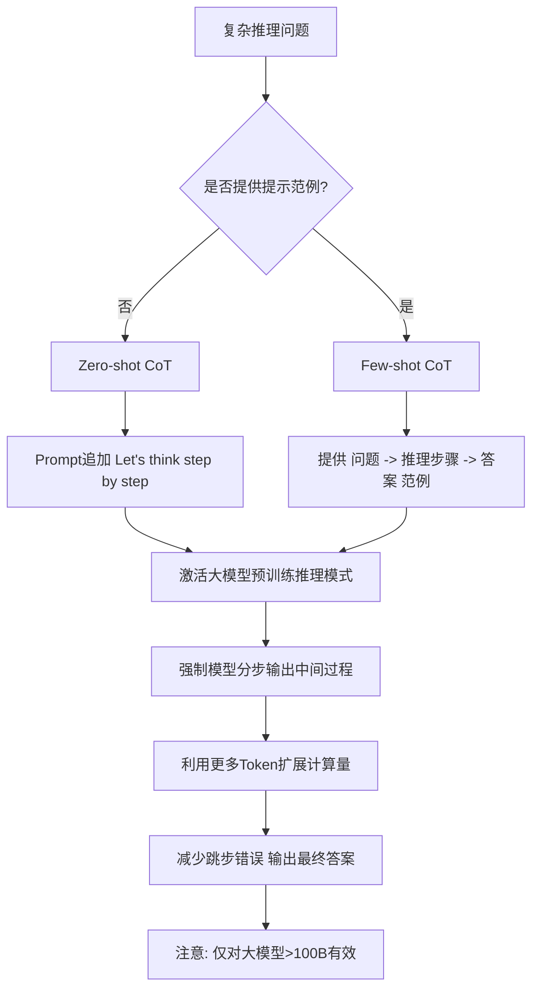
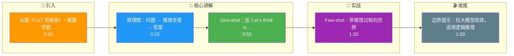

# Chain-of-Thought (CoT) 提示的原理是什么?Zero-shot CoT vs Few-shot CoT有什么区别

- **CoT核心:** 让模型先输出推理步骤,再输出最终答案,显著提升推理任务准确率.

- **Zero-shot CoT:**
- 在prompt末尾加上「让我们一步一步思考」(Let's think step by step)
- 无需示例

- **Few-shot CoT:**
- 提供带推理过程的示例
- 示例格式:问题→推理步骤→答案
- 效果更好但消耗更多token

- **为什么有效:**
1. **分解问题** - 复杂问题拆为子步骤
2. **利用更多计算** - 更多的中间token = 更多的推理计算
3. **减少跳步错误** - 强制模型展示中间过程

- **CoT效果(GSM8K数学题):**
- 标准prompt: 17.7%
- Zero-shot CoT: 46.9%
- Few-shot CoT: 56.9%

- **内部计算流示意:**

```text
Input: "Roger has 5 balls. He buys 2 cans of 3 balls each..."

Standard Prompt:
Input -> Model -> Output (Direct Answer, often wrong)

CoT Prompt:
Input -> Model -> 
  "Step 1: Start with 5 balls.
   Step 2: 2 cans * 3 balls = 6 balls.
   Step 3: 5 + 6 = 11 balls.
   Answer: 11"
```

## 常见考点
1. **CoT 的涌现现象是什么？**
   - CoT 效果通常只在模型规模超过一定阈值（如约 100B 参数或 70B 参数，取决于模型）时才会显著出现。小模型增加 CoT 提示甚至可能降低性能。

2. **Zero-shot CoT 为什么仅仅加一句话就有效？**
   - 这句话激活了模型在预训练期间见过的「推理模式」样本空间，引导模型生成类似的逐步推理文本，从而自我纠错。

3. **CoT 的缺点是什么？**
   - 显著增加了推理延迟（生成更多 token）和成本；且对于知识回忆类问题帮助不大，甚至可能因为过度推理引入错误。

- **实战案例**：在做数据清洗时，曾直接让 LLM 判断数据合法性，结果因模型胡乱猜测导致脏数据率极高；改用 Zero-shot CoT 要求模型先列出"违规的字段及原因"再输出"Valid/Invalid"，准确率从 75% 提升至 98%，同时还能附带错误原因供人工审核。

- **代码示例**：
```python
# Zero-shot CoT 模板示例
def get_reasoning_answer(query: str):
    prompt = f"""Q: {query}
A: Let's think step by step."""
    # 模型会自动先生成推理步骤，最后生成答案
    response = llm.generate(prompt)
    return response 
```

- **## 易错点**
1. **任务类型误用**：CoT适用于算术、逻辑推理和符号推理任务。对于常识问答（QA）、事实检索或开放域生成任务，CoT不仅无益，反而可能因为路径过长引入噪声，导致准确性下降。
2. **推理链条的幻觉**：CoT虽然提升了答案准确率，但无法保证中间推理步骤的正确性。模型可能编造错误的逻辑步骤来推导出一个“碰巧正确”的答案。

- **## 面试追问**
1. 如果CoT生成的推理路径很长导致超时或Token耗尽，有什么优化手段？（可以使用“Least-to-Most”提示策略将问题分解为子问题逐个解决，或者只输出关键推理步骤）
2. 如何自动化验证CoT输出的推理过程是否正确？（可以引入程序解释器，如Code Interpreter/PAL，让模型生成代码来执行计算并验证结果，而非自然语言推理）
3. Few-shot CoT中示例的选择对结果有什么影响？（示例的推理风格和逻辑结构需要与目标问题匹配。如果示例是数学推理，而问题是常识推理，模型可能会被误导。）

## 流程图



## 记忆要点

- CoT原理：让模型输出推理步骤再给答案，分解问题并利用更多计算。
- Zero-shot CoT：加一句“Let's think step by step”，无需示例。
- Few-shot CoT：提供带推理过程的示例，效果更好但耗Token。
- 注意：CoT仅对大模型(>100B)有效，适用于逻辑推理，不适用于常识问答。

## 结构化回答

**30 秒电梯演讲：** CoT 是让模型先输出推理步骤再给答案，像解数学题写出过程比只写答案更不容易算错。两种用法：Zero-shot 只需加一句"Let's think step by step"；Few-shot 给带推理过程的范例，效果更稳但更费 token。注意 CoT 只对大模型（大于 100B）有效，适用逻辑推理，对常识问答没用。

**展开框架：**
1. **核心原理** — 让模型把复杂问题分解成多步推理，每步输出中间结论，本质是用更多 token 换更多计算量，减少逻辑跳跃。
2. **Zero-shot vs Few-shot** — Zero-shot CoT 加一句"Let's think step by step"即可，零成本启动；Few-shot CoT 提供带推理链的示例，效果更稳定但消耗更多 token。
3. **有效边界** — CoT 是涌现能力，仅对大模型（约大于 100B）有效；适用于数学、逻辑、多步推理，不适用于常识问答或简单事实查询。

**收尾：** 一句话，CoT 是激活大模型推理的开关。您想深入聊聊 Self-Consistency 怎么提升 CoT，还是它在什么模型规模下才有效？

## 视频脚本

> 预计时长：2 分钟 | 由浅入深

| 时间 | 画面/字幕 | 口播台词 | 讲解要点 |
|------|----------|----------|----------|
| 0:00 | 标题《CoT 思维链》+ 解数学题写过程漫画 | CoT 像解数学题，写出解题过程比只写答案更不容易算错，也更容易检查。 | 类比开场 |
| 0:25 | 原理图：问题 → 推理步骤 → 答案 | 原理是让模型先输出推理步骤再给答案，把复杂问题分解成多步，用更多计算换更少逻辑跳跃。 | 核心原理 |
| 0:55 | Zero-shot：加 "Let's think step by step" | Zero-shot CoT 最简单，加一句"Let's think step by step"就能启动，无需任何示例。 | Zero-shot |
| 1:20 | Few-shot：带推理过程的范例 | Few-shot CoT 提供带推理链的范例，效果更稳定，但消耗更多 token。 | Few-shot |
| 1:50 | 边界提示：仅大模型有效，适用逻辑推理 | 注意 CoT 只对大模型，大约 100B 以上才有效，适用逻辑推理，对常识问答没用。 | 有效边界 |

### 视频流程图




