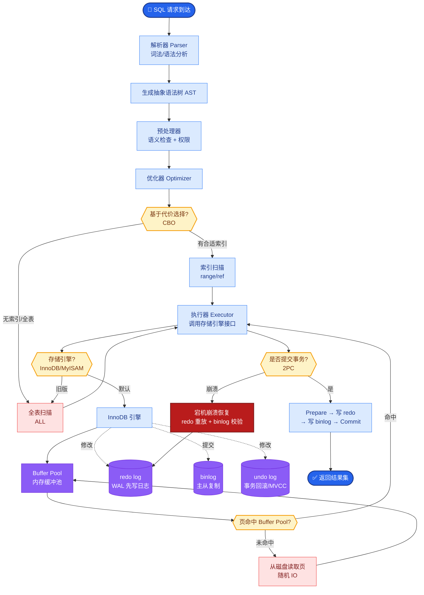

# In-Context Learning (ICL) 的原理是什么?Few-shot示例如何选择

- **ICL (In-Context Learning):** 模型从prompt中提供的示例学习模式,无需参数更新.

- **示例选择策略:**

1. **随机选择** - 基线,效果不稳定
2. **相似度选择** - 用embedding找与输入最相似的示例
3. **投票选择** - 多组示例投票,选一致性最高的
4. **多样性选择** - 选择覆盖不同模式的示例

- **关键发现:**
- 示例**顺序**影响巨大(准确率波动>10%)
- 示例**格式**必须一致
- **3-5个**示例通常效果最好
- 负面示例(错误答案)可能比正面示例更有效

- **Self-Consistency:**
1. 用不同示例生成多个答案
2. 对答案进行多数投票
3. 准确率提升5-15%

- **ICL 机制示意:**

```text
Prompt Context Window:
┌─────────────────────────────────────────────┐
│ System Instructions                         │
├─────────────────────────────────────────────┤
│ Example 1: Input -> Output  (Demonstration) │
│ Example 2: Input -> Output  (Demonstration) │
│ Example 3: Input -> Output  (Demonstration) │
├─────────────────────────────────────────────┤
│ [Test Input]  -> [??? Output]               │
└─────────────────────────────────────────────┘
         │
         ▼
  Model Inference (Gradient Free)
```

## 常见考点
1. **ICL 为什么不需要梯度更新？**
   - ICL 被认为是利用 Transformer 的注意力机制，从上下文中「检索」或「激活」模型预训练时学到的相关知识，本质上是一种前向推理时的贝叶斯学习模拟，而非权重更新。

2. **Label 空间对 ICL 有影响吗？**
   - 有。标签与其在分布中的频率、以及标签词本身在预训练中的出现频率有关。有时将输入标签映射到不常见的词汇可以提高效果。

3. **为什么 KNN（K近邻）常被用来解释 ICL？**
   - 研究表明 ICL 的行为很大程度上类似于 KNN 分类器：模型倾向于关注与测试输入最相似的示例，且随着相似示例数量的增加，性能显著提升。

- **实战案例**：在构建文本分类器时，直接随机抽取 3 个示例导致模型对长文本分类极差；改用基于 Embedding 余弦相似度检索最相似的 Top-3 示例后，长难句的分类 F1 分数提升了约 20 个百分点，解决了模型被简单示例带偏的问题。

- **代码示例**：
```python
from sklearn.metrics.pairwise import cosine_similarity
import numpy as np

# 基于相似度选择 Top-K 示例
def select_few_shot_examples(query, corpus_embeddings, k=3):
    query_emb = get_embedding(query) 
    # 计算余弦相似度并获取 Top-K 索引
    scores = cosine_similarity([query_emb], corpus_embeddings)[0]
    top_indices = np.argsort(scores)[-k:][::-1] 
    return [examples[i] for i in top_indices]
```

- **## 易错点**
1. **混淆Instruction Tuning与ICL**：Instruction Tuning（指令微调）是训练阶段通过更新权重让模型学会遵循指令；而ICL是推理阶段，仅通过上下文示例激发模型能力。不可混为一谈。
2. **示例的标签泄露**：在构建示例时，如果Input中包含了Label的信息（例如分类任务中输入文本里直接提到了类别词），模型实际上是在做“文本匹配”而非“学习模式”，导致评估虚高。

- **## 面试追问**
1. 当Context Window长度有限，无法塞入很多示例时，如何在ICL效率和效果间平衡？（可以考虑使用模型压缩或转向Instruction Tuning模型；或者在ICL中使用PEFT如LoRA来微调小模型以替代长示例）
2. ICL中的“Recitation”现象是什么？模型是否会死记硬背示例？（如果示例列表很长，模型可能会通过注意力机制直接从Context中“复制”答案而不是进行泛化推理，这被称为Recitation，削弱了泛化能力）
3. 如何利用反向思维进行ICL？（提供输入和错误输出，让模型解释原因并修正，这在纠错类任务中往往比正向示例更有效。）

## 核心流程图



## 记忆要点

- ICL原理：从Prompt示例中学习模式，无需梯度更新，类似KNN检索。
- 示例选择策略：随机(基线)、相似度(常用)、多样性、投票。
- 关键点：示例顺序影响大，3-5个效果最好，格式必须一致。
- Self-Consistency：多路径生成+多数投票，可提升准确率5-15%。

## 结构化回答

**30 秒电梯演讲：** ICL 是上下文学习，像学书法照着字帖描红，给几个例子模型就能模仿完成任务，不用改参数。原理类似 KNN 检索，从示例中学模式。示例选择有随机、相似度、多样性等策略，关键是顺序影响大、3 到 5 个最好、格式必须一致。Self-Consistency 多路径投票还能再提升 5 到 15% 准确率。

**展开框架：**
1. **核心原理** — 模型从 Prompt 里的示例学习输入输出模式，不更新任何梯度，本质是利用预训练阶段习得的模式匹配能力，类似 KNN 在激活的示范上做检索。
2. **示例选择策略** — 随机是基线；相似度检索最常用，选和当前 query 最像的示例；多样性保证覆盖；关键是示例顺序影响巨大，3 到 5 个效果最佳，格式必须严格一致。
3. **Self-Consistency 增强** — 对同一问题用多路径生成多个推理链和答案，再做多数投票，可提升准确率 5 到 15%，特别适合配合 CoT 使用。

**收尾：** 一句话，ICL 是不改参数的"现场学习"。您想深入聊聊为什么示例顺序影响这么大，还是怎么自动选最优示例？

## 视频脚本

> 预计时长：2 分钟 | 由浅入深

| 时间 | 画面/字幕 | 口播台词 | 讲解要点 |
|------|----------|----------|----------|
| 0:00 | 标题《上下文学习 ICL》+ 书法描红漫画 | ICL 像学书法照着字帖描红，给几个例子模型就能模仿完成任务，不用改大脑结构，不用梯度下降。 | 类比开场 |
| 0:25 | 原理图：Prompt 示例 → 模式匹配（类似 KNN） | 原理是从示例里学模式，不更新梯度，类似 KNN 检索，靠预训练阶段习得的模式匹配能力。 | 核心原理 |
| 0:55 | 示例选择策略：随机/相似度/多样性 | 示例选择有随机、相似度、多样性等策略，相似度检索最常用，选和当前问题最像的示例。 | 选择策略 |
| 1:25 | 关键点图：顺序敏感 / 3-5 个 / 格式一致 | 关键三点：示例顺序影响巨大，3 到 5 个效果最好，格式必须严格一致。 | 关键要点 |
| 1:50 | Self-Consistency：多路径 + 多数投票 | Self-Consistency 多路径生成再多数投票，能再提升 5 到 15% 准确率，常配合 CoT 用。 | 增强技巧 |

### 视频流程图


