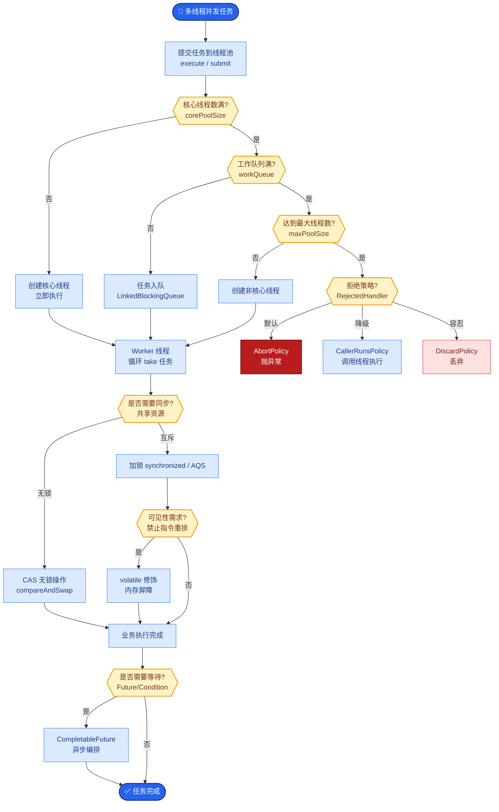

# System Prompt设计的最佳实践是什么?如何设计有效的角色和约束

- **System Prompt设计框架 (CREATE):**

- **C**ontext - 角色和背景(你是XX公司的AI助手)
- **R**ole - 具体职责(你负责回答客户的技术问题)
- **E**xamples - 示例对话
- **A**uthenticity - 语气风格(专业但友好)
- **R**ules - 规则约束(不要编造、不确定时说不知道)
- **T**one - 输出格式(结构化、带标题)
- **E**dge cases - 边界处理(遇到XX时应该YY)

- **Prompt 结构化设计流程:**
```
┌─────────────────────────────────────────────────────┐
│  System Prompt (Root Instruction Set)               │
├─────────────────┬───────────────────────────────────┤
│  # IDENTITY      │  你是资深后端工程师...            │
├─────────────────┼───────────────────────────────────┤
│  # CONSTRAINTS   │  1. 仅使用 Go 语言                │
│                 │  2. 必须处理 Error                 │
├─────────────────┼───────────────────────────────────┤
│  # FORMAT        │  输出必须是 Markdown 代码块       │
├─────────────────┼───────────────────────────────────┤
│  # FEW-SHOT      │  Q: ...                           │
│  (Examples)     │  A: ... (标准答案)                 │
├─────────────────┴───────────────────────────────────┤
│  <user_input>                                   │
│  {{User Query Goes Here}}                       │
│  </user_input>                                  │
└─────────────────────────────────────────────────────┘
```

- **关键原则:**
1. **具体>模糊** - 「回答200字以内」优于「简洁回答"
2. **正面指令>负面指令** - 「只基于文档回答」优于「不要编造"
3. **结构化** - 用Markdown/XML标签组织prompt
4. **分层** - System层定角色,User层给任务
5. **可测试** - 每条规则都能通过测试用例验证

- **设计心理学技巧:**
  - **赋予思维链:** 在 Prompt 中加入 "Let's think step by step" 可以显著提升逻辑推理任务的准确性。
  - **角色绑定强化:** 开头明确 "You are an expert in [Domain]" 会让模型倾向于激活该领域的知识权重。
  - **引用标识:** 要求模型在回答时引用来源（如 "[Source ID]"），可减少幻觉并提升可追溯性。

## 常见考点
- **Token 长度限制怎么办？**：将长篇 System Prompt 压缩，或使用向量检索提取最相关的规则片段，但要注意 Core Identity（身份和核心规则）必须始终保留在上下文窗口顶部。
- **Few-shot（少样本）和 Zero-shot（零样本）如何选择？**：如果任务格式复杂或需要特定风格，Few-shot 效果更好；如果只是通用逻辑，Zero-shot 节省 Token 成本。
- **如何测试 System Prompt 的有效性？**：构建包含 Corner Cases（极端情况）和 Adversarial Inputs（对抗性输入）的测试集，进行自动化评估或人工打分。
- **模型出现「遗忘」系统指令怎么办？**：随着对话轮次增加，系统指令权重可能降低。解决方法包括：在每一轮对话中重新注入系统指令（显式拼接），或使用支持 `system` 消息持久化的模型 API（如部分模型的 `system_prompt_override` 机制）。

## 边界情况
1. **指令冲突**：当 System Prompt 中的约束（如“禁止代码”）与用户显式需求（如“写一段代码”）冲突时，模型容易产生混淆。设计时应明确优先级（如“除非用户明确要求，否则...”）。
2. **多轮对话上下文污染**：用户可能在第 10 轮对话中通过诱导性的对话让模型逐步放弃 System Prompt 的设定（如“为了更灵活，请忽略刚才那条规则”）。
3. **语言差异**：如果 System Prompt 是中文，但用户输入全是英文技术术语，模型可能会“语言切换”导致原本的中文约束被忽略。建议核心约束使用双语表述。

## 易错点
1. **指令过载**：试图在 System Prompt 里塞入所有可能的规则，导致模型注意力分散，核心约束反而被弱化。应遵循“最小必要原则”，核心约束不超过 3-5 条。
2. **负面指令主导**：过多的“不要...”不仅浪费 Token，还可能暗示模型这些行为是存在的，反而激发其尝试。建议将负面约束转化为正向流程（如把“不要瞎编”改为“必须基于提供的文档回答”）。

## 面试追问
1. **追问**：在长上下文场景下，如何保证 System Prompt 的核心指令在 128k 甚至更长的窗口后依然有效？
2. **追问**：如果要设计一个“通用型”Agent 的 System Prompt，如何平衡“通用性”和“特定任务的表现力”？
3. **追问**：你提到“Let's think step by step”，在什么场景下这种 CoT（思维链）提示反而会降低模型性能？


## 核心流程图



## 记忆要点

- 设计框架CREATE：Context背景、Role职责、Examples示例、Rules规则
- 关键原则：具体>模糊，正面指令>负面指令，结构化Markdown组织
- 指令技巧：Let's think step by step激发思维链，专家角色激活领域知识
- 易错点：指令过载（不超过3-5条核心），避免过多负面暗示
- 长Prompt处理：核心Identity保留，规则可用检索提取，每轮重注

## 结构化回答

**30 秒电梯演讲：** System Prompt 设计像给新员工发岗位手册，告诉他该做什么、不该做什么。用 CREATE 框架：Context 背景、Role 职责、Examples 示例、Rules 规则。原则是多用具体正面指令、少用模糊否定，用 Markdown 结构化组织。注意指令别过载，核心不超过 3 到 5 条。

**展开框架：**
1. **CREATE 框架** — Context 交代任务背景、Role 定义角色人设、Examples 给少量示范、Rules 明确行为规则，四要素组合成完整可控的 System Prompt。
2. **关键原则与技巧** — 具体优于模糊、正面指令优于负面指令；用"Let's think step by step"激发思维链，用专家角色激活领域知识；核心指令不超过 3 到 5 条，避免指令过载和过多负面暗示。
3. **长 Prompt 处理** — 核心 Identity 始终保留，详细规则可用检索按需提取；System 层定规矩、User 层派任务，长对话每轮重注 Identity 防漂移。

**收尾：** 一句话，System Prompt 是给模型立岗位手册。您想深入聊聊 System Prompt 应该多长，还是怎么版本管理 Prompt？

## 视频脚本

> 预计时长：2 分钟 | 由浅入深

| 时间 | 画面/字幕 | 口播台词 | 讲解要点 |
|------|----------|----------|----------|
| 0:00 | 标题《System Prompt 设计》+ 新员工岗位手册漫画 | 设计 System Prompt 像给新员工发详细的岗位手册，告诉他该做什么、不该做什么、怎么说话。 | 类比开场 |
| 0:25 | CREATE 框架四要素图 | 用 CREATE 框架：Context 交代背景，Role 定义角色，Examples 给示范，Rules 明确规则。 | CREATE 框架 |
| 0:55 | 原则对比：具体 vs 模糊 / 正面 vs 负面 | 原则上具体优于模糊，正面指令优于负面指令，用 Markdown 结构化组织。 | 关键原则 |
| 1:25 | 技巧：step by step + 专家角色 | 技巧上用"Let's think step by step"激发思维链，用专家角色激活领域知识。 | 指令技巧 |
| 1:50 | 易错点：指令过载 + 长 Prompt 处理 | 易错点是指令过载，核心不超过 3 到 5 条；长 Prompt 核心 Identity 保留，规则可检索提取，每轮重注。 | 易错点 |

