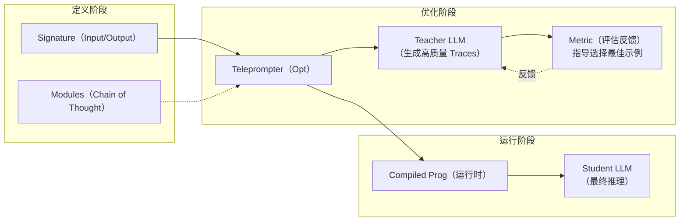
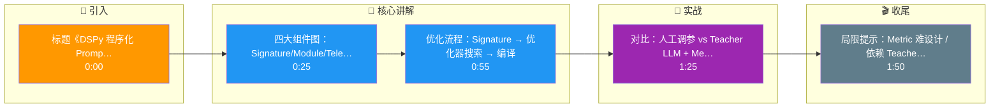

# DSPy框架的核心思想是什么?它如何自动优化Prompt

- **DSPy核心:** 用声明式编程替代手写prompt,让框架自动搜索最优prompt. 将Prompt Engineering转变为参数优化问题（类似机器学习中的超参数搜索）。

- **传统方式:** 手写prompt → 人工调优 → 效果不稳定
- **DSPy方式:** 定义输入输出 → 选择模块 → 自动优化 → 验证效果

- **核心概念:**
1. **Signature** - 声明输入输出(类似函数签名)，定义了"做什么"而非"怎么做"。
2. **Module** - 可组合的处理单元(类似神经网络层)，内部包含Prompt模板和LLM调用逻辑。
3. **Teleprompter (Optimizer)** - 自动优化模块参数（如Few-shot示例的选择、Prompt指令的措辞）。常用算法包括BootstrapFewShot（自助法生成示例）、KNN（近邻选择示例）等。
4. **Metric** - 评估函数，用于量化Prompt效果（如准确率、F1分数、Exact Match）。

- **优化流程原理图:**


- **优化示例代码:**
```python
# 声明式定义
class QA(dspy.Signature):
    """回答问题"""
    question = dspy.InputField()
    answer = dspy.OutputField()

# 自动优化
# BootstrapFewShot: 利用Teacher模型在训练集上生成高质量的Few-shot示例
teleprompter = dspy.BootstrapFewShot(metric=my_metric, max_labeled_demos=16)
optimized_qa = teleprompter.compile(QA(), trainset=train_data)
```

## 边界情况
1. **Metric 定义的主观性**：对于生成式任务（如摘要、写作），很难定义精确的 Metric。如果 Metric 设计不当（如仅基于相似度），优化器可能会找到“死记硬背”而非“泛化”的 Prompt。
2. **Teacher 模型的能力上限**：在 BootstrapFewShot 中，Teacher LLM 的能力决定了生成示例的质量上限。如果 Teacher 模型本身无法解决某些复杂问题，优化器会陷入局部最优。
3. **过拟合**：Teleprompter 可能会在训练集上过度优化，选出的 Few-shot 示例只对训练数据有效，导致在真实泛化场景下表现下降。

## 易错点
1. **混淆 Module 和 Function**：初学者容易将 DSPy 的 Module 简单理解为函数封装，实际上它维护了 Prompt 状态和权重，是可以被 Compiler 修改的动态组件，而非静态代码。
2. **忽略数据质量**：认为 DSPy 能自动修复 Prompt 就不需要关注数据。实际上，如果 `trainset` 包含噪声或错误标注，优化过程会放大这些错误，导致生成的 Prompt 包含错误的 Few-shot 示例。

## 面试追问
1. **追问**：DSPy 在优化过程中需要多次调用 LLM，成本很高。在实际生产环境中如何平衡优化效果和推理成本？
2. **追问**：DSPy 的 `BootstrapFewShot` 和 `KNN` 优化器分别适用于什么场景？它们在选择示例时的核心差异是什么？
3. **追问**：如果目标是优化一个多步骤的 Agent 流程（包含 RAG + 工具调用），DSPy 如何保证整体链路的端到端优化？

## 记忆要点

- 核心思想：声明式编程替代手写Prompt，将Prompt Engineering转为参数优化
- 四大组件：Signature定义输入输出，Module处理单元，Teleprompter优化器，Metric评估
- 优化流程：定义Signature -> 优化器搜索最佳Prompt/示例 -> 编译运行
- 对比：传统靠人工调参，DSPy靠Teacher LLM生成示例和Metric反馈自动调优
- 局限：Metric设计难主观，依赖Teacher模型能力上限，易过拟合训练集

## 结构化回答

**30 秒电梯演讲：** DSPy 把 Prompt Engineering 变成编程问题，像写代码定义接口让编译器自动优化，而不是手写汇编。四大组件：Signature 定义输入输出、Module 是处理单元、Teleprompter 是优化器、Metric 做评估。流程是定义 Signature 后让优化器自动搜索最佳 Prompt 和示例，靠 Teacher LLM 和 Metric 反馈自动调优。

**展开框架：**
1. **核心思想** — 声明式编程替代手写 Prompt，把 Prompt 工程从"人工调字眼"变成"参数化优化"，可复现、可规模化。
2. **四大组件** — Signature 声明输入输出接口；Module 是可组合的处理单元（如 ChainOfThought）；Teleprompter 是优化器，自动搜索最佳示例和指令；Metric 定义评估标准。
3. **流程与局限** — 定义 Signature → 优化器搜索最佳 Prompt/示例 → 编译运行；局限是 Metric 设计主观且难、依赖 Teacher 模型能力上限、容易过拟合训练集。

**收尾：** 一句话，DSPy 让 Prompt 从"手艺活"变成"工程活"。您想深入聊聊 BootstrapFewShot 怎么选示例，还是 DSPy 和 LangChain 的本质区别？

## 视频脚本

> 预计时长：2 分钟 | 由浅入深

| 时间 | 画面/字幕 | 口播台词 | 讲解要点 |
|------|----------|----------|----------|
| 0:00 | 标题《DSPy 程序化 Prompt》+ 写接口 vs 手写汇编漫画 | DSPy 像写代码定义接口，让编译器自动优化底层实现，而不是手写汇编逐字调 Prompt。 | 类比开场 |
| 0:25 | 四大组件图：Signature/Module/Teleprompter/Metric | 四大组件：Signature 定义输入输出，Module 是处理单元，Teleprompter 是优化器，Metric 做评估。 | 四大组件 |
| 0:55 | 优化流程：Signature → 优化器搜索 → 编译 | 流程是定义 Signature，让优化器自动搜索最佳 Prompt 和示例，然后编译运行。 | 优化流程 |
| 1:25 | 对比：人工调参 vs Teacher LLM + Metric 自动调优 | 传统靠人工调参，DSPy 靠 Teacher LLM 生成示例、用 Metric 反馈自动调优。 | 对比传统 |
| 1:50 | 局限提示：Metric 难设计 / 依赖 Teacher / 易过拟合 | 局限是 Metric 设计主观且难，依赖 Teacher 模型能力上限，容易过拟合训练集。 | 局限性 |

### 视频流程图




