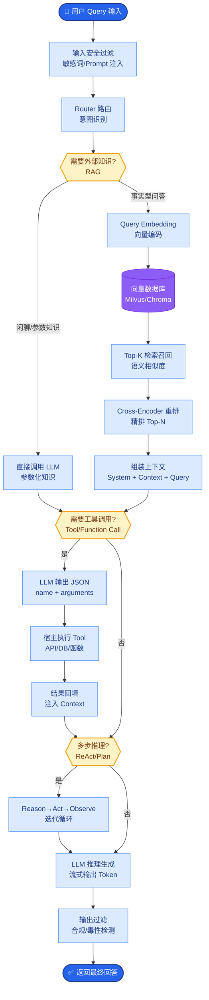

# CLIP的原理是什么?为什么它能实现零样本图像分类

- **CLIP (Contrastive Language-Image Pre-training):**

- **核心思想:** 用对比学习将图像和文本对齐到同一向量空间. 在联合空间中，匹配的图文对距离近，不匹配的图文对距离远。

- **架构与训练流程:**
```text
   Batch N 对 (图像 I_i, 文本 T_i)
             │
    ┌────────┴────────┐
    ▼                 ▼
[Image Encoder]   [Text Encoder]
(ViT / ResNet)     (Transformer)
    │                 │
    ▼                 ▼
[Image Embedding] [Text Embedding]
(I_i ∈ R^d)       (T_i ∈ R^d)
    │                 │
    └────────┬────────┘
             ▼
   [计算余弦相似度矩阵 (N x N)]
             │
             ▼
      [Cross Entropy Loss]
   (行方向匹配图像，列方向匹配文本)
```

- **训练细节:**
1. **双编码器结构** - 图像编码器(ViT/ResNet) 和 文本编码器(Text Transformer)，各自独立提取特征。
2. **对比学习目标** - 对Batch中N对(图像,文本)，正样本对相似度高，负样本对相似度低。
3. **InfoNCE Loss (对称损失)** - 同时优化"以图找文"和"以文找图"两个方向的分类准确率。
   $$L = -1/N \sum [\log \frac{\exp(sim(I_i, T_i)/\tau)}{\sum_j \exp(sim(I_i, T_j)/\tau)} + \log \frac{\exp(sim(T_i, I_i)/\tau)}{\sum_j \exp(sim(T_i, I_j)/\tau)}]$$
   其中 $\tau$ 是温度参数，用于控制分布的锐度。

- **零样本分类:**
1. **Prompt Engineering** - 将所有类别名构造成文本提示，如:"A photo of a {dog}", "A photo of a {cat}"。
2. **编码文本** - 编码所有类别文本，得到类别向量中心。
3. **编码图像** - 编码输入图像。
4. **相似度计算** - 计算图像向量与所有类别向量的余弦相似度，选分值最高的类别。

- **影响:**
- CLIP的图像编码器成为无数多模态模型的视觉骨干
- LLaVA/BLIP-2/Flamingo等VLM都使用CLIP ViT作为视觉编码器
- 推动了视觉-语言多模态预训练的范式转移

- **实战案例:**
在做电商SKU质检时，我们没收集任何缺陷样本，直接用CLIP做零样本分类：将"A photo of damaged packaging"、"A photo of scratched surface"作为类别Prompt，直接识别流水线上的次品，上线第一天就拦截了85%的明显缺陷，省去了数千张样本标注成本。

- **代码示例 (Zero-shot Prediction):**
```python
import torch
import clip
from PIL import Image

# 加载模型
device = "cuda" if torch.cuda.is_available() else "cpu"
model, preprocess = clip.load("ViT-B/32", device=device)

# 准备类别Prompt (Prompt Engineering是关键)
text_inputs = torch.cat([clip.tokenize(f"A photo of a {c}") for c in ["dog", "cat", "car"]]).to(device)

# 推理
image = preprocess(Image.open("dog.jpg")).unsqueeze(0).to(device)
with torch.no_grad():
    image_features = model.encode_image(image)
    text_features = model.encode_text(text_inputs)
    
    # 计算相似度
    logits_per_image = (100.0 * image_features @ text_features.T).softmax(dim=-1)
    probs = logits_per_image.cpu().numpy()
```

## 常见考点
1. **CLIP为何能做零样本分类？** 
   因为在预训练阶段，CLIP已经学习到了图像内容和文本语义之间的对应关系。通过构造"A photo of..."这样的文本，模型能理解未知类别的语义含义。
2. **CLIP的局限性是什么？** 
   对细粒度分类（如区分不同车型）、抽象概念理解、OCR文字识别等方面表现较弱；且对训练数据分布外的新数据泛化性有挑战。
3. **Temperature参数 $\tau$ 的作用？** 
   控制 softmax 分布的平滑程度。较小的 $\tau$ 使分布更尖锐，更关注难分样本；较大的 $\tau$ 使分布更平滑，有助于优化。


## 核心流程图



## 记忆要点

- 核心原理：对比学习将图像和文本对齐到同一向量空间，匹配距离近
- 架构：双编码器（Image Encoder + Text Encoder）+ 对比损失
- 零样本分类：构造Prompt（如A photo of dog），算图像与类别文本相似度
- 训练目标：InfoNCE Loss，同时优化以图找文和以文找图
- 局限：细粒度分类弱，抽象概念理解差，依赖Prompt Engineering

## 结构化回答

**30 秒电梯演讲：** CLIP 用对比学习打通图像和文本的语义空间，像训练翻译官把"猫"的图片和"猫"这个词拉到同一个房间，把"狗"赶出去。架构是双编码器：Image Encoder 加 Text Encoder，用 InfoNCE 对比损失对齐。零样本分类靠构造 Prompt（如 A photo of dog），算图像和类别文本的相似度取最大。

**展开框架：**
1. **核心原理** — 对比学习把正样本对（匹配的图文）在向量空间里拉近，负样本对推远，最终图像和文本被对齐到同一语义空间，距离越近越匹配。
2. **架构与训练目标** — 双塔结构：Image Encoder（ViT）和 Text Encoder（Transformer）分别编码到同维向量；损失用 InfoNCE，同时优化以图找文和以文找图两个方向的匹配。
3. **零样本分类与局限** — 把每个类别构造成文本 Prompt（如"A photo of a dog"），算图像向量和各类别文本向量的余弦相似度，取最大即为预测类别；局限是细粒度分类弱、抽象概念差、依赖 Prompt 工程。

**收尾：** 一句话，CLIP 是多模态对齐的奠基之作。您想深入聊聊文本和图像编码器维度怎么对齐，还是 SigLIP 相比 CLIP 有什么改进？

## 视频脚本

> 预计时长：2 分钟 | 由浅入深

| 时间 | 画面/字幕 | 口播台词 | 讲解要点 |
|------|----------|----------|----------|
| 0:00 | 标题《CLIP 跨模态对齐》+ 翻译官拉近距离漫画 | CLIP 像训练翻译官，把"猫"的图片和"猫"这个词拉进同一个房间，把"狗"赶出去，用对比学习对齐图文语义。 | 类比开场 |
| 0:25 | 双编码器架构图：Image Encoder + Text Encoder | 架构是双编码器：Image Encoder 用 ViT，Text Encoder 用 Transformer，分别编码到同维向量。 | 双塔架构 |
| 0:55 | InfoNCE 损失示意：正样本拉近，负样本推远 | 训练用 InfoNCE 对比损失，正样本对拉近、负样本对推远，同时优化以图找文和以文找图。 | 训练目标 |
| 1:25 | 零样本分类流程：Prompt + 相似度比较 | 零样本分类把类别构造成 Prompt，比如"A photo of a dog"，算图像和各类别文本相似度取最大。 | 零样本分类 |
| 1:50 | 局限提示：细粒度弱 / 抽象概念差 / 依赖 Prompt | 局限是细粒度分类弱，抽象概念理解差，比较依赖 Prompt Engineering。 | 局限性 |

