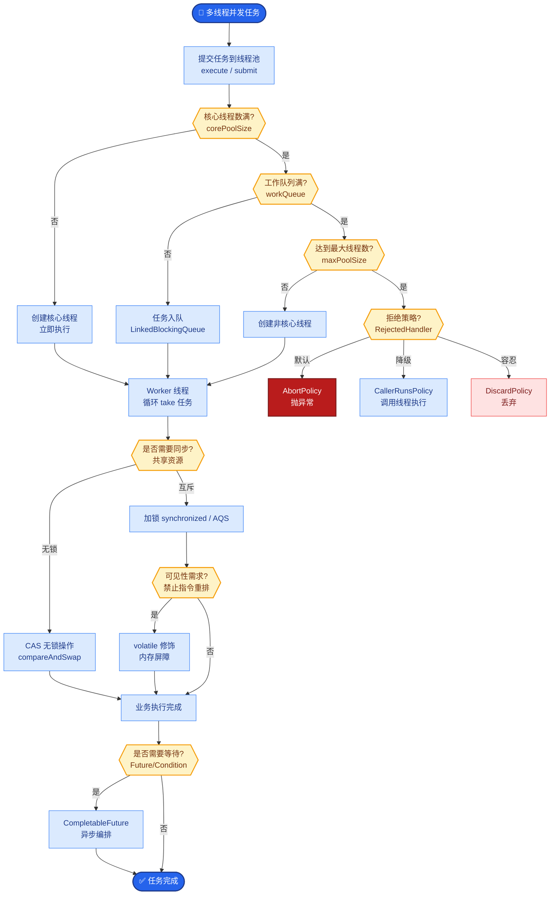
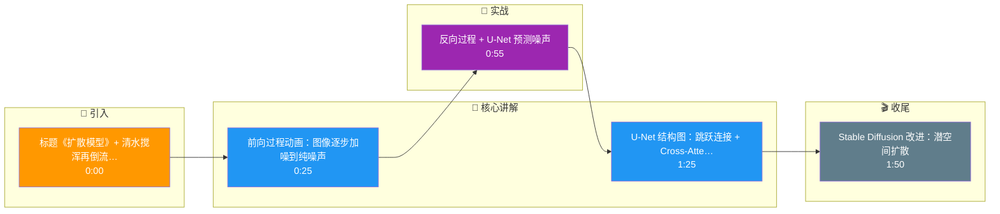

# 扩散模型(Diffusion)的前向和反向过程是什么?为什么U-Net是核心架构

- **扩散模型原理:**

- **前向过程 (加噪 / Diffusion Process):**
- 逐步向图像 $x_0$ 添加高斯噪声，直至变为纯高斯噪声 $x_T$。
- 数学公式: $x_t = \sqrt{\bar{\alpha}_t} x_0 + \sqrt{1-\bar{\alpha}_t} \epsilon$, 其中 $\epsilon \sim N(0, I)$。
- 关键特性：这是一个马尔可夫链，每一步只依赖前一步；可以使用重参数化技巧一次性从 $x_0$ 采样得到任意时刻 $t$ 的 $x_t$，无需逐步迭代。

- **反向过程 (去噪 / Reverse Process):**
- 训练神经网络 $\epsilon_\theta(x_t, t)$ 预测添加的噪声。
- 从高斯噪声 $x_T$ 开始，逐步去除预测的噪声，恢复图像 $x_0$。
- 条件概率: $p_\theta(x_{t-1} | x_t) = N(x_{t-1}; \mu_\theta(x_t, t), \Sigma_\theta(x_t, t))$。

- **U-Net 核心架构细节:**
U-Net 是扩散模型的核心（如在DDPM、Stable Diffusion中），用于预测噪声。其结构优势如下：
```text
      [文本条件 c (Cross-Attention 输入)]
              │
              ▼
    ┌───────────────────────────┐
    │       U-Net Backbone      │
    │  (Downsampling Path)      │
    │  ┌───┐ ┌───┐ ┌───┐        │ <─── 编码器：提取多尺度特征
    │  │ C │→│ C │→│ C │ ...      │   (Conv + ResBlock)
    │  └─┬─┘ └─┬─┘ └─┬─┘        │
    │    │     │     │          │
    │    └──┬──┴─────┘          │
    │       │ Skip Connection   │ <─── 跳跃连接：传递高频细节
    │       │ (拼接特征)         │     (对图像清晰度至关重要)
    │  ┌────┴────┐              │
    │  │ Middle  │              │ <─── 中间层：处理最深语义
    │  │ Block   │              │
    │  └────┬────┘              │
    │       │                   │
    │  ┌────┴────┐              │
    │  │Upsample │              │ <─── 解码器：恢复分辨率
    │  │  Path   │              │
    │  └───┬ ────┬─┘ ...        │
    └──────┼─────┼───────────────┘
           │     │
           ▼     ▼
      [时间步 t] [噪声预测 ε_θ]
       (AdaLN注入)
```

- **U-Net 为什么是核心:**
1. **全卷积结构** - 输入输出尺寸相同，适合图像到图像的映射任务。
2. **编码器-解码器结构** - 捕获不同分辨率的语义和纹理信息。
3. **跳跃连接** - 跨层拼接特征，补充U-Net下采样过程中丢失的高频细节（边缘、纹理），防止图像变模糊。
4. **时间与条件注入** - 
   - **时间嵌入**: 将 $t$ 编码为向量，通过 Adaptive Layer Norm (AdaLN) 注入每一层，告诉网络当前加噪了多少。
   - **交叉注意力**: 在ResBlock中引入 $Q=Image Feature, K,V=Text Feature$，实现文本控制图像生成（Text-to-Image）。

- **Stable Diffusion 改进 (LDM - Latent Diffusion Models):**
- **核心痛点**: 在像素空间(512x512x3)做扩散计算量太大。
- **改进方案**: 
  1. 使用预训练的 VAE (Variational Autoencoder) 将图像压缩到低维潜空间 (Latent Space, 如 64x64x4)。
  2. 在潜空间进行Diffusion过程训练，计算量降低数十倍。

- **实战案例:**
在做LoRA模型微调（如特定人脸或画风）时，我们发现直接在潜空间训练Loss很难收敛。解决方案是引入"Min-SNR Gamma策略"，根据噪声时间步 $t$ 动态调整Loss权重（对高噪步给予更高权重），使得模型在中低噪声阶段的细节生成能力显著提升，生成的文字不再乱码。

- **代码示例 (Diffusers 库使用):**
```python
from diffusers import StableDiffusionPipeline, DPMSolverMultistepScheduler
import torch

# 加载模型（实战中常使用 float16 节省显存）
pipe = StableDiffusionPipeline.from_pretrained(
    "runwayml/stable-diffusion-v1-5", torch_dtype=torch.float16
).to("cuda")

# 优化采样器
pipe.scheduler = DPMSolverMultistepScheduler.from_config(pipe.scheduler.config)

# 生成
image = pipe(
    prompt="cyberpunk city street, neon lights, high detail",
    negative_prompt="blurry, low quality", # 负向提示抑制坏图
    num_inference_steps=20,
    guidance_scale=7.5 # CFG guidance scale，越高越遵循Prompt
).images[0]
image.save("cyberpunk.png")
```

## 核心流程图



## 记忆要点

- 前向过程：逐步加高斯噪声直至纯噪声，公式含重参数化技巧
- 反向过程：训练U-Net预测噪声，从纯噪声逐步去噪恢复图像
- U-Net核心：全卷积结构、跳跃连接（补充高频细节）、Cross-Attention注入文本条件
- Stable Diffusion改进：在VAE压缩的潜空间做扩散，大幅降低计算量
- 时间步注入：通过AdaLN将时间t嵌入网络，告知当前噪声水平

## 结构化回答

**30 秒电梯演讲：** 扩散模型像把清水搅成泥水再训练魔法倒流还原。前向过程逐步加高斯噪声到纯噪声，反向过程训练 U-Net 预测噪声、从纯噪声逐步去噪恢复图像。U-Net 靠跳跃连接补高频细节，用 Cross-Attention 注入文本条件，用 AdaLN 注入时间步。Stable Diffusion 的关键改进是在 VAE 压缩的潜空间做扩散，大幅降算力。

**展开框架：**
1. **前向与反向过程** — 前向：对图像逐步加高斯噪声直至变成纯噪声，公式用重参数化技巧可解析计算任意步的噪声；反向：训练 U-Net 预测每一步要减去的噪声，从纯噪声逐步去噪恢复图像。
2. **U-Net 核心设计** — 全卷积结构配跳跃连接（skip connection）补充高频细节；Cross-Attention 注入文本条件控制生成内容；AdaLN 把时间步 t 嵌入网络，告知当前噪声水平。
3. **Stable Diffusion 改进** — 不在像素空间而是在 VAE 压缩后的潜空间做扩散，计算量大幅降低，让扩散模型能在消费级显卡上跑。

**收尾：** 一句话，扩散模型是"加噪去噪"的生成范式。您想深入聊聊 Latent Diffusion 为什么比像素空间快，还是 DALL-E 3 和 Stable Diffusion 有什么区别？

## 视频脚本

> 预计时长：2 分钟 | 由浅入深

| 时间 | 画面/字幕 | 口播台词 | 讲解要点 |
|------|----------|----------|----------|
| 0:00 | 标题《扩散模型》+ 清水搅浑再倒流还原漫画 | 扩散模型像把一杯清水搅成泥水，再训练魔法倒流还原清水，前向加噪、反向去噪。 | 类比开场 |
| 0:25 | 前向过程动画：图像逐步加噪到纯噪声 | 前向过程是逐步加高斯噪声，直到变成纯噪声，公式用重参数化技巧可以解析计算任意步。 | 前向过程 |
| 0:55 | 反向过程 + U-Net 预测噪声 | 反向过程训练 U-Net 预测每一步的噪声，从纯噪声逐步去噪恢复图像。 | 反向过程 |
| 1:25 | U-Net 结构图：跳跃连接 + Cross-Attention + AdaLN | U-Net 靠跳跃连接补高频细节，Cross-Attention 注入文本条件，AdaLN 注入时间步告知噪声水平。 | U-Net 核心 |
| 1:50 | Stable Diffusion 改进：潜空间扩散 | Stable Diffusion 的关键改进是在 VAE 压缩的潜空间做扩散，大幅降低计算量，消费级显卡也能跑。 | SD 改进 |

### 视频流程图




