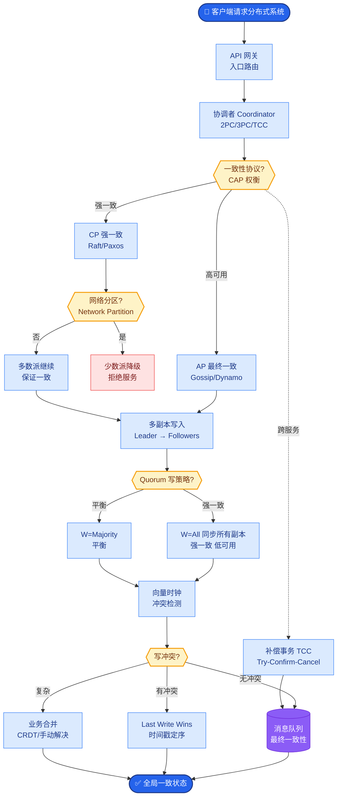

# 大模型幻觉(Hallucination)的成因是什么?如何缓解

- **幻觉类型:**
1. **事实性幻觉** - 编造不存在的事实(如虚假引用、错误的人物关系)。
2. **忠实性幻觉** - 输出与输入/上下文/指令矛盾(如摘要中生成了原文没有的信息)。
3. **推理幻觉** - 推理链条中出现逻辑错误(如数学计算错误、步骤跳转)。

- **成因深度解析:**
- **训练数据** - 数据中的错误信息、过时信息、甚至是统计性偏差（如网络语料中常见的错误关联）被模型吸收。
- **解码策略** - 高温度采样增加随机性，容易偏离事实；Beam Search 可能会陷入局部最优循环。
- **模型能力 (不确定性)** - 参数化知识存在边界。当模型对答案不确定时，仍然倾向于生成"通顺"但错误的内容，而不是拒绝回答，这是因为Next Token Prediction目标仅追求概率最大化，而非真实性。
- **训练目标** - 标准的LM目标是拟合训练语料的分布，而非 factual correctness。

- **缓解策略 (及补充细节):**

| 策略 | 方法 | 效果 | 原理/细节 |
|------|------|------|-----------|
| **RAG** | 检索真实文档辅助生成 | **强** | 提供外部证据，限制模型在给定的上下文范围内生成。需注意检索准确性。 |
| **CoT** | 让模型展示推理过程 | 中 | 分步推理能减少逻辑跳跃，但也可能增加复合误差。 |
| **自一致性** | 多次采样投票 | 中 | 对复杂推理任务有效，假设多数路径收敛于正确答案。 |
| **RLHF** | 奖励诚实回答 | 强 | 通过奖励模型 Penalize 胡编乱造的行为，训练模型学会"不知道时说不知道"。 |
| **外部工具** | 调用搜索/计算器 | 强 | 非确定性知识交给工具（如Google Search），确定性计算交给计算器/Python。 |
| **后处理** | 事实核查/NLI验证 | 中 | 生成后，再调用LLM或规则库检查生成内容是否与引用一致。 |
| **系统Prompt** | 「不确定时说不知道」 | 弱 | 软约束，对强幻觉抑制效果有限，但有助于建立回答边界。 |

- **缓解策略的工作流示例 (RAG + Verification):**
```text
1. User Query ───> [Retriever] ───> Retrieve Context Docs
                           │
                           ▼
2. LLM Generation (based on Docs)
                           │
                           ▼
3. Hallucination Check (LLM as Judge / NLI)
                           │
               ┌───────────┴───────────┐
               ▼                       ▼
          Pass?                    Fail?
           │                         │
           ▼                         ▼
     Return Answer         Retry / Refuse
```

- **实战案例:**
在构建金融研报问答系统时，我们发现简单的RAG经常张冠李戴（A公司营收安在B公司头上）。我们在Prompt中加入了"引用校验"指令：要求模型在回答时必须标注[Doc ID]，并在生成后多一步：检查生成的句子中的主语是否与引用的Doc ID对应。通过这种Self-Check机制，事实错误率降低了40%。

- **代码示例 (Self-Check with LLM):**
```python
# 模拟幻觉检测流程
response = "Apple's revenue in 2023 was $394 billion. [Ref: doc_01]"
context_from_doc_01 = "Microsoft's revenue in 2023 was $211 billion."

# 校验Prompt
check_prompt = f"""
Context: {context_from_doc_01}
Claim: {response}
Task: Determine if the Claim is supported by the Context.
Output: Yes or No.
"""

# 调用LLM判断
is_hallucination = llm.predict(check_prompt) # 输出 "No"

if is_hallucination == "No":
    print("检测到幻觉！执行回退策略或重新生成。")
```

- **最佳组合:** RAG (提供知识底座) + CoT (理清逻辑) + 工具调用 (实时数据/计算) + RLHF (对齐人类偏好)。

## 常见考点
1. **RAG一定能解决幻觉吗？** 
   不能。RAG依赖检索的质量，如果检索到了错误文档，模型依然会一本正经地胡说八道。此外，如果模型在推理时忽略了检索到的文档（Attention分散），仍会产生幻觉。
2. **什么是"一本正经胡说八道"背后的技术原因？** 
   模型的训练目标是让生成的文本符合语言学概率分布。即使事实错误，只要语句通顺、符合常见搭配（如"拿破仑是1950年登基的"，符合"人名+是+年份+动词"的结构），概率也可能很高。
3. **如何量化评估幻觉？** 
   可以使用 FactScore（原子事实分解验证）、TrueTeacher（基于GPT-4的评估）或 RAGAS (Context Faithfulness) 等框架，将生成结果分解为原子事实并与知识库比对。


## 核心流程图



## 记忆要点

- 幻觉成因：训练数据偏差、解码策略随机性、目标追求概率而非真实性
- 缓解策略：RAG提供证据底座，RLHF对齐诚实偏好，工具调用获取实时数据
- 推理类幻觉：用CoT思维链或自一致性（多次采样投票）缓解
- 事实性幻觉：生成后用NLI或LLM作为Judge进行引用校验
- 注意：RAG不能完全解决幻觉，需防检索错误或模型忽略上下文

## 结构化回答

**30 秒电梯演讲：** 幻觉像学生没复习却硬要答题，只能瞎编；给他开卷（RAG）就能答准。根源是模型追求概率最大化而非真实性，加上数据偏差和解码随机性。缓解要分类：事实性幻觉靠 RAG 给证据底座、RLHF 对齐诚实偏好、生成后用 NLI 或 LLM-as-Judge 做引用校验；推理类幻觉靠 CoT 或自一致性缓解。

**展开框架：**
1. **幻觉成因** — 训练数据本身有偏差或错误、解码策略的随机性（高 Temperature）、训练目标是追求概率而非真实性，三者共同导致模型自信地输出无依据内容。
2. **事实性幻觉的缓解** — RAG 提供外部证据底座、RLHF 对齐"诚实、不确定时说不知道"的偏好、工具调用获取实时数据；生成后用 NLI 或 LLM-as-Judge 校验答案是否被引用支持。
3. **推理类幻觉与注意点** — 推理错误用 CoT 思维链或自一致性（多次采样投票）缓解；注意 RAG 也不能完全消灭幻觉，检索错误或模型忽略上下文时仍会出错。

**收尾：** 一句话，幻觉是概率模型的固有缺陷，要分层治理。您想深入聊聊怎么检测幻觉，还是 RLHF 为什么能减少幻觉？

## 视频脚本

> 预计时长：2 分钟 | 由浅入深

| 时间 | 画面/字幕 | 口播台词 | 讲解要点 |
|------|----------|----------|----------|
| 0:00 | 标题《LLM 幻觉》+ 学生没复习瞎编漫画 | 幻觉像学生没复习却硬要答题，只能瞎编；给他开卷考试，也就是 RAG，就能答准。 | 类比开场 |
| 0:25 | 三大成因图：数据偏差 / 解码随机 / 概率目标 | 成因有三个：训练数据有偏差、解码策略随机、模型目标是追求概率而不是真实性。 | 幻觉成因 |
| 0:55 | 事实性幻觉缓解：RAG + RLHF + 引用校验 | 事实性幻觉靠 RAG 给证据底座，RLHF 对齐诚实偏好，生成后用 NLI 或 LLM-as-Judge 做引用校验。 | 事实性缓解 |
| 1:25 | 推理类幻觉缓解：CoT + 自一致性投票 | 推理类幻觉靠 CoT 思维链或自一致性，多次采样投票来缓解逻辑错误。 | 推理性缓解 |
| 1:50 | 警告：RAG 不能完全解决幻觉 | 注意 RAG 也不能完全消灭幻觉，检索错误或模型忽略上下文时还是会出错。 | 边界提醒 |

