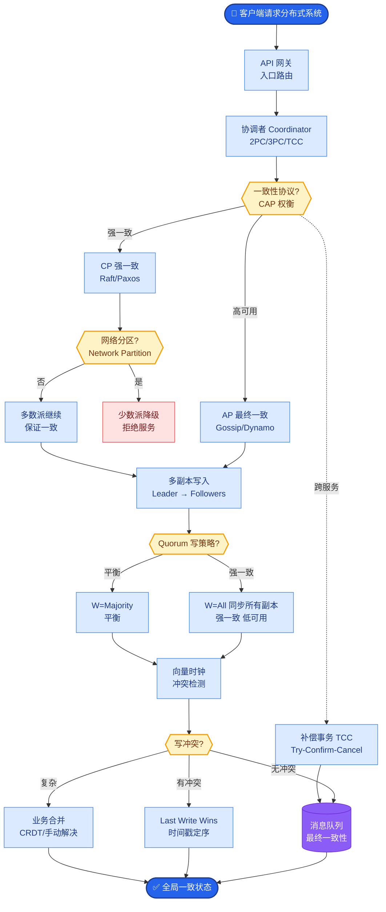

# Constitutional AI (CAI)是什么?它和RLHF有什么区别

- **Constitutional AI (Anthropic提出):**

- **核心思想:** 用一组「宪法原则」(不要有害/要诚实/要公平等)指导模型自我修正,减少对人工标注的依赖.

- **两阶段:**
1. **监督学习阶段 (SL-CAI):**
- 模型生成回复 → 用宪法原则自我评价 → 修改后的回复作为SFT数据
2. **强化学习阶段 (RL-CAI):**
- 模型A生成回复 → 模型B(遵循宪法)评估哪个更好 → 用偏好对做RL(类似RLHF但RM是模型而非人)

- **实战案例**：在构建金融合规模型时，使用 RLHF 需要专家标注大量“合规/不合规”样本，成本极高且标准不一。引入 CAI 后，将“必须引用法规”、“不得提供投资建议”等写入宪法，模型能自动修正违规回复，显著降低专家介入成本。

- **代码示例 (伪代码 - SL-CAI 生成流程)**：
```python
# 模拟 Constitutional AI 自我修正过程
def generate_cai_response(prompt, model, constitution):
    # 1. 初始生成
    raw_response = model.generate(prompt)
    
    # 2. 根据宪法批评
    critique_prompt = f"""
    Principles: {constitution}
    Response: {raw_response}
    Critique the response based on principles.
    """
    critique = model.generate(critique_prompt)
    
    # 3. 根据批评修正
    revision_prompt = f"""
    Original Response: {raw_response}
    Critique: {critique}
    Revise the response based on the critique.
    """
    final_response = model.generate(revision_prompt)
    return (prompt, final_response) # 作为 SFT 数据
```

- **CAI vs RLHF:**
| | RLHF | CAI |
|--|------|-----|
| 偏好来源 | 人类标注 | **AI自我评估** |
| 成本 | 高(人工) | **低** |
| 一致性 | 低(标注者分歧) | **高** |
| 可扩展性 | 差 | **好** |
| 价值观 | 隐式(标注者) | **显式(宪法)** |

- **效果:** Claude系列用CAI训练,在安全性和有用性之间取得更好平衡

- **补充关键细节**：
  - **宪法原则**：通常包含多条规则的列表，例如“请选择对人类无害的回复”、“如果被要求帮助网络攻击，请拒绝”。这些原则不仅指导最终回答，还指导中间的批评过程。
  - **SL-CAI (Supervised Learning)**: 这是一个自我批评过程。模型先生成一个“初步回答”，然后根据宪法生成“批评意见”和“修改后的回答”。这一步主要为了让模型学会遵循宪法格式和修正风格。
  - **RL-CAI (Reinforcement Learning)**: 使用AI生成的偏好数据训练奖励模型（RM）。因为RM是基于宪法训练的，它保证了奖励信号与宪法原则的一致性，避免了RLHF中人类标注者主观标准不一的问题。
  - **RLAIF (RL from AI Feedback)**: CAI的一种具体实现形式。利用AI Feedback替代Human Feedback，解决了RLHF随着模型能力增强，人类越来越难判断回答好坏的瓶颈问题。

```text
┌──────────────────────────────────────────────────────────────────┐
│                  Constitutional AI (CAI) 流程                    │
└──────────────────────────────────────────────────────────────────┘

阶段一: SL-CAI (监督学习 - 学会自我修正)
┌───────────────────┐      ┌───────────────────┐
│  有害/初始提问     │ ──>  │  模型生成初始回复  │
└───────────────────┘      └─────────┬─────────┘
                                    │
                                    ▼
                          ┌───────────────────┐
                          │  AI 依据宪法批评   │
                          └─────────┬─────────┘
                                    │
                                    ▼
                          ┌───────────────────┐      ┌──────────────┐
                          │  AI 生成修正回复   │ ──> │ SFT 训练数据  │
                          └───────────────────┘      └──────────────┘

阶段二: RL-CAI (强化学习 - 学习偏好)
┌───────────────────┐      ┌───────────────────┐
│  提问             │ ──>  │ 生成两个回复      │
└───────────────────┘      │ (Response A & B)  │
                          └─────────┬─────────┘
                                    │
                          ┌─────────▼─────────┐
                          │ AI 基于宪法评分    │
                          └─────────┬─────────┘
                                    ▼
                          ┌───────────────────┐
                          │ RL 训练 (PPO)      │
                          └───────────────────┘
```


## 核心流程图



## 记忆要点

- 定义：用宪法原则指导AI自我修正，减少人工标注依赖。
- 两阶段：SL-CAI(自我批评修正)与RL-CAI(AI生成偏好数据)。
- 对比RLHF：CAI用AI评估(低成本/高一致)，RLHF用人工(高成本)。
- 核心优势：价值观显式(宪法)，可扩展性强，Claude系列采用。

## 结构化回答

**30 秒电梯演讲：** Constitutional AI 像给学生一本《行为守则》让他自评自改，不用老师逐题打分。它用一组显式的"宪法原则"指导模型自我批评和修正，分两阶段：SL-CAI 自我批评生成监督数据，RL-CAI 由 AI 当判别器生成偏好数据做强化学习。相比 RLHF，成本低、一致性高、价值观显式可审计，Claude 系列就采用这套方法。

**展开框架：**
1. **核心思想** — 用显式的"宪法原则"（如诚实、无害、有帮助）指导模型自我修正，把价值观从隐式的人工标注变成显式可审计的规则，减少对人工标注的依赖。
2. **两阶段流程** — SL-CAI（监督阶段）：模型生成回复后，依据宪法原则自我批评并修正，生成监督数据微调；RL-CAI（强化学习阶段）：由 AI 模型充当判别器，对回复做偏好排序，生成偏好数据训练 RL 策略。
3. **对比 RLHF 与优势** — RLHF 靠人工标注偏好，成本高且不一致；CAI 用 AI 评估，低成本、高一致性、价值观显式定义、可扩展性强，是 Claude 系列的核心对齐方法。

**收尾：** 一句话，CAI 让价值观对齐从"人盯人"变成"规则自治"。您想深入聊聊宪法原则怎么设计，还是 CAI 会不会引入 AI 自身的偏见？

## 视频脚本

> 预计时长：2 分钟 | 由浅入深

| 时间 | 画面/字幕 | 口播台词 | 讲解要点 |
|------|----------|----------|----------|
| 0:00 | 标题《Constitutional AI》+ 学生对照守则自评漫画 | CAI 像给学生一本行为守则让他自评自改，而不是老师逐题打分，用宪法原则指导模型自我修正。 | 类比开场 |
| 0:25 | 宪法原则清单示意 | 核心是用一组显式的宪法原则，比如诚实、无害、有帮助，指导模型自我批评和修正。 | 核心思想 |
| 0:55 | 两阶段流程图：SL-CAI + RL-CAI | 分两阶段：SL-CAI 自我批评修正生成监督数据，RL-CAI 由 AI 当判别器生成偏好数据做强化学习。 | 两阶段流程 |
| 1:25 | 对比表：CAI vs RLHF | 相比 RLHF 人工标注成本高、不一致，CAI 用 AI 评估，低成本、高一致、价值观显式可审计。 | 对比 RLHF |
| 1:50 | Claude 标签 + 可扩展性优势 | 核心优势是价值观显式、可扩展性强，Claude 系列就是采用这套对齐方法。 | 核心优势 |

