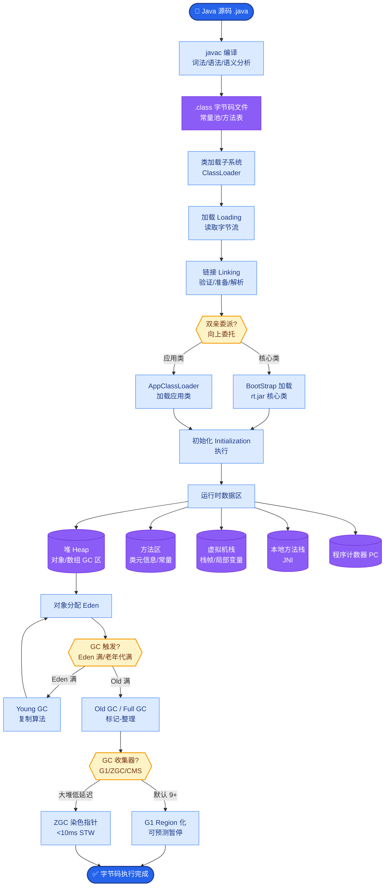

# OpenAI o1模型的推理能力和传统模型有什么本质区别?DeepSeek-R1是如何复现的

- **o1的核心突破:**

**传统模型：** 输入→输出(一步到位)
**o1模型：** 输入→**长思维链推理**→输出

- **关键技术:**
1. **RL训练推理** - 用强化学习训练模型「学会思考更久」
2. **测试时计算(Test-Time Compute)** - 给更多推理时间→更好结果
3. **隐藏CoT** - 推理过程对用户隐藏(商业机密)

- **DeepSeek-R1复现:**

- **R1-Zero:** 纯GRPO训练,无SFT冷启动
- 规则奖励:答案正确性 + 格式奖励
- **自发涌现**长链推理、反思、验证行为

- **R1(正式版):
1. 少量SFT冷启动
2. GRPO推理训练
3. 拒绝采样生成SFT数据
4. 第二轮GRPO(推理+通用)

- **实战案例**：在代码生成任务中，传统模型生成递归函数容易栈溢出。DeepSeek-R1 在推理阶段自动生成了约 2000 个 Token 的思考过程，其中包含“尝试 Python 递归 -> 超时 -> 切换为 C++ 迭代实现 -> 验证边界条件”的反复尝试，最终输出了正确的优化代码。

- **代码示例 (伪代码 - 简化版GRPO)**：
```pythonn
# GRPO (Group Relative Policy Optimization) 简化示意
# 优势：无需训练 Critic 模型，显存占用低

def compute_group_advantage(group_outputs):
    # group_outputs: 同一个Prompt生成的多个回复及其Reward
    rewards = [r["reward"] for r in group_outputs]
    mean_reward = sum(rewards) / len(rewards)
    
    advantages = []
    for r in rewards:
        # 优势 = 当前样本奖励 - 组内平均奖励
        advantages.append(r - mean_reward)
    return advantages

# 训练循环
log_probs = model.generate_multiple(prompts) # 生成多个样本
rewards = [rule_based_check(out) for out in outputs]
loss = -sum(log_prob * compute_group_advantage(rewards))
loss.backward()
```

- **关键发现:**
- RL可以让模型自发学会「反思」「验证」「尝试不同策略」
- 不需要人类教推理步骤,模型自己探索出来

- **补充关键细节**：
  - **思维链搜索策略**：o1 和 R1 的核心不仅仅是生成 CoT，而是学会了“搜索”和“回溯”。当模型发现当前的推理路径可能导致错误时（自我验证失败），它会回退并尝试另一种路径，这类似于 AlphaGo 的 Monte Carlo Tree Search (MCTS)，但在语言模型的离散空间中通过强化学习习得。
  - **GRPO (Group Relative Policy Optimization)**：DeepSeek 提出的变体 PPO 算法。为了降低显存开销，它去掉了 Critic 网络，通过采样的 Group 计算优势函数，允许在单张 4090 或小规模集群上训练推理模型，极大降低了推理对齐的门槛。
  - **Rule-based Rewards (规则奖励)**：在 R1-Zero 阶段，完全依赖确定性规则（如代码能否运行、数学结果是否匹配、格式是否规范）给出 Reward，避免了训练 Reward Model (RM) 的成本，保证了训练信号的纯度。
  - **Aha Moment (顿悟时刻)**：DeepSeek-R1 在训练过程中观察到了性能的“跳跃”。随着训练步数增加，模型突然学会了分配更多 Token 给思考过程，且正确率随思考长度增加而显著提升，这证明了推理能力是可以通过 Scaling Law 和 RL 涌现的。
  - **蒸馏**：DeepSeek-R1 还将 o1 等模型的推理过程蒸馏到了更小的模型（如 Qwen-7B, Llama-8B）中，使得小模型也具备了长链推理能力。

```text
┌─────────────────────────────────────────────────────────────────┐
│                DeepSeek-R1 / o1 推理过程                        │
└─────────────────────────────────────────────────────────────────┘

┌──────────────────┐     ┌───────────────────────────────────────┐
│   用户提问       │ ──> │                                       │
└──────────────────┘     │        思维链生成与搜索               │
                        │  ┌─────────┐    ┌─────────────────┐    │
                        │  │ 思考路径│ ─> │ 自我验证         │    │
                        │  │  A      │    │ (发现逻辑矛盾?)  │    │
                        │  └────┬────┘    └────────┬────────┘   │
                        │       │ NO                │ YES        │
                        │       ▼                   ▼            │
                        │  ┌─────────┐         ┌──────────┐     │
                        │  │ 尝试路径│◄────────│ 回溯修正 │     │
                        │  │  B      │         └──────────┘     │
                        │  └────┬────┘                            │
                        │       │ PASS                            │
                        │       ▼                                 │
                        │  ┌─────────┐                          │
                        │  │ 最终答案│                          │
                        │  └─────────┘                          │
                        └───────────────────────────────────────┘
```


## 核心流程图



## 记忆要点

- o1本质：引入长思维链推理，用RL训练模型学会思考更久。
- DeepSeek-R1：R1-Zero纯RL涌现推理，R1加SFT冷启动优化。
- GRPO算法：组内相对优势，无需Critic，显存占用低。
- 新范式：Test-Time Compute Scaling，用推理算力换智力。

## 结构化回答

**30 秒电梯演讲：** 推理模型（o1/R1）不再让模型直接给答案，而是像在草稿纸上反复推演验证后再输出。本质是用 RL 训练模型学会长思维链推理，把计算开销从训练后移到推理时。DeepSeek-R1 里 R1-Zero 纯 RL 就涌现推理能力，R1 加了 SFT 冷启动进一步优化；训练用 GRPO 算法，组内相对优势、无需 Critic。这开启了 Test-Time Compute Scaling 新范式。

**展开框架：**
1. **核心思想** — 引入长思维链（Long CoT），让模型在输出答案前进行多步反思、验证、自我纠错，用强化学习奖励正确的推理过程，而非只监督最终答案。
2. **训练方法** — GRPO 算法用组内相对优势估计，去掉了 Critic 模型，显存占用低；DeepSeek R1-Zero 证明纯 RL 就能涌现推理能力，R1 加 SFT 冷启动做优化。
3. **新范式与能力涌现** — Test-Time Compute Scaling：用推理算力换智力，模型能自发学会自我反思和错误验证，突破了单纯靠做大参数的旧范式。

**收尾：** 一句话，推理模型把"思考时间"变成了新的 scaling 维度。您想深入聊聊 R1-Zero 为什么不需要 SFT 冷启动，还是测试时计算的 scaling law？

## 视频脚本

> 预计时长：2 分钟 | 由浅入深

| 时间 | 画面/字幕 | 口播台词 | 讲解要点 |
|------|----------|----------|----------|
| 0:00 | 标题《推理模型 o1/R1》+ 草稿纸反复推演漫画 | 推理模型像解题时不直接写答案，而在草稿纸上反复推演验证，最后再给出结果。 | 类比开场 |
| 0:25 | 长思维链示意：反思 → 验证 → 纠错 | 核心是引入长思维链，让模型在输出前多步反思、验证、自我纠错，用 RL 奖励正确推理过程。 | 核心思想 |
| 0:55 | GRPO 算法 + R1-Zero/R1 对比 | 训练用 GRPO，组内相对优势、无需 Critic；R1-Zero 纯 RL 涌现推理，R1 加 SFT 冷启动优化。 | 训练方法 |
| 1:25 | Test-Time Compute Scaling 曲线 | 这开启了新范式：Test-Time Compute Scaling，用推理时的算力换智力，不再只靠做大参数。 | 新范式 |
| 1:50 | 能力涌现：自我反思 + 错误验证 | 模型能自发学会自我反思和错误验证，这是单纯监督学习学不到的能力。 | 能力涌现 |

