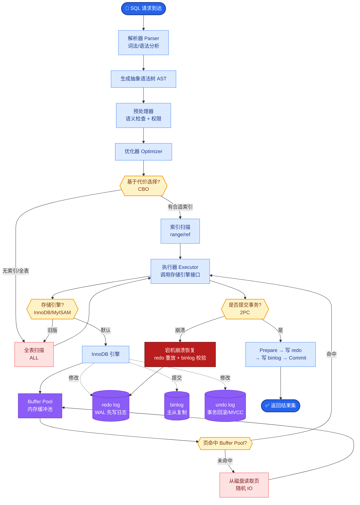

# 如何选择Embedding模型?BGE、E5、Cohere各有什么特点?中文场景推荐什么

**Embedding 模型选择与对比**

Embedding 模型将文本转化为高维向量，用于语义检索、聚类和 RAG 检索。

---

### 1. 主流模型特点对比

| 模型 | 类型 | 维度 | 中文支持 | 核心特点与适用场景 |
| :--- | :--- | :--- | :--- | :--- |
| **BGE-M3** | 开源 | 1024 | **优秀** | **多功能(检索/聚类/重排序)**、**多语言**、支持长文本(8192)。RAG 首选。 |
| **BGE-large-zh** | 开源 | 1024 | **优秀** | 专项中文优化，C-MTEB 榜单常客。纯中文检索精度极高。 |
| **E5-mistral** | 开源 | 4096 | 好 | 基于 Mistral，通用性强，多语言表现均衡。维度高消耗内存。 |
| **GTE** | 开源 | 768/1024 | 好 | 阿里达摩院，通用性强，中英表现均衡。 |
| **text-embedding-3** | API | 1536/3072 | 好 | OpenAI，支持 Matryoshka (自适应维度) 学习。通用且稳定。 |
| **Cohere embed v3** | API | 1024 | 好 | 多语言能力极强，特别擅长处理长文本检索和语义细微差别。 |

---

### 2. RAG 检索流程中的 Embedding

```text
┌──────────────┐         ┌──────────────────────────────────────┐
│   User Query │         │         Document Corpus              │
└──────┬───────┘         └──────────────────┬───────────────────┘
       │                                     │
       │  [Embed Model]                      │  [Embed Model]
       │  (e.g. BGE-M3)                      │  (e.g. BGE-M3)
       ▼                                     ▼
┌──────────────┐                   ┌─────────────────────┐
│ Query Vector │                   │  Vector Database    │
│   (Dim:1024) │                   │  (Index: HNSW/IVF)  │
└──────┬───────┘                   └──────────┬──────────┘
       │                                     │
       │            Similarity Search       │
       └─────────────────┬───────────────────┘
                         ▼
                ┌────────────────┐
                │ Top-K Chunks   │
                └────────────────┘
```

---

### 3. 选择建议、评估与实战

**选择策略：**
1.  **中文场景 (推荐)**: 
    *   追求精度首选 **BGE-large-zh-v1.5**。
    *   追求长文本/多语言/多功能选 **BGE-M3**。
2.  **中英混合/多语言**: 
    *   **BGE-M3** 或 **Cohere embed v3** (若预算允许)。
3.  **英文通用/极高精度**: 
    *   **OpenAI text-embedding-3-large** 或 **Voyage AI**。
4.  **资源受限/低延迟**: 
    *   可考虑 **bge-small-zh** 或通过 **Matryoshka** 技术截断维度（如 text-embedding-3 可降维至 256 而保持较好效果）。

**实战案例**：
在法律合同检索场景中，我们发现 BGE-M3 对长段落整体语义理解较好，但容易漏掉“金额”、“日期”等关键短实体。最终方案是：利用 BGE-M3 做粗排，再针对文档中的关键实体字段建立 ES (Elasticsearch) 倒排索引，通过混合检索提升精准率。

**代码示例 (混合检索打分)**:

```python
# 假设 dense_score 为向量检索相似度, bm25_score 为关键词检索分数
def hybrid_score(dense_score, bm25_score, alpha=0.7):
    # 1. 归一化处理
    dense_norm = (dense_score - dense_score.min()) / (dense_score.max() - dense_score.min() + 1e-6)
    bm25_norm = (bm25_score - bm25_score.min()) / (bm25_score.max() - bm25_score.min() + 1e-6)
    
    # 2. 加权融合，alpha 通常通过验证集调优
    final_score = alpha * dense_norm + (1 - alpha) * bm25_norm
    return final_score
```

**评估指标：**
*   **MTEB (Massive Text Embedding Benchmark)**: 目前最权威的测评基准，涵盖检索、重排序、聚类等任务。


## 核心流程图



## 记忆要点

- 中文首选：BGE-large-zh(精度)或BGE-M3(长文本/多语言)。
- Cohere v3：多语言极强，适合长文本检索，API调用。
- E5/GTE：通用性强，中英均衡，适合混合场景。
- 实战：RAG推荐BGE-M3，混合检索(向量+BM25)效果更佳。

## 结构化回答

**30 秒电梯演讲：** Embedding 把文本映射成高维向量，用向量距离衡量语义相似度，像给每句话贴上唯一坐标，意思越近坐标越近。选型上：中文首选 BGE 系列，BGE-large-zh 重精度、BGE-M3 支持长文本和多语言；商业可用选 Cohere v3 或 OpenAI；E5/GTE 中英均衡。RAG 实战推荐 BGE-M3 配混合检索。

**展开框架：**
1. **核心原理** — 将文本（或图像）编码为高维稠密向量，语义相近的内容向量距离（余弦相似度）也近，从而把"语义相似度"变成可计算的几何距离。
2. **主流选型** — 中文场景首选 BGE-large-zh（精度优先）或 BGE-M3（长文本、多语言、稠密/稀疏/多向量统一）；Cohere v3 多语言极强适合长文本 API 调用；E5/GTE 中英均衡适合混合场景。
3. **选型考量与实战** — 综合考量语言支持、向量维度（影响存储和检索速度）、部署成本（本地 vs API）；RAG 实战推荐 BGE-M3，配合向量加 BM25 的混合检索效果更佳。

**收尾：** 一句话，Embedding 是语义检索的坐标系统。您想深入聊聊 BGE-M3 的"三多"是什么意思，还是 Matryoshka Embedding 怎么实现维度可变？

## 视频脚本

> 预计时长：2 分钟 | 由浅入深

| 时间 | 画面/字幕 | 口播台词 | 讲解要点 |
|------|----------|----------|----------|
| 0:00 | 标题《Embedding 模型选型》+ 坐标标签漫画 | Embedding 给每句话贴上唯一的坐标标签，意思越近标签贴得越近，把语义相似度变成几何距离。 | 类比开场 |
| 0:25 | 文本 → 高维向量 → 余弦相似度 | 核心是把文本编码成高维向量，用余弦相似度衡量远近，语义相近的内容距离也近。 | 核心原理 |
| 0:55 | BGE 系列：large-zh vs M3 | 中文首选 BGE 系列：BGE-large-zh 重精度，BGE-M3 支持长文本和多语言，功能更全。 | BGE 选型 |
| 1:25 | Cohere v3 / E5 / GTE 对比 | 商业可用选 Cohere v3 多语言极强，E5 和 GTE 中英均衡，适合混合场景。 | 其他选型 |
| 1:50 | 实战：BGE-M3 + 混合检索 | RAG 实战推荐 BGE-M3，配合向量加 BM25 的混合检索，效果比单一向量更好。 | 实战建议 |

