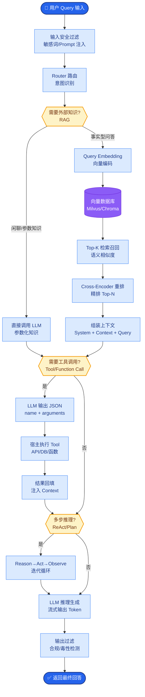

# Test-Time Compute Scaling是什么?为什么说它是推理模型的新范式

**Test-Time Compute Scaling：推理模型的新范式**

Test-Time Compute Scaling（推理时计算扩展）是指在模型参数固定的情况下，通过在推理阶段增加计算量（如延长思考时间、多次采样验证）来提升模型性能的方法。这是区别于传统“预训练扩展定律”的新范式。

---

### 1. 核心范式转变

*   **传统范式**: 
    *   Scaling Law: 预训练计算量 ↑ → 模型参数 ↑ → 效果 ↑
    *   成本：训练昂贵，推理相对固定。
*   **新范式**: 
    *   Inference Scaling: 推理计算量 ↑ (更长的CoT/更多搜索) → 效果 ↑
    *   成本：推理成本可变，用算力换智力。

| 范式 | 核心变量 | 成本分布 | 适用场景 | 代表模型 |
| :--- | :--- | :--- | :--- | :--- |
| **Pre-training Scaling** | 参数规模 | 高昂训练成本，低推理成本 | 通用任务，追求高性价比 | GPT-4, Claude 3 (Base) |
| **Test-Time Scaling** | 推理算力/时间 | 低训练成本，高昂推理成本 | 复杂推理，数学，代码 | OpenAI o1, DeepSeek-R1 |

---

### 2. 实现策略架构

```text
                Test-Time Compute Strategies
    ┌─────────────────────────────────────────────────────┐
    │                                                     │
    │  1. Longer CoT (Process Reward)                     │
    │  ┌─────────────┐                                    │
    │  │ Question    │───► [Reasoning Step 1..N] ──► Answer│
    │  └─────────────┘      (More thinking tokens)        │
    │                                                     │
    │  2. Best-of-N (Outcome Reward)                      │
    │  ┌─────────────┐                                    │
    │  │ Question    │───► Gen N paths ──► [Voter/RM] ──► Best│
    │  └─────────────┘     (Parallel sampling)            │
    │                                                     │
    │  3. Search & Verify (Tree Search)                   │
    │         ┌─────┐                                    │
    │         │Root │                                    │
    │    ┌────┴────┬────┐                                 │
    │   Step A   Step B  Step C  (Explore multiple)      │
    │    │        │       │                              │
    │   [✓]     [✗]     [✓]    (Verify & Prune)         │
    │    │                │                              │
    │    └───────► Answer ◄──┘                            │
    └─────────────────────────────────────────────────────┘
```

---

### 3. 三种主要策略详解与实战

#### (1) 更长的推理链
*   **代表**: OpenAI o1, DeepSeek-R1。
*   **原理**: 模型不直接输出答案，而是生成内部的思维链。通过强化学习（RL）优化“推理过程”，让模型学会自我纠错和多步规划。
*   **特点**: 思考 Token 数量可能是答案 Token 的 10-100 倍。

#### (2) Best-of-N 采样
*   **原理**: 并行生成 N 个不同的回答，使用奖励模型或自身打分选出最好的一个。
*   **特点**: 能够显著提升鲁棒性，避免单次采样的随机性错误。

#### (3) Search & Verify (搜索与验证)
*   **原理**: 类似 AlphaGo 的蒙特卡洛树搜索 (MCTS)。模型生成多个思考步骤，评估每一步的价值，回溯错误的分支，探索正确的路径。
*   **特点**: 效果最好，但计算成本最高，通常需要专门的推理框架支持。

**实战案例**：在解决复杂的数学证明题时，传统的 70B 模型直接回答错误率约为 40%。应用 Test-Time Scaling 策略（DeepSeek-R1 模式）：允许模型生成 5k tokens 的思考过程，并在此过程中进行多次自我反思。虽然单次推理耗时从 2秒 增加到 40秒，但复杂问题的准确率提升至 95% 以上。

**代码示例 (Best-of-N 简易实现)**:

```python
import torch

def best_of_n_sampling(model, tokenizer, prompt, n_samples=5):
    inputs = tokenizer(prompt, return_tensors="pt").to(model.device)
    
    # 1. 并行生成 N 个答案
    outputs = model.generate(
        **inputs,
        max_new_tokens=512,
        do_sample=True,
        top_p=0.9,
        num_return_sequences=n_samples
    )
    
    # 2. 解码文本
    candidates = [tokenizer.decode(out, skip_special_tokens=True) for out in outputs]
    
    # 3. 简易投票机制 (实战中应使用 Reward Model 打分)
    # 这里假设答案包含特定的标记或通过长度/格式过滤
    # 实际打分: scores = reward_model(candidates)
    
    # 模拟打分：选择生成长度适中且包含“Answer:”的
    valid_candidates = [c for c in candidates if "Answer:" in c]
    # 简单选择第一个合法的作为演示
    return valid_candidates[0] if valid_candidates else candidates[0]
```


## 核心流程图



## 记忆要点

- 定义：推理时增加计算量(思考时间/搜索)提升性能。
- 范式转变：从预训练Scaling(参数)转向推理Scaling(算力)。
- 策略：更长CoT、Best-of-N采样、搜索验证。
- 代表：OpenAI o1和DeepSeek-R1，用算力换复杂推理能力。

## 结构化回答

**30 秒电梯演讲：** Test-Time Compute 是范式转移：不再只比谁的脑子大（参数多），而是比谁肯花时间反复验算（思考久）。在模型参数固定的情况下，通过增加推理时的计算量来突破性能瓶颈。三大手段：更长的 CoT、Best-of-N 采样、思维树搜索验证。代表是 OpenAI o1 和 DeepSeek-R1，用推理算力换复杂推理能力。

**展开框架：**
1. **范式转变** — 从预训练 Scaling（靠堆参数换智能）转向 Test-Time Compute Scaling（靠推理算力换智能），小模型配合强推理策略，可以打败简单推理的大模型。
2. **核心手段** — 更长的思维链（Long CoT）让模型多步推理；Best-of-N 采样生成多个答案取最优；思维树（Tree of Thoughts）做搜索验证，探索多条推理路径。
3. **代表与潜力** — OpenAI o1 和 DeepSeek-R1 是典型代表，用 RL 训练模型学会在推理时"思考更久"，在数学、代码等复杂推理任务上显著提升。

**收尾：** 一句话，推理算力成了新的智力放大器。您想深入聊聊怎么确定最优的推理时计算量，还是 Best-of-N 的 N 怎么选？

## 视频脚本

> 预计时长：2 分钟 | 由浅入深

| 时间 | 画面/字幕 | 口播台词 | 讲解要点 |
|------|----------|----------|----------|
| 0:00 | 标题《Test-Time Compute》+ 考试验算漫画 | Test-Time Compute 是考试时不再比谁脑子大，而是比谁肯花时间反复验算，用推理算力换智力。 | 类比开场 |
| 0:25 | 范式转变曲线：参数 Scaling → 推理 Scaling | 范式转变：从预训练靠堆参数，转向推理时靠算力，小模型加强推理策略能打败简单推理的大模型。 | 范式转变 |
| 0:55 | 三大手段：Long CoT / Best-of-N / 思维树 | 三大手段：更长的思维链让模型多步推理，Best-of-N 采样取最优，思维树做搜索验证。 | 核心手段 |
| 1:25 | OpenAI o1 + DeepSeek-R1 代表案例 | 代表是 OpenAI o1 和 DeepSeek-R1，用 RL 训练模型学会在推理时思考更久。 | 代表案例 |
| 1:50 | 复杂推理任务提升柱状图 | 在数学、代码这些复杂推理任务上，Test-Time Compute 带来了显著提升，是新的 scaling 维度。 | 效果与潜力 |

